# HTML5 画布开发人员指南

> 原文：<https://www.sitepoint.com/a-developers-guide-to-html5-canvas/>

毫无疑问，HTML5 中的 canvas 元素是大多数开发人员想要用来开发真正丰富的 web 应用程序的功能，而无需安装像 Adobe 的 Flash player 这样的浏览器插件。Canvas 诞生的时候，客户机丰富性是开发人员最关心的问题。Chrome、Firefox、Internet Explorer 9 和 10 等现代浏览器都支持它。但是 HTML5 中的 canvas 元素到底是什么？如何使用它来创建丰富的 web 应用程序呢？

如果你对 HTML5 不熟悉，在开始阅读本文之前，你可能想读一下[是的，你现在就可以使用 HTML5！](https://www.sitepoint.com/html-5-snapshot-2009/)和 [HTML5 甚至更花哨的形式](https://www.sitepoint.com/html5-forms/)。

### 画布元素是干什么用的？

画布的正式名称是*“一种分辨率相关的位图画布，可用于实时渲染图形、游戏图形或其他视觉图像”*。通俗地说，canvas 是 HTML5 中的一个新元素，可以让你使用 JavaScript 绘制图形。它可以用来动态渲染文本、图像、图形、矩形、线条、渐变和其他效果。通过[画布 2D API](http://msdn.microsoft.com/en-us/library/ff975057.aspx) 在画布上绘图。这个 API 包含了大量的函数，可以让你在画布上画出任何你喜欢的东西。目前，画布支持 2D 表面，而不是 3D。那么画布是什么样子的呢？不多。你自己看吧。

<canvas id="”myCanvas”" style="”width:300px;" height:300px=""></canvas>

上面的代码将在浏览器中呈现一个画布，但是因为画布是空的，所以您将看不到任何东西。让我们添加一个边框，这样你可以看得更清楚。下图显示了带有黑色边框的画布。

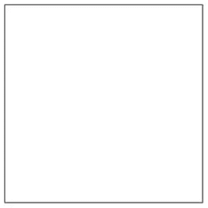

现在还不是很令人兴奋，但是这将会改变你的阅读。一个网页可以有多个画布元素。通过 id 对每个画布进行个性化处理，可以让您通过 JavaScript 定位特定的画布。要在画布上绘图，需要引用画布的*上下文*。上下文允许您访问 2D 属性和方法，这些属性和方法允许您在画布元素上绘制和操作图像。稍后我们将更深入地探讨这一背景。

每个画布元素都有 x 和 y 坐标，x 是水平坐标，y 是垂直坐标。下图显示了画布上的这些坐标。

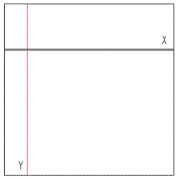

稍后我将更多地关注上下文。

### 阐明 SVG 和 Canvas 的关系

理解 SVG 和 canvas 元素之间的区别很重要。SVG 是一种基于 XML 的矢量图形格式。您可以使用 CSS 向它添加样式，使用 SVG DOM 向它添加动态行为。画布允许您通过 JavaScript 绘制图形和形状。它也可以设计风格，你可以添加动态行为。以下是在 SVG 上使用画布的一些原因。

*   画布绘制复杂图形的速度更快
*   您可以将图像保存在画布之外，而使用 SVG 则不行
*   画布中的一切都是一个像素。

另一方面，SVG 也有一些优点。

*   它与分辨率无关，因此可以根据不同的屏幕分辨率进行缩放
*   它是 xml，所以针对不同的元素是轻而易举的事情
*   它擅长复杂的动画

那么为什么要用一个而不是另一个呢？好吧，如果你的网站是分辨率相关的，高度互动的，你想要矢量图像编辑，选择 SVG。另一方面，如果你正在开发一个游戏，想要快速渲染图形，或者不想处理 XML，那么选择画布。在一个理想的世界里，他们会一起工作，互相补充。

为了更好地在 SVG 和 Canvas 之间进行选择，[阅读这个博客](http://blogs.msdn.com/b/ie/archive/2011/04/22/thoughts-on-when-to-use-canvas-and-svg.aspx)。

### 画布和硬件加速

使用 canvas 是在 web 上了解硬件加速的最好方式。在早期版本的浏览器中，图形渲染——像大多数计算密集型任务一样——由中央处理器 CPU 处理。现代浏览器一直在这一领域进行创新，将图形密集型任务转移到图形处理单元 GPU，使用 Direct2D 和 DirectWrite 在网页上呈现图形和文本。将这些任务分配给 GPU 核心不仅可以加速图形处理，还可以减轻 CPU 的负载，同时 *it* 可以更高效地处理串行任务。

JavaScript 也被指责为处理猪。处理这一问题的一个很好的例子是 IE9 的 JavaScript 引擎， [Chakra](http://blogs.msdn.com/b/ie/archive/2010/08/25/chakra-interoperability-means-more-than-just-standards.aspx) ，它利用多处理器内核将 JavaScript 后台编译成机器代码，以加快处理速度。

在这两种情况下，最终结果都是性能的提高。

我在这里提到这一点是因为如果您将加速的图形处理与加速的 Javascript 处理放在一起，您已经创建了一个最大限度利用 HTML5 canvas 的理想环境。

当您将绘图命令发送到画布时，浏览器会将它们直接发送到图形硬件，无需您进一步开发。硬件加速速度惊人，可交付实时动画和交互式图形，而不会降低您交付的周围用户体验。你可以在这里测试许多不同的浏览器及其对硬件加速的支持。

对于有创造力的开发人员来说，这是一种解放，因为他们知道可以放入代码中的视觉体验将会按照预期进行翻译和渲染。

当通过硬件加速浏览器查看时，以下所有使用 canvas 的方式都提供了增强的、强化的和更愉快的体验。

### 画布 2D API

画布 2D API 是一个允许你在画布元素上绘制和操作图像和图形的对象。为了引用画布的上下文，您调用 [getContext](http://msdn.microsoft.com/en-us/library/ff975238.aspx) ，这是 canvas 元素上的一个方法。它有一个参数，目前是 *2d* 。下面是引用上下文的代码片段。

var my canvas = document . get elementbyid(“my canvas”)：
var 上下文= myCanvas.getContext(二维)”：

每个画布都有自己的上下文，所以如果您的页面包含多个画布元素，您必须有一个对您想要使用的每个上下文的引用。

除了 getContext 之外，在 canvas 2D API 中还有许多其他函数可供您使用。其中一些值得注意的概述如下。

**转换函数**

*   缩放–允许您缩放当前上下文。
*   旋转–允许您旋转当前上下文的 x 和 y 坐标。

**状态功能**

*   保存–允许您保存上下文的当前状态。
*   恢复–允许您从以前保存的状态恢复上下文的状态。

**文本功能**

*   字体–获取或设置当前上下文的字体。
*   fill text–将填充的文本渲染到当前画布。
*   measure text–测量指定文本的当前宽度。

可以想象，画布 2D API 附带了更多的方法。查看[这个](http://msdn.microsoft.com/en-us/library/ff975057.aspx)页面，了解我在本节中没有涉及的方法。

如果你不在画布上画画的话，画布会很单调，所以让我们来看看一旦你有了背景，你能画出什么。

### 形状和颜色

有一整套专门用于绘制形状的属性和函数。让我们从矩形开始。以下是可用于绘制矩形的相关函数。

*   fillRect(x，y，w，h)-使用当前填充样式在画布上绘制给定的矩形
*   strokeRect(x，y，w，h)-使用当前的笔画样式在画布上绘制一个框，该框勾勒出给定的矩形
*   clearRect(x，y，w，h)-将给定矩形中画布上的所有像素清除为透明黑色

要画矩形，最简单的方法是使用 fillRect。这将使用当前 fillStyle 在画布上绘制一个矩形。下面是如何创建一个黑色矩形。

var canvas = document . get elementbyid(下称“myCanvas”)：
var 上下文=画布. get context(2d)；：
上下文.文件权利(5、5、145、145)；

此代码将呈现一个黑色矩形，从顶部开始 5 个像素，从右侧开始 5 个像素，宽度和高度为 145 个像素。下图显示了画布中的矩形。

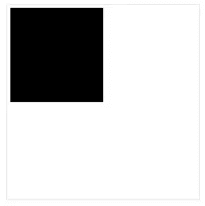

如果不指定颜色，默认颜色将始终是黑色。要在顶部绘制另一个矩形，请使用不同的参数再次调用 fillRect。fillStyle 可以是任何 CSS 颜色，因此它可以利用 CSS3 中新的[不透明度](http://www.css3.info/preview/rgba/)属性。以下代码在画布上绘制了三个矩形，并更改了底部矩形的颜色，使其半透明。

context.fillRect(5, 5, 145, 145);
context.fillStyle = “rgb(0, 162, 232)”;
context.fillRect(40, 55, 145, 145);
context.fillStyle = “rgba(255, 0, 0, 0.2)”;
context.fillRect(75, 105, 145, 145);

这是结果。

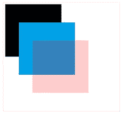

画圆也是轻而易举的事。画圆，最简单的方法是用[圆弧](http://msdn.microsoft.com/en-us/library/ff975305.aspx)。这将使用当前 fillStyle 在画布上绘制一个圆。该函数的定义如下。

*   arc(x，y，radius，startAngle，endAngle，逆时针)-指向子路径，以便将由参数描述的圆周所描述的弧添加到路径中，该弧从给定的开始角度开始，到给定的结束角度结束，沿着给定的方向前进

以下是如何创建一个黑色的圆圈。

context . begin path()；
context.fillStyle = "rgb(0，0，0)"；
context.arc(123，93，70，0，2 * Math。PI，真)；
context . fill()；

因为 arc 给子路径增加了点，你必须先调用 [beginPath](http://msdn.microsoft.com/en-us/library/ff975405.aspx) ，然后调用 [fill](http://msdn.microsoft.com/en-us/library/ff975415.aspx) 。这会用当前的 fillStyle 填充子路径。下图显示了结果。

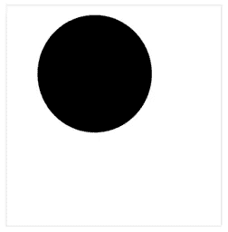

要画圆的轮廓，用 [strokeStyle](http://msdn.microsoft.com/en-us/library/ff974918.aspx) 代替 fillStyle。然后叫[中风](http://msdn.microsoft.com/en-us/library/ff975431.aspx)而不是补。

context . begin path()；
context.strokeStyle = "rgb(0，0，0)"；
context.arc(123，93，70，0，2 * Math。PI，真)；
context . stroke()；

圆不一定是 360 度。要改变形状，请更改起点和终点半径。

context . begin path()；
context.strokeStyle = "rgb(0，0，0)"；
context.arc(123，93，70，0，0.5 *数学。PI，真)；
context . stroke()；

这是半圆。

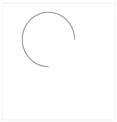

离开圆形，进入更高级的领域，让我们看看如何绘制[贝塞尔](http://en.wikipedia.org/wiki/B%C3%A9zier_curve)曲线。通过使用 [bezierCurveTo](http://msdn.microsoft.com/en-us/library/ff975406.aspx) 函数，这项艰巨的任务变得相对简单。这通过使用表示贝塞尔曲线的控制点向当前子路径添加点。bezierCurveTo 的参数如下。

*   bezierCurveTo (cp1x，cp1y，cp2x，cp2y，x，y)–将给定点添加到当前路径，通过具有给定控制点的三次贝塞尔曲线连接到前一个点

贝塞尔曲线必须包括三个点。前两点控制计算，第三点是曲线的终点。以下是如何创建一个简单的贝塞尔曲线。

context.lineWidth = 20
context . begin path()；
context.moveTo(5，50)；
context.bezierCurveTo(30，30，130，530，200，100)；
context . stroke()；

下图是在画布中绘制的内容。

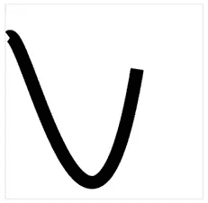

贝塞尔曲线给你很大的绘图能力。这里有一个在画布上画笑脸的高级例子。

//face
context . begin path()；
context . line width = 10；
context.strokeStyle = "rgb(0，0，0)"；
context.arc(200，233，150，0，2 *数学。PI，真)；
context . stroke()；

//彩面
context . begin path()；
context.fillStyle = "rgba(80，100，80，0.4)"；
context.arc(200，233，150，0，2 *数学。PI，真)；
context.fill()。

//右眼
context . line width = 20；
context . begin path()；
context.moveTo(230，130)；
context.bezierCurveTo(230，130，230，130，240，200)；
context . stroke()；
//左眼
context . begin path()；
context.moveTo(170，130)；
context.bezierCurveTo(170，130，170，130，160，200)；
context . stroke()；

//上唇
context . begin path()；
context.moveTo(100，230)；
context.bezierCurveTo(100，230，200，380，300，230)；
context . stroke()；

//下唇
context . begin path()；
context.moveTo(100，235)；
context.bezierCurveTo(105，270，200，480，300，232)；
context . stroke()；

下图显示了笑脸。

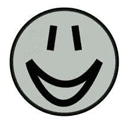

为了补充画布上的形状，你也可以通过纯色、轮廓、渐变或图案来混合颜色。在前面的例子中，我主要使用了 [fillStyle](http://msdn.microsoft.com/en-us/library/ff974906.aspx) 。这个函数用纯色填充上下文的背景。这可以是多种颜色。下面的例子将随机画布的背景颜色，并产生彩虹效果。

var a = 1；

为(j = 0；j<100；j++) {
var r = 255，g = 0，b = 0；

为(I = 0；我<150；i++) {
//黄色
if(I<25)g+= 10.2；
//绿色
else if(I>= 25&&I<50)r-= 10.2；

//蓝色
其他 if(I>= 50&&I<75){
g-= 10.2；
b+ = 10.2；
}

//紫色
else if(I>= 75&I<100)r+= 10.2；

//红色
else B- = 10.2；

context . fill style = " rgba("+math . floor(r)+"，"+
Math.floor(g) +"，"+ Math.floor(b) +"，"+a+" "；
context.fillRect(3 * i，5 * j，3，5)；} a-= 0.01；}

效果可以在下图中看到。

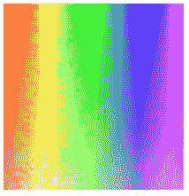

如果不想要纯色，可以使用 strokeStyle 和 strokeRect 绘制矩形的轮廓。canvas 的另一个特性是能够创建渐变。与此相关的功能如下。

*   addColorStop(offset，color)–将给定颜色的颜色停止点添加到渐变中的给定偏移量处。0.0 是渐变一端的偏移，1.0 是另一端的偏移
*   createlanegradient(x0，y0，x1，y1)-返回一个 CanvasGradient 对象，该对象代表沿坐标给定的直线绘制的线性渐变
*   createaradialgradient(x0，y0，r0，x1，y1，R1)-返回一个 CanvasGradient 对象，该对象代表一种径向渐变，该渐变沿着由坐标代表的圆所给出的圆锥体进行绘制

可以通过调用 [createLinearGradient](http://msdn.microsoft.com/en-us/library/ff975411.aspx) 来创建线性渐变。为了给渐变添加颜色，你调用 [addColorStop](http://msdn.microsoft.com/en-us/library/ff975436.aspx) 。调用此函数会在 x 和 y 坐标处添加指定的颜色。下面的例子演示了一个简单的线性渐变。

var gradient = context . createlineargradient(0，0，0，145)；
gradient.addColorStop(0，" # 00 abeb ")；
gradient.addColorStop(0.5，"黄色")；
gradient.addColorStop(0.8，“绿色”)；
gradient.addColorStop(1，"白色")；

context . fillstyle = gradient；
context.fillRect(5，5，145，145)；

梯度可以在下面看到。

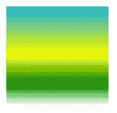

还有很多关于梯度的东西我没有讲过。完整的图片你应该查看 W3C 网站[这里](https://www.w3.org/TR/2dcontext/#colors-and-styles)。

### 线条、文本和阴影

当你画线的时候，想想路径。每个画布都有一条路径。定义路径就像画一条线。任何线路都有可能。就像写字一样，你需要定义一个路径，然后把路径填进去。下面是一些与画线相关的属性和函数。

*   线宽[ =值]–返回当前线宽。可以设置来改变线宽
*   line cap[= value]–返回当前线帽样式。可以设置来更改线帽样式。可能的线帽样式有平头、圆形和方形
*   line join[= value]–返回当前线条连接样式。可以设置以更改线条连接样式。可能的线条连接样式有斜角、圆形和斜接

为了画线，你把[叫做移动到](http://msdn.microsoft.com/en-us/library/ff975422.aspx)，把[叫做直线到](http://msdn.microsoft.com/en-us/library/ff975420.aspx)。这些函数接受 x 和 y 参数，告诉它你想在哪里画线。您也可以通过设置[线宽](http://msdn.microsoft.com/en-us/library/ff974912.aspx)来指定线条的宽度。一旦定义了线条，就需要调用 stroke 来绘制线条。

下面的示例演示了如何从粗到细绘制一系列线条。

for(I = 15；I > 0；I-){
context . stroke style = " blue "；
context . line width = I；
context . begin path()；
context.moveTo(55，15+(15–I)* 24)；
context.lineTo(335，15+(15–I)* 24)；
context . stroke()；
}

结果如下。

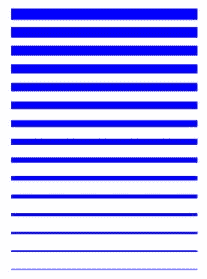

为了给线条添加一些活力，您还可以通过设置 [lineCap](http://msdn.microsoft.com/en-us/library/ff974910.aspx) 属性来更改所谓的线帽或线条的末端形状。为了创建一个圆形的边缘，我可以设置线帽为*圆形*。

context.lineCap = " round

这样做的例子画出了圆形的线条。

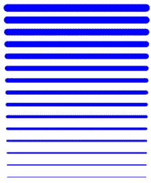

和线条一样，在画布元素上绘制文本也很简单。不像网页上的文本，没有盒子模型，这意味着你熟悉的 CSS 不可用。但是你有选择。绘图文本的一些相关属性和功能如下。

*   font[= value]–返回当前字体设置。可以设置，改变字体。语法与 CSS 的“font”属性相同
*   textAlign[= value]–返回当前文本对齐设置。可以设置，以更改对齐方式。可能的值有开始、结束、向左、向右和居中
*   text baseline[= value]–返回当前基线对齐设置。可以设置，以改变基线对齐
*   fillText(text，x，y [，maxWidth])–在给定位置填充文本
*   strokeText(text，x，y [，maxWidth])–在给定位置对文本进行描边

要打印一些纯文本，请使用 fillText。我正在使用 font 属性设置字体大小和类型。

context.font = ' 24px " Tahomacontext.fillText("Hello World！", 0, 0);

这是结果。

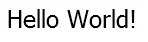

若要创建透明文本，请设置 fillStyle。

context.fillStyle = “rgba(0, 0, 0, 0.2)”;

而结果。

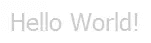

添加阴影等效果也是小菜一碟。下面的代码使用阴影绘制对象来创建阴影。

context.shadowOffsetX = 5;
context.shadowOffsetY = 5;
context.shadowBlur = 5;
context.shadowColor = “rgba(0, 0, 0, 1)”;

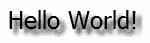

阴影可以定制成你喜欢的任何角度或颜色。我只演示了你可以在画布上处理文本的一小部分。有关这方面的更多信息，请查看 W3C 上的文本[部分](https://www.w3.org/TR/2dcontext/#text)。

### 图像和视频

嗯，当你在画布上工作时，也有可能处理图像和视频。显而易见的问题是为什么不使用标准的元素呢？最大的好处是你的图像可以成为一个更大更复杂的图像的一部分，这要归功于你可以用画布元素创造的所有魔法。处理图像和视频有一个主要的功能，那就是 [drawImage](http://msdn.microsoft.com/en-us/library/ff975414.aspx) 。下面这段代码引用了绵羊图像，并将其绘制在画布上。

var image = document . getelementbyid(" my sheep ")；
context.drawImage(image，10，10，128，128)；

这段代码在画布上画出了绵羊。

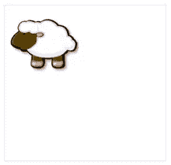

图像现在可以旋转、翻转、淡入淡出，或者简单地旋转，因为它已经绘制在画布上了。

视频遵循类似的路径。首先，您需要使用 HTML5 视频元素。正如您所想象的，这个元素附带了大量的功能，所以在我们开始之前，您应该在这里[阅读一下。视频元素本身并不那么有趣。元素本身包含一个 controls 属性，它决定了浏览器是否应该显示标准的视频控件集，还包含一个 loop，它告诉浏览器视频是否是递归的。在 video 元素中，指定三个子元素，每个子元素都有相同的视频，但格式不同。这没什么新鲜的，但是当你把视频元素和画布组合在一起时，你会发现一些惊人的东西。](https://www.w3.org/TR/html5/video.html)

我将首先添加画布和视频 HTML。

<canvas id="”myCanvas”">
<video id = " my video "控件循环>
<source src = " video . webm " type = " video/webm ">
<source src = " video . ogg " type = " video/ogg ">
<source src = " video . MP4 " type = " video/MP4 ">
</video></canvas>

这里没发生什么事情。视频将在视频标记内播放，但是我将在画布上绘制视频，并将视频放置在画布的中央。结果棒极了。这是代码。

var canvas = function(){
return {
draw:function(){
var video = document . getelementbyid(" my video ")；
var canvas = document . getelementbyid(" my canvas ")；
var context = canvas . get context(" 2d ")；

var width = math . floor(canvas . client width/100)；
var height = math . floor(canvas . client height/100)；

canvas.width =宽度；canvas.height =高度；

video . play()；
context.drawImage(video，0，0，width，height)；
}，
init:function(){
setInterval(canvas . draw，16)；

}

}

}()；

实现这一点的技巧是递归地在画布上绘制视频，否则它只会被绘制一次，看起来会非常糟糕。这就是页面加载时调用 setInterval 的原因。现场视频可以看[这里](http://msdeploy.net/IE9/Canvas/video.htm)。

### 变换和动画

canvas 元素可以实现变换和动画。下面是一些用于执行转换的相关属性和函数。

*   scale(x，y)–更改变换矩阵以应用具有给定特征的缩放变换
*   旋转(角度)–更改变换矩阵以应用具有给定特征的旋转变换
*   translate(x，y)–更改变换矩阵以应用具有给定特征的平移变换
*   transform(m11，m12，m21，m22，dx，dy)-更改变换矩阵以应用参数给定的矩阵
*   setTransform(m11，m12，m21，m22，dx，dy)-将转换矩阵更改为参数给定的矩阵。

变换和动画可以分开工作，但是当你把它们结合起来时，正如我现在将要演示的，它们可以产生强大的视觉效果。先说旋转。要旋转上下文，传入一个角度，它将在画布上旋转。下面的示例演示了每隔 250 毫秒绘制一个矩形，并且每个矩形都被旋转，因此效果就像一个纺车。颜色也是随机的，以产生明亮的效果。

var can = function(){
var canvas；
var 上下文；
return {
draw:function(){
var r = math . floor(math . random()* 255)+70；
var g = math . floor(math . random()* 255)+70；
var b = math . floor(math . random()* 255)+70；
var s = 'rgba(' + r +'，'+ g +'，'+ b + '，0.5)'；

context . rotate(0.2 * Math。PI)；
context . fill style = s；
context.fillRect(10，0，150，50)；
}，
init:function(){
canvas = document . getelementbyid(" my canvas ")；
context = canvas . get context(" 2d ")；
context . translate(200 250)；
setInterval(can.draw，250)；
}
}
}()；

window . onload = can . init；

下图显示了结果。

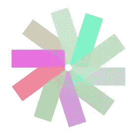

静止图像对这个演示没有任何帮助——要查看动画效果，你可以点击[这里](http://msdeploy.net/IE9/Canvas/rotate.htm)。缩放画布元素也很容易。除了旋转之外，我将坚持以前的演示；我将每秒缩小每个矩形。这是代码。

var can = function(){
var canvas；
var 上下文；
var x = 0；
var y = 0；

函数 currectX() {
返回 x = x+1；
}

function currectY(){
返回 y = y+1；
}
return {
draw:function(){
var r = math . floor(math . random()* 255)+70；
var g = math . floor(math . random()* 255)+70；
var b = math . floor(math . random()* 255)+70；
var s = 'rgba(' + r +'，'+ g +'，'+ b + '，0.5)'；

context . fill style = s；
context.scale(1.2，1.2)；
context.fillRect(currectX()，currectY()，5，5)；
}，
init:function(){
canvas = document . getelementbyid(" my canvas ")；
context = canvas . get context(" 2d ")；
context.translate(0，0)；
setInterval(can.draw，1000)；
}
}
}()；

window . onload = can . init；

下图显示了结果。

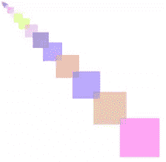

同样，图像不会显示动画——要查看动画效果，您可以点击[此处](http://msdeploy.net/IE9/Canvas/scale.htm)。可以想象，这只是变换和动画的一个起点。对于一个复杂的动画，你可以看看 Brilliant Lines，它是由 W3C 小组创建的。在这里可以找到[和](https://www.w3.org/TR/2dcontext/#examples)。想了解更多关于转换的信息，你可以点击[这里](https://www.w3.org/TR/2dcontext/#transformations)。

### 使用鼠标

正如你可能已经猜到的，用鼠标工作也是可能的。就像网页上的任何元素一样，可以通过查询元素的 [pageX](https://developer.mozilla.org/en/DOM/event.pageX) 和 [pageY](https://developer.mozilla.org/en/DOM/event.pageY) 属性来返回鼠标的 x 和 y 坐标。要在画布上跟踪鼠标，下面是代码片段。

var canvas = document . getelement byid(" myanvas ")；
var context = canvas . get context(" 2d ")；

canvas . onmosemove = function(e){
var x = e . pagex–此. offsetleft
var y = e . pagey–此. offsettop

var div = document . getelement byid(" coordinates ")；
div . intrahtml = " x:"+x+" y:"+y "；
}：

在上面的代码中，我附加了一个事件来捕获鼠标的移动，所以当它移动时，x 和 y 坐标被打印到网页上。简单明了。对于更高级的东西，我想让画布像一张纸一样，这样你就可以在上面画画了。好吧，这样做的代码并不太复杂。这是完整的代码。

var canvas = document . getelementbyid(" my canvas ")；
var context = canvas . get context(" 2d ")；

context . fill circle = function(x，y，radius，fill color){
this . fill style = fill color；
this . begin path()；
this.moveTo(x，y)；
this.arc(x，y，半径，0，数学。PI * 2，假)；
this . fill()；
}；
context . clear to = function(fill color){
context . fill style = fill color；
context.fillRect(0，0，canvas.width，canvas . height)；
}；

context . clear to(" # DDD ")；
canvas . onmousemove = function(e){
if(！canvas.isDrawing)返回；
var x = e . pagex–this . offset left；
var y = e . pagey–this . offsettop；
T21【var div = document . getelementbyid(" coords ")；
div . innerhtml = " x:"+x+" y:"+y；
var 半径= 10；
var fill color = ' # ff 0000 '；
context.fillCircle(x，y，radius，fill color)；
}；

canvas . onmousedown = function(e){
canvas . is drawing = true；
}；
canvas . onmouseup = function(e){
canvas . is drawing = false；
}；

多亏了 JavaScript，我可以轻松地扩展 canvas 元素并添加一些自定义事件处理程序来处理鼠标移动。现场版本可以在这里看到。去吧，尝试一下:画些草图。

**SitePoint Content Partner**

本教程是在微软的支持下完成的。我们与微软合作，由 SitePoint 独立编写，努力共同开发对您最有用、最相关的内容。

这就是画布元素的美妙之处:有太多你可以尝试的东西。

这是一次旋风式的旅行，我希望它让您热衷于使用 canvas 元素，知道这些非凡的效果在现在的现代浏览器中完全可以实现。

想了解更多？尝试这些链接:

*   [MSDN 的 HTML5 Canvas 开发者指南](http://msdn.microsoft.com/en-us/library/gg589510%28v=VS.85%29.aspx)
*   [硬件加速彩弹画布演示](http://ie.microsoft.com/testdrive/Performance/Paintball/Default.html)
*   [如何在 Canvas 和 SVG 之间选择创建网页图形](http://blogs.msdn.com/b/ie/archive/2011/04/22/thoughts-on-when-to-use-canvas-and-svg.aspx)

## 分享这篇文章