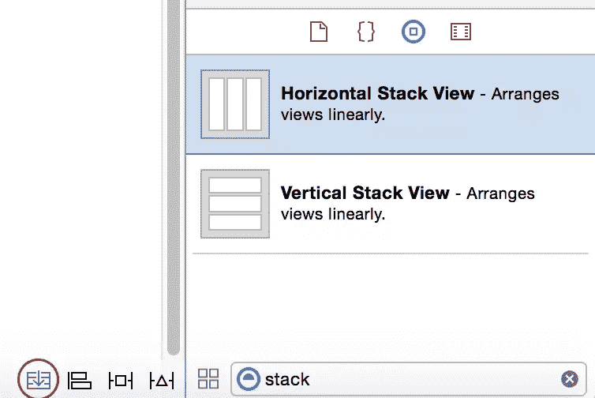
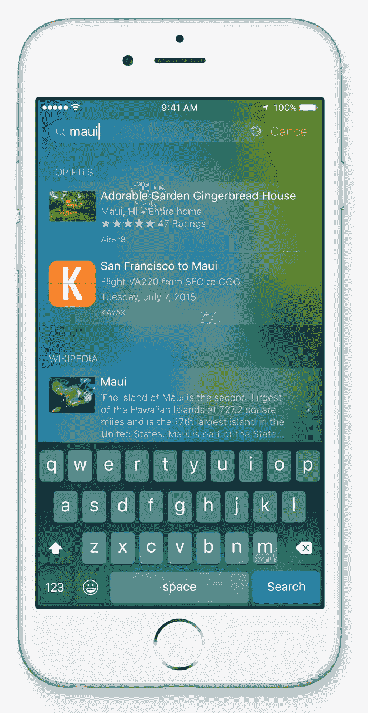
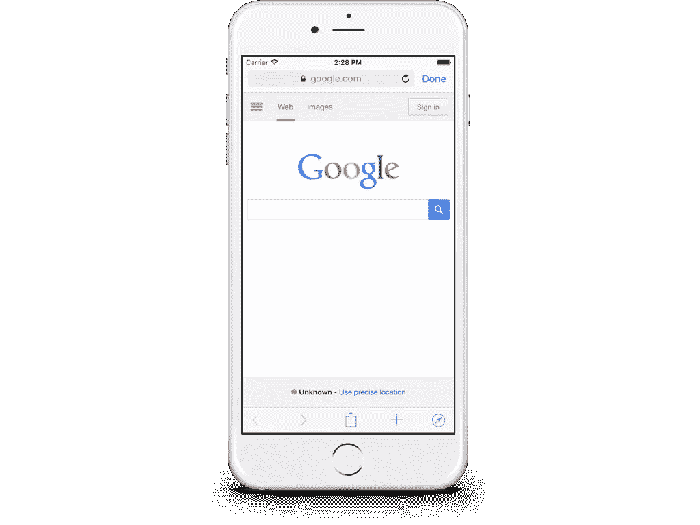

# 一个开发者对 iOS 9 的介绍

> 原文：<https://www.sitepoint.com/a-developers-introduction-to-ios-9/>

每年在 WWDC，苹果都会推出新版 iOS。自从 iOS 2 发布以来，Cocoa Touch 开发人员知道是时候研究文档、查看样本代码并为新的 API 准备代码了。

今年的 iOS 9，苹果增加了许多有用的功能，并完善了现有的功能。虽然它不像 iOS 7 那样是一个突破性的变化，但有很多新功能需要学习。

在这篇文章中，我将讨论 iOS 9 中我最喜欢的一些变化和添加。

## UIKit

UIKit 用于每一个 iOS 应用程序，驱动用户界面。随着 iOS 9 的发布，苹果从根本上改变了开发者使用新的`UIStackView`创建布局的方式。

### UIStackView

新的堆栈视图是如此重要，以至于苹果建议你应该开始使用堆栈视图构建你的用户界面，只有当界面变得过于复杂或高度定制时才偏离。栈视图将开发人员创建约束的大量工作抽象化。您将项目插入到 stack 视图中，UIKit 会在运行时自动分配适当的约束。

在 interface builder 中使用堆栈视图有多种方式。您可以从对象资源库中选择水平或垂直堆栈视图，或者使用 Xcode 底部的专用按钮:



在代码中使用这些很容易。要利用堆栈视图，您需要指定三个关键事项:

*   堆栈视图在哪个轴上
*   它应该如何排列子视图
*   这些子视图应该如何分布

最初可能会令人困惑的一件事是如何从视图层次结构中删除一个堆栈视图。这是一个两步过程。您需要从堆栈视图的`arrangeSubviews`属性中移除子视图，并从子视图实例中调用`removeFromSuperview(_:)`。整个过程可能如下所示:

```
//Init stack view
let horizontalSV = UIStackView()
horizontalSV.axis = .Horizontal
horizontalSV.alignment = .Center
horizontalSV.distribution = .Fill
self.view.addSubview(horizontalSV)

//Add a view
let aView = UIView()

//Add subviews
horizontalSV.addArrangedSubview(aView)

//Removing
horizontalSV.removeArrangedSubview(aView)

//Take out of view hierarchy
aView.removeFromSuperview()
```

### UIKit 动态

总是受欢迎的，好玩的， [UIKitDynamics API](https://developer.apple.com/library/ios/samplecode/DynamicsCatalog/Introduction/Intro.html) 有了新的行为。除了现在支持非矩形碰撞边界(即路径)，还有一个针对`UIAttachmentBehavior`的新附件类型的新行为类。

新的行为`UIFieldBehavior`，允许开发者对向量力场建模。苹果甚至提供了一个很好的代码样本来演示如何使用它[这里](https://developer.apple.com/library/prerelease/ios/samplecode/StickyCorners/Introduction/Intro.html)。值得下载以查看新行为的运行情况，并查看展示如何实现它的代码示例。

### UICollectionView 增强功能

自从在 iOS 6 中引入以来，收藏视图已经成为在 Cocoa Touch 中显示数据列表的首选方式。与表格视图相比，它们有明显的优势，但最大的优势是能够定义自定义布局。

在 iOS 9 中，它们变得更加强大和直观。新的布尔属性`sectionHeadersPinToVisibleBounds`强制流布局像表格视图一样工作。滚动时，部分标题将贴在屏幕顶部。

它们也可以很容易地重新排序。如果您正在使用`UICollectionViewController`，请将`installsStandardGestureForInteractiveMoment`设置为真。有了这一行，用户现在能够在他们的用户界面中按照自己的意愿订购商品。

### UIPickerView 增强功能

世界各地的开发人员已经编写了正确调整选取器视图大小的技巧。现在，picker 视图有了对调整大小和适应性的本机支持。在 iOS 的早期版本中，即使您试图操作日期选择器和选择器视图，它们也会强制使用默认大小。两个控件的默认宽度现在都是 320 磅。以前，它会是上显示的 iPhone 的设备宽度。

很少有人提到最近在`NSLayoutConstraint`上增加的功能`activateConstraints(_:)`。这是在 iOS 8 中添加的，通过一次调用激活一组约束。

## 联系人 API

长久以来，开发者不得不依赖基于 C 的 API 来使用他们应用程序中的联系信息。最后，苹果通过两个新框架给了我们一个完整的面向对象的 API:*联系人*和*联系人*。这些取代了*地址簿*和*地址簿 UI* 框架。

使用新的 API 比旧的方法要简单得多:

```
import Contacts

//Create the contact with a name
let contact = CNMutableContact()
contact.givenName = "Jordan"
contact.familyName = "Morgan"

//Setup other info
let homeEmail = CNLabeledValue(label:CNLabelHome, value:"jordan@morgans.com")
let workEmail = CNLabeledValue(label:CNLabelWork, value:"jordan@dreaminginbinary.com")
contact.emailAddresses = [homeEmail, workEmail]

//Address
let homeAddress = CNMutablePostalAddress()
homeAddress.street = "1 Somewhere Lane"
homeAddress.city = "Springfield"
homeAddress.state = "MO"
homeAddress.postalCode = "65807"
contact.postalAddresses = [CNLabeledValue(label:CNLabelHome, value:homeAddress)]

let birthday = NSDateComponents()
birthday.day = 6
birthday.month = 10
birthday.year = 1988  //You can leave the year off if you want
contact.birthday = birthday

//And just save it!
let store = CNContactStore()
let saveRequest = CNSaveRequest()
saveRequest.addContact(contact, toContainerWithIdentifier:nil)
store.executeSaveRequest(saveRequest)
```

## 多任务处理

对于用户来说，这将是最好的前瞻性增强之一，尽管目前它并不能在所有设备上使用。最好的部分(或者最差的部分取决于一个人的代码库)是，一个应用程序几乎可以开箱即用地使用这个功能。以 Twitter 为例:


这可以通过使用 iOS **自动布局**和**尺寸等级**来支持。如果代码库已经广泛使用了这些，那么就没什么可做的了。

本质上，当用户拖动手指设置多任务时，iOS 将在运行时操纵大小分类。如果屏幕被分成两部分，每个应用程序占据屏幕的一半，它们可能都是常规的宽度和高度。如果一个应用程序占据了屏幕的三分之二，而应用程序开发者只占据了四分之一(如上图所示)，那么它将会是紧凑的宽度和正常的高度。是时候停止回避自动布局和大小类了！

## 搜索

苹果宣布，他们希望 iOS 9 更加智能，并对你使用设备的方式做出反应。Siri 现在可以更好地猜测用户试图访问什么数据，用户的日常活动是什么样子等等。这将允许开发者在 iOS 9 中深度链接搜索。

使用搜索 API，开发人员可以让用户提供相关信息直接导航。在下图中，用户搜索*毛伊岛*，流行的旅游应用 Kayak 显示出从用户当前位置到毛伊岛的航班:



虽然我找不到这句话的出处，但我读到过用户在使用 iOS 时，花在应用程序上的时间高达 86%。重要的是，我们要让用户尽可能容易地进入我们自己的应用。

借助搜索，您可以通过以下三个主要 API 公开您的应用信息来实现这一点:

*   `NSUserActivity`:之前查看过的 app 内容。
*   **Web 标记**:Web 上也支持的 App 内容。
*   这可能是最常见的方法，应用程序的任何部分都可以使用这个 API 来公开。

## 云套件 JS

谁会想到 WWDC 最大的宣布之一会涉及 javascript？CloudKit 现在拥有丰富的 javascript API，这很重要，因为大多数“连接”应用通常需要某种网络存在。CloudKit JS 提供了一个 web 界面，可以与 iOS 应用程序协同工作。

CloudKit JS 将访问与其 iOS 版本相同的容器。这意味着所有数据都可以从两个设备自由流动。如果开发者不想自己托管该框架，苹果已经从自己的 CDN 中公开了该框架:

```
<script src="https://cdn.apple-cloudkit.com/ck/1/cloudkit.js">
```

在那里，从 CloudKit 仪表板为应用程序的容器启用 web 服务。该 API 使用 RESTFUL 架构构建，数据可以通过 JSON 检索和发布。例如，修改现有记录的端点如下所示:

```
POST [path]/database/[version]/[container]/[environment]/[database]/records/modify
```

由于 CloudKit 的定价具有竞争力，这可能是帮助它与类似服务如 [Parse](https://parse.com/) 竞争的缺失环节。

## 应用程序细化

这对开发者来说是一大胜利。作为开发者，我们可能遇到的最糟糕的事情之一就是错过销售机会，因为用户没有连接到 WIFI 来下载我们的应用程序。现在，苹果正在帮助消除这些类型的问题，他们使用的概念是“应用程序变薄”。

通过应用精简，用户将只下载二进制文件中与用户相关的部分。例如，如果用户有 iPhone 6+，则下载不会下载@1x 或@2x 图像，因为它们不会被使用，并且只下载@3x 图像。

应用程序精简有三个主要组成部分:

*   **App Slicing** :这是只下载需要的东西的过程。
*   **点播资源(ODR)** :应用商店托管的资源，用户下载应用后即可访问。例如，通过应用程序购买游戏中的新关卡。
*   **Bitcode** :允许苹果在未来重新优化应用的二进制，而无需提交新版本。

也许应用细化最好的部分是它的两个组件实际上已经完成了，应用切片和位代码。我个人认为这是一个奇妙的想法，因为开发人员已经独立地做了很长时间。

若要使用，请用关键字标记应用程序中的资源。然后，可以在以后使用这些标签下载这些资源。更好的是，这可以在 Xcode 中调试。使用新的`NSBundleResourceRequest`类，调用`beginAccessingResourcesWithCompletionHandler(_:)`来访问请求的资源。

## SFSafariViewController

早就应该这样了。在 iPhone 上浏览网页内容是一个日常过程，我甚至可以说 iOS 实际上是移动浏览的先驱。在很长一段时间里，开发者只剩下了`UIWebView`。它基本上可以完成工作，但它以泄漏内存、无法访问 nitro javascript 引擎、无法访问设备的钥匙链、cookies 等而闻名。

随着 WebKit 的发布，情况稍微好了一些，它引入了改进的`WKWebView`。这个版本提供了对 nitro javascript 引擎的访问，每秒 60 帧的响应滚动，内置手势等等。开发人员仍然必须创建自定义用户界面，无法访问自动填充、阅读器模式或浏览历史。

`SFSafariViewController`使用户浏览一致。这也为开发人员节省了大量时间，因为他们不再需要创建自己的自定义浏览体验。这对用户来说更方便，因为他们会预先填写密码，不必离开应用程序，他们的浏览历史可用，等等。

最棒的是，使用它们非常简单:

```
import UIKit
import SafariServices

class ViewController: UIViewController, SFSafariViewControllerDelegate
{

    override func viewDidAppear(animated: Bool)
    {
        super.viewDidAppear(animated)

        //Create the safari view controller
        let sfVC = SFSafariViewController(URL: NSURL(string:"https://google.com")!, entersReaderIfAvailable: true)
        sfVC.delegate = self

        //Show the browser
        self.presentViewController(sfVC, animated: true, completion: nil)

    }

    //Delegate method for dismissing it
    func safariViewControllerDidFinish(controller: SFSafariViewController)
    {
        dismissViewControllerAnimated(true, completion: nil)
    }
}
```

这将产生以下结果(注意 *Done* 按钮，它将用户直接带回到应用程序):



## 结论

我对 iOS 9 为开发者和用户带来的东西感到兴奋。对用户体验的改进，如多任务处理和画中画，将吸引现有用户并吸引新用户。对于开发人员来说，我们已经有了一些工具来帮助我们自己的应用程序满足这些新的期望，比如 stack view。iOS 9 的公开测试版已经发布，现在是时候开始使用它进行开发了。

这是 iOS 9 中我最喜欢的一些 API 的列表，还有数千个。除了 API 之外，Interface Builder 也得到了极大的增强(它现在可以渲染模糊和透明)。我甚至没有提到 SpriteKit，它已经用新的框架进行了改进。要获得 iOS 9 中所有变化的详尽列表，请务必访问苹果的[文档](https://developer.apple.com/library/prerelease/ios/releasenotes/General/WhatsNewIniOS/Articles/iOS9.html)。

我很想听听你对 iOS 9 的想法和反馈。

## 分享这篇文章