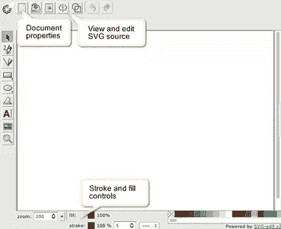
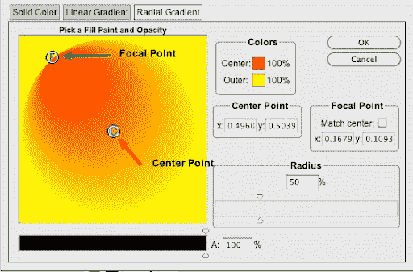
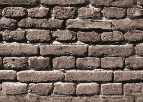
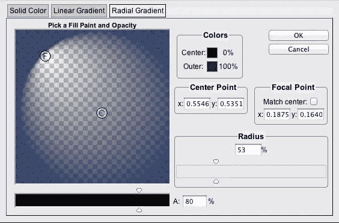
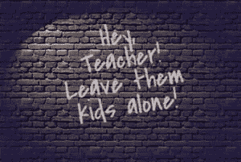
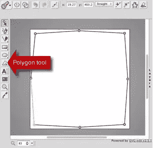
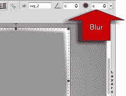
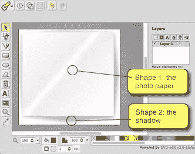
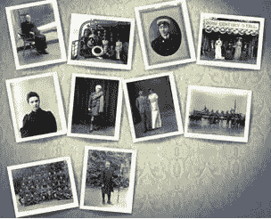

# 告别 CSS3 渐变

> 原文：<https://www.sitepoint.com/a-farewell-to-css3-gradients/>

在我们开始之前，让我们弄清楚一件事:

I ♥ CSS3.

我知道我们从来没有这么好过。事实上，我毫不怀疑从 2004 年来的时间旅行者会嫉妒我们现在如此容易地想象圆角、阴影和物体旋转。

当然，特定于浏览器的前缀(例如-moz，-webkit -o 等)令人恼火，但令人高兴的是，符号的其余部分是明智的、一致的，并且在现代浏览器中得到可靠的支持。

也就是说，除了一个明显的例外…

### CSS3 渐变:是的，它们实际上有点蹩脚。

虽然可编程渐变的想法很棒，但是使用起来却非常麻烦。即使在完美的浏览器乌托邦中，渐变也有意识地局限于基本的线性或放射状应用。你当然不能把它们组合起来，或者让它们形成一个形状或者任何类似的有用的东西。

更重要的是，大多数浏览器的支持都很复杂，有些甚至不存在。

以下是游戏当前状态的快照:

| 浏览器 | 径向 CSS | 线性 CSS |
| 火狐浏览器 | `-moz-radial-gradient( 500px 25%, circle, blue 20px, #eef 40px );` | `-moz-linear-gradient(top, #444444, #999999);)` |
| Chrome 11，Safari 5 | `-webkit-radial-gradient(#cde6f9, #81a8cb);` | `-webkit-linear-gradient(top, #444444, #999999);)` |
| 铬 | `-webkit-gradient( radial, 500 25%, 20, 500 25%, 40, from(blue), to(#eef) );` | `-webkit-gradient(linear, left top, left bottom, from(#444444), to(#999999));` |
| 歌剧 11 | 不支持 | `-o-linear-gradient(top, #444444, #999999);)` |
| 歌剧 10- | 不支持 | 不支持 |
| IE10 测试版 | `-ms-radial-gradient(top center, circle cover,
orange, yellow 25px, turquoise)` | `-ms-linear-gradient(30deg, orange, yellow 50%, turquoise);` |
| IE9 | 不支持 | 不支持 |
| IE8 | 不支持 | `-ms-filter: "progid:DXImageTransform.Microsoft.gradient( la la la...` |
| IE5-7 | 不支持 | `filter: progid:DXImageTransform.Microsoft.gradient(la la la..` |

哇，看起来很有趣，是吧？简而言之，它是一个笨拙的工具，语法古怪，支持不全面。

### 好吧，那还有什么选择？

虽然最近有一些关于渐变主题的伟大讨论，John Allsop 最近的文章给出了完美的概述，但大多数都集中在使用 CSS3，偶尔用 SVG 的 dab 修补一些漏洞。

会不会是我们看问题的方式不对？

2011 年，SVG 实际上得到了所有主流浏览器的良好支持——甚至在移动设备上。如果我们从 SVG 开始并修补边缘，会怎么样？回顾 CSS 15 年来的发展，这是一个缓慢的，经常是痛苦的发展。以这样的发展速度，很难想象 CSS 会发展成一个真正强大、灵活、可视化的设计工具。

但是有了 SVG，可以说我们今天已经拥有了功能齐全的可视化语言。

### 退一步:到底什么是 SVG？

所以，如果你在想' *SVG？那是新的大众汽车，对吗？*’，让我们做一个快速的追赶。

可缩放矢量图形(SVG)是一种基于 XML 的文件格式，用于描述二维矢量图形。像 Illustrator 的人工智能格式一样，它使用数学和几何来构建图像，而不是像素网格(即 JPEGs、PSD 等)。这给了 SVG 图像一些与网络相关的超能力——主要是，SVG 在保持微小文件大小的同时不会失真。

### 如何制作 SVG？

有很多方法可以制作自己的 SVG。

*   **手码**:如果你够极客，就打开你的 ol' text 编辑器，开始打字。像大多数 XML 格式一样，SVG 在阅读时很有意义。
*   **Illustrator**:[Adobe Illustrator](http://www.adobe.com/products/illustrator.html)可以导出到 SVG，尽管坦率地说，代码并不完全苗条和性感。也许这里没有合适的工具。
*   Inkscape : [Inkscape](http://inkscape.org/) 是一个强大的免费开源编辑器，使用 SVG 作为其原生文件格式。它当然有很多粉丝，但对于制作简单的网络图片来说可能有点过头了。
*   **BoxySVG** :我个人最喜欢的， [BoxySVG](https://boxy-svg.com) 是一个超级强大、性价比高的编辑器，让你与代码保持联系。
*   **SVG 编辑**:老经典，[谷歌的帕沃尔·鲁斯纳克的 SVG 编辑(托管在谷歌代码上)](http://code.google.com/p/svg-edit/)简单却有效。

最后一个可能会令人惊讶，因为谷歌代码并不是你想到视觉设计工具的第一个地方。一样没错，丑的跟牛头犬吃粥一样。但令人高兴的是，它也有很多令人喜欢的地方:

1.  这是免费的，我们总是喜欢免费的。
2.  它是由普通的 JavaScript、HTML、CSS 和 SVG 构建的，所以你可以使用谷歌的在线版本或者在你的本地系统上运行一个副本。
3.  它写出紧凑、干净、可读的标记。
4.  SVG Edit 旨在让您在整个过程中与 SVG 代码保持密切联系。

最后一点很重要。作为前端设计师，我们倾向于自然地不信任那些隐藏代码的所见即所得工具。事实上，我们大多数人都以手工编写十六进制颜色、字体堆栈、行高设置和基线节奏为荣。见鬼，我们中的一些人甚至根据他们的 RGB 值来选择 t 恤的颜色(不用指指点点)。SVG 编辑鼓励你以同样的方式“近距离接触”你的 SVG。随着您使用 SVG 越来越多，这将变得越来越有用。

理论到此为止。让我们看一下最简单的 SVG 例子。

### 示例 1:简单的线性渐变

1.在浏览器中打开 [SVG Edit](http://code.google.com/p/svg-edit/) (从链接演示部分)。

[](https://www.sitepoint.com/wp-content/uploads/2011/08/svg-edit.png)

空白 SVG 编辑应用程序

2.在我们做任何事情之前，试着点击左上方那个可怕的“SVG”按钮。将出现一个弹出窗口，显示您的空白 SVG 文档。您会注意到文档大小设置为 640 像素乘 480 像素。尝试将宽度更改为 480 像素，然后点击“应用更改”以在可视编辑器视图中查看您的更改。

很好。你刚刚写了一些 SVG。

3.接下来从左边的工具栏中选择矩形工具，拖出一个和你的文档大小差不多的盒子。默认情况下，您的矩形可能有一个描边轮廓。在编辑器的底部，你会注意到填充和描边控件。通过将笔画宽度设置为 0px 来删除笔画。

4.切换回 SVG 代码视图，您会看到 atag 已经添加了一组颜色、笔画和大小的属性。SVG 的伟大之处在于它通常非常易读。既然我们去掉了笔画，如果你愿意，你可以删除笔画宽度和笔画颜色属性。如果您的矩形不太适合您的画布，请手动编辑宽度和高度以匹配文档。它应该是这样的:

```
<svg width="640" height="480" >
  <!-- Created with SVG-edit - http://svg-edit.googlecode.com/ -->
 <g> <title>Layer 1</title>
   <rect fill="#ff0000" x="0" y="0" height="480" width="640" id="svg_1"/>
 </g>
</svg>
```

5.交叉回到可视化编辑器视图。选中你的新矩形，点击填充色卡(靠近桶)。一个选项卡式弹出窗口启动，让您选择纯色，线性和径向梯度。让我们面对现实:在这里，纯色 SVG 没有普通的 ol' CSS 有用，但是其他两个选项卡非常有用。

试试线性渐变面板。您可以使用颜色选择器选择开始和结束颜色。“x”和“y”设置控制渐变的方向。左上角的位置是 0:0，右下角的位置是 1:1，因此 0:0 的开始点和 1:1 的结束点将为您提供从左上到右下的对角线渐变。

改变你的终点到 0:1 将会把你的渐变从水平切换到垂直。你会注意到底部有一个滑块，可以让你控制整个对象的不透明度。或者，您可以使用拾色器为每个色标设置不同的透明度级别。试着选择一个开始和结束的颜色，然后看一下 SVG。它应该看起来像这样。

```
<svg width="640" height="480" >
 <!-- Created with SVG-edit - http://svg-edit.googlecode.com/ -->
 <defs>
  <linearGradient y2="1" x2="1" y1="0" x1="0" id="svg_2">
   <stop stop-color="#ff0000" offset="0"/>
   <stop stop-color="#ffff00" offset="1"/>
  </linearGradient>
 </defs>
 <g>
  <title>Layer 1</title>
  <rect id="svg_1" height="480" width="640" y="0" x="0"  fill="url(#svg_2)"/>
 </g>
</svg>
```

这种标记应该很熟悉。您会看到渐变是在标签之间的顶部定义的，并且有一个惟一的 ID——“SVG _ 2”。停止表示我们的开始和结束颜色。在它下面，你会看到标签通过它的 ID (id="svg_2 ")引用渐变。

让我们把它扔向一个浏览器。

打开 SVG 代码视图，选择标记并将其复制到剪贴板。接下来，打开您最喜欢的代码编辑器，创建一个新文档并粘贴您的 SVG。

将您的文档作为'`gradient.svg`'保存到测试文件夹。接下来创建一个空白的 HTML 文档，并在文件头中添加以下代码。

```
<style> html { background: url(gradient.svg); background-size:100% 100%; height:100%; } </style>
```

将 HTML 文档与 SVG 一起保存，并在浏览器中预览。您应该看到一个优雅的双色渐变，可以毫不费力地缩放以填充任何当前的浏览器窗口。

但是三种或三种以上的颜色渐变呢？你说。

简单。在代码编辑器中切换回“`gradient.svg`”。你会注意到线性梯度中的停靠点的偏移量分别为 0 和 1。添加一个新的，偏移量为 0.5，颜色为您喜欢的任何颜色，并将其插入其他两个停靠点之间，如下所示:

```
<stop stop-color="#ff0000" offset="0"/>
   <stop stop-color="#00ff00" offset=".5"/>
   <stop stop-color="#ffff00" offset="1"/>
```

保存并重新加载，你现在应该有一个三色彩虹。

好吧，所以你可能会想‘*好吧，但是我们可以用 CSS3 渐变来实现——有什么大不了的？这是非常正确的，但是 SVG 确实有一些很好的优点。*

*   我们的 CSS 是如此干净，你可以吃了它。
*   我们可以在不离开代码编辑器的情况下调整渐变。
*   我们现在只需要管理一组数字，而不是 4、5 或 6 种语法。(即使假设我们仍然可能不得不破解旧的 IE 浏览器)

这很好，那么一个不能用纯 CSS 解决方案复制的例子呢？

### 径向渐变呢？



SVG 编辑-径向渐变面板

回到 SVG 编辑。再次选择你的矩形，点击填充色卡，切换到**径向渐变**标签。你会看到一个控制面板，不像线性渐变面板。

默认情况下，渐变以您的形状为中心(例如，位置 x=0.5，y=0.5)，但是您可以随时随意拖动和重新定位中心点。

可以通过右侧的半径滑块调整外半径。然而，我认为真正漂亮的部分是能够有一个单独的中心点和焦点。

只需取消选中“*匹配中心*”框，将“F”和“C”图标放在您喜欢的任何位置。正如你在 screencap 中看到的，这可以让你以类似聚光灯和阴影的方式拉伸和扭曲径向渐变。

即使是最时髦的新浏览器也不能用纯 CSS 做到这一点。

[](https://www.sitepoint.com/wp-content/uploads/2011/09/sunset.jpg)

像比利·怀尔德和阿尔弗雷德·希区柯克这样伟大的电影导演用光影来讲述他们的故事。

### 示例 2-灯光效果

最近我看了老经典电影《日落大道》，这让我想到像比利·怀尔德和阿尔弗雷德·希区柯克这样的导演是如何出色地运用阴影和光线来创造戏剧的。影子几乎成了故事中的另一个角色。

[](https://www.sitepoint.com/wp-content/uploads/2011/09/seamless-brick.jpg)

无缝瓷砖很棒，但它们必须在平面光照下才能发挥作用

对我来说，这突出了网络上无缝拼接位图的一个自然限制:根据定义，它们需要乏味的，几乎是临床上的平面照明。

更准确地说，如果你想让边缘融合，你不能让瓷砖一边比另一边亮。

如果我们将 SVG 的优势与平铺位图结合起来，以达到两全其美，会怎么样呢？

先说这个基本的无缝砖瓷砖(左)。[自己渲染](https://www.sitepoint.com/examples/svg/wall.html)，印象不是特别深刻。当然，我们可以使用[蝉原理](https://www.sitepoint.com/the-cicada-principle-and-why-it-matters-to-web-designers/)来随机排列砖块图案，但是我认为是单调、无菌的灯光让它变得沉闷。让我们解决这个问题。

使用 SVG Edit，我已经创建了一个简单的，带有半透明径向渐变中心的深蓝色矩形。

我将焦点向左上角倾斜，给它一种聚光灯的感觉。

[](https://www.sitepoint.com/wp-content/uploads/2011/09/svg.jpg)

SVG 中的径向渐变

将代码复制到一个新的 SVG 文件中应该是这样的:

```
<svg width="640" height="480" >
 <!-- Created with SVG-edit - http://svg-edit.googlecode.com/ -->
 <defs>
  <radialGradient id="svg_3" cx="0.5" cy="0.5" r="0.5" fx="0.19" fy="0.19">
   <stop offset="0" stop-color="#000000" stop-opacity="0"/>
   <stop offset="1" stop-color="#120747"/>
  </radialGradient>
 </defs>
 <g>
  <title>Layer 1</title>
  <rect fill="url(#svg_3)" x="0" y="0" height="480" width="640" id="svg_1" fill-opacity="0.72"/>
 </g>
</svg>
```

如你所见，它仍然非常简洁易读。

首先，我们将为不支持多背景的旧浏览器(主要是 IE 浏览器)设置一个后备背景。我们还将 HTML 元素的高度设置为 100%，以确保我们的图像填充浏览器。

```
html { background:url(bricks3.jpg) ; height:100%; }
```

接下来，我们将添加我们的多图像背景。砖瓷砖在后面(最后)，我们的 SVG 覆盖它。

```
html {
 background:url(bricks3.jpg) ;
  background:url(spotlight.svg), url(bricks3.jpg) ;
height:100%;
}
```

注意，我使用的是简写的“背景”CSS 属性，而不是“背景图像”,因为当你使用更具体的符号时，旧的 IE 似乎试图将多个图像读取为一个长图像。德尔普。

显然，默认情况下背景图片会平铺显示。这非常适合我们的砖块图形，但是我们希望我们的 SVG 符合浏览器窗口，所以我们需要像这样指定背景大小:

```
html { background:url(bricks3.jpg) ;
background:url(spotlight.svg), url(bricks3.jpg);
background-size:100% 100%, auto; /* auto is tile */
 height:100%;
}
```

[](https://www.sitepoint.com/wp-content/uploads/2011/09/heyteacher.jpg)

将 SVG 与一个简单的图块结合起来。

最后，我们添加了一些网络字体和少量的 CSS3，我们得到了这样的东西。可以戳[这里有个活生生的例子](https://www.sitepoint.com/examples/svg/thewall.html)。

我认为有许多点毫无价值。

我首先想到的是一个非常简单的 SVG 对一个看起来很平的瓷砖有多大的影响。不断变化的光线意味着，即使是紧密重复的砖块，似乎也远没有以前那么明显了。

其次，从技术角度来看，您会注意到 SVG 可以立即扩展到任何浏览器窗口，并且无论屏幕分辨率如何，它都保持清晰。

在当前所有主流浏览器中，CSS 背景对 SVG 的支持都很好。

*   Chrome(自 2010 年 5 月起)
*   火狐浏览器(2011 年 3 月)
*   IE9(2010 年 3 月测试版)
*   safari(2010 年 6 月)
*   歌剧(2008 年 6 月)。

旧的浏览器会很乐意呈现砖块，但不会呈现 SVG——对于这个例子来说，这是一个不错的结果。我在这里不打算深入探讨解决方法，但是你可以考虑回退到 Firefox 3.6 和 I E8——你自己决定。

### 示例 3–复古画廊

[](https://www.sitepoint.com/wp-content/uploads/2011/09/polygon-tool.jpg)

使用多边形工具创建一个边缘稍微向外弯曲的矩形。

是时候认真对待 SVG，给它一个更大的挑战了。到目前为止，我们的前两个示例只使用了一个矩形，但是——与 CSS3 渐变不同——没有什么可以阻止我们将一个、两个或更多的形状和渐变组合成一个更复杂的 SVG。

对于最后一个例子，我们将创建一个具有复古风格的松散图库。我们图库的 HTML 非常干净——由国家图书馆[或爱尔兰国家图书馆](http://www.flickr.com/photos/nlireland/sets/72157626734839765/with/5852344432/ "National Library of Ireland")提供的 Flickr 图片的无序列表。我想为每个图像创建一个自动调整大小的 SVG 框架。

回到 SVG 编辑，我将从两个简单的图形创建这个新图形。

第一个形状是使用多边形工具创建的。它本质上是一个边缘略微向外弯曲的矩形——几乎就像形状被过度膨胀了一样。这个形状将是我的阴影，所以我想删除的中风，并给它一个半透明，30%的黑色填充。

令人高兴的是，SVG 还支持一组方便的内置过滤器，我们可以使用其中的一个来给我们的阴影添加一个柔和的模糊边缘。

选择形状，你应该看到模糊过滤器控制出现在编辑器的顶部。我已经将模糊度设置为 6，来得到你在下面看到的柔和的边缘。

[](https://www.sitepoint.com/wp-content/uploads/2011/09/blurfilter.jpg)

设置模糊过滤器为 6 给我们一个柔和的阴影效果。

第二个形状只是一个长方形。它有一个浅灰色的边界，白色和浅灰色的线性梯度给它一个光滑的“相纸”的外观。

从编辑器中抓取代码并粘贴到一个新的 SVG 文档中。我们现在有了[一个简单的、可扩展的框架图形](https://www.sitepoint.com/examples/svg/polaroid.svg)，它非常适合我们的需求。

让我们看看 CSS。

```
ul li { background: url(polaroid.svg);
 -moz-background-size: 100% 100%;
 background-size: 100% 100%;
 display:inline-block;
 padding:2% 2.5% 3% 2%;
 list-style: none;
  ... }
```

[](https://www.sitepoint.com/wp-content/uploads/2011/09/photopaper.jpg)

使用简单的 SVG 来模拟光滑相纸的外观

首先，我们将新的 SVG 应用于列表项的背景，并使用`background-size`来匹配每个列表项的大小。

我还在列表项上使用了`display:inline-block`,让照片在屏幕上堆叠起来。这通常使它们的堆叠比浮动每个列表项更优雅。

我们还需要添加一些填充，以确保照片不会完全遮住我们的框架。

[](https://www.sitepoint.com/wp-content/uploads/2011/09/gallery.jpg)

我们的 SVG 毫不费力地适应任何大小或方向的图像。

最后，我使用了一点 CSS3 旋转来给画廊一种松散的感觉。我不会在这里分解代码，但是 Frank Fuchs 早在五月份就提出了这个想法。

[下面是结果](https://www.sitepoint.com/examples/svg/gallery.php)。

### 你怎么想呢?

对我来说，这种方法有很多优点。SVG 的优势似乎很明显。SVG 的每一次出现都会缩放、旋转和重塑自身，而不会有任何失真或图像质量损失。文件大小要小一个数量级，以字节而不是千字节来度量。

能够通过几个懒惰的按键来调整模糊或不透明也很好。

当然，有一些缺点，但不太多。

目前 IE9 很好地支持 SVG，但不幸的是不支持 SVG 过滤器，所以我们的阴影边缘看起来很清晰。

不出所料，早期的 IE 忽略了 SVG，但实际上他们缺乏对 CSS3 属性的支持才是真正的阻碍。扩展 SVG 才是真正的力量所在。你也许可以用微软的过滤器设计一个 IE8 的后备版本。祝你好运。不管怎样，CSS3 渐变肯定不是你的救星。

另一个重要的不支持 SVG 的浏览器似乎是第 4 版之前的任何火狐浏览器，随着 Mozilla 转向自动升级，这一点每天都变得不那么重要了。奇怪的是，自 2008 年以来，Firefox 实际上已经很好地支持了 SVG 只是不在 CSS 背景中，因为它们在 CSS 背景中非常有用。我再说一遍，德尔普。

无论如何，我希望这篇文章能激发一些想法，告诉你如何在你的作品中编织一些性感的载体。如果没有，它至少应该是一个很好的 SVG 入门。

开启 SVG 时代！

## 分享这篇文章