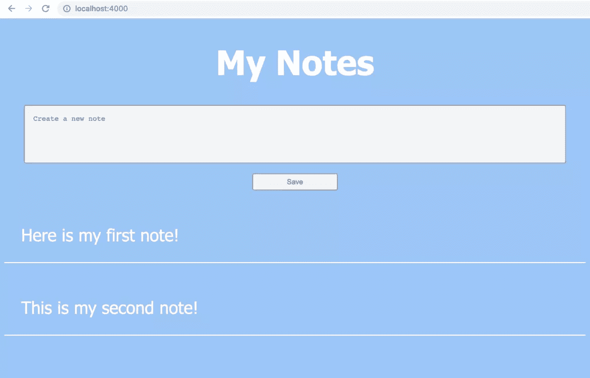
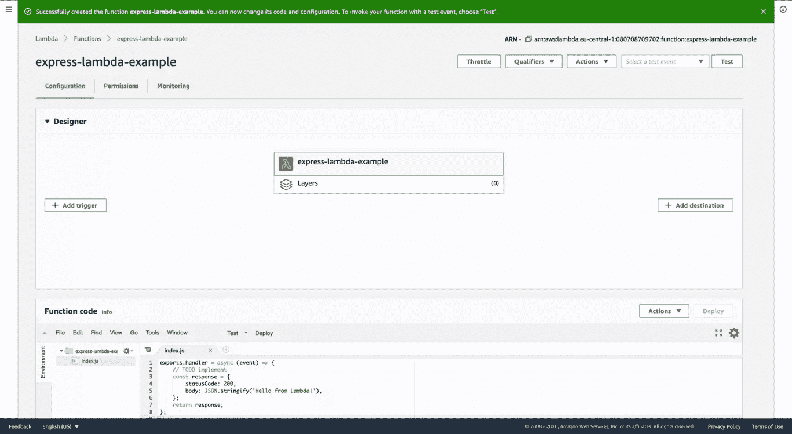
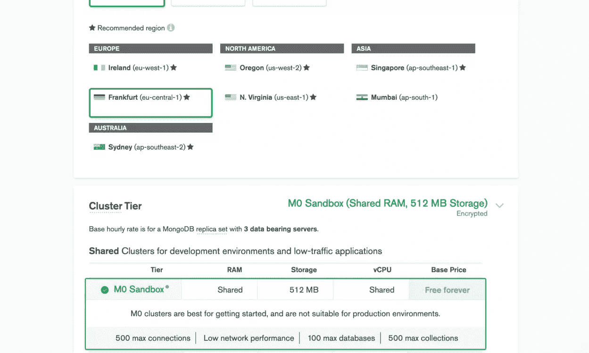
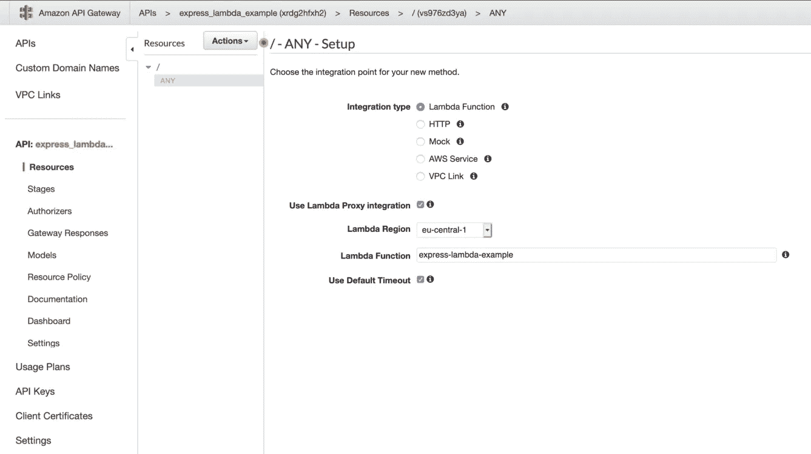
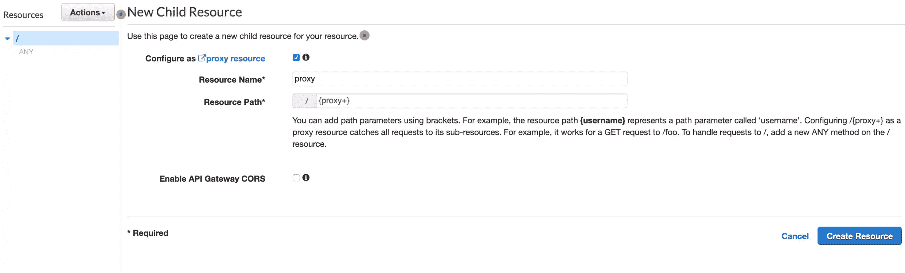

# Express 和 MongoDB 无服务器部署指南

> 原文：<https://www.sitepoint.com/a-guide-to-serverless-deployment-with-express-and-mongodb/>

在本教程中，我将向您展示我最喜欢的部署数据库驱动的 web 应用程序的工作流程。它面向的是那些希望在自己的项目上实现全栈，而不必建立和维护复杂的多服务基础设施的开发人员。

我们将部署一个用 Node.js 和 Express 编写的非常初级的 web 应用程序。它允许访问者写和保存笔记，并阅读以前写的笔记。数据存储在 MongoDB 数据库中。我们将使用 GitHub 操作创建一个 CI/CD 工作流，在 AWS Lambda 上部署我们的应用程序。

重点是简单、实用和节约成本。由于 AWS 和 MongoDB 有非常慷慨的免费层，您可以免费跟随。但是，请记住，如果您不想最终支付几分钱，请在事后取消部署该应用程序。由于您的应用程序将是公开可用的，从长远来看，理论上它的使用可以通过免费层。但是，如果你打算为自己的目的扩展这个应用程序，我可以推荐这个设置，因为它对于一个流量适中的网站来说是非常实惠的。

你可以在我们的 [GitHub 账号](https://github.com/sitepoint-editors/express_lambda_mongodb_example)上找到本教程的所有代码。

## 先决条件

你需要一些东西来构建这个应用程序。确保您的系统上安装了 Node 和 Docker。要安装 Node，你可以使用节点版本管理器(nvm)(参见一些说明[此处](https://www.sitepoint.com/quick-tip-multiple-versions-node-nvm/))。对于 Docker，为你的操作系统安装最新版本的 [Docker 桌面](https://www.docker.com/get-started)。

注意，我们将使用 Docker 在我们的机器上运行 MongoDB 的一个实例。或者，您也可以手动安装 MongoDB 社区版。你可以在这里找到一些说明[。](https://www.sitepoint.com/an-introduction-to-mongodb)

你还需要在 [GitHub](https://github.com/) 、 [MongoDB](https://www.mongodb.com/) 和[亚马逊网络服务(AWS)](https://aws.amazon.com/) 拥有账户。在 AWS 上注册时，您必须输入信用卡号。如上所述，采取本教程中的步骤不会超出免费层。

Node 和 Express 中的一些知识可能会有所帮助。

## 地方发展

好了，我们开始吧。我们首先需要一个空文件夹，里面有一个新的`package.json`文件。执行`npm init`就可以创建一个。

我们需要安装以下依赖项:

1.  [express](https://www.npmjs.com/package/express) ，对客户端的 HTTP 请求做出反应
2.  mongose，与我们的 MongoDB 数据库通信
3.  为了让 AWS Lambda 能够调用我们的应用程序
4.  [并发](https://www.npmjs.com/package/concurrently)(作为开发依赖)，并行执行 npm 脚本

运行以下命令来安装它们:

```
npm install --save express mongoose aws-serverless-express && npm install --save-dev concurrently 
```

### 1.MongoDB 和 mongoose

因为我们使用 MongoDB 数据库来存储我们的数据，所以在本地机器上运行一个数据库实例对开发很有帮助。这就是我们使用最新 *mongo* Docker 图像的地方。如果您的机器上安装了 Docker，这就像在终端中键入`docker run mongo`一样简单。图像从 [dockerhub](https://hub.docker.com/_/mongo) 中取出，并在新的容器中开始。如果你不熟悉 Docker，没关系。您只需要知道，您的计算机上运行着一个 MongoDB 实例，您可以与之通信。

为了让我们的应用程序与数据库通信，我们需要初始化一个连接。我们在一个名为`mongoose.js`的新文件中这样做。Mongoose 是帮助我们进行 MongoDB 对象建模的库:

```
// mongoose.js

const mongoose = require("mongoose");

const uri = process.env.MONGODB_URL;

let connection;
const connect = async () => {
  try {
    connection = await mongoose.createConnection(uri, {
      useNewUrlParser: true,
      useFindAndModify: false,
      useUnifiedTopology: true,
      bufferCommands: false, // Disable mongoose buffering
      bufferMaxEntries: 0, // and MongoDB driver buffering
    });
    return connection;
  } catch (e) {
    console.error("Could not connect to MongoDB...");
    throw e;
  }
};

function getConnection() {
  return connection;
}

module.exports = { connect, getConnection }; 
```

这个文件用两个函数导出一个对象。在我们在环境变量中指定的位置创建一个到 MongoDB 的连接。连接被存储在一个名为`connection`的变量中。`getConnection()`简单地返回连接变量。你可能想知道为什么我们不直接返回连接变量本身。这是因为 Node.js 会在第一次加载所需模块后缓存它们。因此，我们使用一个函数从我们的`mongoose.js`模块中取出最新的连接变量。

现在，我们的应用程序将能够连接到数据库，我们还想在其中存储数据，更具体地说，我们可以在用户界面中写笔记。因此，我们将为我们的笔记创建一个数据模型。这是在一个名为`Notes.js`的新文件中完成的，该文件位于一个`models`文件夹中:

```
// models/Notes.js

const mongoose = require("mongoose");
const { getConnection } = require("../mongoose");
const conn = getConnection();
const Schema = mongoose.Schema;

module.exports = conn.model(
  "Note",
  new Schema({ text: { type: String, required: true } })
); 
```

这里，我们从我们的`mongoose.js`模块中取出当前连接，并在其上注册一个名为`Note`的模型。它有一个非常基本的模式，只包含一个字符串类型的必需属性`text`。使用这个模型，我们可以构造存储在数据库中的文档。

### 2.快速申请

接下来，我们创建一个简单的 Express 应用程序。在项目根目录下创建一个名为`app.js`的文件。它有以下内容:

```
// app.js

const express = require("express");

const app = express();

app.use(express.urlencoded({ extended: false }));

app.get("/", async (req, res) => {
  try {
    const Note = require("./models/Note");
    const notes = await Note.find({});
    return res.status(200).send(
      `<!DOCTYPE html>
      <html lang="en">

      <head>
          <title>My Notes</title>
          <style>
              html {
                  text-align: center;
                  background-color: #93c5fd;
                  font-family: "Segoe UI", Tahoma, Geneva, Verdana, sans-serif;
                  color: white;
                  font-size: 2rem;
              }

              textarea {
                  resize: none;
                  border: 2px solid #9ca3af;
                  border-radius: 4px;
                  background-color: #f3f4f6;
                  padding: 0.5rem;
                  width: 90%;
              }

              button {
                  padding-left: 2rem;
                  padding-right: 2rem;
                  padding-top: 7px;
                  padding-bottom: 7px;
                  background-color: #f3f4f6;
                  border: 2px solid #9ca3af;
                  color: #4b5563;
                  border-radius: 4px;
              }

              p {
                  border-bottom: 2px solid;
                  padding: 1rem;
                  text-align: left;
              }
          </style>
      </head>

      <body>

          <h1>My Notes</h1>

          <form method="POST">
              <textarea required name="text" rows="5" cols="50" placeholder="Create a new note"></textarea>
              <button type="submit">Save</button>
          </form> ${notes.map((n) => `<p>${n.text}</p>`).join("")} </body>

      </html>`
    );
  } catch (e) {
    return res.send(e);
  }
});

app.post("/", async (req, res) => {
  try {
    const Note = require("./models/Note");
    const note = new Note(req.body);
    await note.save();
    return res.send("Note saved. <a href=''>Refresh</a>");
  } catch (e) {
    return res.send(e);
  }
});

module.exports = app; 
```

正如我所说的，这个应用程序非常简单，只是一个演示。首先，我们启动一个快递应用程序。然后，我们告诉它用内置的 URL 编码中间件解析传入的请求体，以便我们能够处理提交的表单数据。对于应用程序根上的请求，该应用程序有两个方法处理程序:

*   `app.get("/", ...)`处理 HTTP GET 请求。它在用户加载页面时被调用。我们想展示给他们的是一个简单的页面，他们可以在这里输入并保存注释。此外，我们希望显示以前写的笔记。在请求处理程序的回调函数中，我们需要我们的`Note`模型。我们的 POST 请求处理程序的回调函数中需要这个模型，因为它需要一个当前的数据库连接——当`app.js`文件第一次加载时，这个数据库连接可能不存在。然后，我们应用`find`方法从数据库中接收所有的笔记。这个方法返回一个承诺。因此，我们等待它解决。最后但同样重要的是，我们使用响应对象(`res`)的`send`方法向客户端发回一个字符串。该字符串包含浏览器呈现到实际 HTML 元素中的 HTML 语法。对于数据库中的每一条注释，我们只需添加一个包含其文本的段落元素。

    在这一点上，您可以将这个非常基本的示例转换成一个漂亮的用户界面。您可以自由选择发送给客户端的内容。例如，这可以是完全捆绑的客户端 React 应用程序。您也可以选择服务器端渲染的方法，例如，通过使用 handlebars 这样的快速视图引擎。根据具体情况，您可能需要向应用程序添加更多的路由，并提供像 JS 包这样的静态文件。

*   `app.post("/", ...)`处理 HTTP POST 请求。当用户保存他们的笔记时它被调用。同样，我们首先需要我们的`Note`模型。请求有效负载可以通过请求对象的 body 属性来访问(`req`)。它包含用户提交的文本。我们用它创建一个新文档，并用 Mongoose 提供的`save`方法保存。同样，我们等待这个异步操作完成，然后通知用户，让他们可以刷新页面。

为了让我们的应用程序真正开始监听 HTTP 请求，我们必须调用 Express 提供的`listen`方法。我们将在一个名为`dev.js`的单独文件中这样做，我们将它添加到我们的项目根目录:

```
// dev.js

const app = require("./app");
const { connect } = require("./mongoose");

connect();

const port = 4000;

app.listen(port, () => {
  console.log(`app listening on port ${port}`);
}); 
```

这里，我们从我们的`mongoose.js`文件中调用`connect`函数。这将启动数据库连接。最后但同样重要的是，我们开始监听端口 4000 上的 HTTP 请求。

用两个独立的命令启动`mongo` Docker 图像和我们的应用程序有点麻烦。因此，我们将一些脚本添加到我们的`package.json`文件中:

```
"scripts": {
  "start": "concurrently 'npm:mongoDB' 'npm:dev'",
  "dev": "MONGODB_URL=mongodb://localhost:27017 node dev.js",
  "mongoDB": "docker run -p 27017:27017 mongo"
} 
```

`mongoDB`启动一个 MongoDB 实例，并将容器端口 27017 映射到本地机器的端口 27017。`dev`启动我们的应用程序，并设置环境变量`MONGODB_URL`，该变量被加载到`mongoose.js`文件中，以便与我们的数据库进行通信。`start`脚本并行执行这两个脚本。现在，我们需要做的就是在终端中运行`npm start`来启动我们的应用程序。

现在，您可以通过在浏览器中访问 [http://localhost:4000](http://localhost:4000) 来加载应用程序。



## 部署

现在是时候部署我们的应用程序了。我们将在 AWS、MongoDB Atlas 和 AWS API Gateway 上使用 Lambda 函数来实现这一点。

### 1.什么是 Lambda 函数，我们为什么要使用它们？

Lambda 函数是一种无需维护服务器就能执行代码来响应 HTTP 请求的方式。它们只按需运行，这意味着，如果没有人调用您的服务，您不必为服务器时间付费。另一方面，如果很多人调用您的服务，AWS 会自动扩展，并启动更多的 Lambda 实例。

顾名思义，Lambda 函数就是函数，你可以用任何你想要的东西来填充它们。只有一个例外:你的代码不应该有状态，因为 Lambda 实例一旦不再被执行就会关闭。

我们将把整个应用程序包装在一个 Lambda 函数中，并将其部署在 AWS Lambda 上。AWS Lambda 有一个非常慷慨的无限制免费层，其中包括一百万个免费请求和每月 400，000 GB 秒！因此，您可以放心地试验该服务并部署几个 Lambda 函数，而不必为此付费。如果你不想再使用这些功能，记得删除它们。

### 2.创建 AWS Lambda 函数

现在，登录到您的 AWS 管理控制台并导航到 AWS Lambda。在*功能*部分，点击*创建功能*。在这样做之前，重要的是您已经指定了您想要部署服务的区域。在台式计算机上，您可以在管理控制台的右上角选择一个区域。

从头开始选择*Author*并给你的函数起个名字。我就叫它*快车——λ——例*。在*运行时*下，选择 *Node.js 12x* 然后创建函数。您将看到一个如下所示的窗口:



我们的 Lambda 函数已经包含了一些测试代码。您可以忽略它，因为我们稍后会覆盖它。如果你向下滚动页面，你会看到一个叫做*环境变量*的部分。还记得吗，在我们的本地开发脚本中，我们定义了一个名为`MONGODB_URL`的变量？为了 Lambda 实例能够与数据库通信，我们必须在这里创建相同的变量。

然而，我们还没有一个运行的数据库。我们不想为此使用我们的本地机器。这就是为什么我们将在 MongoDB Atlas 上创建一个自由层集群。

### 3.设置 MongoDB Atlas 云服务

要创建自由层集群，请在[mongodb.com](https://www.mongodb.com/try)上创建一个帐户。在注册过程中，您将被要求选择一个集群类型。选择一个免费的*共享集群*。下一步是给你的项目命名。此外，您可以选择自己喜欢的编程语言。

下一步，您可以选择云提供商和地区。因为我们已经在 Node.js 应用程序中使用了 AWS，所以我建议您选择它，如果可能的话，选择您之前在 AWS 上选择的相同区域。在下一部分中，您可以决定要使用哪一层。选择 *M0 沙盒*层。MongoDB 不建议在生产环境中使用这一层，但是对于初学者来说，它将提供您需要的一切。



几分钟后，我们的集群就可以使用了。现在缺的就是拿到它。点击菜单中的*数据库访问*并创建一个新用户。认证方式为*密码*。授予用户读写权限。一旦你做到了这一点，我们需要将可以访问我们数据库的 IP 地址列入白名单。您可以在*网络访问*部分进行操作。

不幸的是，我们不知道也不可能知道每个试图连接到集群的 Lambda 实例的 IP。因此，我们将通过添加`0.0.0.0/0`将任何 IP 地址列入白名单。请注意，如果您有敏感数据并希望确保高度的数据保护，则不建议这样做。我们的集群现在只受到我们给数据库用户的凭证的保护。建立一个[对等连接](https://docs.atlas.mongodb.com/security-vpc-peering/)可能是这个问题的解决方案。

现在，回到您的集群，点击*连接*。在弹出的模态窗口中，点击*连接您的应用程序*。然后，选择 Node.js 版本 2.2.12 或更高版本，并复制连接字符串。回到 AWS 上的 Lambda 函数控制台，创建一个名为`MONGODB_URL`的新环境变量，并粘贴连接字符串。确保用数据库用户的凭据和数据库的名称替换字符串中的占位符。

### 4.让您的应用为 AWS lambda 做好准备

为了让 AWS Lambda 能够调用我们的应用程序，我们必须设置一个新的入口脚本，类似于我们在`dev.js`文件中所做的。我们将它称为`index.js`，它有以下内容:

```
// index.js
const awsServerlessExpress = require("aws-serverless-express");

const { connect } = require("./mongoose");

let connection = null;

module.exports.handler = async (event, context) => {
  context.callbackWaitsForEmptyEventLoop = false;

  if (connection === null) connection = await connect();
  const app = require("./app");
  const server = awsServerlessExpress.createServer(app);
  return awsServerlessExpress.proxy(server, event, context, "PROMISE").promise;
}; 
```

这里，我们使用`aws-serverless-express`库。它基本上与`dev.js`中的`listen`方法具有相同的功能。它允许我们的应用程序在 Lambda 环境中处理客户端请求。

现在，关于我们的`lambda.js`文件有一件重要的事情需要注意。每次调用 Lambda 函数时，都会执行`handler`函数。一旦 Lambda 容器启动，这个函数之外的所有东西都会被初始化，并且可能会在多次 Lambda 调用中保持不变。这就是我们将 MongoDB 连接对象存储在文件的全局范围内的原因。每次处理函数运行时，它都会检查连接是否已经启动。如果是这样，该函数将重用它，而不是每次都重新连接到数据库。这非常重要，因为它节省了大量的执行时间。为了在多次调用中保持连接，我们需要将`context.callbackWaitForEmptyEventLoop`设置为 false。你可以在这里阅读更多关于这个功能的信息[。](https://docs.aws.amazon.com/lambda/latest/dg/nodejs-handler.html)

### 5.使用 GitHub 操作部署到 AWS Lambda

下一步是使用 GitHub 操作来创建 CI/CD 工作流。这意味着每次我们将代码变更推送到 GitHub 库时，我们都希望触发一个管道。管道自动负责更新我们在 AWS 上的 Lambda 函数。Jakob Lind 在他的文章“[如何使用 Github Actions](https://blog.jakoblind.no/aws-lambda-github-actions/) 设置 AWS Lambda 和自动部署”中详细描述了这个过程。我就简单总结一下主要部分。

为了让 GitHub 设置和初始化工作流，我们在路径`/.github/workflows`中创建了一个名为`deploy.yml`的文件。它包含以下 YAML 代码:

```
# /.github/workflows/deploy.yml

name: deploy to lambda
on:
  push:
    branches:
      - main
jobs:
  deploy:
    name: deploy
    strategy:
      matrix:
        node-version: [12.x]
    runs-on: ubuntu-latest
    steps:
      - uses: actions/checkout@v1
      - name: Setup Nodejs
        uses: actions/setup-node@v1
        with:
          node-version: ${{ matrix.node-version }}
      - name: npm install
        run: npm ci --production
      - name: zip
        uses: montudor/action-zip@v0.1.1
        with:
          args: zip -qq -r ./app.zip ./
      - name: push to lambda
        uses: appleboy/lambda-action@master
        with:
          aws_access_key_id: ${{ secrets.AWS_ACCESS_KEY }}
          aws_secret_access_key: ${{ secrets.AWS_SECRET_KEY }}
          aws_region: eu-central-1
          function_name: express-lambda-example
          zip_file: app.zip 
```

该文件告诉 GitHub Actions 在每次推送到存储库的主分支时执行一个名为`deploy`的作业。对我来说，将此限制在主分支非常有用。因此，您可以安全地推进到您的开发分支，而不会部署不需要的代码。

作业只是安装所有必要的库，压缩整个项目，并将其推送到 AWS Lambda。注意，YAML 文件需要通过环境变量来访问 AWS 访问键:`AWS_ACCESS_KEY`和`AWS_SECRET_KEY`。您可以通过在 AWS 上的身份和访问管理控制台中创建新用户来生成这些密钥。一旦你有了密钥，你需要把它们作为环境变量保存在你的 GitHub 项目设置中的*秘密*下。

在 AWS Lambda 上准备好您的应用程序所需要做的就是提交您的代码，并将其推送到您的 GitHub repo 的主分支。

### 6.通过 AWS API 网关访问我们的应用程序

现在，我们已经准备好在真实环境中使用我们的应用程序。然而，我们没有办法通过网络访问它。这是我们下一步要做的 AWS API Gateway。请注意，API Gateway 也有一个自由层。然而，这一次仅限于 12 个月。

在 AWS 控制台中，导航到 API 网关服务并点击 *Create API* ，选择 *REST API* ，为其命名并保存。

为了将 API Gateway 连接到我们的 Lambda 函数，我们创建了一个新方法，将任何 HTTP 请求转发到我们的 Lambda 函数。因此，在*动作*下拉菜单中，选择*创建方法*并勾选*任意*。您应该会看到如下图所示的屏幕。确保复选框*使用 Lambda 代理集成*被选中。键入 Lambda 函数的名称并保存。



接下来，我们必须设置一个[λ代理集成](https://docs.aws.amazon.com/apigateway/latest/developerguide/set-up-lambda-proxy-integrations.html)。这基本上意味着所有的客户端请求都应该被重定向到我们的 Lambda 函数。因此，我们在*动作*下拉菜单中创建新资源。在弹出的模态窗口中，勾选*配置为代理资源*(见下)并保存。



这将创建另一个我们必须与 Lambda 函数连接的方法。

最后但同样重要的是，我们通过在*动作*下拉菜单中选择*部署 API* 来部署我们的 API。在弹出的窗口中，选择*【新舞台】*，给舞台起个名字，然后部署。

就是这样。您可以通过点击在您创建的阶段的*阶段编辑器*中找到的*调用 URL* 来访问我们的应用程序。*调用 URL* 是映射到我们的 API 网关的公共 URL。当然，你也可以使用[自定义域](https://docs.aws.amazon.com/apigateway/latest/developerguide/how-to-custom-domains.html)来实现。

## 结论

您会发现部署需要数据库的更复杂的应用程序并不困难。当然，我向您展示的工作流远非完美，并且缺少大规模应用程序长期需要的许多特性。但对我来说，对于低流量和中等流量的网站来说，它被证明是简单、实用和便宜的。我使用了一个非常相似的技术栈来构建和部署 JSchallenger。

如果你有任何想法或评论，请在推特上联系: [@kueckelheim](https://twitter.com/kueckelheim) 。

## 分享这篇文章