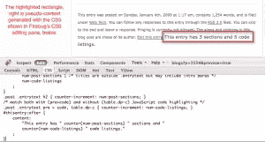

# 一个鲜为人知的用 CSS 计数器替换一些脚本的方法

> 原文：<https://www.sitepoint.com/a-little-known-way-to-replace-some-scripts-with-css-counters/>

自从[埃里克·迈耶](http://meyerweb.com/)在[他的 <cite>css/edge</cite> 系列](http://meyerweb.com/eric/css/edge/)中强调了 css 的强大后，我们就一直在寻找用基于 CSS 的等价物来取代曾经只能用 JavaScript 实现的效果的方法。用样式表替换可执行脚本通常可以提高性能，并产生更易于访问的页面。最早的例子之一是 Eric 的纯 CSS 弹出窗口，他简单地将这种效果概括为文本在没有 JavaScript 驱动的情况下出现和消失。

随着 CSS 的进步和实现的改进，越来越多的纯粹使用样式表而不需要在网站的前端或后端编写额外的脚本成为可能，这减少了可执行代码的数量。我最近想到的一个可能性是，仅使用 CSS2.1 生成的内容属性的一部分，我们就可以聚集和公开关于页面整体部分的补充信息。

与许多其他博客一样，SitePoint 的博客帖子在每篇帖子的末尾都有一小段元数据。该段落为读者提供了帖子的补充信息，如发布日期、标签以及帖子所属的任何类别。让我们看看只用 CSS 就能多容易地添加新信息。

## 使用(和滥用？)CSS 计数器

CSS2.1 的一个长期未被充分利用的特性是 CSS 计数器。计数器是 CSS 规范生成的内容部分的子集。表面上，它们是对出现在文档树中的元素组进行编号的通用机制。可悲的是，很长一段时间以来，某些浏览器缺乏对 CSS 特性的支持。

CSS 计数器真正有趣的地方在于，由于显示计数器的行为与计数机制本身是分离的，所以除了仅仅对序列中的元素进行编号之外，我们还可以利用它们来显示元素的总数。

作为一个简短的回顾，下面是 [CSS2.1 规范如何说明](https://www.w3.org/TR/CSS21/generate.html#scope)我们可以用 CSS 计数器替换典型有序列表的数字标记，以获得或多或少等效的视觉效果:

```
ol { counter-reset: item; }
ol li { display: block; }
ol li:before {
    counter-increment: item;
    content: counter(item)". ";
}
```

这段代码在每个`ol`元素初始化一个名为`item`的计数器。然后，它将所有的`li`元素变成`block`级别的 CSS 框，而不是默认的`list-item`框，这样它们就不会显示标记(例如，`list-style-type`属性中的数字或项目符号)。最后，对于每个列表项，它递增`item`计数器，然后呈现其当前值。

现在，我们可以使用相同的机制在列表末尾显示列表项总数的*,只需稍加修改就可以完全有效:*

```
ol { counter-reset: item; }
ol li {
    display: block;
    counter-increment: item;
}
ol:after {
    display: block;
    content: "Number of items in this list: " counter(item) ".";
}
```

唯一的“窍门”是不要多次调用`counter()`函数。具体来说，你只需要调用`:after`就可以了，你已经完成了对每个元素的递增。以这种方式使用，你可以看到 CSS 计数器就像一个有限的整数变量排序。

多亏了这两个通用的功能——CSS 计数器和 CSS 生成的内容——我们可以开始真正地发挥创造力了。

## 变得有创造力:在博客文章中数数

这种技术的一个有趣的用途是扩展，或者在某些情况下，完全取代编程代码，如 JavaScript 或计算事物的服务器端脚本。例如，下面是我如何使用上面的技术来计算 SitePoint 博客文章中不同部分的数量:

```
 /* Initialize counter to 1 (not 0) since titles are outside .entrytext but may include intro paras. */
.post { counter-reset: num-post-sections 1; }
.post .entrytext h2 { counter-increment: num-post-sections; }
#thisentry:after {
    content: "This entry has " counter(num-post-sections) " sections.";
} 
```

上面的代码只是在`post`的`entrytext`中每遇到一个`h2`元素就增加一个名为`num-post-sections`的计数器，然后在最后显示结果，就像前面的列表项计数示例一样。

当然，你不仅仅局限于数一件事。下面是我如何使用相同的模式计算 SitePoint 博客文章中的章节数*和代码摘录数*:

```
 .post {
    counter-reset:
        num-post-sections 1 /* titles outside .entrytext but may include intro paras */
        num-code-listings
    ;
}
.post .entrytext h2 { counter-increment: num-post-sections; }
/* match both with (pre>code) and without (table.dp-c) JavaScript code highlighting */
.post .entrytext pre > code, table.dp-c { counter-increment: num-code-listings; }
#thisentry:after {
    content:
        "This entry has " counter(num-post-sections) " sections and "
        counter(num-code-listings) " code listings."
    ;
} 
```

[](https://www.sitepoint.com/wp-content/uploads/2009/01/css-counters-sitepoint-blog-post.png)

显示这篇应用了 CSS 摘录的 SitePoint 博客文章的屏幕截图。

作为一种模式，如果我们将上述特定于 SitePoint 的 CSS 规则一般化，使它们适用于任何使用 [hAtom 微格式](http://microformats.org/wiki/hatom)构建帖子的博客，这样你就可以在许多网站上使用它，或者[将它作为用户样式表](/2007/05/28/user-style-sheets-come-of-age/)插入到你自己的浏览器中。唯一必要的改变是 [CSS 选择器](https://reference.sitepoint.com/css/selectorref)，但是你可以变得非常花哨。为了举例说明，我加入了一些额外的计数器来说明你可以计算的更多可能性。

```
/* Initialize counters. */
.hentry {
    counter-reset:
        num-post-sections
        num-code-listings
        num-code-listings-css /* code listings that are specifically CSS */
        num-links
        num-links-internal    /* links to other blog posts on this site */
        num-links-rel-tag     /* rel-tag microformat */
    ;
}
/* Increment counters. */
.hentry h2,
.hentry h3,
.hentry h4,
.hentry h5, /* consider any headline an additional "section" */
.hentry h6 { counter-increment: num-post-sections; }
.hentry pre > code { counter-increment: num-code-listings; }
.hentry pre > code.css {
    counter-increment:
        num-code-listings     /* increment count of total code listings */
        num-code-listings-css /* AND the subset that are just CSS samples */
    ;
}
.hentry :link { counter-increment: num-links; }
.hentry :link[href^="/blogs/"] {
    counter-increment:
        num-links
        num-links-internal
    ;
}
.hentry :link[rel="tag"] {
    counter-increment:
        num-links
        num-links-rel-tag;
}
/* Display results. */
.hentry:after {
    display: block;
    content:
        "This entry has a total of "
        counter(num-post-sections) " sections, "
        counter(num-code-listings) " code listings "
        "(" counter(num-code-listings-css) " are CSS) "
        " and " counter(num-links) " links, "
        "of which " counter(num-links-internal) 
        " point to other blog posts on this site "

        " and " counter(num-links-rel-tag) " are tags."
    ;
}
```

自然地，你只能计算你用 CSS 选择器所能达到的目标，所以生成字数统计是不可能的。此外，您只能在生成的内容中显示您想要计数的所有标记的总数，而不是它的总数。显然，这种实现细节会限制您的设计灵活性。

最后，值得再次强调的是 [CSS 计数器并没有在 IE 6 或者 7](https://reference.sitepoint.com/css/counter-increment#compatibilitysection) 中实现(唉…)。此外，由于我们完全是在处理 CSS 生成的内容，所以显示的文本可能无法被用户选择，也无法通过 DOM 进行进一步的操作。当然，在许多情况下，您可能希望将这些东西作为“真正的”内容直接放入标记中。

然而，比这些限制更重要的一点是，这是一个强有力的演示，说明了如何使用标记作为 API，让 CSS 的高级功能做以前只能用客户端或服务器端脚本做的事情。现在*那是*令人兴奋的。

## 分享这篇文章