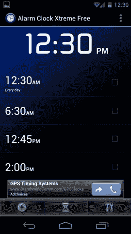
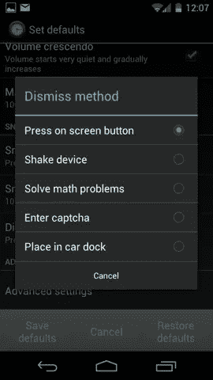
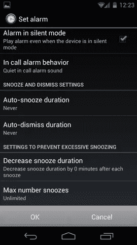
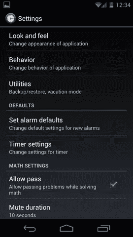

# 一个更文明的起床方式

> 原文：<https://www.sitepoint.com/a-more-civilized-wake-up-with-alarm-clock-xtreme/>

我今年 38 岁，因此，我年轻时接触过一些非常复古的技术。老实说，在我生命的最初几年，我从来不需要闹钟，因为我的父母会叫醒我去上学。但是当我在高中有自己的时间表时，我开始和这个普遍不喜欢的技术互动:闹钟。

我的第一个闹钟是一个每天晚上都需要上发条的机械装置，发出很大的“嘀嗒-toc”声。作为一个有失眠症倾向并且听力相当好的孩子，我对这个机器非常熟悉。

快进到 90 年代中期，闹钟时代基本结束了。我们大多数人都是被手机的闹铃吵醒的(就我而言，是一部坚固的诺基亚 PCS 手机)。

## 轻轻地醒来

现在，你可能会认为现代 Android 手机等先进设备会在闹钟体验方面提供难以置信的便利和控制。令人惊讶的是，事实并非如此。Android 4.0 中的闹钟功能仍然非常基本。

我在标准的 Android 闹钟中发现的一个最重要的疏漏是，没有让闹钟逐渐淡入的选项，而不是以最大音量播放。在我看来，这种微妙的差异所创造的体验要好得多:这是被轻轻推醒和被惊吓进入你的一天之间的差异。

想要避免这种每天早上的危机是我如何在 Android 应用程序商店找到闹钟 Xtreme 的。ACX 是一个专门的闹钟程序，旨在帮助您获得准确的闹钟体验，你想要的。

* * *

主屏幕

* * *

## 选择

闹钟 Xtreme 有两种风格，免费(支持广告)和付费。我使用广告支持的版本，因为我不认为在屏幕底部有一个小广告会妨碍产品的可用性。

现在，ACX，它真正是一个名副其实的清醒管理系统。有如此多的选项可以用来定制程序的行为，我不认为我能够在本专栏中涵盖所有的选项。相反，我将谈论最常见的问题，ACX 可以缓解。

**问题 1:我不喜欢被震耳欲聋的闹铃吵醒**
除了让你选择手机中任何音频文件作为铃声的标准安卓功能，ACX 还提供了一个名为“音量渐强”的选项。这正如它的名字所暗示的那样，它在你的闹铃中逐渐减弱，这样你就能在最轻柔的声音中醒来。当然，如果你不是用轻柔的声音叫醒它，它会一直变大，直到达到最大音量。

值得一提的是，我信赖的诺基亚 PCS 手机在 90 年代就有这个功能，奇怪的是，它并没有进入大多数现代智能手机。

* * *

* * *

现在，除此之外，ACX 还拥有“高级”的闹钟控制功能，包括定义音量达到最大强度需要多长时间，手机处于静音模式时闹钟是否响起，以及如果你在通话中听到闹钟响，你希望听到什么样的声音或振动。

第二个问题:我关掉闹钟，然后继续睡觉
有时我不得不设置多个闹钟来叫醒我去参加一个非常重要、非常早的会议。在某些特殊情况下，我需要在另一个设备(比如一部旧手机)上设置一个闹钟，并把它放在足够远的地方，以至于我不得不起身穿过房间去关掉它。

闹钟 Xtreme 解决了无意识解除闹钟的问题，为你提供了不同的解除闹钟的方法。

浅睡眠者的选择包括摇动你的设备(你可以配置 ACX 对你的摇动有多敏感)或者把它放在扩展坞上解除警报。我们中那些倾向于在睡觉时关掉闹钟的人，将从更具挑战性的方法中受益，如“解决数学问题”或“输入验证码”。

如果你能在睡梦中解决数学问题，这可能不适合你。

有些人实际上喜欢被叫醒，这样他们就可以享受再次入睡的乐趣，他们在早上的例行公事中安排打盹的时间。对于这些人来说，除了贪睡功能，ACX 有和上面一样的选择范围。

我不明白为什么有人会想做一道数学题然后回去睡觉，但是让我知道如果你是这种人，我想了解你。

问题 4:我睡过头了
现在这是一个我很熟悉的领域:睡太多次了，结果是花太多时间在床上，换来很少的休息。如果这种情况发生在你身上，ACX 允许你配置一个参数来逐步减少你打盹的时间。换句话说，每次你在闹钟上打盹，你的打盹时间会越来越短。

为了更好的控制，设置一个“最大打盹次数”的值，第二天早上你会发现你的闹钟在 x 次之后拒绝打盹。现在你必须向自己承认，你真的不会醒来，因为禁用闹钟总感觉比打盹更像是一种承诺。

* * *

* * *

## 更多早晨的快乐

除此之外，还有很多选项可以控制闹钟的外观，屏幕是否旋转，闹钟响起时屏幕有多亮，以及你想要多大的贪睡按钮等等。

我推荐这个程序，因为我每天都在使用它，到目前为止它相当可靠(没有因为应用程序崩溃而错过早会)。

一个额外的好处是，在 Android 4.0 中，你可以通过对手机说 Siri 风格的“早上 6 点设置闹钟”来设置闹钟。这可比我的老诺基亚好太多了。

## 分享这篇文章