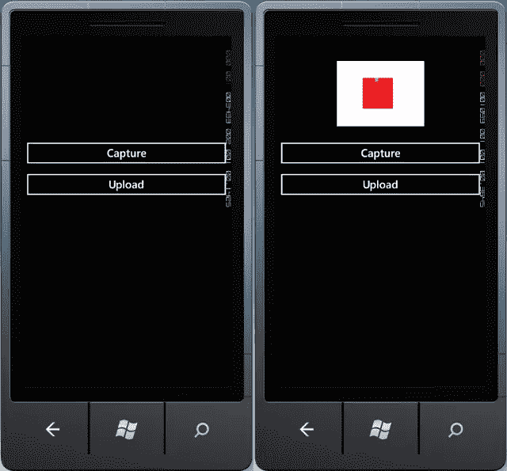
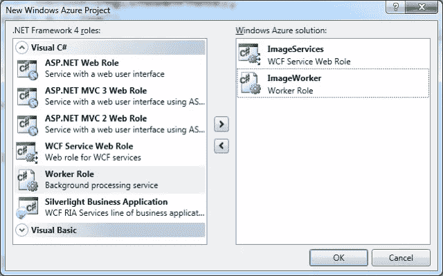
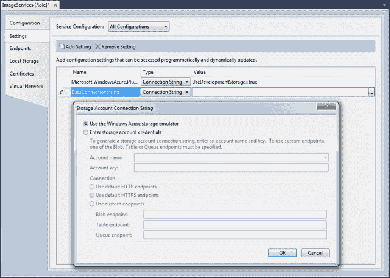
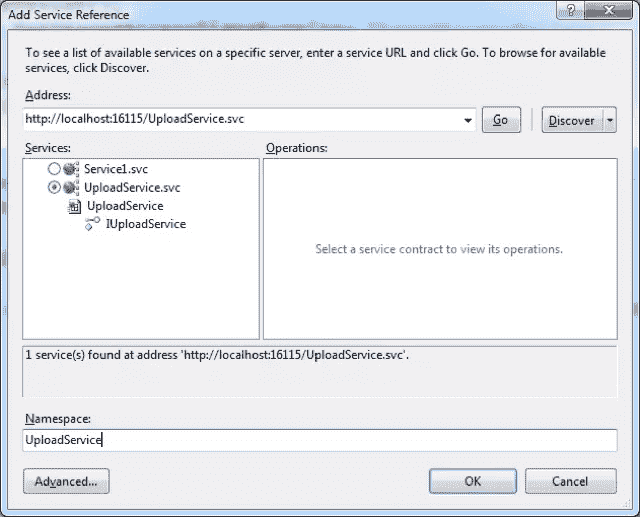

# 使用 Windows Phone 和 Azure 的照片共享应用指南

> 原文：<https://www.sitepoint.com/a-practical-guide-to-photo-sharing-apps-using-windows-phone-and-azure/>

本系列的前一篇文章叫做[使用 Windows Phone 和 Azure 的基于云的照片分享应用的理论](https://www.sitepoint.com/theory-of-a-cloud-based-photo-sharing-app-using-windows-phone-and-azure/)。我们浏览了一个简单的图像共享应用程序的架构。这个过程中的步骤 1 到 5 包括用相机拍摄照片并将其上传到 blob 存储器。按照本文，你需要安装 [Windows Phone SDK](http://create.msdn.com/en-us/home/getting_started) 和[Windows Azure SDK for Visual Studio](http://www.microsoft.com/windowsazure/sdk/)。

### 步骤 1:创建电话应用程序

注意:建议您在本教程中以“管理员”身份运行 Visual Studio。虽然它不是开发手机应用程序所必需的，但它是使用 Windows Azure 开发环境所必需的。另请注意，如果 Visual Studio 以“管理员”身份运行，它也会以此模式运行 Windows Phone 模拟器–如果您已经运行了模拟器，请记住在尝试从以此模式运行的 Visual Studio 中运行您的电话应用程序之前关闭模拟器。

先说电话部分。我们将从一个新的 Windows Phone 项目开始，并用相机拍摄图像。Windows Phone 有一个称为任务的概念，它旨在使用标准、一致的外观和感觉来公开平台的通用功能。它们分为两类:启动器，简单地启动特定的功能，如地图或搜索应用程序，以及选择器，用于向应用程序返回数据。在这种情况下，我们将使用`CameraCaptureTask`来提示用户用相机拍照，然后将照片返回给应用程序。请注意，在 Windows Phone 7.5 (Mango)中，如果您想为拍照或拍摄视频提供自己的自定义用户体验，您可以直接访问摄像头馈送。

我们将保持应用程序的`MainPage`的布局相对简单，由一个`Image`控件和两个`Buttons`组成，其中一个控件显示捕获的照片，另一个控件启动照片捕获，第二个控件将捕获的图像上传到云端。

```
<StackPanel>
    <Image x:Name="CaptureImage" Height="200" Width="200" />
    <Button Content="Capture" Click="CaptureClick" />
    <Button Content="Upload" Click="UploadClick" />
</StackPanel> 
```

在`MainPage`的代码中，我们需要创建一个`CameraCaptureTask`的实例，为`Completed`事件分配一个事件处理程序，然后在用户点击`Capture`按钮时调用任务的`Show`方法。

```
private CameraCaptureTask camera = new CameraCaptureTask();
private string filename;

public MainPage() {
    InitializeComponent();

    camera.Completed += CameraCompleted;
}

private void CameraCompleted(object sender, PhotoResult e)  {
    var bmp = PictureDecoder.DecodeJpeg(e.ChosenPhoto);
    filename = Guid.NewGuid() + ".jpg";
    using (var file = IsolatedStorageFile.GetUserStoreForApplication().OpenFile(filename, FileMode.Create, FileAccess.Write)) {
        bmp.SaveJpeg(file, bmp.PixelWidth, bmp.PixelHeight, 0, 100);
    }
    CaptureImage.Source = bmp;
}

private void CaptureClick(object sender, RoutedEventArgs e) {
    camera.Show();
}

private void UploadClick(object sender, RoutedEventArgs e) { } 
```

当`CameraCaptureTask`返回时，我们获取返回的流`(e.ChosenPhoto)`并将其解码成一个图像，该图像被保存到`IsolatedStorage`(应用程序的本地存储)并显示在图像控件`CaptureImage`中。如果您在模拟器中运行这段代码，您应该能够使用相机模拟返回一个默认图像，该图像将显示在您的应用程序中，如图 1 的右图所示。


[](https://www.sitepoint.com/wp-content/uploads/2011/10/sp0015_01.png)

图 1

### 步骤 2:创建云应用程序

下一步是创建我们的云项目，它可以添加到包含您的手机应用程序的同一个解决方案中。在解决方案资源管理器中右键单击解决方案节点，然后选择“添加”>“新建项目”，在“添加新项目”对话框中，从云节点中选择 Windows Azure 项目模板。为新项目命名，例如“ImageSharingCloud ”,然后单击 OK 继续。然后会提示您基于一组现有模板添加一个或多个 Windows Azure 项目。在本例中，我们将创建一个名为`ImageServices`的 WCF 服务 Web 角色和一个名为`ImageWorker`的工作者角色。通过选择角色并单击右箭头来添加它们(参见图 2)；然后，您可以重命名它们，以便在您的解决方案中更容易识别它们。


[](https://www.sitepoint.com/wp-content/uploads/2011/10/sp0015_02.png)

图 2

### 步骤 3:生成共享访问签名

为了将照片从我们的 Windows Phone 应用程序直接上传到 Windows Azure Blob 存储，我们需要知道通过 [Windows Azure 管理控制台](http://windows.azure.com)为您要上传到的存储帐户颁发的两个访问密钥之一。这些密钥被设计用于位于服务器上的网站或服务中，**而不是**用于包含在客户端应用程序中。Silverlight，无论是用于构建桌面应用程序还是 Windows Phone 应用程序，都是一种客户端技术，你应该**而不是**在这些应用程序中包含访问键。

Windows Azure 提供了通过使用共享访问签名(SAS)将内容上载到 Blob 存储的替代策略。当应用程序想要将内容上传到 Blob 存储时，它向服务请求 SAS 该服务使用访问密钥之一来生成 SAS，该 SAS 被返回给调用应用；当上传内容时，应用程序使用 SAS 代替访问密钥。

我们将使用新创建的`ImageServices`项目来公开一个服务，我们的 Windows Phone 应用程序可以调用该服务来返回一个 SAS。首先，您需要告诉`ImageServices`项目您想要使用哪个存储帐户。在解决方案资源管理器中双击`ImageServices`项目的属性节点，打开属性对话框。在 Settings 选项卡上，您需要创建一个新条目`DataConnectionString`，其类型设置为 Connection String。单击省略号按钮将打开存储帐户连接字符串对话框，如图 3 所示。这里我们将使用 Windows Azure SDK 附带的存储模拟器。但是，当您最终发布您的应用程序时，您需要将其更改为使用您的存储帐户的帐户名和密钥。


[](https://www.sitepoint.com/wp-content/uploads/2011/10/sp0015_03.png)

图 3

下一步是创建将 SAS 返回给应用程序的服务。在解决方案资源管理器中右键单击`ImageServices`项目并选择 Add > New Item，然后在 Add New Item 对话框中选择 WCF 服务模板。为新服务命名为`UploadService.svc`，并单击 Add 创建新服务。更改服务接口以包含一个名为`UploadUriWithSharedAccessSignature`的方法，如下所示:

```
[ServiceContract]
public interface IUploadService {
    [OperationContract]
    Uri UploadUriWithSharedAccessSignature(string userId);
} 
```

此方法接受单个参数，该参数将用于区分 Blob 存储中不同用户的上载。该方法将返回应用程序可以将文件上载到其中的 Blob 存储容器的 Uri，以及完整的共享访问签名。下面的代码提供了该方法的实现，以及私有方法`InitializeStorage`，该私有方法用于加载云配置信息并创建`CloudBlobClient`类的实例，该类是用于 Blob 存储的包装类。

```
public class UploadService : IUploadService {
    private const SharedAccessPermissions ContainerSharedAccessPermissions = 
        SharedAccessPermissions.Write | SharedAccessPermissions.Delete | SharedAccessPermissions.List;
    private CloudBlobClient cloudBlobClient;

    private void InitializeStorage() {
        CloudStorageAccount.SetConfigurationSettingPublisher((configName, configSetter) => {
            configSetter(RoleEnvironment.GetConfigurationSettingValue(configName));
        });
        var storageAccount = CloudStorageAccount.FromConfigurationSetting("DataConnectionString");
        cloudBlobClient = storageAccount.CreateCloudBlobClient();
    }

    public Uri UploadUriWithSharedAccessSignature(string userId) {
        try {
            InitializeStorage();

            var container = this.cloudBlobClient.GetContainerReference("imageservice");
            container.CreateIfNotExist();
            var sas = container.GetSharedAccessSignature(new SharedAccessPolicy() {
                Permissions = ContainerSharedAccessPermissions,
                SharedAccessExpiryTime = DateTime.UtcNow + TimeSpan.FromMinutes(5)
            });

            var uriBuilder = new UriBuilder(container.Uri + "/" + userId) { Query = sas.TrimStart('?') };
            return uriBuilder.Uri;
        }
        catch (Exception exception) {
            throw new WebFaultException<string>(exception.Message, HttpStatusCode.InternalServerError);
        }
    }
} 
```

在这种情况下，创建的`SharedAccessSignature`有 5 分钟的到期时间。这意味着我们的 Windows Phone 应用程序将只能在该窗口内上传文件。这大大降低了向 Windows Phone 应用程序暴露访问密钥的风险。

### 步骤 4:检索 SharedAccessSignature

现在我们有了一个将生成共享访问签名的服务，我们需要在 Windows Phone 应用程序中调用它。为了做到这一点，我们需要在 Windows Phone 项目中添加一个对`UploadService`的引用。确保您已经构建了解决方案，并且可以浏览到`UploadService`(右键单击`UploadService.svc`，并选择在浏览器中查看)。右键单击 Windows Phone 项目，然后选择“添加服务引用”。在 Add Service Reference 对话框中，如图 4 所示，单击 Discover 按钮。一旦发现了服务，选择`UploadService`，指定一个名称空间，在本例中我们将使用`UploadService`，然后单击 OK。


[](https://www.sitepoint.com/wp-content/uploads/2011/10/sp0015_04.png)

图 4

这不仅会创建必要的代理类来包装对`UploadService`的调用，还会创建一个名为`ServiceReferences.ClientConfig`的文件，并将其添加到 Windows Phone 项目中。在这个文件中，您将看到`UploadService`端点的配置信息。您需要对此进行调整，以将其从指向 Visual Studio 开发服务器(默认)更改为指向 Windows Azure 计算仿真程序。通常这包括将端点地址更改为`http://127.0.0.1:81/UploadService.svc;`，尽管实际端口号可能会有所不同，所以在运行`ImageSharingCloud`项目时，请检查您的服务运行在哪个端口号上。

### 步骤 5:完成上传

最后一步是调用`UploadUriWithSharedAccessSignature`方法来检索 SAS，然后用它将照片上传到 Blob 存储器。下面的代码首先调用这个方法，然后当收到响应时，使用`CloudBlobUploader`类将照片上传到 Blob 存储。这个类的完整代码可以在这篇文章的末尾找到。

```
private void UploadClick(object sender, RoutedEventArgs e) {
    var client = new UploadServiceClient();
    client.UploadUriWithSharedAccessSignatureCompleted += UploadUriWithSharedAccessSignatureCompleted;
    client.UploadUriWithSharedAccessSignatureAsync(Guid.NewGuid().ToString());
}

private void UploadUriWithSharedAccessSignatureCompleted(object sender,
                                                            UploadUriWithSharedAccessSignatureCompletedEventArgs e) {
    if (e.Error == null) {
        // Determine upload path - Add filename to container path
        var builder = new UriBuilder(e.Result);
        builder.Path = builder.Path + "/" + filename;
        var blobUrl = builder.Uri;

        // Open the image file from isolates storage to read from
        IsolatedStorageFileStream file =
IsolatedStorageFile.GetUserStoreForApplication().OpenFile(filename, FileMode.Open, FileAccess.Read);

        // Create the uploader and kick off the uploader
        var uploader = new CloudBlobUploader(file, blobUrl.AbsoluteUri);
        uploader.UploadFinished += (s, args) => {
                     this.Dispatcher.BeginInvoke(() => {
                                  MessageBox.Show("Upload complete!"); });
                                        };
        uploader.StartUpload();
    }
} 
```

为了运行这个应用程序，你需要同时运行`ImageSharingCloud`项目和`ImageSharing` Windows Phone 项目。通过点按“捕捉”按钮捕捉图像，然后点按“上传”按钮。如果成功，您应该会看到一条消息显示上传完成。此时，您可以浏览 Windows Azure 存储模拟器并检查已上传的图像。以下代码是本教程最后一步中使用的 CloudBlobUploader 类。这可以在任何应用程序中重用，以便将内容上传到 Blob 存储中。

```
public class CloudBlobUploader
{
    private const long ChunkSize = 4194304;
    private readonly IList<string> blockIds = new List<string>();

    private readonly long dataLength;
    private readonly Stream fileStream;
    private readonly string uploadUrl;

    private readonly bool useBlocks;
    private string currentBlockId;
    private long dataSent;

    public CloudBlobUploader(Stream fileStream, string uploadUrl) //, IStorageCredentials credentials)
    {
        this.fileStream = fileStream;
        this.uploadUrl = uploadUrl;
        //                this.StorageCredentials = credentials;
        dataLength = this.fileStream.Length;
        dataSent = 0;

        // Upload the blob in smaller blocks if it's a "big" file.
        useBlocks = (dataLength - dataSent) > ChunkSize;
    }

    public event EventHandler<ParameterEventArgs<bool>> UploadFinished;
    public event EventHandler<ParameterEventArgs<double>> UploadProgress;

    //public IStorageCredentials StorageCredentials { get; set; }

    public void StartUpload()
    {
        if (uploadUrl == null)
        {
            RaiseUploadFinished(false);
        }
        var uriBuilder = new UriBuilder(uploadUrl);

        // Set a timeout query string parameter.
        uriBuilder.Query = string.Format(
            CultureInfo.InvariantCulture,
            "{0}{1}",
            uriBuilder.Query.TrimStart('?'),
            string.IsNullOrEmpty(uriBuilder.Query) ? "timeout=10000" : "&timeout=10000");

        if (useBlocks)
        {
            // Encode the block name and add it to the query string.
            currentBlockId = Convert.ToBase64String(Encoding.UTF8.GetBytes(Guid.NewGuid().ToString()));
            uriBuilder.Query = string.Format(
                CultureInfo.InvariantCulture,
                "{0}&comp=block&blockid={1}",
                uriBuilder.Query.TrimStart('?'),
                currentBlockId);
        }

        // With or without using blocks, we'll make a PUT request with the data.
        var request = (HttpWebRequest) WebRequestCreator.ClientHttp.Create(uriBuilder.Uri);
        request.Method = "PUT";
        request.BeginGetRequestStream(WriteToStreamCallback, request);
    }

    private void WriteToStreamCallback(IAsyncResult asynchronousResult)
    {
        try
        {
            var request = (HttpWebRequest) asynchronousResult.AsyncState;
            Stream requestStream = request.EndGetRequestStream(asynchronousResult);
            var buffer = new byte[4096];
            int bytesRead = 0;
            int tempTotal = 0;
            fileStream.Position = dataSent;

            while (((bytesRead = fileStream.Read(buffer, 0, buffer.Length)) != 0) &&
                    (tempTotal + bytesRead < ChunkSize))
            {
                requestStream.Write(buffer, 0, bytesRead);
                requestStream.Flush();

                dataSent += bytesRead;
                tempTotal += bytesRead;
            }

            requestStream.Close();

            request.BeginGetResponse(ReadHttpResponseCallback, request);
        }
        catch (Exception exception)
        {
            RaiseUploadFinished(false);
        }
    }

    private void ReadHttpResponseCallback(IAsyncResult asynchronousResult)
    {
        try
        {
            var request = (HttpWebRequest) asynchronousResult.AsyncState;
            var response = (HttpWebResponse) request.EndGetResponse(asynchronousResult);

            if (useBlocks)
            {
                blockIds.Add(currentBlockId);
            }

            RaiseUploadProgress(100.0*dataSent/dataLength);

            // If there is more data, send another request.
            if (dataSent < dataLength)
            {
                StartUpload();
            }
            else
            {
                fileStream.Close();
                fileStream.Dispose();

                if (useBlocks)
                {
                    // Commit the blocks into the blob.
                    PutBlockList();
                }
                else
                {
                    RaiseUploadFinished(true);
                }
            }
        }
        catch (Exception exception)
        {
            RaiseUploadFinished(false);
        }
    }

    private void PutBlockList()
    {
        if (uploadUrl == null)
        {
            RaiseUploadFinished(false);
        }
        var uriBuilder = new UriBuilder(uploadUrl);
        uriBuilder.Query = string.Format(
            CultureInfo.InvariantCulture,
            "{0}{1}",
            uriBuilder.Query.TrimStart('?'),
            string.IsNullOrEmpty(uriBuilder.Query) ? "comp=blocklist" : "&comp=blocklist");

        var request = (HttpWebRequest) WebRequestCreator.ClientHttp.Create(uriBuilder.Uri);
        request.Method = "PUT";

        // x-ms-version is required for put block list
        request.Headers["x-ms-version"] = "2009-09-19";

        request.BeginGetRequestStream(BlockListWriteToStreamCallback, request);
    }

    private void BlockListWriteToStreamCallback(IAsyncResult asynchronousResult)
    {
        try
        {
            var request = (HttpWebRequest) asynchronousResult.AsyncState;
            Stream requestStream = request.EndGetRequestStream(asynchronousResult);
            var document =
                new XDocument(new XElement("BlockList",
                                            from blockId in blockIds
                                            select new XElement("Uncommitted", blockId)));
            XmlWriter writer = XmlWriter.Create(requestStream, new XmlWriterSettings {Encoding = Encoding.UTF8});
            long length = 0L;

            document.Save(writer);
            writer.Flush();

            length = requestStream.Length;
            requestStream.Close();

            request.BeginGetResponse(BlockListReadHttpResponseCallback, request);
        }
        catch (Exception exception)
        {
            RaiseUploadFinished(false);
        }
    }

    private void BlockListReadHttpResponseCallback(IAsyncResult asynchronousResult)
    {
        try
        {
            var request = (HttpWebRequest) asynchronousResult.AsyncState;
            var response = (HttpWebResponse) request.EndGetResponse(asynchronousResult);

            RaiseUploadFinished(true);
        }
        catch (Exception exception)
        {
            RaiseUploadFinished(false);
        }
    }

    private void RaiseUploadProgress(double progress)
    {
        if (UploadProgress != null)
        {
            UploadProgress(this, progress);
        }
    }

    private void RaiseUploadFinished(bool response)
    {
        if (UploadFinished != null)
        {
            UploadFinished(this, response);
        }
    }
}

public class ParameterEventArgs<T> : EventArgs
{
    public ParameterEventArgs(T parameter)
    {
        Parameter1 = parameter;
    }

    public T Parameter1 { get; set; }

    /// <summary>
    /// Converts the parameter into a ParameterEventArgs
    /// </summary>
    public static implicit operator ParameterEventArgs<T>(T parameter)
    {
        return new ParameterEventArgs<T>(parameter);
    }
} 
```

## 分享这篇文章