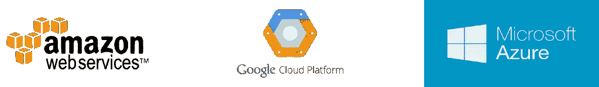
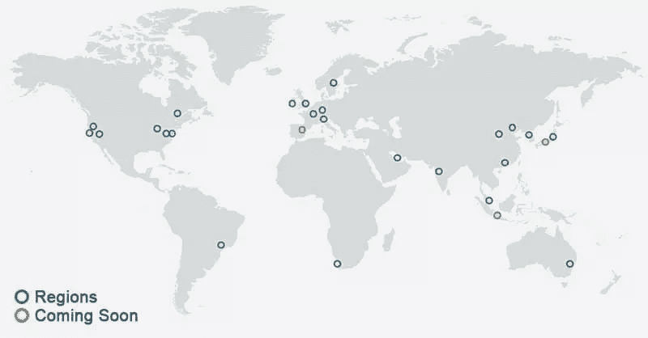
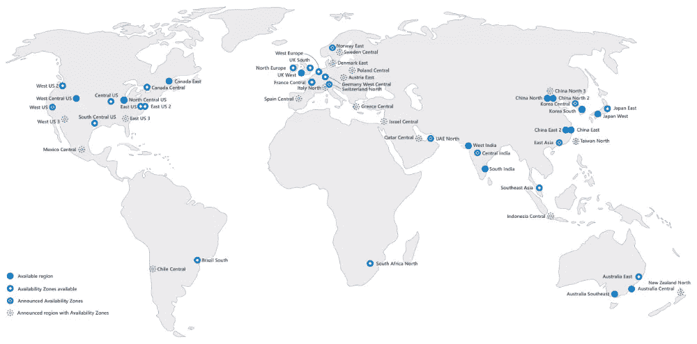
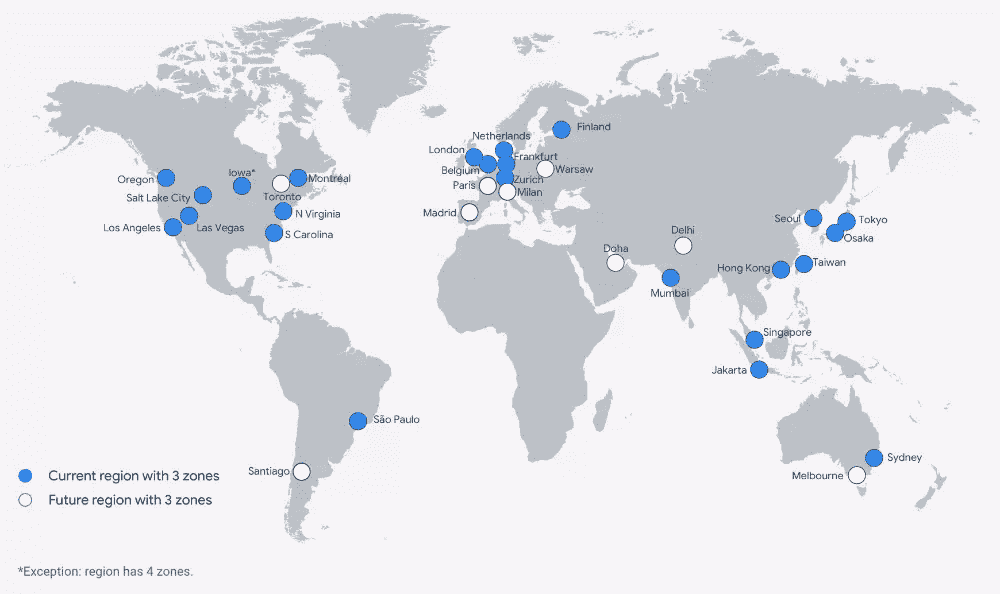

# AWS、谷歌云和 Azure 的对比

> 原文：<https://www.sitepoint.com/a-side-by-side-comparison-of-aws-google-cloud-and-azure/>

商业云服务的三个主要参与者——亚马逊、谷歌和微软——拥有一系列产品，涵盖您在线运营可能需要的所有内容。但是不仅在价格上有差异，而且在他们如何命名和分组他们的服务上也有差异，所以让我们比较一下他们提供的服务。

我们将重点关注由[亚马逊网络服务](https://aws.amazon.com/)(AWS)[谷歌云平台](https://cloud.google.com/) (GCP)和[微软 Azure](https://azure.microsoft.com/en-us/) 提供的服务。我们不会涵盖所有的内容，也不会涉及云计算基础设施的很多细节。但是，我们将调查许多提供的产品，并熟悉一些云概念。

## 其他服务，以及随时间的变化

当然，我们还可以在这里讨论其他云服务。近年来，像数字海洋和 T2 这样的公司已经在三大巨头上取得了一些进展。但它是一个新的竞争者，从根本上简化了云基础设施的部署，并仍在将 DevOps 工作流推向下一个水平— [Netlify](https://www.netlify.com/) 。Netlify 恰好也是创造了“Jamstack”概念的公司。(有关更多信息，请参见“[jam stack 简介](https://www.sitepoint.com/learn-jamstack/)和“ [DevOps 示例](https://www.sitepoint.com/devops-by-example-tools-pros-and-cons-of-a-devops-culture/)”。)

### 一体化，但更简单:谷歌 Firebase，Netlify，AWS Amplify

亚马逊、谷歌和 Azure(按此顺序)仍然是几乎唯一覆盖云服务所有领域的公司。但是考虑到 Netlify 是如何简化游戏的，为了保持竞争力，他们都必须在向开发者展示工具的方式上做出重大改进。

谷歌和亚马逊分别推出了 [Firebase](https://firebase.google.com/) 和 [Amplify](https://aws.amazon.com/amplify/) ，两者都包装了一堆来自 GCP 和 AWS 的服务，以一种清晰且易于实现的方式呈现给网络和移动开发者。(奇怪的是，微软似乎只是有意让 Azure 过时。)

正如我在关于“ [100 个 Jamstack 工具、API&服务为您的站点提供动力](https://www.sitepoint.com/jamstack-tools-services-apis/)”的文章中所说:

> 谷歌通过将 Firebase 系列产品从 GCP“分离”出来，确实迈出了一步，但亚马逊在 AWS Amplify 上走了一半。与常规的 AWS 工作流程相比，这无疑是一个巨大的改进，尤其是对于新手用户来说，而且它的[文档中心](https://docs.amplify.aws/)非常棒，比亚马逊通常记录服务的方式更加务实。但是 Amplify 仍然可以从同一个旧的[(臃肿得可怕)控制台](https://aws.amazon.com/console/)访问。你仍然需要一张信用卡来开户，部署仍然是地区特定的(没有内置的 CDN，真的吗？)，而且与 Firebase 或 Netlify 相比，工作流程没有那么简单。

有着令人难以置信的[有据可查的框架](https://firebase.google.com/docs)，杰出而有趣的【YouTube 频道，以及[各种各样的使用应用](https://firebase.google.com/use-cases)， *Google Firebase 远在 AWS Amplify 之上…但在简单性方面却远远落后于 Netlify*。

### 蔚蓝…真的吗？

Azure 似乎在为一些人(特别是美国的企业部门)工作，但正如 T2 的 Reddit 搜索和 T4 的 TrustPilot 调查很快就会发现的那样，人们的意见充其量是分歧很大。

尽管 AWS 一开始可能会很难，但用户通常会称赞他们的支持团队反应迅速、知识渊博。从我自己的经验来说，Azure 支持——或者说它完全没有支持——另一方面，可以 100%自动化并且完全不存在，以至于解决像设置信用卡这样简单(和关键)的问题将变得不可能，并且使整个套件不可用。

虽然微软在几个领域都是无可争议的领导者，但它也有迟到的悠久历史，付出了巨大的努力来迎头赶上，然后似乎失去了信心，半途而废(例如 Zune 的[、](https://en.wikipedia.org/wiki/Zune) [Groove](https://en.wikipedia.org/wiki/Groove_Music) 、 [Mobile](https://en.wikipedia.org/wiki/Microsoft_Mobile) 、 [Edge](https://en.wikipedia.org/wiki/Microsoft_Edge) 和 [Skype](https://en.wikipedia.org/wiki/Skype) )。Azure 的情况如何，还有待观察是否也是如此。

## 为什么是云

来自公共和私营部门的标志性公司，如网飞、Airbnb、Spotify、Expedia、PBS 等，都依赖云服务来支持他们的在线运营。这使他们能够更好地专注于他们所熟知的事情，并让许多技术问题由已经存在并不断升级的基础架构来解决。如果他们不得不自己实施运营实际需要的物理基础设施，他们将需要一大批技术人员、大量额外的预算和时间，而且许多初创公司将永远无法克服这些技术挑战。

### 对所有人

但这并不仅限于大牌。今天，我们生活在这样一个世界里，一个巨大的企业和两个几乎没有初始资本的年轻人都可以访问世界一流的存储、计算、管理等基础设施，以提供下一个大规模的在线服务，并按小时付费。

### 灵活(有时复杂)的定价

您所支付的费用会有很大的不同，这取决于您需要多少处理能力、*、部署多少实例(即多少虚拟服务器)以及在哪里部署实例(更多信息请参见“[位置”](#locations)部分)。批量使用也会有很大的折扣。在任何情况下，大多数时候你都有这些优势:*

*   没有前期成本
*   无终止费
*   只为您使用的东西付费
*   每分钟计费

要了解准确的细节，你需要阅读 [AWS](https://aws.amazon.com/pricing/) 、 [GCP](https://cloud.google.com/pricing/) 和 [Azure](https://azure.microsoft.com/pricing/) 的定价细则。

## 产品与解决方案

我们将相当宽松地使用术语“产品”和“服务”。然而，*解决方案*是一个更具体的概念，在处理云服务时你会听到很多。简而言之，解决方案是一组面向特定需求的预配置产品，其中包含大量文档、使用案例和证明，可引导您完成采用云基础架构的过程。

一些典型的“罐装”解决方案有:

*   **大数据** : [AWS](https://aws.amazon.com/big-data/datalakes-and-analytics/) ， [GCP](https://cloud.google.com/solutions/smart-analytics) ，[蔚蓝](https://azure.microsoft.com/solutions/big-data/)
*   **电商和零售** : [AWS](https://aws.amazon.com/ecommerce-applications/) ， [GCP](https://cloud.google.com/solutions/retail) ，Azure ( [电商](https://azure.microsoft.com/solutions/ecommerce/)和[零售](https://azure.microsoft.com/industries/retailers/))
*   **游戏** : [AWS](https://aws.amazon.com/game-hosting/) ， [GCP](https://cloud.google.com/solutions/gaming/) ，[蔚蓝](https://azure.microsoft.com/solutions/gaming/)
*   **政府** : AWS ( [联邦](https://aws.amazon.com/federal/)、[州和地方](https://aws.amazon.com/stateandlocal/))、GCP ( [联邦](https://cloud.google.com/solutions/federal-government)、[州和地方](https://cloud.google.com/solutions/state-and-local-government/))、[蔚蓝](https://azure.microsoft.com/industries/government/)
*   **物联网** (IoT): [AWS](https://aws.amazon.com/iot/) ， [GCP](https://cloud.google.com/solutions/iot/) ， [Azure](https://azure.microsoft.com/overview/iot/)
*   **营销** : [AWS](https://aws.amazon.com/digital-marketing/) 、GCP ( [科技](https://cloud.google.com/solutions/marketing-technology)和[分析](https://cloud.google.com/solutions/marketing-analytics))、 [Azure](https://azure.microsoft.com/solutions/digital-marketing/)

## 我们来对比一下！

亚马逊通过其于 2004 年推出的首个 AWS 服务引入了“商品化”云计算服务，自那以来，他们一直在不断创新和添加功能，这使他们能够通过为云构建最广泛的服务和解决方案来保持在该领域的优势。在很多方面，它们也是最贵的。

谷歌，以及后来的微软，加入了这场游戏，并很快达到了标准，带来了他们自己的基础设施和想法，提供交易，并拉低了价格。

在下面的视频中，每家公司的代表讨论了他们的云战略:

[https://www.youtube.com/embed/342KEaxFVjM?rel=0](https://www.youtube.com/embed/342KEaxFVjM?rel=0)

### 计算

毕竟，这就是计算机的用途:计算、处理数据——计算。如果您需要更快的图形渲染、数据分析等处理能力，您可以购买更多硬件，也可以使用云技术。

当然，如果你买了硬件，你就拥有了它。这是一项资产。但是，当计算机不进行任何实际处理时，你也在为所有的空闲时间付费，加上随之而来的所有维护，如果你建立一个数据中心，这可能会非常高。

另一方面，当你使用云时，你只需为你使用的东西付费，你可以在几分钟内扩展到数千个处理节点(如果你不小心的话，还会刷爆你的信用卡)。

[弹性计算云](https://aws.amazon.com/ec2/) (EC2)是亚马逊**按需可扩展计算**的旗舰，与谷歌[计算引擎](https://cloud.google.com/compute/)和 Azure 的[虚拟机](https://azure.microsoft.com/services/virtual-machines/)和[虚拟机规模集](https://azure.microsoft.com/services/virtual-machine-scale-sets/)竞争。亚马逊的服务是最全面的，但如前所述，EC2 的[定价可能会变得*非常复杂，Azure 的*](https://aws.amazon.com/ec2/pricing/) *[VMs 定价](https://azure.microsoft.com/pricing/details/virtual-machines/)也是如此。谷歌的产品不太灵活，但是价格更容易理解。*

还可以选择为网络和移动应用租用**计算进程，如果你的应用符合这项服务的规格，当代替 EC2 或计算引擎使用时，可以节省大量成本(更多细节请参见 [AWS Elastic Beanstalk](https://aws.amazon.com/elasticbeanstalk/) 和[谷歌应用引擎](https://cloud.google.com/appengine/))。**

如果你想用 Docker 来[部署软件容器，你应该看看亚马逊的](https://www.sitepoint.com/docker-containers-software-delivery/)[弹性容器服务](https://aws.amazon.com/ecs/) (ECS)和[弹性容器注册中心](https://aws.amazon.com/ecr/) (ECR)。谷歌的对等物是 [Kubernetes 引擎](https://cloud.google.com/kubernetes-engine)和[容器注册表](https://cloud.google.com/container-registry/)。Azure 也加入了 Docker，推出了 Azure Kubernetes 服务(AKS ),尽管目前他们还没有为 Docker 的私有注册提供服务。

既然 Azure 是微软的，它也允许你用它的[远程桌面客户端](https://docs.microsoft.com/windows-server/remote/remote-desktop-services/clients/remote-desktop-clients)服务**部署 Windows 客户端应用**。

### 储存；储备

除了计算，存储也是云服务的一个重要支柱。在云中，您可以轻松地存储从几 GB 到几 Pb 的任何数据(1 Pb = 1，024 TB = 1，048，576 GB)。但是要注意:实现这些解决方案并不简单，因为这不是一个普通的主机，你只需要一个用户和密码就可以通过 FTP 上传文件。相反，您需要与 API 或第三方程序进行交互，并且在您准备好完全在云中操作您的存储之前，可能需要一些时间。

为了**存储对象**(也就是几乎任何东西)，亚马逊的[简单存储服务](https://aws.amazon.com/s3/) (S3)是运行时间最长的服务，因此它拥有[丰富的文档](https://aws.amazon.com/documentation/s3/)，包括[免费网络研讨会](https://aws.amazon.com/events/online-tech-talks/on-demand/?ott-on-demand-all.sort-by=item.additionalFields.startDateTime&ott-on-demand-all.sort-order=desc&awsf.ott-on-demand-master-category=categories%23storage)、[文章和教程](https://aws.amazon.com/articles/?tag=articles%23keywords%23amazon-s3)和[非常活跃的论坛](https://forums.aws.amazon.com/forum.jspa?forumID=24)，亚马逊开发者在这里定期提供非常有用的反馈。当然，谷歌[云存储](https://cloud.google.com/storage/)和微软 [Azure Storage](https://azure.microsoft.com/services/storage/) 提供了同样可靠和强大的服务，但你会发现这些资源甚至无法与亚马逊相比。也就是说，谷歌和微软可能在价格上有优势，所以请阅读小字。

| 服务 |  | 供应者 | GB/月 |
| --- | --- | --- | --- |
| [块存储](https://www.rackspace.com/cloud/block-storage) | [w](https://en.wikipedia.org/wiki/OpenStack#Block_Storage_.28Cinder.29) | Rackspace 云 | $0.12 |
| [云文件](https://www.rackspace.com/cloud/files) | [w](https://en.wikipedia.org/wiki/Rackspace_Cloud#Cloud_Files) | Rackspace 云 | $0.1 |
| [云存储](https://cloud.google.com/storage/) | [w](https://en.wikipedia.org/wiki/Google_Storage) | 谷歌云平台 | 因地区而异，请参见[定价](https://cloud.google.com/storage/pricing) |
| [数据湖商店](https://azure.microsoft.com/services/data-lake-store/) | [w](https://en.wikipedia.org/wiki/Microsoft_Azure#Storage_services) | 微软 Azure | 因地区而异，请参见[定价](https://azure.microsoft.com/pricing/details/storage/data-lake/) |
| [简单存储服务(S3)](https://aws.amazon.com/s3/) | [w](https://en.wikipedia.org/wiki/Amazon_S3) | 亚马逊网络服务 | 因地区而异，请参见[定价](https://aws.amazon.com/s3/pricing/) |
| [存储](https://azure.microsoft.com/services/storage/) | [w](https://en.wikipedia.org/wiki/Microsoft_Azure#Storage_services) | 微软 Azure | 因地区而异，请参见[定价](https://azure.microsoft.com/pricing/details/storage/) |

对于**存档**，有时也被称为“冷存储”(就像当你存储大部分情况下不打算经常访问的对象时)，你将享受较低的速率，但访问速度也较低，这在大多数情况下应该不是什么大问题。不同提供商的特性和价格非常相似，所以您很可能会受到在后端实现的 API 的限制。规格和细节见亚马逊[冰川和冰川深度存档](https://aws.amazon.com/glacier/)，谷歌[数据存档云存储](https://cloud.google.com/storage/archival)，Azure 备份。还要查看这些提供商提供的*归档解决方案*:AWS 的[数据归档](https://aws.amazon.com/archive/)和 Azure 的[备份和归档](https://azure.microsoft.com/solutions/backup-archive/)。

除了存储和归档，他们还提供更多具体的选择，如亚马逊[CloudFront](https://aws.amazon.com/cloudfront/)——旨在建立内容交付网络(CDN)——这与谷歌[的云 CDN](https://cloud.google.com/cdn/) 和 Azure 的[内容交付网络](https://azure.microsoft.com/services/cdn/)相同。但是，如果你有更多的异国情调的要求，一定要检查他们的网站。

### 分析学

现在我们开始认真起来，因为我们进入了一个强大的领域，在这个领域，我们整合并充分利用计算、存储和交付，一次完成。事实是，有些事情除了在云中，你无法在其他任何地方执行(也就是说，除非你能负担得起基础设施的巨额投资)。让我们来谈谈分析。

**[大数据](https://en.wikipedia.org/wiki/Big_data)** 的挑战是处理难以置信的大数据集(大到你无法在内存中容纳它们)，理解它们，使用它们进行预测，甚至帮助建模全新的情况，如新产品、服务、治疗、城市规划方式和大型*等*。

这需要非常具体的技术和编程模型，其中之一是由谷歌开发的 [MapReduce](https://en.wikipedia.org/wiki/MapReduce) ，因此，看到谷歌通过提供一系列产品在大数据领域向前迈进可能并不奇怪，例如 [BigQuery](https://cloud.google.com/bigquery/) (用于大规模数据分析的托管数据仓库)[数据流](https://cloud.google.com/dataflow/)(实时数据处理) [Dataproc](https://cloud.google.com/dataproc/) (托管 Spark 和 Hadoop)[data lab](https://cloud.google.com/datalab/)(大规模数据探索、分析和可视化)【3】 [Elastic MapReduce](https://aws.amazon.com/emr/) (EMR)和 [HDInsight](https://azure.microsoft.com/services/hdinsight/) 分别是亚马逊和 Azure 在大数据方面的成果。更多信息，请查看他们提供的*大数据解决方案*:[GCP](https://cloud.google.com/solutions/smart-analytics)、 [AWS](https://aws.amazon.com/big-data/datalakes-and-analytics/) 和 [Azure](https://azure.microsoft.com/solutions/big-data/) 。

但是你不需要落入大数据的范畴就能理解数据。大量的结构化甚至非结构化数据可以帮助你识别商业机会。这就是所谓的**[【BI】](https://en.wikipedia.org/wiki/Business_intelligence)**，这里的策略可以非常多样，并且会根据你所在的领域*变化很大*。因此，如果你的企业有数据集，可能会有有价值的见解等待挖掘。在这种情况下，只有亚马逊凭借 [QuickSight](https://aws.amazon.com/quicksight/) 占领了这个利基市场。

对于所有这些，你很可能需要使用**[【ML】](https://en.wikipedia.org/wiki/Machine_learning)**，这是人工智能(AI)的一个分支。有趣的是，谷歌在这一点上也占了上风，它的[人工智能平台](https://cloud.google.com/ai-platform)不仅用于通用人工智能，还用于利用他们必须为自己的应用程序构建的产品，并提供面向人工智能非常特定用途的访问它们的接口，包括用于[视觉人工智能](https://cloud.google.com/vision/)、[语音到文本](https://cloud.google.com/speech-to-text)、[自然语言](https://cloud.google.com/natural-language/)和[翻译](https://cloud.google.com/translate/)的 API。通用替代方案是 AWS 上的[机器学习](https://aws.amazon.com/machine-learning/)和 [Azure 机器学习](https://azure.microsoft.com/services/machine-learning/)。

### 位置

在部署您的服务时，您可能希望选择一个靠近您的主要目标受众的数据中心。例如，如果你在美国西海岸做房地产或零售托管，你会想在那里部署你的服务以最小化[延迟](https://en.wikipedia.org/wiki/Latency_(engineering))并提供更好的用户体验(UX)。当然，你仍然可以从远处部署，但是 UX 将会遭殃。

亚马逊覆盖面广:

[AWS 位置。图由亚马逊](https://datacenterlocations.com/wp-content/uploads/2020/08/AWS-data-center-location-map.jpg)

Azure 的覆盖面也相当广:

[蔚蓝的天空。图由微软](https://azurecomcdn.azureedge.net/cvt-7edd7dd38cdf5a1d744cb2accdedcbc2aa74e40b5225b631a4700dd77ef951img/shared/regions-map-desktop.svg)T3 制作

谷歌在美国、欧洲和亚洲有稳固的覆盖，在南美有一些覆盖，但在非洲没有。

[谷歌云位置](https://cloud.google.com/about/locations/)

但是要注意，在不同的地方部署会有不同的价格，美国和欧洲——按此顺序——通常是最便宜的。

有关更多详细信息:

*   [AWS 全球基础设施](https://aws.amazon.com/about-aws/global-infrastructure/)
*   [谷歌云位置](https://cloud.google.com/about/locations/)
*   [蔚蓝的天空](https://azure.microsoft.com/global-infrastructure/geographies/)

## 其他产品和服务

如上所述，我们只介绍了一些主要的云服务，但是在结束之前，让我们快速回顾一下您可能想要关注的一些产品。

### 建立工作关系网

*   用亚马逊的 [Route 53](https://aws.amazon.com/route53/) 、[云 DNS](https://cloud.google.com/dns/) 或者 [Azure DNS](https://azure.microsoft.com/services/dns/) 做**域名系统(DNS)** 就可以在云中联网。

*   或者用亚马逊的[弹性负载均衡](https://aws.amazon.com/elasticloadbalancing/) (ELB)、[云大声均衡](https://cloud.google.com/load-balancing/)和 Azure 的[负载均衡器](https://azure.microsoft.com/services/load-balancer/)做**负载均衡**。

*   当然还有用亚马逊的[虚拟私有云](https://aws.amazon.com/vpc/) (VPC)、谷歌的[虚拟私有云](https://cloud.google.com/vpc) (VPC)和 Azure 的 [VPN 网关](https://azure.microsoft.com/services/vpn-gateway/)设置你的**虚拟专用网络(VPN)** 。

### 数据库

*   你可以用亚马逊的[关系数据库服务](https://aws.amazon.com/rds/) (RDS，支持很多 DBMS)、谷歌的[云 SQL](https://cloud.google.com/sql/) (目前只支持 MySQL)、Azure 的 [SQL 数据库](https://azure.microsoft.com/services/sql-database/)、 [Synapse Analytics](https://azure.microsoft.com/services/synapse-analytics/) 和 [SQL Server 伸展数据库](https://azure.microsoft.com/services/sql-server-stretch-database/)来实现 **SQL 解决方案**。

*   还有更新的 **NoSQL 解决方案**有亚马逊的 [DynamoDB](https://aws.amazon.com/dynamodb/) ，谷歌的[云 Bigtable](https://cloud.google.com/bigtable/) 和 [Datastore](https://cloud.google.com/datastore/) ，以及 Azure 的 [Cosmos DB](https://azure.microsoft.com/services/cosmos-db/) 和[表存储](https://azure.microsoft.com/services/storage/tables/)。

*   但是，当您需要的只是一个**缓存**时，谁会想要一个 DB 呢？如果是这样的话，那么亚马逊的[弹性缓存](https://aws.amazon.com/elasticache/)和 Azure 的【Redis 缓存可能会做到这一点。

*   更多信息，请查看亚马逊提供的**解决方案**:AWS 上的[数据库。](https://aws.amazon.com/products/databases/)

### 开发人员工具、管理、安全性、身份、灾难恢复…

还有更多的，但让我们今天就到此为止吧！

## 其他玩家

我们只需要在这里介绍大公司，但是云领域非常活跃，有几家提供商以极具竞争力的价格提供可靠的基础架构。他们中的许多人关注的是开发人员的需求，而不是公司的需求，他们可能非常值得一试，尤其是如果您的扩展需求介于小型和中型之间。

一些替代方案:

*   **[Brightbox](https://www.brightbox.com/)** :基于英国的云托管，为坚持 100%正常运行时间的团队服务。
*   **[Codero](http://www.codero.com/)** :托管、专用、云托管。
*   **[数字海洋](https://www.digitalocean.com/)** :云计算，为开发者设计，价格有竞争力。
*   **[【春分金属】](https://metal.equinix.com/)** :之前包了一个[贱金属](https://en.wikipedia.org/wiki/Bare_machine)云给开发者打造。
*   **[IBM Cloud](https://www.ibm.com/cloud)** :以前的 SoftLayer，是分布广泛的企业的另一个选择，由 IBM 支持。
*   :高性能固态硬盘 Linux 服务器，满足多种基础设施需求。
*   **[Rackspace Cloud](https://www.rackspace.com/cloud)** :采用开源技术 OpenStack。
*   **[Vultr](https://www.vultr.com/)** :高性能 SSD 云，在全球 14 个城市上市，价格极具竞争力。

## 下一步做什么

亚马逊、谷歌和微软，以及几乎所有列出的替代者，都为新账户提供启动交易甚至免费信用，这意味着你可以开始在云中进行试验，而不用带你的信用卡，也没有未来的义务。

还有[别麻痹了](https://www.ted.com/talks/barry_schwartz_on_the_paradox_of_choice)！可能有很多选择，但是你可以从关注你的需求开始。如果你需要一个非常具体的解决方案，或者某个地方，或者如果你只是一个卑微的开发人员，在小公司工作可能会更好，那么从那里开始。

## 分享这篇文章