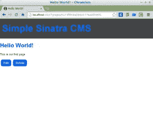

# 西纳特拉的一个简单的 CMS，第二部分

> 原文：<https://www.sitepoint.com/a-simple-cms-in-sinatra-part-ii/>

在[第一部分](https://www.sitepoint.com/a-simple-content-management-system-in-sinatra/)中，我们安装了 MongoDB 并使用 Mongoid 为我们的简单 CMS 创建了一些页面。我们还构建了一个用于添加和查看页面的 web 前端。在本教程中，我们将添加另外两个 CRUD 操作，允许用户编辑和删除页面。在我们添加功能之前，让我们为每个页面添加几个按钮，允许您编辑或删除页面。编辑`show.slim`文件，如下所示:

```
a href="/pages/#{@page.id}/edit" Edit this page,
  a href="/pages/delete/#{@page.id}" Delete this page
```

## 编辑页面

当用户点击编辑页面 URL 时，我们需要创建一个路由处理程序。将以下内容添加到`main.rb`(但确保它在“/pages/:id”路径之前):

```
get '/pages/:id/edit' do
    @page = Page.find(params[:id])
    slim :edit
  end
```

这会使用 URL 中提供的 id 在数据库中找到要编辑的页面，并将其存储在名为`@page`的实例变量中。这在视图中是可以访问的，这个视图叫做`edit.slim`。我们需要创造这样的机会，所以现在就开始吧。将以下内容作为`edit.slim`保存在`views`目录中:

```
h1 Edit Page
  form action="/pages/#{@page.id}" method="POST"
    input type="hidden" name="_method" value="PUT"
    fieldset
      legend Edit page
      == slim :form
    input type="submit" value="Update"
```

请注意，这重用了我们在上一教程中用于`new`页面的`form`片段。这使事情保持一致，并保持我们的代码干燥。表单引用了`@page`对象中的值，所以一些字段应该用它们当前的值来填充。该表单还有一个隐藏字段，用于告诉 Sinatra 该请求是一个 PUT 请求。这是因为除了 GET 和 POST 之外，大多数浏览器本身不支持任何 HTTP 动词。解决方案是使用 Sinatra 的方法 override，这样请求就像 PUT 请求一样被路由。在这种情况下，我们使用 PUT 请求，因为我们正在更新资源。

接下来，我们需要处理提交表单时发生的事情。我们需要另一个路由处理器来处理这个问题，所以在`main.rb`中添加以下内容:

```
put '/pages/:id' do
    page = Page.find(params[:id])
    page.update_attributes(params[:page])
    redirect to("/pages/#{page.id}")
  end
```

这将找到需要更新的页面，并使用 Mongoid 的`update_attributes`方法进行更新。然后，它将用户重定向到新更新的页面。

## 删除页面

要删除页面，我们将创建一个两步流程。首先，我们显示一个确认页面，检查用户是否希望删除该页面。以下是该页面的路由处理程序:

```
get '/pages/delete/:id' do
    @page = Page.find(params[:id])
    slim :delete
  end
```

这个路由处理程序只是找到要删除的页面，然后显示一个确认页面。我们需要为这个页面创建一个视图，在`views`目录中保存为`delete.slim`:

```
h1 Delete Page
  p Are you sure you want to delete the page called #{@page.title}?
  form action="/pages/#{@page.id}" method="POST"
    input type="hidden" name="_method" value="DELETE"
    input type="submit" value="Delete"
  a href="/pages" cancel
```

我们必须使用一个表单来完成这项工作，因为我们将在路由处理程序中使用 DELETE HTTP 方法来删除页面。如果我们使用链接，那么我们只能使用 GET 方法。我们还需要再次使用隐藏的输入字段来使用 Sinatra 的方法覆盖，这一次告诉它将请求作为删除方法进行路由。

剩下要做的就是在`main.rb`的底部添加一个路由处理器来处理这个请求:

```
delete '/pages/:id' do
      Page.find(params[:id]).destroy
      redirect to('/pages')
    end
```

这只是找到页面并使用`destroy`方法将其从数据库中删除。然后，它重定向到页面索引。

## 永久链接

到目前为止，我们一直使用页面对象的 id 作为 URL。MongoDB 使用非常大的 id，所以这意味着我们有像`/pages/5173f443a39401776a000001`这样的 URL。这些都很长，不是很有描述性，所以如果我们能根据页面的标题创建一个“漂亮的 URL”就好了。

为此，我们必须向页面模型添加一个名为`permalink`的新字段。这可以通过下面一行代码来完成:

```
field :permalink, type: String, default: -> { make_permalink }
```

这不会是用户在表单中填写的字段。它将根据标题自动创建。我们通过添加一个默认值来做到这一点，这个默认值是用一个 lambda 设置的，这个 lambda 引用了一个名为`make_permalink`的方法。该方法获取页面标题，并使用各种字符串方法删除带有连字符('-')的任何空格或标点符号。下面是这个方法，它只需要放在`Page`类中:

```
def make_permalink
    title.downcase.gsub(/W/,'-').squeeze('-').chomp('-') if title
  end
```

我们可以使用以下代码行在 IRB 中测试此功能:

```
$> irb
  2.0.0-p0 :001 > require './main'
   => true
```

现在，搜索我们集合中的第一个文档，您会惊奇地发现，它已经有一个带有适当值的`permalink`字段:

```
2.0.0-p0 :002 > Page.first
  => #This is our first page

", permalink: "hello-world">
```

欢迎来到无模式数据库的世界！不幸的是，事情并不像我们最初想象的那样好，因为如果我们试图基于这个字段进行查询，我们会得到一个错误:

```
2.0.0p0 :003 > Page.find_by(permalink: "hello-world")
  Mongoid::Errors::DocumentNotFound:
```

这是因为需要保存带有新的`permalink`字段的`Page`对象。使用下面的代码很容易做到这一点:

```
2.0.0p0 :004 > Page.first.save
   => true
```

现在，我们应该能够使用永久链接找到该页面:

```
2.0.0p0 :005 > Page.find_by(permalink: "hello-world")
   => #This is our first page

", permalink: "hello-world">
```

太好了！这意味着到目前为止创建的每个页面只需要保存就可以获得自己的永久链接。如果您有很多页面，您可以使用下面的代码行一次性完成:

```
2.0.0p0 :007 > Page.all.each{|page| page.save }
```

一切似乎都在正常运转。现在我们只需要为漂亮的 URL 创建路由处理程序。这些只是永久链接，不会以`/pages`开头。比如去`http://localhost:4567/hello-world`会显示标题为“Hello World！”。这个路由处理器实际上将匹配每一条路由，所以为了允许其他路由通过，我们将在一个 resuce 块中使用 Sinatra 的`pass`方法，如果在数据库中找不到该页面，将调用该方法。

将以下代码添加到`main.rb`:

```
get '/:permalink' do
    begin
      @page = Page.find_by(permalink: params[:permalink])
    rescue
      pass
    end
    slim :show
  end
```

这个路由处理程序将尝试根据 URL 中给定的永久链接找到页面，并在使用我们已经创建的`show`视图显示页面之前，将其存储在`@page`实例变量中。如果在数据库中找不到该页面，就会抛出一个错误。`rescue`方法捕捉到错误并调用`pass`方法，因此 Sinatra 将简单地移动到下一条路线，看它是否匹配。

## 添加一些风格

一切都如我们所愿，但看起来有点糟糕。Sinatra 使得使用 Sass 来组合一些漂亮的样式表变得非常容易。您所需要做的就是将下面的路由处理器添加到`main.rb`:

```
get('/styles/main.css'){ scss :styles }
```

然后在布局文件中放置以下行:

```
link rel="stylesheet" href="/styles/main.css"
```

然后创建一个名为`styles.scss`的文件，保存在`views`目录下。这是你展示所有风格的地方。

这是我拼凑的一个。它增加了一点色彩，使表单更好看，并且使一些链接和提交输入字段看起来像按钮:

```
$blue: #0166FF;

  body{
    margin: 0;
    padding: 0;
    font: 13px/1.2 helvetica, arial, sans-serif;
  }

  h1,h2,h3,h4,h5,h6{
    color: $blue;
  }

  .logo {
    background: #444;
    margin: 0;
    padding: 20px 10px;
    font-size: 44px;
    a,a:visited{ color: $blue; text-decoration: none;}
  }

  .button{
    border: none;
    border-radius: 8px;
    padding: 8px 12px;
    margin: 4px;
    color: #fff;
    background: $blue;
    text-decoration: none;
    font-weight: bold;
    display: inline-block;
    width: auto;
    &:hover{
      background: darken($blue,20%);
    }
  }

  label{
    display: block;
    font-weight: bold;
    font-size: 16px;
  }

  form, input, textarea{
    width: 100%;
  }

  input, textarea {
    border: #ccc 1px solid;
    padding: 10px 5px;
    font-size: 16px;
  }
```

注意为了使其中的一些样式工作，您需要向视图中的相关元素添加一个`button`类。例如，`show.slim`现在看起来是这样的:

```
h1= @page.title
  - if @page.content
    == markdown @page.content

  a.button href="/pages/#{@page.id}/edit" Edit
  a.button href="/pages/delete/#{@page.id}" Delete
```

…而且它看起来好多了！


## 那都是乡亲们！

现在我们有了一个功能齐全的内容管理系统，尽管非常简单。你可以创建、更新、查看和删除页面，它们也有一些基于标题的漂亮的 URL。在下一部分中，我们将创建一个管理部分，快速消息，缓存页面，版本和时间戳。请在评论中发表你希望在未来看到的任何其他功能。

## 分享这篇文章