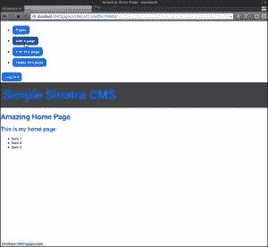
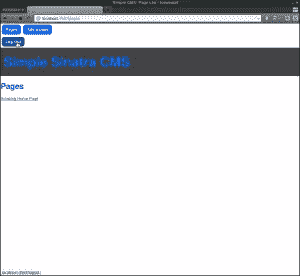

# 一个简单的西纳特拉 CMS，第三部分

> 原文：<https://www.sitepoint.com/a-simple-cms-in-sinatra-part-iii/>

在本系列教程的第二部分中，我们已经完成了简单内容管理系统的基础工作。现在可以创建、编辑和删除带有漂亮 URL 的页面。

在这篇文章中，我们将看看如何添加一个管理部分，并定义哪些页面是面向公众的，哪些是私人的。

## 登录和注销

首先，我们将添加一些允许用户登录和退出的功能。为此，我们需要配置我们的应用程序来使用会话。将靠近 **main.rb** 顶部的配置块改为如下:

```
configure do
  Mongoid.load!("./mongoid.yml")
  enable :sessions
end
```

现在，我们可以访问会话散列来跟踪用户是否从一个请求登录到另一个请求。

接下来，我们将创建一个名为`admin?`的助手方法，如果`session[:admin]`散列是`true`，那么这个方法就是`true`(当用户登录时，这个散列将被设置为`true`，当用户退出时，这个散列将被设置为`nil`)。在 **main.rb** 中的`configure`块下添加以下行:

```
helpers do
  def admin?
    session[:admin]
  end
end
```

我们现在有一种方便的方法来检查用户是否登录到视图和路由处理程序中。让我们用它来为我们的应用程序添加一个登录按钮。

我们希望它出现在每一页上，所以将**视图**文件夹中的 **layout.slim** 文件改为如下:

```
doctype html
html
  head
    title= @title || "Simple Sinatra CMS"
    link rel="stylesheet" href="/styles/main.css"
  body
    - if admin?
      == slim :admin
    - else
      a.rounded.button href="/login" Log In
    h1.logo
      a href="/pages" Simple Sinatra CMS
    == yield
```

主体之后的部分现在检查用户是否登录(通过检查我们刚刚创建的`admin?` helper 方法是否是`true`)。如果是，那么我们将显示管理部分视图(我们将在一分钟内创建它)。

如果用户未登录，则会显示一个链接，允许他们登录。这个链接有我们在上一个教程中创建的类`.rounded.button`，所以它显示为一个按钮。它还包含路由`/login`，我们很快就会处理它。

让我们对管理视图进行排序——将以下代码作为 **admin.slim** 保存在**视图**文件夹中:

```
#admin
  nav
    ul
      li
        a.round.button href='/pages' Pages
      li
        a.round.button href='/pages/new' Add a page
      - if @page
        li
          a.round.button href="/pages/#{@page.id}/edit" Edit this page
        li
          a.round.button href="/pages/delete/#{@page.id}" Delete this page a.rounded.button href="/logout" Log Out
```

这将添加“创建新页面”按钮以及编辑和删除按钮，这些按钮只有在您查看实际页面时才会显示。这些按钮应该只有在用户登录后才可用。在我们应用程序的前一版本中，它们被放在其他视图中，所以我们现在需要删除它们，并将它们限制在 admin 视图中。

在 **index.slim** 中，删除以下代码行:

```
a.button.round href='/pages/new' Add a new page
```

现在在 **show.slim** 中，删除以下代码:

```
a.button href="/pages/#{@page.id}/edit" Edit 
a.button href="/pages/delete/#{@page.id}" Delete
```

最后，我们需要创建用于用户登录和注销的实际路由处理程序。在 **main.rb** 中的页面路由处理程序上方添加以下几行:

```
get('/login'){session[:admin]=true; redirect back}
get('/logout'){session[:admin]=nil; redirect back}
```

当用户登录时，这些路由处理器将`session[:admin]`散列设置为`true`,当用户通过访问相关 URL 退出时，将散列设置为`nil`。这些信息使用 cookies 保存在会话散列中，然后由我们刚刚创建的`admin?` helper 方法用来检查用户是登录还是注销。两个路由处理程序都使用 Sinatra 提供的方便的`back`助手方法。这将把用户带回到他们登录或退出之前查看的页面。

这一切现在应该都正常了。确保您启动服务器运行，然后导航到[http://localhost:4567/pages](http://localhost:4567/pages)并在登录和注销时玩一玩。如果您已登录，应该只能看到添加、编辑和删除页面的按钮。

[](https://www.sitepoint.com/wp-content/uploads/2013/08/Screenshot5.png)

## 史上最不安全的安保？

你们当中眼尖的人可能已经注意到这个认证系统并不是特别强大——甚至没有密码！这是因为拥有一个强大的 auth 过程是一件重要的事情，超出了本教程的范围。我们在这里所做的是将这些部分放在适当的位置，以便合适的 auth 解决方案可以放在相关的位置。

你可能想看看 sinatra-auth gem (或者其他许多提供 auth 的 gem 中的一个)。你可以使用 [Twitter 认证](http://rubysource.com/twitter-authentication-in-sinatra/)或者你甚至可以推出自己的解决方案。

出于本教程的目的，我只是想演示应用程序如何根据用户是否登录而不同地运行。

## 保护管理功能

在我们的应用程序中有许多我们不希望所有用户都访问的路由。事实上，大多数路由都属于这一类，我们实际上只希望“显示”URL 对每个人都可见。

我们已经成功隐藏了链接到管理路径的按钮，但这可能无法阻止一个坚定或好奇的用户直接在浏览器地址栏中键入 URL。例如，您可以导航到“http://localhost:4567/pages/new”来添加新页面。

我们需要为路由本身增加一些安全性，以便实际上只允许用户在登录后访问这些路由。这是通过创建一个`protected!`助手方法来完成的。

在我们之前创建的`helpers`块中添加以下方法:

```
def protected!
  halt 401,"You are not authorized to see this page!" unless admin?
end
```

它使用 Sinatra 的`halt` helper 方法来停止请求，并发出一个 401“未授权”错误和一条自定义消息(这可以是一个字符串，或者您可以为它创建一个视图)。注意，我们使用在本教程开始时创建的`admin?` helper 方法来检查用户是否登录，因此只有当用户没有登录时，请求才会暂停。

现在需要将这个方法添加到我们想要保护的所有路由处理程序中。这意味着我们需要将许多路由处理程序更改为以下内容:

```
get '/pages/new' do
  protected!
  @page = Page.new
  slim :new
end

post '/pages' do
  protected!
  page = Page.create(params[:page])
  redirect to("/pages/#{page.id}")
end

put '/pages/:id' do
  protected!
  page = Page.find(params[:id])
  page.update_attributes(params[:page])
  redirect to("/pages/#{page.id}")
end

get '/pages/delete/:id' do
  protected!
  @page = Page.find(params[:id])
  slim :delete
end

delete '/pages/:id' do
  protected!
  Page.find(params[:id]).destroy
  redirect to('/pages')
end

get '/pages/:id/edit' do
  protected!
  @page = Page.find(params[:id])
  slim :edit
end
```

现在，任何未登录的用户都无法访问这些路由，即使他们直接在浏览器中键入路由。

## 不同用户的不同网址

在上一篇文章中，我们根据页面标题创建了漂亮的 URL。这些是我们希望为大多数用户使用的 URL——它们看起来更好，我们不希望他们看到 URL 中显示的每个页面的 id。

然而，当用户登录时，我们希望使用指向页面 ID 的 URL。为此，我们需要在 **main.rb** 中添加一个名为`url`的助手块:

```
def url_for page
  if admin?
    "/pages/" + page.id
  else
    "/" + page.permalink   
  end  
end
```

这基本上使用了一个`if ... else`块来检查用户是否使用我们相同的`admin?`助手登录。如果用户已经登录，那么 URL 将使用页面的 ID，否则它将使用页面的 pretty URL。

我们现在只要想链接到一个页面，就可以使用这个助手，确信会显示正确的 URL。此外，如果我们想改变网页网址的命名结构，那么我们只需要在这个地方。

我们当前链接到页面的唯一地方是页面部分，因此我们需要将 **page.slim** 视图更改为如下所示:

```
li
  a href="#{url_for page}" =page.title
```

## 添加一些风格

最后，我们可以将下面这段 Sass 代码添加到 **styles.scss** 的底部，使管理部分的按钮列表显示为一个水平列表:

```
#admin ul{
  list-style: none;
  margin: 0;
  padding: 0;
  li{
        display: inline-block;
  }
}
```

现在重新启动服务器，使用不同的功能进行试验——检查链接是否根据您是否登录而有所不同。

[](https://www.sitepoint.com/wp-content/uploads/2013/08/Screenshot6.png)

## 那都是乡亲们！

在本帖中，我们在内容管理系统中添加了一个管理部分，尽管这可能是最不安全的认证系统。

尽管缺乏安全性，但用户登录的能力允许我们分离应用程序的不同视图和功能。在下一篇文章中，我们将探讨如何缓存页面，以及如何给页面添加时间戳和版本控制。

请在下面留下任何评论，以及任何你希望看到这个 CMS 如何发展的要求。

## 分享这篇文章