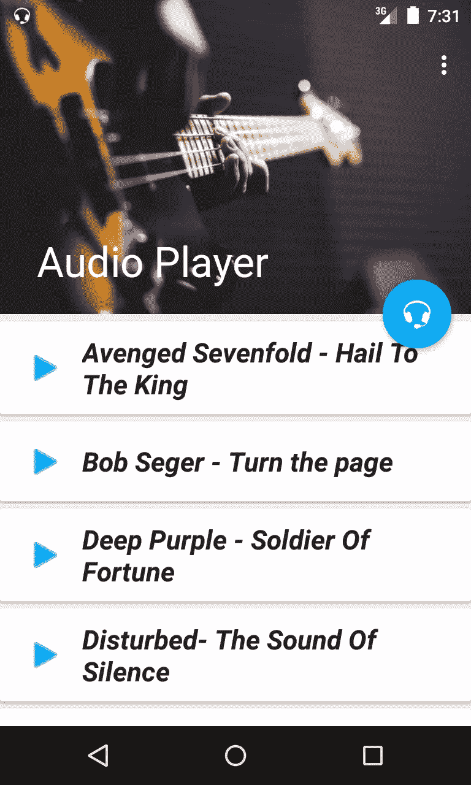
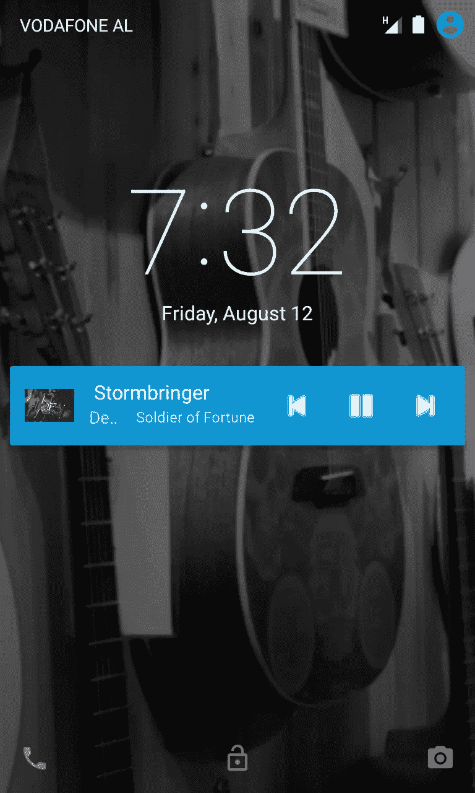
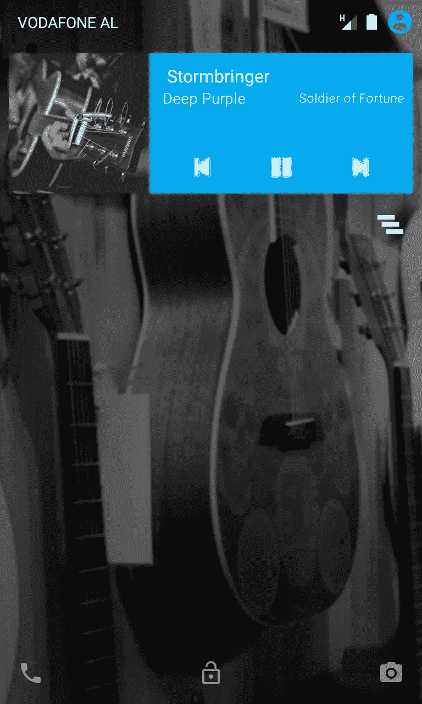

# 构建 Android 音频播放器应用程序的分步指南

> 原文：<https://www.sitepoint.com/a-step-by-step-guide-to-building-an-android-audio-player-app/>

本教程是一步一步的指南，使用最好和最有效的方法和 API 来构建 Android 音频应用程序。这是一个很长的教程，所以我把它分成两个独立的部分，如果一次阅读太多的话:

1.  在服务中构建媒体播放器，这对于在后台播放媒体很重要。
2.  通过`BroadcastReceiver` s(播放、暂停、下一个、上一个)与服务交互。如何处理边缘用例，如来电、音频输出改变(例如，移除耳机)。

## 第一部分-建立项目。

在 Android Studio 中创建新项目，并在 *AndroidManifest.xml* 文件中添加以下权限。

```
<uses-permission android:name="android.permission.INTERNET" />
<permission android:name="android.permission.MEDIA_CONTENT_CONTROL" />
<uses-permission android:name="android.permission.READ_PHONE_STATE" /> 
```

流媒体播放时，应用程序需要这些权限才能通过互联网访问媒体文件。因为本文的重点是构建一个媒体播放器应用程序，所以您需要`MEDIA_CONTENT_CONTROL`来控制媒体播放。您可以使用`READ_PHONE_STATE`权限访问电话状态来监听来电等事件，以便在通话过程中停止音频。

## 第二步–创建 MediaPlayer 服务

音频播放器应用的核心是媒体播放器服务。下面的类是这个服务的一个例子。该类有多个`MediaPlayer`实现来处理播放音频时可能发生的事件。来自`AudioManager.OnAudioFocusChangeListener`的最后一个实现是处理来自其他想要播放媒体文件的应用对`AudioFocus`的请求所必需的。

```
public class MediaPlayerService extends Service implements MediaPlayer.OnCompletionListener,
      MediaPlayer.OnPreparedListener, MediaPlayer.OnErrorListener, MediaPlayer.OnSeekCompleteListener,
      MediaPlayer.OnInfoListener, MediaPlayer.OnBufferingUpdateListener,

      AudioManager.OnAudioFocusChangeListener {

  // Binder given to clients
  private final IBinder iBinder = new LocalBinder();

  @Override
  public IBinder onBind(Intent intent) {
      return iBinder;
  }

  @Override
  public void onBufferingUpdate(MediaPlayer mp, int percent) {
      //Invoked indicating buffering status of
      //a media resource being streamed over the network.
  }

  @Override
  public void onCompletion(MediaPlayer mp) {
      //Invoked when playback of a media source has completed.
  }

  //Handle errors
  @Override
  public boolean onError(MediaPlayer mp, int what, int extra) {
      //Invoked when there has been an error during an asynchronous operation.
      return false;
  }

  @Override
  public boolean onInfo(MediaPlayer mp, int what, int extra) {
      //Invoked to communicate some info.
      return false;
  }

  @Override
  public void onPrepared(MediaPlayer mp) {
      //Invoked when the media source is ready for playback.
  }

  @Override
  public void onSeekComplete(MediaPlayer mp) {
      //Invoked indicating the completion of a seek operation.
  }

  @Override
  public void onAudioFocusChange(int focusChange) {
      //Invoked when the audio focus of the system is updated.
  }

  public class LocalBinder extends Binder {
      public MediaPlayerService getService() {
          return MediaPlayerService.this;
      }
  }

} 
```

上面的代码是所有处理`MediaPlayer`事件的方法的模板。唯一完整的代码是`Service`的绑定。您需要绑定此服务，因为它与活动交互以获取音频文件。您可以在[文档](https://developer.android.com/guide/components/bound-services.html)中了解更多关于绑定服务的信息。

在 *AndroidManifest.xml* 文件中声明`Service`

```
<application
  <service android:name=".MediaPlayerService" />
  ...
</application> 
```

## 第三步——构建媒体播放器

Android 多媒体框架支持各种常见的媒体类型。这个框架的一个关键组件是 [MediaPlayer](https://developer.android.com/reference/android/media/MediaPlayer.html) 类，只需很少的设置就可以用来播放音频和视频。您可以在[文档](https://developer.android.com/guide/topics/media/mediaplayer.html#mediaplayer)中找到`MediaPlayer`实现的基本示例，但是您需要比这个示例`Service`更多的内容来播放媒体。接下来我将描述需要在`MediaPlayerService`类中设置的必要方法。

在`Service`类中创建以下`MediaPlayer`的全局实例和音频的`String`路径。

```
private MediaPlayer mediaPlayer;
//path to the audio file
private String mediaFile; 
```

现在初始化`mediaPlayer`:

```
private void initMediaPlayer() {
    mediaPlayer = new MediaPlayer();
    //Set up MediaPlayer event listeners
    mediaPlayer.setOnCompletionListener(this);
    mediaPlayer.setOnErrorListener(this);
    mediaPlayer.setOnPreparedListener(this);
    mediaPlayer.setOnBufferingUpdateListener(this);
    mediaPlayer.setOnSeekCompleteListener(this);
    mediaPlayer.setOnInfoListener(this);
    //Reset so that the MediaPlayer is not pointing to another data source
    mediaPlayer.reset();

    mediaPlayer.setAudioStreamType(AudioManager.STREAM_MUSIC);
    try {
        // Set the data source to the mediaFile location
        mediaPlayer.setDataSource(mediaFile);
    } catch (IOException e) {
        e.printStackTrace();
        stopSelf();
    }
    mediaPlayer.prepareAsync();
} 
```

使用媒体时，您需要实现一些函数来处理播放媒体的基本操作。这些基本功能是播放、停止、暂停和恢复。

首先添加另一个全局变量来存储暂停/恢复位置。

```
//Used to pause/resume MediaPlayer
private int resumePosition; 
```

添加`if`语句以确保播放媒体时没有问题。

```
private void playMedia() {
    if (!mediaPlayer.isPlaying()) {
        mediaPlayer.start();
    }
}

private void stopMedia() {
    if (mediaPlayer == null) return;
    if (mediaPlayer.isPlaying()) {
        mediaPlayer.stop();
    }
}

private void pauseMedia() {
    if (mediaPlayer.isPlaying()) {
        mediaPlayer.pause();
        resumePosition = mediaPlayer.getCurrentPosition();
    }
}

private void resumeMedia() {
    if (!mediaPlayer.isPlaying()) {
        mediaPlayer.seekTo(resumePosition);
        mediaPlayer.start();
    }
} 
```

现在您已经创建了初始化函数，是时候实现在初始`Service`模板中构造的`@Override`方法了。这些方法对`MediaPlayer`很重要，因为玩家将要执行的所有关键动作都将从这些方法中调用。用以下内容替换`Service`模板中的原始方法。

```
@Override
public void onCompletion(MediaPlayer mp) {
    //Invoked when playback of a media source has completed.
    stopMedia();
    //stop the service
    stopSelf();
}

//Handle errors
@Override
public boolean onError(MediaPlayer mp, int what, int extra) {
    //Invoked when there has been an error during an asynchronous operation
    switch (what) {
        case MediaPlayer.MEDIA_ERROR_NOT_VALID_FOR_PROGRESSIVE_PLAYBACK:
            Log.d("MediaPlayer Error", "MEDIA ERROR NOT VALID FOR PROGRESSIVE PLAYBACK " + extra);
            break;
        case MediaPlayer.MEDIA_ERROR_SERVER_DIED:
            Log.d("MediaPlayer Error", "MEDIA ERROR SERVER DIED " + extra);
            break;
        case MediaPlayer.MEDIA_ERROR_UNKNOWN:
            Log.d("MediaPlayer Error", "MEDIA ERROR UNKNOWN " + extra);
            break;
    }
    return false;
}

@Override
public void onPrepared(MediaPlayer mp) {
    //Invoked when the media source is ready for playback.
    playMedia();
} 
```

**注意**:在初始`Service`模板中实现了更多的`@Override`方法。这些在特定的`MediaPlayer`事件中很有用，但是由于本教程的重点是构建一个通用的媒体播放器，所以我不会实现它们。

## 第四步-处理音频焦点

为了在 Android 中获得良好的音频用户体验，你需要注意你的应用程序与系统和其他播放媒体的应用程序很好地配合。

为了确保良好的用户体验，`MediaPlayerService`必须处理`AudioFocus`事件，这些事件在最后一个覆盖方法`onAudioFocusChange()`中处理。该方法是一个将焦点事件作为其`case:`的`switch`语句。请记住，该覆盖方法是在系统或另一个媒体应用程序发出`AudioFocus`请求后调用的。

每个`case:`里都发生了什么？

*   服务获得了音频焦点，所以它需要开始播放。
*   `AudioManager.AUDIOFOCUS_LOSS`–服务失去了音频焦点，用户可能在另一个应用程序上播放媒体，因此释放媒体播放器。
*   `AudioManager.AUDIOFOCUS_LOSS_TRANSIENT`–Fucos 短时间丢失，暂停`MediaPlayer`。
*   `AudioManager.AUDIOFOCUS_LOSS_TRANSIENT_CAN_DUCK`–短时间失去焦点，可能是设备收到通知，降低播放音量。

除了覆盖方法之外，您还需要另外两个函数来请求和释放来自`MediaPlayer`的音频焦点。下面的代码块包含上述所有音频焦点方法。我从 Android 开发者[的文档](https://developer.android.com/guide/topics/media/mediaplayer.html#audiofocus)中获取了`onAudioFocusChange()`的代码，并进行了一些修改，但是这段代码完成了这个例子的工作。

首先向`Service`类添加一个新的全局变量。

```
private AudioManager audioManager; 
```

用以下内容替换`Service`的`onAudioFocusChange()`方法，并添加它使用的函数。

```
@Override
public void onAudioFocusChange(int focusState) {
    //Invoked when the audio focus of the system is updated.
    switch (focusState) {
        case AudioManager.AUDIOFOCUS_GAIN:
            // resume playback
            if (mediaPlayer == null) initMediaPlayer();
            else if (!mediaPlayer.isPlaying()) mediaPlayer.start();
            mediaPlayer.setVolume(1.0f, 1.0f);
            break;
        case AudioManager.AUDIOFOCUS_LOSS:
            // Lost focus for an unbounded amount of time: stop playback and release media player
            if (mediaPlayer.isPlaying()) mediaPlayer.stop();
            mediaPlayer.release();
            mediaPlayer = null;
            break;
        case AudioManager.AUDIOFOCUS_LOSS_TRANSIENT:
            // Lost focus for a short time, but we have to stop
            // playback. We don't release the media player because playback
            // is likely to resume
            if (mediaPlayer.isPlaying()) mediaPlayer.pause();
            break;
        case AudioManager.AUDIOFOCUS_LOSS_TRANSIENT_CAN_DUCK:
            // Lost focus for a short time, but it's ok to keep playing
            // at an attenuated level
            if (mediaPlayer.isPlaying()) mediaPlayer.setVolume(0.1f, 0.1f);
            break;
    }
}

private boolean requestAudioFocus() {
    audioManager = (AudioManager) getSystemService(Context.AUDIO_SERVICE);
    int result = audioManager.requestAudioFocus(this, AudioManager.STREAM_MUSIC, AudioManager.AUDIOFOCUS_GAIN);
    if (result == AudioManager.AUDIOFOCUS_REQUEST_GRANTED) {
        //Focus gained
        return true;
    }
    //Could not gain focus
    return false;
}

private boolean removeAudioFocus() {
    return AudioManager.AUDIOFOCUS_REQUEST_GRANTED ==
            audioManager.abandonAudioFocus(this);
} 
```

如果你想了解更多关于音频焦点的知识，那么 [SitePoint 文章](https://www.sitepoint.com/managing-multiple-sound-sources-in-android-with-audio-focus/)有一个很棒的教程。

## 第五步–服务生命周期方法

在这一节中，我将重点介绍`Service`生命周期。这些方法对`MediaPlayer`至关重要，因为`Service`的生命周期与`MediaPlayer`紧密相连。这些方法将处理`MediaPlayer`的初始化和资源管理。

我有行内注释，使它更容易理解。

```
//The system calls this method when an activity, requests the service be started
@Override
public int onStartCommand(Intent intent, int flags, int startId) {
    try {
        //An audio file is passed to the service through putExtra();
        mediaFile = intent.getExtras().getString("media");
    } catch (NullPointerException e) {
        stopSelf();
    }

    //Request audio focus
    if (requestAudioFocus() == false) {
        //Could not gain focus
        stopSelf();
    }

    if (mediaFile != null && mediaFile != "")
        initMediaPlayer();

    return super.onStartCommand(intent, flags, startId);
} 
```

`onStartCommand()`处理`MediaPlayer`的初始化和焦点请求，以确保没有其他应用程序播放媒体。在`onStartCommand()`代码中，我添加了一个额外的`try-catch`块来确保`getExtras()`方法不会抛出`NullPointerException`。

您需要实现的另一个重要方法是`onDestroy()`。在该方法中，必须释放`MediaPlayer`资源，因为该服务即将被销毁，并且不需要 app 来控制媒体资源。

```
@Override
public void onDestroy() {
    super.onDestroy();
    if (mediaPlayer != null) {
        stopMedia();
        mediaPlayer.release();
    }
    removeAudioFocus();
} 
```

`onDestroy()`方法也释放音频焦点，这更多的是个人选择。如果你用这种方法释放焦点，`MediaPlayerService`将拥有音频焦点，直到被破坏，如果没有其他媒体应用程序中断音频焦点。

如果您想要一个更动态的焦点控制，您可以在新媒体开始播放时请求音频焦点，并在`onCompletion()`方法中释放它，这样服务将只在播放某些内容时拥有焦点控制。

## 第六步–绑定音频播放器

在这一节中，我将介绍将`MediaPlayerService`类绑定到`MainActivity`的最后步骤，并为其提供音频播放。你必须将`Service`绑定到`Activity`上，这样它们就可以相互交互。

将以下全局变量添加到`MainActivity`类中。

```
private MediaPlayerService player;
boolean serviceBound = false; 
```

第一个是`Service`的实例，第二个布尔值包含`Service`的状态，是否绑定到活动。

为了处理`Service`绑定，将以下代码添加到`MainActivity`类中。

```
//Binding this Client to the AudioPlayer Service
private ServiceConnection serviceConnection = new ServiceConnection() {
    @Override
    public void onServiceConnected(ComponentName name, IBinder service) {
        // We've bound to LocalService, cast the IBinder and get LocalService instance
        MediaPlayerService.LocalBinder binder = (MediaPlayerService.LocalBinder) service;
        player = binder.getService();
        serviceBound = true;

        Toast.makeText(MainActivity.this, "Service Bound", Toast.LENGTH_SHORT).show();
    }

    @Override
    public void onServiceDisconnected(ComponentName name) {
        serviceBound = false;
    }
}; 
```

现在是时候播放一些音频了。下面的函数创建了一个新的`MediaPlayerService`实例，并发送了一个要播放的媒体文件，所以将其添加到`MainActivity`中。

```
private void playAudio(String media) {
    //Check is service is active
    if (!serviceBound) {
        Intent playerIntent = new Intent(this, MediaPlayerService.class);
        playerIntent.putExtra("media", media);
        startService(playerIntent);
        bindService(playerIntent, serviceConnection, Context.BIND_AUTO_CREATE);
    } else {
        //Service is active
        //Send media with BroadcastReceiver
    }
} 
```

`playAudio()`功能不完整。当我用一个`BroadcastReceiver`向`Service`发送媒体文件时，我将回到这个话题。

从`Activity`的`onCreate()`方法调用`playAudio()`函数，并引用一个音频文件。

```
playAudio("https://upload.wikimedia.org/wikipedia/commons/6/6c/Grieg_Lyric_Pieces_Kobold.ogg"); 
```

## 第七步——活动生命周期方法

在这一节中，我将介绍基本但重要的生命周期方法的实现。如果你从`Activity`的`onCreate()`方法中调用`playAudio()`函数，`Service`将会开始播放，但是程序很容易崩溃。

将以下方法添加到`MainActivity`中进行修复。所有这些方法都是保存和恢复变量`serviceBound`的状态，并在用户关闭应用程序时解除绑定`Service`。

```
@Override
public void onSaveInstanceState(Bundle savedInstanceState) {
    savedInstanceState.putBoolean("ServiceState", serviceBound);
    super.onSaveInstanceState(savedInstanceState);
}

@Override
public void onRestoreInstanceState(Bundle savedInstanceState) {
    super.onRestoreInstanceState(savedInstanceState);
    serviceBound = savedInstanceState.getBoolean("ServiceState");
}

@Override
protected void onDestroy() {
    super.onDestroy();
    if (serviceBound) {
        unbindService(serviceConnection);
        //service is active
        player.stopSelf();
    }
} 
```

## 附加功能-加载本地音频文件

用户可能希望从实际设备加载音频，而不是在线播放。您可以使用`ContentResolver`从设备中加载音频文件。

创建一个用作音频对象的新 Java 类。下面的类包含了音频文件需要的关键信息，但是如果需要的话你可以添加更多。

```
public class Audio implements Serializable {

    private String data;
    private String title;
    private String album;
    private String artist;

    public Audio(String data, String title, String album, String artist) {
        this.data = data;
        this.title = title;
        this.album = album;
        this.artist = artist;
    }

    public String getData() {
        return data;
    }

    public void setData(String data) {
        this.data = data;
    }

    public String getTitle() {
        return title;
    }

    public void setTitle(String title) {
        this.title = title;
    }

    public String getAlbum() {
        return album;
    }

    public void setAlbum(String album) {
        this.album = album;
    }

    public String getArtist() {
        return artist;
    }

    public void setArtist(String artist) {
        this.artist = artist;
    }
} 
```

将权限添加到 *AndroidManifest.xml* 。

```
<uses-permission android:name="android.permission.READ_EXTERNAL_STORAGE" /> 
```

这是从 Android 设备加载本地媒体文件所必需的。

在`MainActivity`类中创建一个`Audio`对象的全局`ArrayList`。

```
ArrayList<Audio> audioList; 
```

要从设备获取数据，将以下函数添加到`MainActivity`。它按升序从设备中检索数据。

```
private void loadAudio() {
  ContentResolver contentResolver = getContentResolver();

  Uri uri = MediaStore.Audio.Media.EXTERNAL_CONTENT_URI;
  String selection = MediaStore.Audio.Media.IS_MUSIC + "!= 0";
  String sortOrder = MediaStore.Audio.Media.TITLE + " ASC";
  Cursor cursor = contentResolver.query(uri, null, selection, null, sortOrder);

  if (cursor != null && cursor.getCount() > 0) {
      audioList = new ArrayList<>();
      while (cursor.moveToNext()) {
          String data = cursor.getString(cursor.getColumnIndex(MediaStore.Audio.Media.DATA));
          String title = cursor.getString(cursor.getColumnIndex(MediaStore.Audio.Media.TITLE));
          String album = cursor.getString(cursor.getColumnIndex(MediaStore.Audio.Media.ALBUM));
          String artist = cursor.getString(cursor.getColumnIndex(MediaStore.Audio.Media.ARTIST));

          // Save to audioList
          audioList.add(new Audio(data, title, album, artist));
      }
  }
  cursor.close();
} 
```

从设备中检索数据后，`playAudio()`功能可以在`Service`上播放数据。

在`MainActivity`的`onCreate()`方法中添加以下代码。确保至少有一个服务可以播放的音轨，否则应用程序会崩溃。

```
loadAudio();
//play the first audio in the ArrayList
playAudio(audioList.get(0).getData()); 
```

如果你准备好了更多，那么继续阅读，或者这也是一个在继续阅读前快速休息的好机会。

接下来，我将重点关注用户与`MediaPlayerService`的交互，以及处理播放媒体时出现的中断，如来电、音频输出的改变以及构建完整的音频播放器应用程序所需的其他功能。

与后台服务交互的关键组件是 [`BroadcastReceiver`](https://developer.android.com/reference/android/content/BroadcastReceiver.html) 。

## 什么是`BroadcastReceiver`？

Android 系统组件和应用程序借助`sendBroadcast()`、`sendStickyBroadcast()`或`sendOrderedBroadcast()`方法通过意向进行系统范围的调用，以通知感兴趣的应用程序。广播意图可用于在应用程序组件之间提供消息和事件系统，或者被 Android 系统用来通知感兴趣的应用程序关于关键系统事件。注册`BroadcastReceiver` s 拦截这些事件广播到整个 Android 系统。`BroadcastReceiver`的目的是等待某些事件发生，并对这些事件做出反应，但是`BroadcastReceiver`并不对所有到来的事件做出反应，只对特定的事件做出反应。当一个`BroadcastReceiver`检测到一个匹配的意图时，它将调用它的`onReceive()`方法来处理它。

你可以用两种方式注册一个`BroadcastReceiver`，在 *AndroidManifest.xml* 中静态注册，或者在运行时使用`registerReceiver()`方法动态注册。

对于本教程，`BroadcastReceiver`是动态创建的，因为重要的是`MediaPlayerService`只在玩家活动时监听事件。如果应用程序在事件被触发后意外开始播放音频，这不是一个好的用户体验。如果你注册了一个接收者，你必须在不再需要它的时候取消注册。

## 让我们回到音频播放器应用程序

为了更完整的音频应用程序，我添加了一个`RecyclerView`，并在`loadAudio()`功能的帮助下，将本地音频文件加载到`RecyclerView`。我还修改了配色方案和布局。我不会详细描述将`RecyclerView`添加到应用程序的过程，但你可以在 [GitHub](https://github.com/sitepoint-editors/AudioPlayer) 上看到最终结果。

如果你想了解更多关于`RecyclerView`的信息，那么请阅读我的[文章](https://www.sitepoint.com/mastering-complex-lists-with-the-android-recyclerview/)。

另一个变化是`playAudio()`函数和`Service`的`onStartCommand()`方法，但我将在稍后返回这些变化，并重点关注`BroadcastReceiver`的事件和用户与`Service`的交互。

## 更改音频输出(耳机已移除)

在媒体应用程序中，当用户从插孔中取出耳机时，媒体停止播放是很常见的。

在`MediaPlayerService`类中创建一个监听`ACTION_AUDIO_BECOMING_NOISY`的`BroadcastReceiver`，这意味着由于音频输出的变化，音频将变得“嘈杂”。在服务类中添加以下函数。

```
//Becoming noisy
private BroadcastReceiver becomingNoisyReceiver = new BroadcastReceiver() {
    @Override
    public void onReceive(Context context, Intent intent) {
        //pause audio on ACTION_AUDIO_BECOMING_NOISY
        pauseMedia();
        buildNotification(PlaybackStatus.PAUSED);
    }
};

private void registerBecomingNoisyReceiver() {
    //register after getting audio focus
    IntentFilter intentFilter = new IntentFilter(AudioManager.ACTION_AUDIO_BECOMING_NOISY);
    registerReceiver(becomingNoisyReceiver, intentFilter);
} 
```

当系统发出一个`ACTION_AUDIO_BECOMING_NOISY`调用时，`BroadcastReceiver`实例将暂停`MediaPlayer`。要使`BroadcastReceiver`可用，您必须注册它。`registerBecomingNoisyReceiver()`功能对此进行处理，并指定将触发此`BroadcastReceiver`的意图动作`BECOMING_NOISY`。

您还没有实现`buildNotification()`，所以当它显示错误时不要担心。

## 处理来电

接下来的功能避免在通话时播放音频，这将是一个糟糕的用户体验。

首先在`MediaPlayerService`类中创建以下全局变量。

```
//Handle incoming phone calls
private boolean ongoingCall = false;
private PhoneStateListener phoneStateListener;
private TelephonyManager telephonyManager; 
```

添加以下函数。

```
//Handle incoming phone calls
private void callStateListener() {
  // Get the telephony manager
  telephonyManager = (TelephonyManager) getSystemService(Context.TELEPHONY_SERVICE);
  //Starting listening for PhoneState changes
  phoneStateListener = new PhoneStateListener() {
      @Override
      public void onCallStateChanged(int state, String incomingNumber) {
          switch (state) {
              //if at least one call exists or the phone is ringing
              //pause the MediaPlayer
              case TelephonyManager.CALL_STATE_OFFHOOK:
              case TelephonyManager.CALL_STATE_RINGING:
                  if (mediaPlayer != null) {
                      pauseMedia();
                      ongoingCall = true;
                  }
                  break;
              case TelephonyManager.CALL_STATE_IDLE:
                  // Phone idle. Start playing.
                  if (mediaPlayer != null) {
                      if (ongoingCall) {
                          ongoingCall = false;
                          resumeMedia();
                      }
                  }
                  break;
          }
      }
  };
  // Register the listener with the telephony manager
  // Listen for changes to the device call state.
  telephonyManager.listen(phoneStateListener,
          PhoneStateListener.LISTEN_CALL_STATE);
} 
```

`callStateListener()`函数是监听`TelephonyManager`状态变化的`PhoneStateListener`的实现。`TelephonyManager`提供对设备上电话服务信息的访问，监听设备呼叫状态的变化并对这些变化做出反应。

## 重新定义方法

我提到我改变了本文前面描述的方法。我还改变了音频文件传递到`Service`的方式。在`loadAudio()`功能的帮助下，从设备中加载音频文件。当用户想要播放音频时，从加载的音频文件的`ArrayList`中调用带有想要的音频的索引的`playAudio(int audioIndex)`函数。

当第一次调用`playAudio()`函数时，`ArrayList`与音频索引号一起存储在`SharedPreferences`中，当`MediaPlayerService`想要播放新的音频时，它从`SharedPreferences`加载。这是将`Audio`数组加载到`Service`的一种方式，但还有其他方式。

打开 *build.gradle (app)* 并为 [Gson](https://github.com/google/gson) 库添加依赖项。

```
dependencies {
  ...
  compile group: 'com.google.code.gson', name: 'gson', version: '2.7', changing: true
} 
```

下面的类处理数据存储。

```
public class StorageUtil {

    private final String STORAGE = " com.valdioveliu.valdio.audioplayer.STORAGE";
    private SharedPreferences preferences;
    private Context context;

    public StorageUtil(Context context) {
        this.context = context;
    }

    public void storeAudio(ArrayList<Audio> arrayList) {
        preferences = context.getSharedPreferences(STORAGE, Context.MODE_PRIVATE);

        SharedPreferences.Editor editor = preferences.edit();
        Gson gson = new Gson();
        String json = gson.toJson(arrayList);
        editor.putString("audioArrayList", json);
        editor.apply();
    }

    public ArrayList<Audio> loadAudio() {
        preferences = context.getSharedPreferences(STORAGE, Context.MODE_PRIVATE);
        Gson gson = new Gson();
        String json = preferences.getString("audioArrayList", null);
        Type type = new TypeToken<ArrayList<Audio>>() {
        }.getType();
        return gson.fromJson(json, type);
    }

    public void storeAudioIndex(int index) {
        preferences = context.getSharedPreferences(STORAGE, Context.MODE_PRIVATE);
        SharedPreferences.Editor editor = preferences.edit();
        editor.putInt("audioIndex", index);
        editor.apply();
    }

    public int loadAudioIndex() {
        preferences = context.getSharedPreferences(STORAGE, Context.MODE_PRIVATE);
        return preferences.getInt("audioIndex", -1);//return -1 if no data found
    }

    public void clearCachedAudioPlaylist() {
        preferences = context.getSharedPreferences(STORAGE, Context.MODE_PRIVATE);
        SharedPreferences.Editor editor = preferences.edit();
        editor.clear();
        editor.commit();
    }
} 
```

现在是时候改变`playAudio()`函数了。首先在`MainActivity`类中创建一个全局静态`String`。

```
public static final String Broadcast_PLAY_NEW_AUDIO = "com.valdioveliu.valdio.audioplayer.PlayNewAudio";
// Change to your package name 
```

该字符串向`MediaPlayerService`发送广播意图，表明用户想要播放新的音频，并且已经更新了他们想要播放的音频的缓存索引。处理这个意图的`BroadcastReceiver`还没有创建，现在用下面的函数替换`MainActivity`中旧的`playAudio()`函数。

```
private void playAudio(int audioIndex) {
    //Check is service is active
    if (!serviceBound) {
        //Store Serializable audioList to SharedPreferences
        StorageUtil storage = new StorageUtil(getApplicationContext());
        storage.storeAudio(audioList);
        storage.storeAudioIndex(audioIndex);

        Intent playerIntent = new Intent(this, MediaPlayerService.class);
        startService(playerIntent);
        bindService(playerIntent, serviceConnection, Context.BIND_AUTO_CREATE);
    } else {
        //Store the new audioIndex to SharedPreferences
        StorageUtil storage = new StorageUtil(getApplicationContext());
        storage.storeAudioIndex(audioIndex);

        //Service is active
        //Send a broadcast to the service -> PLAY_NEW_AUDIO
        Intent broadcastIntent = new Intent(Broadcast_PLAY_NEW_AUDIO);
        sendBroadcast(broadcastIntent);
    }
} 
```

音频没有通过`putExtra()`传递给`Service`，所以`Service`必须从`SharedPreferences`加载数据，这就是为什么`onStartCommand()`方法需要重写的原因。我将在本教程的最后回到这个方法，给出完整的`onStartCommand()`实现。现在，将以下全局变量添加到`MediaPlayerService`类中。

```
//List of available Audio files
private ArrayList<Audio> audioList;
private int audioIndex = -1;
private Audio activeAudio; //an object of the currently playing audio 
```

## 播放新的音频广播

当`MediaPlayerService`正在播放一些东西，而用户想要播放一个新的音轨时，你必须通知服务它需要移动到新的音频。你需要一种方式让`Service`监听这些“播放新音频”的呼叫并对其采取行动。怎么会？另一个`BroadcastReceiver`。当调用`playAudio()`函数时，我在*重定义方法*部分提到了这些“播放新音频”调用。

在`MediaPlayerService`类中添加以下函数。

```
private BroadcastReceiver playNewAudio = new BroadcastReceiver() {
    @Override
    public void onReceive(Context context, Intent intent) {

        //Get the new media index form SharedPreferences
        audioIndex = new StorageUtil(getApplicationContext()).loadAudioIndex();
        if (audioIndex != -1 && audioIndex < audioList.size()) {
            //index is in a valid range
            activeAudio = audioList.get(audioIndex);
        } else {
            stopSelf();
        }

        //A PLAY_NEW_AUDIO action received
        //reset mediaPlayer to play the new Audio
        stopMedia();
        mediaPlayer.reset();
        initMediaPlayer();
        updateMetaData();
        buildNotification(PlaybackStatus.PLAYING);
    }
};

private void register_playNewAudio() {
    //Register playNewMedia receiver
    IntentFilter filter = new IntentFilter(MainActivity.Broadcast_PLAY_NEW_AUDIO);
    registerReceiver(playNewAudio, filter);
} 
```

当拦截到一个`PLAY_NEW_AUDIO`意图时，这个`BroadcastReceiver`加载更新的索引并将`activeAudio`对象更新到新的媒体，并且`MediaPlayer`被重置以播放新的音频。`buildNotification()`函数还没有实现，所以它显示一个错误。

## 寄存器`BroadcastReceiver` S

在`Service` s `onCreate()`方法中添加对`BroadcastReceiver` s 的注册调用

```
@Override
public void onCreate() {
    super.onCreate();
    // Perform one-time setup procedures

    // Manage incoming phone calls during playback.
    // Pause MediaPlayer on incoming call,
    // Resume on hangup.
    callStateListener();
    //ACTION_AUDIO_BECOMING_NOISY -- change in audio outputs -- BroadcastReceiver
    registerBecomingNoisyReceiver();
    //Listen for new Audio to play -- BroadcastReceiver
    register_playNewAudio();
} 
```

当不再需要时，您必须注销所有已注册的`BroadcastReceiver`。这发生在`Service` s `onDestroy()`方法中。用下面的方法替换你现在的`onDestroy()`方法。还是那句话，不要担心`removeNotification()`，这是以后实现的。

```
@Override
public void onDestroy() {
    super.onDestroy();
    if (mediaPlayer != null) {
        stopMedia();
        mediaPlayer.release();
    }
    removeAudioFocus();
    //Disable the PhoneStateListener
    if (phoneStateListener != null) {
        telephonyManager.listen(phoneStateListener, PhoneStateListener.LISTEN_NONE);
    }

    removeNotification();

    //unregister BroadcastReceivers
    unregisterReceiver(becomingNoisyReceiver);
    unregisterReceiver(playNewAudio);

    //clear cached playlist
    new StorageUtil(getApplicationContext()).clearCachedAudioPlaylist();
} 
```

当`Service`被销毁时，它必须停止监听来电并释放`TelephonyManager`资源。在被摧毁之前，`Service`还要做的最后一件事是清除存储在`SharedPreferences`中的数据。

## 用户交互

与`MediaPlayerService`交互是音频播放器应用程序的关键功能之一，因为用户不需要播放媒体，但也需要对应用程序拥有控制权。当使用后台服务时，这并不像看起来那么容易，因为在后台线程中没有用户界面。Android Lollipop 引入了新功能，包括 Android [MediaStyle 通知](https://developer.android.com/reference/android/app/Notification.MediaStyle.html)。

`Notification.MediaStyle`允许您添加媒体按钮，而无需创建自定义通知。在这个例子中，我将使用`MediaStyle` s 支持库、 [`NotificationCompat.MediaStyle`](https://developer.android.com/reference/android/support/v7/app/NotificationCompat.MediaStyle.html) 来支持旧的 Android 版本。

要完全控制`MediaPlayerService`中的媒体播放，您需要创建一个`MediaSession`的实例。`MediaSession`允许与媒体控制器、音量键、媒体按钮和传输控制进行交互。当一个应用程序想要发布媒体播放信息或处理媒体密钥时，它会创建一个`MediaSession`实例。

为了给这个例子构建一个`MediaStyle`通知，`MediaPlayerService`将利用`MediaSession`的传输控件来添加通知控件并发布`MetaData`，这样 Android 系统就知道它正在播放音频。

在继续之前，在`MediaPlayerService`类中添加以下变量。

```
public static final String ACTION_PLAY = "com.valdioveliu.valdio.audioplayer.ACTION_PLAY";
public static final String ACTION_PAUSE = "com.valdioveliu.valdio.audioplayer.ACTION_PAUSE";
public static final String ACTION_PREVIOUS = "com.valdioveliu.valdio.audioplayer.ACTION_PREVIOUS";
public static final String ACTION_NEXT = "com.valdioveliu.valdio.audioplayer.ACTION_NEXT";
public static final String ACTION_STOP = "com.valdioveliu.valdio.audioplayer.ACTION_STOP";

//MediaSession
private MediaSessionManager mediaSessionManager;
private MediaSessionCompat mediaSession;
private MediaControllerCompat.TransportControls transportControls;

//AudioPlayer notification ID
private static final int NOTIFICATION_ID = 101; 
```

`String`变量用于通知从`MediaSession`回调监听器触发了哪个动作。其余的实例与`MediaSession`和唯一标识媒体样式通知的通知 ID 相关。

以下函数处理`MediaSession`的初始化，并将`MetaData`设置为活动会话。下面的`initMediaSession()`函数的一个重要部分是设置`MediaSession`回调来处理来自通知按钮的事件。

在`MediaPlayerService`类中添加以下函数。

```
private void initMediaSession() throws RemoteException {
  if (mediaSessionManager != null) return; //mediaSessionManager exists

  mediaSessionManager = (MediaSessionManager) getSystemService(Context.MEDIA_SESSION_SERVICE);
  // Create a new MediaSession
  mediaSession = new MediaSessionCompat(getApplicationContext(), "AudioPlayer");
  //Get MediaSessions transport controls
  transportControls = mediaSession.getController().getTransportControls();
  //set MediaSession -> ready to receive media commands
  mediaSession.setActive(true);
  //indicate that the MediaSession handles transport control commands
  // through its MediaSessionCompat.Callback.
  mediaSession.setFlags(MediaSessionCompat.FLAG_HANDLES_TRANSPORT_CONTROLS);

  //Set mediaSession's MetaData
  updateMetaData();

  // Attach Callback to receive MediaSession updates
  mediaSession.setCallback(new MediaSessionCompat.Callback() {
      // Implement callbacks
      @Override
      public void onPlay() {
          super.onPlay();
          resumeMedia();
          buildNotification(PlaybackStatus.PLAYING);
      }

      @Override
      public void onPause() {
          super.onPause();
          pauseMedia();
          buildNotification(PlaybackStatus.PAUSED);
      }

      @Override
      public void onSkipToNext() {
          super.onSkipToNext();
          skipToNext();
          updateMetaData();
          buildNotification(PlaybackStatus.PLAYING);
      }

      @Override
      public void onSkipToPrevious() {
          super.onSkipToPrevious();
          skipToPrevious();
          updateMetaData();
          buildNotification(PlaybackStatus.PLAYING);
      }

      @Override
      public void onStop() {
          super.onStop();
          removeNotification();
          //Stop the service
          stopSelf();
      }

      @Override
      public void onSeekTo(long position) {
          super.onSeekTo(position);
      }
  });
}

private void updateMetaData() {
  Bitmap albumArt = BitmapFactory.decodeResource(getResources(),
          R.drawable.image); //replace with medias albumArt
  // Update the current metadata
  mediaSession.setMetadata(new MediaMetadataCompat.Builder()
          .putBitmap(MediaMetadataCompat.METADATA_KEY_ALBUM_ART, albumArt)
          .putString(MediaMetadataCompat.METADATA_KEY_ARTIST, activeAudio.getArtist())
          .putString(MediaMetadataCompat.METADATA_KEY_ALBUM, activeAudio.getAlbum())
          .putString(MediaMetadataCompat.METADATA_KEY_TITLE, activeAudio.getTitle())
          .build());
} 
```

`updateMetaData()`方法有一个您需要创建的`Bitmap`图像，所以添加一个图像到项目的 *drawable* 文件夹中。`Callback()`覆盖方法利用了前面描述的媒体播放器按键功能。接下来将前面提到的媒体播放器功能添加到`Service`中。

```
private void skipToNext() {

    if (audioIndex == audioList.size() - 1) {
        //if last in playlist
        audioIndex = 0;
        activeAudio = audioList.get(audioIndex);
    } else {
        //get next in playlist
        activeAudio = audioList.get(++audioIndex);
    }

    //Update stored index
    new StorageUtil(getApplicationContext()).storeAudioIndex(audioIndex);

    stopMedia();
    //reset mediaPlayer
    mediaPlayer.reset();
    initMediaPlayer();
}

private void skipToPrevious() {

    if (audioIndex == 0) {
        //if first in playlist
        //set index to the last of audioList
        audioIndex = audioList.size() - 1;
        activeAudio = audioList.get(audioIndex);
    } else {
        //get previous in playlist
        activeAudio = audioList.get(--audioIndex);
    }

    //Update stored index
    new StorageUtil(getApplicationContext()).storeAudioIndex(audioIndex);

    stopMedia();
    //reset mediaPlayer
    mediaPlayer.reset();
    initMediaPlayer();
} 
```

现在服务需要一种方法来构建`MediaStyle`通知，但是服务需要一种方法来跟踪它的回放状态。为此创建一个新的枚举。

在您的项目中创建以下类。

```
public enum PlaybackStatus {
    PLAYING,
    PAUSED
} 
```

现在，该服务有了跟踪其回放状态的方法，并添加了以下用于构建通知的函数。

```
private void buildNotification(PlaybackStatus playbackStatus) {

    int notificationAction = android.R.drawable.ic_media_pause;//needs to be initialized
    PendingIntent play_pauseAction = null;

    //Build a new notification according to the current state of the MediaPlayer
    if (playbackStatus == PlaybackStatus.PLAYING) {
        notificationAction = android.R.drawable.ic_media_pause;
        //create the pause action
        play_pauseAction = playbackAction(1);
    } else if (playbackStatus == PlaybackStatus.PAUSED) {
        notificationAction = android.R.drawable.ic_media_play;
        //create the play action
        play_pauseAction = playbackAction(0);
    }

    Bitmap largeIcon = BitmapFactory.decodeResource(getResources(),
            R.drawable.image); //replace with your own image

    // Create a new Notification
    NotificationCompat.Builder notificationBuilder = (NotificationCompat.Builder) new NotificationCompat.Builder(this)
            .setShowWhen(false)
            // Set the Notification style
            .setStyle(new NotificationCompat.MediaStyle()
                    // Attach our MediaSession token
                    .setMediaSession(mediaSession.getSessionToken())
                    // Show our playback controls in the compact notification view.
                    .setShowActionsInCompactView(0, 1, 2))
            // Set the Notification color
            .setColor(getResources().getColor(R.color.colorPrimary))
            // Set the large and small icons
            .setLargeIcon(largeIcon)
            .setSmallIcon(android.R.drawable.stat_sys_headset)
            // Set Notification content information
            .setContentText(activeAudio.getArtist())
            .setContentTitle(activeAudio.getAlbum())
            .setContentInfo(activeAudio.getTitle())
            // Add playback actions
            .addAction(android.R.drawable.ic_media_previous, "previous", playbackAction(3))
            .addAction(notificationAction, "pause", play_pauseAction)
            .addAction(android.R.drawable.ic_media_next, "next", playbackAction(2));

    ((NotificationManager) getSystemService(Context.NOTIFICATION_SERVICE)).notify(NOTIFICATION_ID, notificationBuilder.build());
}

private void removeNotification() {
    NotificationManager notificationManager = (NotificationManager) getSystemService(Context.NOTIFICATION_SERVICE);
    notificationManager.cancel(NOTIFICATION_ID);
} 
```

当被调用时，该函数将根据`PlaybackStatus`构建通知。

`buildNotification()`函数的主要目的是构建通知 UI，并设置当用户单击通知按钮时将触发的所有事件。您通过来自`playbackAction()`函数的`PendingIntent`生成动作。将其添加到`MediaPlayerService`中。

```
private PendingIntent playbackAction(int actionNumber) {
  Intent playbackAction = new Intent(this, MediaPlayerService.class);
  switch (actionNumber) {
      case 0:
          // Play
          playbackAction.setAction(ACTION_PLAY);
          return PendingIntent.getService(this, actionNumber, playbackAction, 0);
      case 1:
          // Pause
          playbackAction.setAction(ACTION_PAUSE);
          return PendingIntent.getService(this, actionNumber, playbackAction, 0);
      case 2:
          // Next track
          playbackAction.setAction(ACTION_NEXT);
          return PendingIntent.getService(this, actionNumber, playbackAction, 0);
      case 3:
          // Previous track
          playbackAction.setAction(ACTION_PREVIOUS);
          return PendingIntent.getService(this, actionNumber, playbackAction, 0);
      default:
          break;
  }
  return null;
} 
```

现在，当用户点击通知按钮时，服务生成动作，它需要一种方法来处理这些动作。将以下操作添加到服务中。

```
private void handleIncomingActions(Intent playbackAction) {
  if (playbackAction == null || playbackAction.getAction() == null) return;

  String actionString = playbackAction.getAction();
  if (actionString.equalsIgnoreCase(ACTION_PLAY)) {
      transportControls.play();
  } else if (actionString.equalsIgnoreCase(ACTION_PAUSE)) {
      transportControls.pause();
  } else if (actionString.equalsIgnoreCase(ACTION_NEXT)) {
      transportControls.skipToNext();
  } else if (actionString.equalsIgnoreCase(ACTION_PREVIOUS)) {
      transportControls.skipToPrevious();
  } else if (actionString.equalsIgnoreCase(ACTION_STOP)) {
      transportControls.stop();
  }
} 
```

该函数计算出哪个回放动作被触发，并通过其传输控件执行其中一个`MediaSession`回调方法。在`initMediaSession()`函数中实现的回调方法处理所有的`MediaPlayer`动作。

## 收尾工作

剩下的工作就是定义服务`onStartCommand()`方法。这个方法将处理`MediaSession`、`MediaPlayer`的初始化，加载缓存的音频播放列表并构建`MediaStyle`通知。在服务类中，用下面的方法替换旧的`onStartCommand()`方法。

```
@Override
public int onStartCommand(Intent intent, int flags, int startId) {
  try {
      //Load data from SharedPreferences
      StorageUtil storage = new StorageUtil(getApplicationContext());
      audioList = storage.loadAudio();
      audioIndex = storage.loadAudioIndex();

      if (audioIndex != -1 && audioIndex < audioList.size()) {
          //index is in a valid range
          activeAudio = audioList.get(audioIndex);
      } else {
          stopSelf();
      }
  } catch (NullPointerException e) {
      stopSelf();
  }

  //Request audio focus
  if (requestAudioFocus() == false) {
      //Could not gain focus
      stopSelf();
  }

  if (mediaSessionManager == null) {
      try {
          initMediaSession();
          initMediaPlayer();
      } catch (RemoteException e) {
          e.printStackTrace();
          stopSelf();
      }
      buildNotification(PlaybackStatus.PLAYING);
  }

  //Handle Intent action from MediaSession.TransportControls
  handleIncomingActions(intent);
  return super.onStartCommand(intent, flags, startId);
} 
```

在`initMediaPlayer()`函数中，用下面一行替换`setDataSource()`调用

```
mediaPlayer.setDataSource(activeAudio.getData()); 
```

总结起来就是在 Android 的后台服务中播放音频。现在运行应用程序，以正确的方式播放音频。下面是我的示例应用程序的外观。我给应用程序添加了一个`RecyclerView`，布局可能看起来不同，但通知视图和控件是相同的。







## 快进

就是这样！我知道在这个教程中有很多东西需要吸收和理解，所以如果你有任何问题或意见，请在下面告诉我。

## 分享这篇文章