# 多年来对光涂鸦的研究

> 原文：<https://www.sitepoint.com/a-study-of-light-graffiti-through-the-years/>

光线涂鸦，也被称为光线绘画或光线写作，可以追溯到 20 世纪初的摄影技术，今天仍然存在。这篇文章重点介绍了这些年来一些比较著名的光涂鸦艺术家。你知道一些应该被列入这个名单的现代光涂鸦艺术家吗？

## 20 世纪初

光涂鸦的先驱可以追溯到 1914 年的摄影师弗兰克·吉尔布雷斯和他的妻子莉莲。他们实际上并没有试图发挥创造力。相反，他们跟踪装配线上工人的移动，寻找效率低下的地方。虽然不是有意的艺术性质，吉尔布雷斯的作品是光涂鸦的第一个例子。

[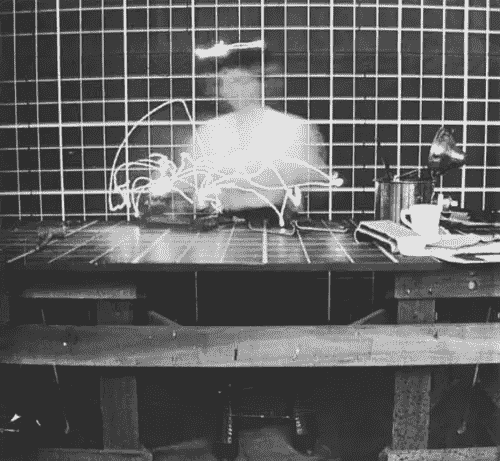](https://www.sitepoint.com/wp-content/uploads/2011/09/01-gilbreth.jpg)

[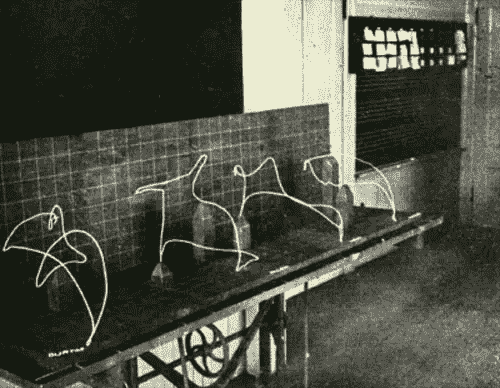](https://www.sitepoint.com/wp-content/uploads/2011/09/02-gilbreth.jpg)

## 20 世纪 30 年代

20 世纪 30 年代，艺术家们开始探索在曼·雷身上进行光线涂鸦的可能性。虽然他的光涂鸦作品并不广为人知，但曼·雷是第一个使用光涂鸦的艺术家，他的作品今天仍然在许多方面定义了这种风格。

[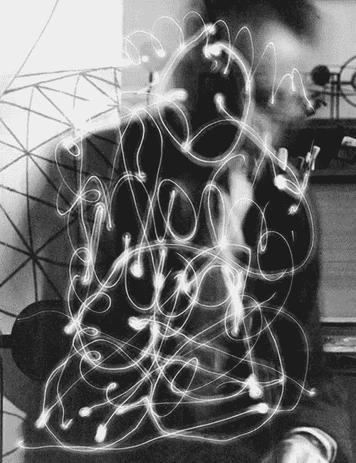](http://sobrelasmanos.javierseguidelariva.com/__oneclick_uploads/2011/05/man-ray_space-writing_1.jpg)

[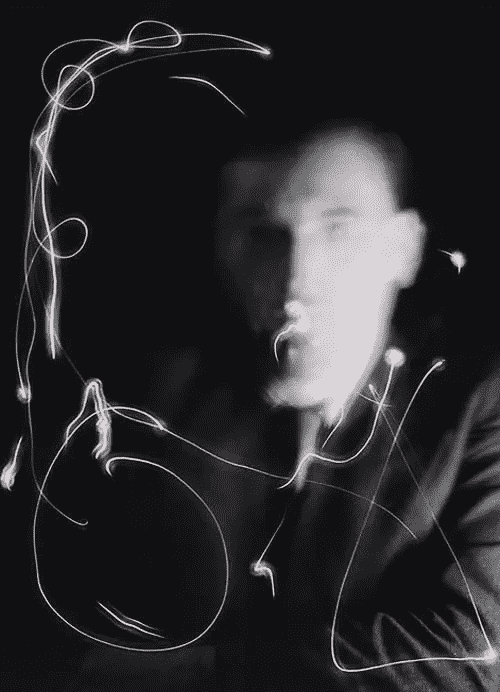](https://www.sitepoint.com/wp-content/uploads/2011/09/04-ray.jpg)

## 二十世纪四十年代

灯光涂鸦真正开始于 20 世纪 40 年代，是阿尔巴尼亚人焦恩·迈利，他于 1923 年来到美国。20 世纪 30 年代，Gjon 发明了闪光摄影来研究舞者、花样滑冰运动员和音乐家。后来，在 20 世纪 40 年代，他开始专门探索光线涂鸦，并继续为《时代》杂志捕捉一些与毕加索等人最难忘的时刻。

[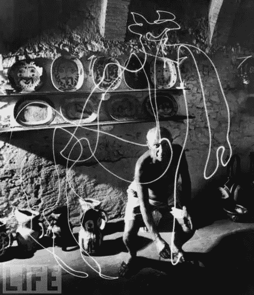](https://www.sitepoint.com/wp-content/uploads/2011/09/05-mili.jpg)

[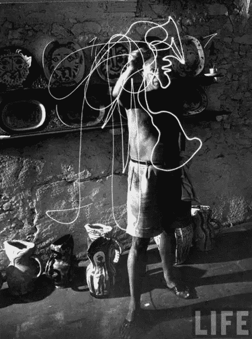](https://www.sitepoint.com/wp-content/uploads/2011/09/06-mili.jpg)

## 1950 年代至今

从 20 世纪 40 年代开始，随着许多艺术家开始研究这种形式，光涂鸦成为了一种自己的风格。随着世纪的发展，成千上万的艺术家开始将这种形式发展成今天的样子。现在，你可以找到每年数百场比赛，任何人都可以提交他们的光涂鸦作品，许多光画艺术家被雇佣来为商业设计创造灯光效果。

从上个世纪到今天，一些比较著名的艺术家包括:

杰克·德拉诺(50 年代):

[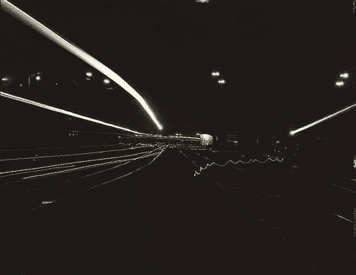](http://lightpaintingphotography.com/wp-content/uploads/2010/12/Jack_delano_Santa-Fe-RR-yard.jpg)

安德烈亚斯·费宁格(' 50 年代):

[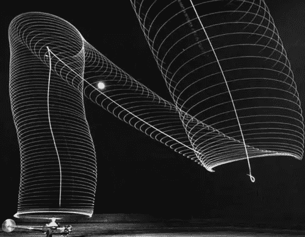](http://lightpaintingphotography.com/wp-content/uploads/2010/12/sikorsky3.jpg)

埃里克·斯塔勒(70 年代):

[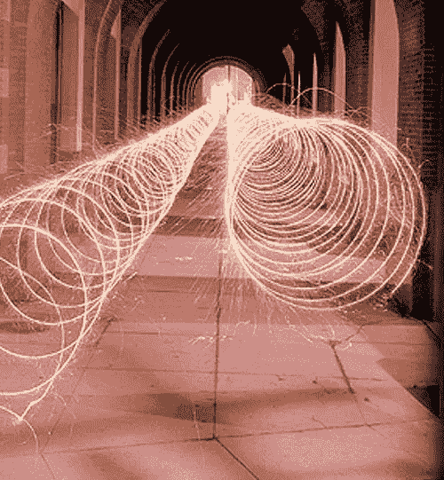](http://jasonmelcher.com/LIGHT_GRAFFITI_WEBSITE/Eric%20Staller.jpg)

[雅克·普金](http://lightpaintingphotography.com/wp-content/uploads/2010/12/graffiti_greffes25.jpg)(’80s):

[Jozef Sedlák](http://www.sedlakjozef.com/img/3.jpg)  (’80s):

[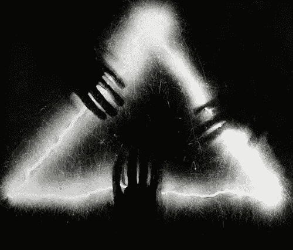](http://www.sedlakjozef.com/img/3.jpg)

维基·达希尔瓦(80 年代):

[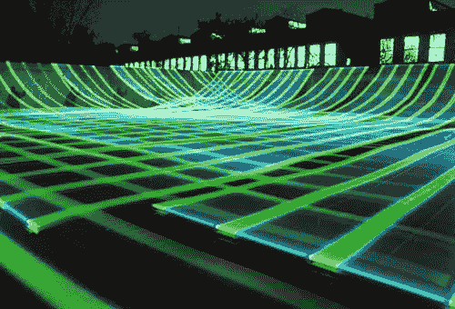](http://cdn.jimonlight.com/wp-content/uploads/2009/04/dasilva2.jpg)

[【佐藤志郎】](http://www.dandeli.cn/UploadPic/20098221446436968.jpg)(‘80s】:

[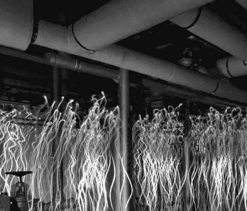](http://www.dandeli.cn/UploadPic/20098221446436968.jpg)

奥罗拉·克劳利(90 年代):

[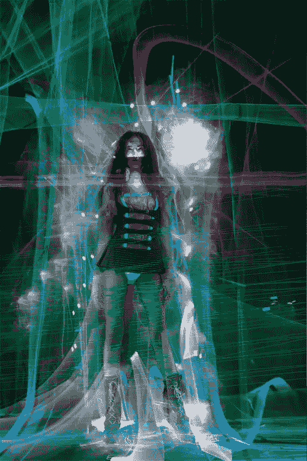](http://lightpaintingphotography.com/wp-content/uploads/2010/12/Aurora-Crowley-Light-Painting.jpg)

[光因子](http://www.lichtfaktor.eu/)(21 世纪):

[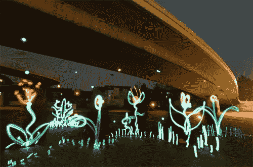](http://www.lichtfaktor.eu/blog/?page_id=3)

迈克尔·博桑科(21 世纪):

[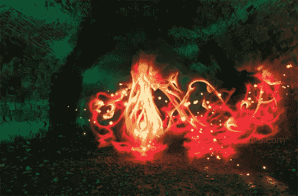](http://www.michaelbosanko.com/portfolio50325.html)

艾伦·杰拉斯(21 世纪):

[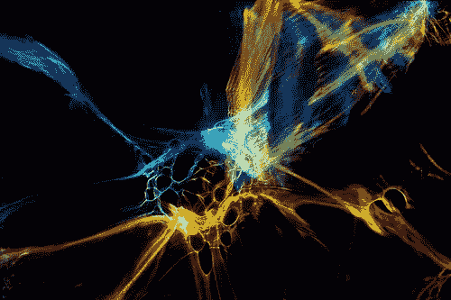](http://www.flickr.com/photos/alanjaras/6014842348/in/photostream)

[核磁共振光绘](http://www.mrilightpainting.com/)(21 世纪):

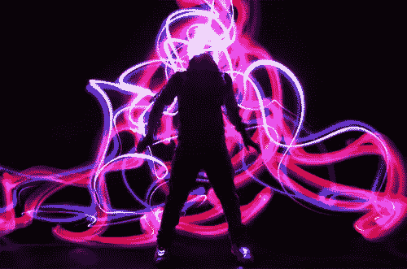

帕特里克·罗雄的本田电波(21 世纪):

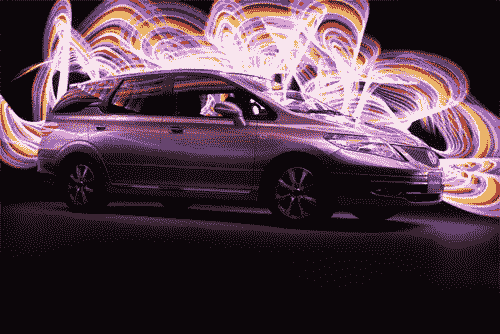

烧伤蓝摄影公司的托比·凯勒:

[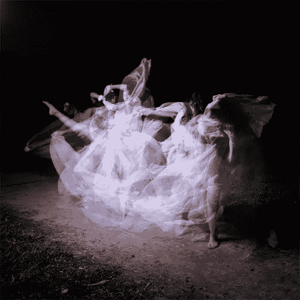](http://www.burnblue.com/blog/article/dance_and_light/)

## 分享这篇文章