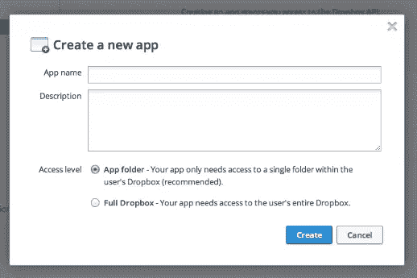
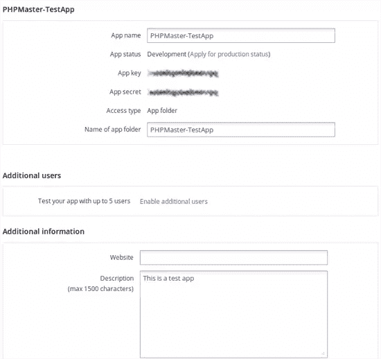
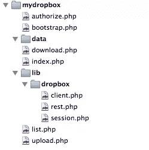

# 使用 PHP 访问 Dropbox

> 原文：<https://www.sitepoint.com/access-dropbox-using-php/>

在本文中，我们将通过构建一个简单的客户端来访问 Dropbox 帐户中的文件，从而探索 Dropbox PHP API。客户端将执行一些基本操作，如身份验证、列出文件以及上传和下载文件。

为了使文章简短易读，我将尽量减少包含的代码，而是让您参考 GitHub 上的完整代码。要运行代码，你需要支持 cURL 的 PHP 和一个 [Dropbox 账户](http://db.tt/9EMMLfjo "Join Dropbox")。

你应该从 [Dropbox 开发者中心](https://www.dropbox.com/developers "Developers - Dropbox")开始，在那里你可以找到 API 参考以及它的基本概念和最佳实践。你也可以下载官方的 SDK，但是 PHP 不在支持的语言之列。Github 上有一个[第三方 PHP SDK](https://github.com/BenTheDesigner/Dropbox "BenTheDesigner/Dropbox") 的链接。

我们的客户端将更像官方的 Python 客户端，但是我从上面的 PHP SDK 中获取了一些想法和代码，特别是 OAuth 部分。我们将有一个`DropboxSession`对象和一个`DropboxClient`对象。第一部分将解决最困难的部分:从 Dropbox 获取和管理访问凭证。然后，客户机对象将使用会话对象来执行 API 调用并获取数据。在会话对象下面有一个`DropboxRESTClient`对象，使用 cURL 执行 HTTP 调用。

## 向 Dropbox 介绍你的应用

首先，我们需要向 Dropbox 注册我们的应用程序，以便获得一个惟一的 API 密钥对。我们需要这些密钥来“介绍”我们的应用程序并请求授权。

登录开发者中心，点击“MyApps”链接，然后选择“创建应用”。Dropbox 会要求您输入应用程序的名称、描述和访问类型。



访问类型参数指定应用程序能够读写文件的位置。推荐值是“App folder”，这是一个沙盒目录，将在用户家中创建。通过选择“完整的 Dropbox ”,应用程序将看到用户的整个 Dropbox。

创建应用程序后，将会出现一个选项页面，您可以在其中编辑其详细信息并查找其访问凭据。



新创建的应用程序处于“开发状态”。这使我们可以立即开始开发，并允许多达五个其他用户来测试它。当应用程序准备好发布时，我们可以申请生产状态，Dropbox 团队将审查它，以确保它符合他们的条款和条件以及品牌指南。

## 编写应用程序代码

我将代码放在本地 Apache 设置的子目录中，这样就可以通过 URL `http://localhost/mydropbox`访问它。目录结构是:



`bootstrap.php`文件执行应用程序的启动，并将包含在每个前端文件中，所以让我们从讨论这个开始。

我将一个全局`$config`变量初始化为一个空数组，然后指定一些配置值。前三个是与 Dropbox 相关的:应用程序详细信息页面中的访问密钥、密钥和访问类型。然后我定义一些其他有用的设置:应用程序的根路径、保存一些数据的路径以及包含应用程序访问令牌的 PHP 文件的路径。

此访问令牌文件文件开头不存在；它由`authorize.php`页面创建，并由 Dropbox 提供的凭证填充。这将是一个标准的 PHP 文件，如果存在的话，将包含在这个脚本中。令牌文件的内容将类似于:

```
<?php
$access_token = array (
  "oauth_token_secret" => "abcdefghilmnopqr",
  "oauth_token" => "stuvwxyzabcdefgh",
  "uid" => "1234567"
);
```

`oauth_token`和`oauth_token_secret`是访问凭证，`uid`是用户的唯一标识。

在引导文件的下一部分，我设置了 PHP 错误行为并执行了一些需求检查；为了运行应用程序，数据目录必须存在且可写，如果存在的话，`auth.php`文件也必须可写。这确保了应用程序可以自由地工作。

最后，我包含我们的库，初始化 PHP 会话，设置一个空的`$access_token`(稍后将被填充)，如果它存在，包含`auth.php`文件。

每个前端脚本将在一个主`try` / `catch`块中运行。在深入研究库代码之前，我们首先需要理解流程，所以我将从授权周期开始。

### 批准

第一次运行我们的应用程序时，`index.php`文件中的以下条件将为真:

```
<?php
if (!isset($access_token)) {
    header("Location: authorize.php");
    exit;
}
```

访问令牌为空，所以我将用户重定向到管理授权过程的`authorize.php`页面。

在引导阶段之后，我对现有令牌进行了另一次检查。这确保了只有在我们没有令牌的情况下才运行这个脚本。为了避免无限重定向循环，如果返回的错误代码是 401(无效令牌)，脚本的主`catch`块将删除`auth.php`文件。

我在每个脚本中做的第一件事是用我们的 API 键创建一个新的`DropboxSession`对象。当我们直接调用脚本时，第一个条件将为假，并且执行`else`块。会话对象连接到 Dropbox 并请求一个临时令牌。然后，令牌被解析成一个数组，并存储到下一阶段的`$_SESSION`变量中。

我们使用这个令牌构建授权 URL。用户应该被重定向或提示访问网址，他将决定是否允许或拒绝访问他的数据。

授权 URL 可以包含返回 URL 作为可选参数。我只传递当前脚本的 URL，所以如果用户授权应用程序，他将被重定向回我们的脚本，这次是通过查询字符串传递的`oauth_token`和`uid`值。第一个条件现在评估为真，所以我们可以继续请求永久访问令牌。

这个请求的`$token`数组是用这个新的`oauth_token`和先前的`oauth_token_secret`构建的，然后传递给`obtainAccessToken()`方法。如果成功，我们将拥有永久(直到被撤销)的访问令牌。这一定是存放在某个地方；显而易见的选择是数据库，但是对于这个例子，我们将使用本机的`var_export()`函数将其导出为有效的 PHP 代码，并将其写入我们的`auth.php`文件。然后用户被重定向到索引页面，这是最简单的脚本。

在我们的`try` / `catch`块的开始，创建了一个新的`DropboxSession`对象，这次使用永久的`$access_token`作为第四个参数。这个对象用来创建`DropboxClient`对象。这两个步骤对于所有其他脚本都是通用的。

客户端的公共方法被映射到相应的 Dropbox API 调用。我正在调用`accountInfo()`方法，该方法返回一个包含用户详细信息的数组:唯一 id、姓名、电子邮件、配额信息和推荐链接(更多详细信息请参考官方文档)。

## 幕后:REST 和 Session 对象

现在我们对表面流有了一个概述，让我们看看幕后发生了什么，我们的 Dropbox 库包含在`lib/dropbox`目录中，由三个类组成。

### 其余对象

我们库的最底层类是 REST 客户端(见`lib/dropbox/rest.php`)。这个类是一个简单的 cURL 包装器。它执行 HTTP 调用并以原始或编码格式返回输出，或者在出错时抛出异常。

构造函数检查系统上是否安装了 cURL，或者抛出一个异常。然后，它试图用`$curlDefaults`设置初始化内部`$curl`处理程序。处理程序在析构函数中未设置。

`error()`、`errno()`和`close()`方法是不言自明的。然后，我们有一系列的实用方法，`get()`、`post()`和`put()`，这些都是主`request()`方法的简单包装器，它完成真正的工作。

首先，我们设置要获取的 URL，然后是 HTTP 方法和所需的参数、附加的头和 POST 字段(如果有的话)。GET 和 PUT 方法的参数由调用者方法沿着 URL 传递。

在进行调用之前，我们需要告诉 cURL 检索完整的内容，包括 HTTP 头(set option `CURLOPT_HEADER`),因为一些 API 方法(例如`file_get()`)将它们的信息放在头中。

执行 cURL 请求时，`curl_exec()`将结果存储到`$response`中，变量`$info`由`curl_info()`填充上一次执行的细节。如果方法是 PUT，我们还必须关闭输入文件句柄。

使用`$response`内容和`$info`值，我们解析结果并将 HTTP 头从主体中分离出来。默认情况下，除非`$raw`参数设置为真，否则主体以 JSON 解码的形式返回。

在继续之前，有一个错误检查。Dropbox API 使用 HTTP 错误代码进行错误通知。如果状态代码大于 400，则表示出现了问题，并且在正文内容中存储了一条错误消息。我提取这条消息并抛出一个异常。如果没有错误，解析 HTTP 头，结果作为包含状态代码、头和主体的数组返回。

### 会话对象

`DropboxSession`对象扩展了基本的 REST 客户端来满足我们的需求:

*   执行初始认证/授权流程，
*   包括在每个后续的 REST 请求中。

构造函数只是初始化内部变量。另一个简单的方法是`buildAuthorizeURL()`，它从临时令牌构建授权 URL。该类最重要的方法是:

*   `obtainRequestToken()`–请求临时 OAuth 访问令牌。
*   `obtainAccessToken()`–为应用程序请求永久 OAuth 访问令牌。
*   `fetch()`–执行 REST 调用，包括所有必要的认证和签名参数。

这三种方法有相似的流程。首先，他们构建基本的目的地 URL，并用需要发送的`oauth_*`键/值填充`$params`关联数组。每个 API 调用必须提供一个时间戳和一个唯一的随机生成的散列值，即`$nonce`参数。

然后使用 HTTP 方法名、URL 和参数生成签名。然后使用`oauth_signature`键将其排队到`$params`数组。使用给定的 HTTP 方法获取 URL，并返回响应的主体部分。对于 GET 和 PUT 方法，使用本机的`http_build_query()`函数生成查询字符串并附加到 URL。

`obtainRequestToken()`和`obtainAccessToken()`几乎相同:第一个不使用令牌，而是用 GET HTTP 方法调用。第二个是用 POST HTTP 方法调用的，并且必须包含用前一个调用获得的令牌。然后，这个令牌被用作以下所有 API 调用的签名密钥的一部分。

`fetch()`方法执行一些额外的任务。首先，它接受一个名为`$args`的数组，该数组带有特定 API 所需的任何附加参数，例如要列出的资源路径或要上传/下载的文件。在签名生成之前，这些参数与`$params`数组合并。唯一的例外是输入文件参数，put 方法使用它来上传文件，该文件将被提取并保存以备后用。一个`switch`语句用于告诉调用正确的 HTTP 方法。

`DropboxSession`类还有两个实用方法，`encodeParams()`和`getSignature()`，由上面的主方法调用。`encodeParams()`准备要签名的请求参数，而`getSignature()`为给定的 API 调用生成 OAuth 请求签名。

## 最终的 DropboxClient 对象

`DropboxClient`对象是我们与 Dropbox 的高级接口。它公开了公共 API 方法，使用中间层的`DropboxSession`对象来执行 API 调用，并将处理后的输出返回给调用脚本。对于本文，我实现了一套有限的方法:

*   `accountInfo()`–获取当前 Dropbox 用户的详细信息。
*   `metadata()`–获取关于 Dropbox 对象(文件或文件夹)的信息，并检索文件夹对象的内容列表。
*   `getFile()`–下载文件及其元数据，并可选择将其保存到磁盘。
*   `putFile()`–将本地文件上传到远程收存箱路径。

会话对象和基本 API URLs 存储为内部变量，并由构造函数初始化。

所有的方法或多或少都遵循相同的方法，所以我将指出它们的区别。所有处理路径的方法都必须在每次调用前添加 Dropbox 根路径。根路径取决于应用程序的访问类型，如果应用程序具有完全访问权限，则可以是“dropbox ”,如果应用程序具有有限访问权限，则可以是“sandbox”。如果该值与应用程序的远程设置不匹配，将返回一个错误。

每种方法执行的常见步骤是:

1.  检查并准备参数列表。
2.  执行 HTTP 调用。
3.  解析并返回响应。

`accountInfo()`方法最简单；它不带参数地调用它的 URL，并返回带有响应的关联数组。

`list.php`文件使用`metadata()`方法获取并显示目录的内容。唯一需要的参数是要检查的文件或目录的路径，但是它允许我们指定相应 API 调用的所有其他参数。如果`$path`参数是一个文件，那么返回的数组包含它的元数据。如果是一个文件夹，`content`键包含它的文件列表，除非`$list`参数为假。我们可以使用`$fileLimit`参数来限制内容的大小(最大值为 25，000)，并且我们可以请求文件或文件夹的特定修订(参见 API 参考以了解详细信息)。

需要注意的是，Dropbox API 会为每个调用返回一个哈希值。如果我们想列出一个文件夹的内容，并为我们的方法提供一个`$hash`参数，API 会检查自上次调用以来输出是否发生了变化。如果没有，它返回状态代码 301(未修改)。Dropbox 团队建议缓存结果，并依靠这些文件夹列表值来优化性能。

`getFile()`方法用于检索存储在用户的 Dropbox 中的文件。如果成功，调用将返回整个文件内容，其元数据作为 JSON 字符串存储在自定义 HTTP 头`x-dropbox-metadata`中。这个方法的返回值是一个包含名称、mime 类型、元数据和内容的关联数组。此外，我还添加了一个`$outFile`参数，将文件直接保存在磁盘上。

`download.php`文件展示了这种方法的运行演示。在这个例子中，下载的文件被直接保存到应用程序的数据目录中，响应的内容部分被清空。

`putFile()`方法使用 PUT HTTP 方法将文件从我们的本地存储上传到用户的 Dropbox，这是 Dropbox 团队的首选方法，而不是 POST。该方法在任何其他常见操作之前检查本地文件是否存在并且没有超过 150MB API 限制。

除了源文件路径之外，此方法支持的参数还有目标文件夹、可选的替代名称和覆盖选项。如果最后一个选项为假，并且远程文件存在，则上传的文件将使用一个递增的数字进行重命名(例如，`test.txt`变为`test (1).txt`)。API 还允许一个可选的`parent_rev`参数来管理修订，但是为了简单起见，我决定省略它。

## 摘要

这只是 Dropbox API 的一小部分，但作为开发自己的应用程序的起点，这已经足够了。对我来说，这也是和 OAuth 一起打球的好机会。请随意细化和扩展本文附带的代码，以满足您的需求，并一如既往地祝您编码愉快！

图片 via[Fotolia](http://us.fotolia.com/?utm_source=sitepoint&utm_medium=website_link&utm=campaign=sitepoint "Royalty Free Stock Photos at Fotolia.com")

## 分享这篇文章