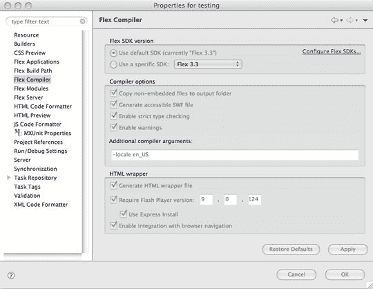

# 在 Flex 应用程序中启用辅助功能

> 原文：<https://www.sitepoint.com/accessibility-in-flex-apps/>

作为有责任心的开发人员，我们努力确保我们的应用程序是精简的、自我解释的和易于使用的。我们努力工作，以确保它们看起来很好，并很好地适应给定的工作流程，但经常忘记，不是每个人都以相同的方式体验我们的工作。

从阅读障碍和色盲到完全视觉障碍和行动问题，一定比例的人会面临障碍，这些障碍会使应用程序的使用变得困难甚至不可能。幸运的是，作为 Flex 开发人员，我们在选择的平台中为各种可访问性解决方案提供了强大的支持，并可以通过多种方式定制我们的应用程序，以确保它们适用于所有用户。

在文章的最后，你会发现一个由 Adobe 赞助的测验。[测试你自己](https://www.sitepoint.com/quiz/flex3/accessibility-in-flex-apps/)，看看你做得有多好。

## 什么是可访问性？

可访问性是一个对象可以被任何人使用的能力，不管一个人是否有能力。为了使应用程序具有可访问性，web 开发人员采用了一些技术和设计概念，使有任何障碍的用户都能够浏览网页和使用软件。它可能涉及改变组件结构，添加文本以允许与屏幕阅读器更好地交互，选择一个考虑到对比度和色盲的颜色集，或者支持对屏幕上所有内容的全键盘访问。核心思想是，您的网站或应用程序适用于部分或完全失明的人，或难以区分颜色的人，或行动受限的人，因此使用鼠标或手势很困难。

当想到残疾时，许多人会想到轮椅，但从软件的角度来看，这不一定是障碍；大多数坐在轮椅上的人可以毫无困难地操作电脑软件。

**note:** The D Word

我们在这里使用有时有争议的术语“残疾”只是作为一个总括来描述各种身体和精神状态、视觉或听觉损伤或其他状况。这绝不是试图将有任何缺陷的人描述为残疾人；相反，它只是一个所有人都理解的参考术语。

最有可能影响你的用户的障碍分为四大类，并向开发者提出了他们自己的挑战(这个列表不全面，不科学，也不权威；只是给你一个起点):

Visual Impairment

视觉障碍包括隧道视觉、色盲，当然还有法定失明。当谈到可访问性问题时，视障用户通常受影响最大，因为在计算机上完成的所有事情在某种程度上都是可视化的。这些用户严重依赖键盘进行输入和控制，并倾向于避免使用鼠标。屏幕放大镜或屏幕阅读器提供了很多帮助，音频事件和提示也是如此。有些人使用盲文显示器，用指尖“阅读”屏幕上的文字。

Dyslexia

阅读障碍用户在阅读网页或处理大量文本控件时可能会有很大的困难。在某些情况下，这也可能导致数据输入困难，例如使用搜索功能。逻辑页面或屏幕结构之类的策略会有所帮助，开发人员采用尽可能使应用程序不言自明的设计理念也会有所帮助。诵读困难的用户也可以使用屏幕阅读器来帮助理解。

Motor Disabilities

运动障碍包括手或手臂颤抖、失去四肢或身体部分缺乏控制和运动。在这些情况下，需要考虑输入设备，记住用户可能完全不能操作鼠标。即使用户不能打字，其他辅助技术也可以帮助他们。全键盘导航和控制对这些用户来说是必不可少的。

Cognitive Disabilities

这个群体可能是影响最广的。残疾可能包括记忆回忆、理解和解释等功能障碍。在某些情况下，这可能是暂时的情况；在其他情况下，它们是永久性的——没有简单的解决方案来满足所有人的需求。这一组人最好使用其他三组人使用的技术组合，与整体设计哲学相联系，意识到网上越来越多的人不是极客或程序员，因此以不同于我们预期的方式对待软件。

Other Requirements

对于一些用户来说，解决方案可能很简单，只要确保您的应用程序提供字体缩放即可。即使用户不认为自己有视觉障碍，他们也可能是轻度近视或花太多时间看屏幕，因此能够放大屏幕字体可以让生活变得轻松很多。我是一名全职软件开发人员和作家，但我有视力问题，这让我一直很感激能够在应用程序中增加字体大小；从技术上来说，我自己可能属于视觉障碍类别。

### 何苦呢？

努力构建可访问的软件有很多原因，我们将在这里讨论:

Economics

无论您是经营一家通过出售许可证赚钱的软件公司，还是领导一个项目，将新的应用程序或工作流程引入一个组织，您都会从更多的人使用该软件中受益。关于残疾计算机用户的统计数据很难获得，但澳大利亚盲人公民组织列出了 2004-2005 年的统计数据，显示超过 480，000 名视力受损者和超过 50，000 名全盲者。Fred Hollows 基金会的一项研究提到，世界卫生组织估计，到 2020 年，全世界将有超过 7500 万人失明或视力受损。

这有很多潜在用户，而这只是我们易访问性目标受众的一部分。残疾人世界社区网站估计，大约有 10%的世界人口，也就是大约 6 . 5 亿人，患有某种残疾。

Legislation

在许多国家，都有反歧视立法，要求网站和应用程序至少具备某种程度的可访问性。甚至更严格的规则可能适用于政府和教育部门。这些法案的执行程度差异很大，但如果你不能满足要求，总有可能损失收入，或者被罚款并被迫重新开发。一定要查看你工作的国家和商业领域的法律。当软件是获得任何政府或教育服务或支持的必要条件时，这一点尤其重要。

Technical

每个人都知道 Google 和其他网络蜘蛛是推广和销售软件和网站的重要工具，但是你可能没有意识到标准的可访问性实践也可以帮助蜘蛛索引你的页面。如果你想一想，一个蜘蛛搜索引擎本质上是一个盲目的用户，只阅读你的站点中的文本和代码。如果你正在建立一个深度链接结构或者文本替换，这是很重要的，并且随着更多的引擎开始寻找蜘蛛抓取 SWF 文件本身，这些技术变得更加相关。

Doing the right thing

利他主义并不总是可以衡量的，但是你可以确信，努力让你的软件变得易于使用会让很多人感到快乐；即使是那些可访问性不是关键问题的人也会记住你的努力。如果纯粹的利他主义还不够，请记住，快乐和印象深刻的客户指的是其他人！

Flex 为我们提供了许多关于可访问性的技术解决方案。让我们探索一些技巧和技术，您可以采用它们来使您的应用程序迎合尽可能多的用户。

## 在 Flex 应用程序中实现可访问性

默认情况下，Flex 3 应用程序是不可访问的，所以您需要自己启用可访问性(不过，请注意 Flex 4 beta，因为它现在看起来默认情况下包含了可访问性)。这样做会给 SWF 文件增加大约 8KB 的空间，有四种方法可以做到这一点。

要为所有 Flex 应用程序自动启用辅助功能，只需通过将 accessible 标记设置为`true`来修改您的`flex-config.xml`文件，如下所示:

```
<mxml-compiler>
  …  <accessible>true</accessible>  …</mxml-compiler>
```

您可以在 Flex Builder 中基于“每个项目”启用辅助功能，方法是在项目属性对话框的编译器选项部分选择生成辅助 SWF 文件选项，如图[图 1，“生成辅助 SWF 文件”](#fig_projprops "Figure 1. Generate accessible SWF file")所示。

**图一。生成可访问的 SWF 文件**



要在使用命令行编译器时启用可访问性，您可以在编译期间添加一个配置变量`-compiler.accessible`或只添加`-accessible`，如下所示:

```
mxmlc -compiler.accessible /myapp/app.mxml
```

或者

```
mcml -accessible /myapp/app.mxml
```

这两种方法都会改变项目目录中的`.actionScriptProperties`文件，以添加一个编译器参数，如下所示:

```
<compiler additionalCompilerArguments=”-locale en_US”     generateAccessible=”true”>
```

如果您的应用程序是在运行时编译的，并且默认情况下没有设置可访问性，您可以通过将查询参数附加到 URL 来动态启用它，如下所示:

```
http://www.example.com/myapp/app.mxml?accessible=true
```

## Flex 中的可访问组件

Flex 3 SDK 中包含 28 个可访问的组件。有关它们的完整列表以及它们提供的辅助功能增强，请查看 Adobe *辅助组件和容器列表*文档。如果你想让你的 RIA 具有可访问性，你需要尽可能地构建完全可访问的组件。如果您正在构建新的组件，您将需要添加可访问性支持，或者至少从 SDK 中创建一个可访问组件的子类。该摘录摘自 Adobe 辅助功能最佳实践文档:

> 要使组件可访问，它必须根据 Microsoft 主动可访问性(MSAA)规范公开角色和状态信息。计划开发自己的组件的开发人员应该从一开始就计划研究和实现 MSAA，以帮助确保 Flex 组件与操作系统级别的其他控件具有一致的行为。一旦将 MSAA 支持添加到控件中，验证该组件是否能与辅助技术(如 JAWS 屏幕阅读器)一起工作是非常重要的。屏幕阅读器很少实现整个 MSAA 规范，尤其是在浏览器内部，因为 web 应用程序通常只依赖 HTML 规范中包含的 12 个基本控件。如果自定义组件偏离了默认 Flex 组件集中使用的方法，或者引入了新的控件类型，则可能需要与屏幕阅读器供应商进行一定程度的协调。

### 屏幕阅读器

屏幕阅读器是视障用户用来帮助他们浏览网站和应用程序的应用程序。这些应用程序使用合成语音读出文本和导航项目。为了真正理解这种体验，你需要安装一个阅读器，例如 [JAWS](http://www.freedomscientific.com/products/fs/jaws-product-page.asp) ，并尝试在关闭显示器的情况下浏览你的应用程序。如果你以前从未这样做过，我强烈推荐它，因为它对一些用户面临的困难有着惊人的洞察力。

JAWS 是屏幕阅读器中的标准，所以它是一个很好的测试标准。不过这是 Windows 专用软件，所以如果你在 Mac 或 Linux 机器上，你需要一些虚拟化或双引导设置。当提到屏幕阅读器时，我们将在本文的其余部分提到 JAWS。

为屏幕阅读器编码时，两个最重要的方面是可选的文本内容和阅读顺序。顾名思义，阅读顺序决定了 JAWS 朗读屏幕内容的顺序。对于一个非常简单的应用程序来说，这可能不是问题，但是对于任何一种复杂的或者非标准的布局来说，默认的阅读顺序可能会让 JAWS 用户感到非常困惑。这影响了从导航到数据输入的一切；例如，如果您的读取顺序不正确，用户可能会被 JAWS 读取错误的表单字段标签，并试图在他们当前关注的字段中输入错误的数据。因此，您应该始终通过 JAWS 运行您的应用程序，以了解它是如何读取的。

最重要的一点是保持你的界面简单整洁，使用可访问的组件，如折叠和标签导航器。之后，您需要为界面中的每个对象分配一个 tabIndex 值，包括文本字段和不可聚焦的界面控件。

**important:** Careful with tabIndex

如果您错过了 *甚至一个* 标签索引，整个批次将被忽略，Flex 将恢复其默认读取顺序！

#### 添加说明

您还可以选择在屏幕阅读器可以向用户大声朗读的各个位置添加说明。通过在应用程序的 description 属性或所有容器的属性中输入文本来包含描述会很有帮助。请记住，每次用户刷新或移动到应用程序顶部时，都会阅读这些说明，所以如果它们太长，就会变得很麻烦。从 [Adobe 最佳实践文档](http://www.adobe.com/accessibility/products/flex/best_practices.html)中，这里有一个包含在博客阅读器演示应用程序中的示例:

```
function accessibleInit() {  var desc = createObject("TextInput","desc",0);  desc.x = 0;  desc.y = 0;  desc.width = 0;  desc.height = 0;  desc.accessibilityProperties = new AccessibilityProperties();  desc.accessibilityProperties.description= 'Access instructions.     The Flex Blog Reader reads entries from different Blogs on the Web.     To interact with this application, turn forms mode on after entering     the application.';} 
```

然后从应用程序标签中调用该函数:

```
<mx:Application xmlns:mx="http://www.adobe.com/2006/mxml"     creationComplete="*accessibleInit();*”     pageTitle="Flex BlogReader">…
```

您可能需要为说明添加一个完全独立的屏幕，提供一个按钮或链接来查看它们。让这个按钮或链接成为屏幕阅读器阅读的第一个细节是一个好主意，这样用户就知道他们可以很容易地获得帮助。

#### 工具提示和文本等价物

所有的控件都应该有包含其名称的工具提示，如果需要的话，还应该有如何使用它们的简短说明。记住工具提示是由屏幕阅读器读出的，所以如果有用户需要知道的关于控件的信息，把它放在工具提示里。任何图像的标题和描述也应该在工具提示中可用。确保如果你在应用程序中使用图标按钮，它们有描述其功能的工具提示(这在任何情况下都是好的实践)。如果您想给图像添加额外的信息，您可以将文本存放在`accessibilityProperties`属性中。这是 Adobe 文档中的另一个示例:

```
<mx:Image width="60" height="56"   source="assets/icecreampint.jpg"    toolTip="Ice Cream Pint"  creationComplete="event.target.accessibilityProperties =      new AccessibilityProperties();      event.target.accessibilityProperties.description = 'Our fine           Ice Cream Pint provides the perfect serving dish for your          homemade ice cream treats'"/>
```

当包含视频和音频内容时，以字幕的形式同步文本是很有帮助的。你可以自己设置，但是有一些很棒的工具，比如 his 软件的 Hi-Caption Studio 和国家无障碍媒体中心的 MAGpie。这些工具创建了一个特殊的 XML 文件，其中包含专门为 Flash 设置的字幕数据，并且可以与[字幕](http://www.buraks.com/captionate/)结合使用，以提供与视频中的提示点相关的字幕。显然，您需要在视频播放器中添加一个显示元素，在必要的地方显示字幕。

### 字体和颜色

字体缩放应该总是包含在可访问的应用程序中。让用户能够通过从选择框中选择比例或使用键盘快捷键来增加字体。尽量避免使用任何特别奇怪的字体，任何使用的非默认字体都应该嵌入。

记住颜色，因为那些色盲的人很难察觉你认为理所当然的视觉线索。永远不要把颜色作为提供信息的唯一手段。例如，图表中的条形应该有替换文本，或者有一个轮廓或边框会有所帮助。彩色按钮需要有工具提示；请记住，色盲用户可能无法区分绿色和红色按钮。添加说明时，请确保包含控件的替代说明；比如“点击右侧的红色按钮*”在链接的情况下，包含下划线以及使链接具有不同的颜色是很有用的，这样，如果用户看不出颜色差异，他们仍然能够识别链接。*

 *对比度对于可读性也很重要。由于鼠标悬停事件而引起的焦点突出、背景和元素变化需要提供足够强的对比度，以便视力障碍者能够识别。例如，如果您在背景或容器中使用极其细微的阴影变化来帮助描绘文本或表单片段，许多用户可能看不到它。*  *### 键盘访问

许多用户不使用或不能使用鼠标，因此确保您的应用程序可以通过键盘控制是很重要的。Flex 中的可访问组件已经有助于键盘访问，您可以在自己的组件中启用相同的功能，而无需太多工作。这样做的关键是通过键盘使鼠标事件可用。一个简单的方法是在控件上添加一个新的侦听器，并让它调用鼠标单击的相同功能。请记住，键盘用户会在屏幕上的控件间切换，所以要确保(例如)在控件上按 enter 键会达到和用鼠标点击一样的效果。

第二个考虑是，即使用户可以使用键盘，对他们来说仍然很困难。在这种情况下，键盘快捷键会有所帮助；例如，映射一个键来加载用户关注的任何屏幕或部分的帮助，以及添加映射到键的导航控件。如果你愿意，你可以为键盘快捷键创建一个全局键盘监听器，让它拦截某些键或组合键并独立操作它们。*  *## 思维可达性

开发可访问的应用程序有许多技术挑战，但我能给出的最好建议是调整你的设计理念，从一开始就考虑可访问性。从一开始就开发易访问性比试图在开发结束时把它硬塞进应用程序要容易得多。

在开发时，争取像最小容器嵌套这样的最佳实践；这将使屏幕阅读器调整更容易。从受损用户的角度考虑使用你的应用程序；这不仅有助于支持可访问性，而且最终使你的软件对每个人都更有用。以黑白模式测试您的应用程序，然后在关闭显示器的情况下运行 JAWS，看看它的性能如何。

另一个常见且有用的方法是为您的页面或应用程序提供文本替代。这并不总是一个合适的解决方案，尤其是对于企业软件，但是对于较小的应用程序或用户查找文本的区域，深度链接甚至是 Flex 版本的全文替代方案会非常有用。有各种方法可以尝试检测屏幕阅读器的使用，但目前它们可能有点不可靠。查看 Steve Faulkner 关于这个主题的博客文章。

当然，并不是所有的软件都可以访问；如果这是一个高度视觉化的游戏，比如第一人称射击游戏或 CAD 应用程序，某些类型的残疾会将用户排除在外，但我们在那里无能为力。即使在这些情况下，我们也可以做一些调整，让那些*可以使用软件，但可能会从一点帮助中受益的人的生活变得更容易。最终，考虑到可访问性的开发会使你的应用程序全面变得更好，并极大地扩大你的受众。*

 *除了我们在这里看到的，还有许多网站以这样或那样的形式致力于可访问性，其中一些提供了很好的建议。甚至有在线服务和组织会为你检查一个网站或应用程序，以测试其可访问性；此外，当你的开发符合易访问性法规时，让专家检查你的软件会很有帮助。如果你要付钱给一家公司让你的软件可以访问，确保他们知道他们在做什么，并为各种屏幕阅读器提供选项，以及上面提到的所有方面。以下是您可能会觉得有用的网站的简要列表:

*   [W3C 网络无障碍倡议](https://www.w3.org/WAI/)

*   【1992 年澳大利亚残疾歧视法

*   [视觉澳大利亚适应性技术指南](http://www.visionaustralia.org.au/info.aspx?page=1230)

*   [澳大利亚人权委员会 WWW 无障碍](http://www.hreoc.gov.au/disability_rights/webaccess/index.htm)

您还可以在此阅读有关 Flex 辅助功能的更多信息:

*   Adobe Flex 3 livedocs

*   [Adobe Flex 辅助功能最佳实践](http://www.adobe.com/accessibility/products/flex/best_practices.html)

你认为你在我们的测验中会有多好？[自测](https://www.sitepoint.com/quiz/flex3/accessibility-in-flex-apps/)一探究竟！* 

## *分享这篇文章**