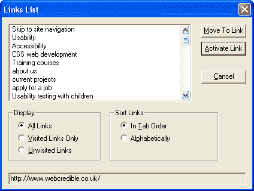
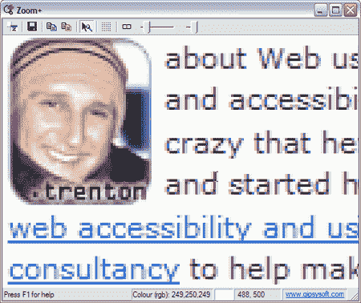

# 超越指南:高级可访问性技术

> 原文：<https://www.sitepoint.com/accessibility-techniques/>

在创建可访问的网站时，大多数 web 开发人员和 web 管理人员都遵循 W3C 的 web 内容可访问性指南，简称 WCAG。的确如此——毕竟，这些指南是当今网络上最全面的可访问性资源。

这些指南的第一版于 1999 年发布。即将发布的第二版有些可疑，引发了关于这个新版本是一个改进还是事实上是一个倒退的讨论。对这个新版本的关注是一个严酷的提醒，指南仅仅是:指南，不应该总是从字面上理解。

为了确保您的网站提供高级的辅助功能，您需要比这些建议更进一步。在本文中，除了指导原则之外，我们将研究一些可以实现高级可访问性的技术。

##### 隐藏文本

隐藏文本对屏幕阅读器用户非常有用。如果这些用户因为没有足够的文本来描述某个部分而无法理解该部分，那么您可以通过创建额外的信息并对视力正常的用户隐藏它来非常简单地解决这个问题。虽然有人坚持认为视觉和非视觉浏览器的文本应该完全相同，但我的经验是，为视障读者提供额外的上下文对他们大有好处。

当然，虽然这些额外的文本对屏幕阅读器用户来说非常有用，但视力正常的用户可能不喜欢。为此，我们隐藏了文本。

有几种隐藏文本的方法，每种方法都有不同的支持级别。下面这个简单的 CSS 规则是我最成功的一个。

```
.hidden {

  position: absolute;

  left: -9000px;

  top: 0;

}
```

该规则将文本置于屏幕之外，对视觉用户隐藏。然后，您可以通过将属性`class="hidden"`分配给任何想要在可视浏览器中隐藏的文本来应用它。轻松点。

如果你想使用`display: none`或`display: hidden`来隐藏额外的文本，要警惕屏幕阅读器完全忽略样式表的神话——它们不会，而且大多数屏幕阅读器不会阅读使用`display: none`或`display: hidden`隐藏的文本。

您可能希望添加隐藏文本，为以下内容提供附加信息:

*   **标题**–每一页的每一个部分都应该有一个标题放在它的前面。这样，屏幕阅读器用户总是知道前面的部分已经结束，新的部分已经开始。例如，在主导航开始之前，插入一个标有“网站导航”的标题。
*   **表单标签**–每个表单项前面必须有一个标签，否则屏幕阅读器用户将不知道表单项是关于什么的。
*   **出生日期字段**–日期、月份和年份字段分开的出生日期字段是省略字段标签的常见原因。要使这些字段更容易访问，请在三个表单字段前放置可见的“出生日期”标签，然后在其他两个字段“出生月份”和“出生年份”前插入一个不可见的标签。
*   **跳转链接**–跳转链接是一个位于 HTML 文件顶部的不可见链接，允许用户“跳转”到该页面的不同内容区域。跳转链接对屏幕阅读器和只使用键盘的用户来说都非常有用，允许他们直接跳转到他们需要的内容，而不必浏览页面上的导航和其他多余的项目。

##### 简洁、前置和传统的链接文本

作为浏览页面的一种方法，屏幕阅读器用户通常能够调出页面上的链接列表，并直接跳转到他们最感兴趣的链接。


*在 JAWS 屏幕阅读器中查看的站点链接*

众所周知，你使用的链接文本应该脱离上下文，这确实是 W3C 的指导方针。显然，像“点击这里”这样的链接文本在如上所示的列表中毫无意义。链接文本也很重要:

*   简洁的描述符——保持链接描述符切中要点，这样屏幕阅读器用户就可以快速方便地浏览这个列表。
*   **前置**–将链接文本中最相关的单词放在短语的开头，以便屏幕阅读器用户可以立即理解链接的意思。如果他们对此不感兴趣，他们可以跳到下一个。“点击此处了解我们服务的更多信息”是一个很好的前期投入的例子。在这种情况下，“服务”作为链接文本短语更有用。
*   **常规**——避免使用流行词汇或晦涩难懂的替代术语。这将允许屏幕阅读器用户按字母顺序排列列表，并跳转到他们正在寻找的链接。例如，如果您将“联系我们”链接标记为“咨询”，屏幕阅读器用户将更难找到您公司的联系方式。

对于难以在线阅读的用户(如屏幕放大镜用户)以及有学习困难和阅读障碍的用户来说，链接文本尤为重要。当这些用户浏览网页时，他们通常看不出特定的单词，只能看到形状和颜色。任何高对比颜色的东西都是显而易见的链接，所以他们经常会停下来阅读，只是因为它很突出。


*使用免费软件屏幕放大镜检查链接文本 [ZoomPlus](http://www.gipsysoft.com/zoomplus/)*

简洁的、传统措辞的前置链接让那些有困难的人更容易立即理解链接的含义和目的地。

##### Visible Font Resizer

对于视力不好或有限的网络用户来说，文本的大小可以调整是至关重要的——至少理论上是这样的。实际上，用户测试已经一次又一次地表明，很少有 web 用户真正知道如何调整文本大小，或者甚至知道这种功能是存在的。

通过提供一个可见的字体大小调整器，所有用户都知道他们可以调整文本大小，如果他们需要的话。要了解如何在你的网站上添加字体大小调整器，请阅读这篇关于样式表切换的文章。

顺便说一句，如果你不知道如何调整文本大小，只需在 Internet Explorer 或 Firefox 中选择`View > Text Size`。或者，按住`Control`键的同时滚动鼠标滚轮(Mac 上的`Command`)。

##### 首先放置说明

如果你为你的网站所提供的任何功能提供说明，确保说明放在*在*你所描述的功能之前。我知道这听起来是显而易见的，但指令放错地方的次数之多令人吃惊。屏幕阅读器用户按照书写的顺序来阅读页面，所以任何出现在他们参考的主题之后的指令都是脱离上下文的。

首先放置说明对于屏幕放大镜用户来说也是至关重要的，他们在任何给定的时间只能看到屏幕的一小部分，因此任何放置模糊的说明都可能被忽略。

Web 表单可能是包含指令的最常见的功能类型。确保所有的说明都放在表单的上方，而不是下方，因为这些说明通常包括解释哪些字段是必填的重要信息，以及错误信息。

##### 大标题

标题至关重要，因为它们可以帮助用户快速有效地找到他们想要的东西。标题对于难以在线阅读的用户特别有用，例如屏幕放大镜用户或有学习困难或阅读障碍的人。

当这些用户浏览网页时，他们通常会看到形状和颜色，而不是文字。使用大字体的标题可以让这些用户很容易发现重要的标题。

##### 链接的焦点状态

仅使用键盘的 web 用户可以通过从链接到链接(以及从表单项目到表单项目)的跳转来浏览网页。然而，当你使用这种跳转方法时，有时很难确定你在页面上的确切位置。通过为每个链接的焦点状态指定背景颜色，用户可以更容易地确定自己的位置。用 CSS 实现这一点非常简单:

```
a:active, a:focus {

  background: yellow;

} 

大型链接目标

许多有灵巧问题的网络用户只会使用键盘浏览网站。有些人会坚持使用鼠标，但控制能力相当有限。为了让这些用户更容易导航，尽可能增加链接目标的区域。例如，对于基于垂直的导航列表，通过给每个链接分配样式`display: block`,很容易将可点击区域扩展到整个列的宽度。关于可访问链接目标的更多信息，参见[这个关于样式列表的教程。](http://css.maxdesign.com.au/listamatic/)

结论

虽然 W3C 可访问性指南很重要，但是如果你希望你的网站是真正可访问的，那么你就需要超越指南。当然，遵循本文中的建议是一个很好的开始！

要真正测试站点的可访问性，您应该使用屏幕阅读器和屏幕放大镜进行一些测试。你可以下载免费试用的 [JAWS 屏幕阅读器](http://www.freedomsci.com/fs_downloads/jaws.asp)和[魔法屏幕放大镜](http://www.freedomscientific.com/fs_downloads/magic.asp)，或者试用任意数量的[免费软件和共享软件替代工具](http://www.magnifiers.org/links/Download_Software/)。

```

## 分享这篇文章