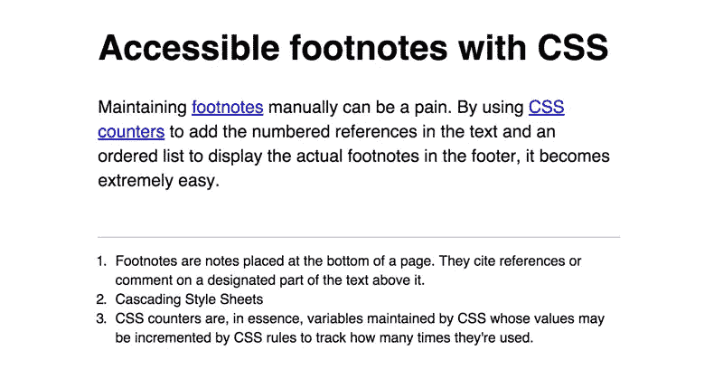
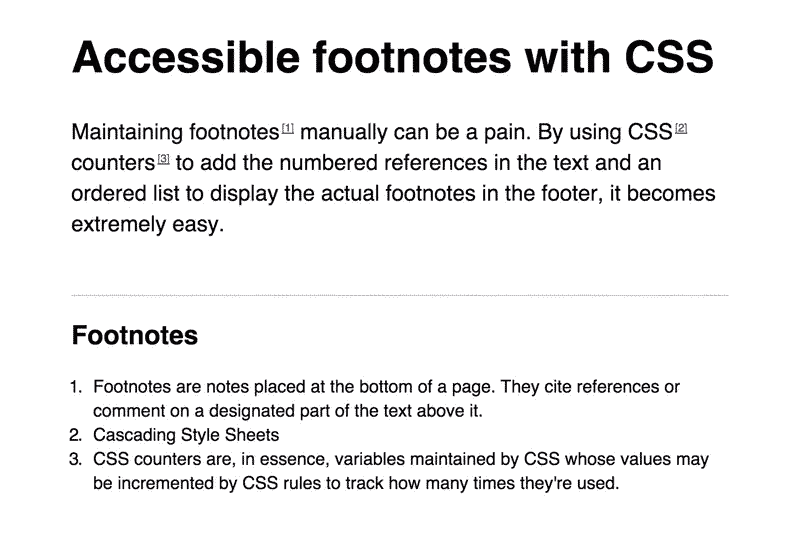
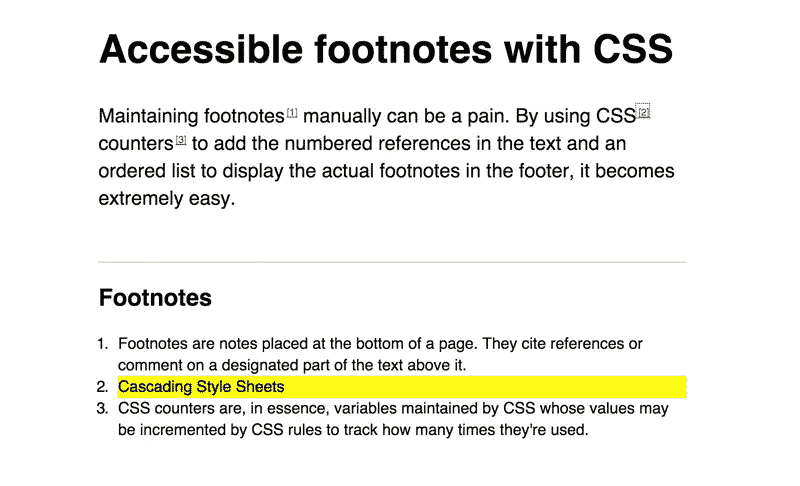

# 带有 CSS 的可访问脚注

> 原文：<https://www.sitepoint.com/accessible-footnotes-css/>

前几天我在玩 CSS 计数器，想着用它们来处理脚注。根据[抄袭](http://www.plagiarism.org/citing-sources/what-are-footnotes/)的说法，其中有一个关于此事的长得惊人的条目，脚注是:

> [……]放置在页面底部的注释。他们引用参考文献或评论上面指定的文字部分。

当作者想添加一条信息或引用一篇参考文献而没有在内容中间添加或使用括号时，你经常会在论文中看到它们。通常，脚注根据脚注在文档中的位置用数字表示，然后相同的数字出现在文档的底部，增加额外的内容。

网上脚注的问题是维护起来很麻烦。如果您碰巧经常处理同一个文档，改变了章节的顺序，沿途添加了参考文献，那么对所有现有的脚注重新编号可能会很繁琐。例如，如果您在一个文档中有 3 个现有的脚注引用，并且您想要添加另一个，但是在一个出现在所有其他脚注之前的内容上，您必须将它们全部重新编号。不太好…

我们可以使用 CSS 计数器来使整个事情变得更容易。如果我们不必手动维护编号，而是可以自动完成，会怎么样？我们唯一需要注意的是，页脚中实际注释的顺序要符合文本中引用的出现顺序。

## 创建样本文档

让我们创建一个示例文档，这样我们就可以开始了。

```
<article>
  <h1>CSS-Powered Footnotes</h1>

  <p>Maintaining <a href="#footnotes">footnotes</a> manually can be a pain. 
  By using <a href="#css">CSS</a> <a href="#css-counters">counters</a> to add 
  the numbered references in the text and an ordered list to display the actual 
  footnotes in the footer, it becomes extremely easy.</p>

  <footer>
    <ol>
      <li id="footnotes">Footnotes are notes placed at the bottom of a page. They 
      cite references or comment on a designated part of the text above it.</li>

      <li id="css">Cascading Style Sheets</li>

      <li id="css-counters">CSS counters are, in essence, variables maintained by 
      CSS whose values may be incremented by CSS rules to track how many times 
      they're used.</li>
    </ol>
  </footer>
</article>
```

我们的例子是轻量级的:我们在一个`<article>`元素中有一些内容，它包含一些指向文档内 id 的链接(`<a>`)，映射到文章的`<footer>`中的注释。

对于一些样式，它可能看起来像这样:



## 让它变得可访问

在真正使用计数器之前，我们应该确保屏幕阅读器可以完全访问我们的标记。我们要做的第一件事是给我们的页脚添加一个标题，作为我们的说明或脚注参考。我们将用 CSS 隐藏这个标题，这样它就不会在视觉上显示出来。

```
<footer>
  <h2 id="footnote-label">Footnotes</h2>
  <ol>
    ...
  </ol>
</footer>
```

然后，我们想用这个标题描述我们所有的引用，使用`aria-describedby`属性:

```
<p>Maintaining <a aria-describedby="footnote-label" href="#footnotes">footnotes</a> 
manually can be a pain. By using <a aria-describedby="footnote-label" href="#css">CSS</a> 
<a aria-describedby="footnote-label" href="#css-counters">counters</a> to add the 
numbered references in the text and an ordered list to display the actual footnotes 
in the footer, it becomes extremely easy.</p>
```

现在，屏幕阅读器用户将理解链接是对脚注的引用。

## 添加引用

我知道你在想什么:他说会有 CSS 计数器。CSS 柜台在哪里？别担心，我的朋友，他们来了。

我们要做的是为文档中每一个将`aria-describedby`属性设置为`footnote-label`的链接增加一个计数器。然后我们将使用`::after`伪元素显示计数器。从那以后，一切都是关于应用 CSS 样式。

```
/**
 * Initialiazing a `footnotes` counter on the wrapper
 */
article {
  counter-reset: footnotes;
}

/**
 * Inline footnotes references
 * 1\. Increment the counter at each new reference
 * 2\. Reset link styles to make it appear like regular text
 */
a[aria-describedby="footnote-label"] {
  counter-increment: footnotes; /* 1 */
  text-decoration: none; /* 2 */
  color: inherit; /* 2 */
  cursor: default; /* 2 */
  outline: none; /* 2 */
}

/**
 * Actual numbered references
 * 1\. Display the current state of the counter (e.g. `[1]`)
 * 2\. Align text as superscript
 * 3\. Make the number smaller (since it's superscript)
 * 4\. Slightly offset the number from the text
 * 5\. Reset link styles on the number to show it's usable
 */
a[aria-describedby="footnote-label"]::after {
  content: '[' counter(footnotes) ']'; /* 1 */
  vertical-align: super; /* 2 */
  font-size: 0.5em; /* 3 */
  margin-left: 2px; /* 4 */
  color: blue; /* 5 */
  text-decoration: underline; /* 5 */
  cursor: pointer; /* 5 */
}

/**
 * Resetting the default focused styles on the number
 */
a[aria-describedby="footnote-label"]:focus::after {
  outline: thin dotted;
  outline-offset: 2px;
}
```

现在看起来是这样的:



很不错，是吧？最后，当从一个引用转到一个脚注时，我们希望突出显示脚注中的注释，这样我们就可以实际看到引用的注释是什么，这可以通过使用`:target`伪类来实现:

```
footer :target {
  background: yellow;
}
```

这是一个有点原始，所以请随意定制。尽管我必须说我喜欢纯黄色作为亮点——它看起来如此真实:



## 提供反向链接

我们的演示需要最后一个元素来实现完全可访问性(也很酷):返回内容链接。想想看:你关注一个参考文献，找到页脚的相关注释，阅读它，然后…什么也没有。你需要一个方法回到你离开的地方！

提供这些链接并不难:我们只需要为内容中的每个引用添加一个惟一的 ID 属性，这样它们就可以被链接到。我决定变得简单一些，获取它们引用的 ID，并简单地在它后面添加`-ref`:

```
<p>Maintaining <a aria-describedby="footnote-label" href="#footnotes" id="footnotes-ref">footnotes</a> 
manually can be a pain. By using <a aria-describedby="footnote-label" href="#css" id="css-ref">CSS</a> 
<a aria-describedby="footnote-label" href="#css-counters" id="css-counters-ref">counters</a> 
to add the numbered references in the text and an ordered list to display the actual 
footnotes in the footer, it becomes extremely easy.</p>
```

然后，页脚中的每个列表项都有自己的链接标题，指向我们刚刚添加的相关`id`。链接的内容是*反向链接* Unicode 图标(↩)，它有一个值为“返回内容”的`aria-label`属性。

```
<ol>
  <li id="footnotes">Footnotes are notes placed at the bottom of a page. 
  They cite references or comment on a designated part of the text above it. 
  <a href="#footnotes-ref" aria-label="Back to content">↵</a></li>
  <li id="css">Cascading Style Sheets 
  <a href="#css-ref" aria-label="Back to content">↵</a></li>
  <li id="css-counters">CSS counters are, in essence, variables maintained 
  by CSS whose values may be incremented by CSS rules to track how many 
  times they're used. <a href="#css-counters-ref" aria-label="Back to content">↵</a></li>
</ol>
```

为了在 CSS 中定位这些链接，我们可以像对待`aria-describedby`一样依赖于`aria-label`属性:

```
[aria-label="Back to content"] {
  font-size: 0.8em;
}
```

这是最终演示的样子:

参见 [CodePen](http://codepen.io) 上 SitePoint ( [@SitePoint](http://codepen.io/SitePoint) )的带 CSS 的 Pen [可访问脚注。](http://codepen.io/SitePoint/pen/QbMgvY/)