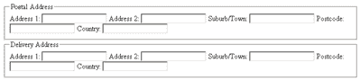

# 可访问的表单标记要点

> 原文：<https://www.sitepoint.com/accessible-form-markup-essentials/>

表单代表了您的网站中的一个区域，您必须投入时间和精力来确保用户的可访问性。但是在开始设计 web 表单之前，您需要制作一些真正可靠的标记，它将提供一个框架，您可以向其中添加一些样式。

尽管表单代表了网页上可能发生的一些最复杂的交互，但在许多情况下，这些交互只是通过可视化的方式来表示——通过表单元素与其`label`的接近度，或者通过边框和背景颜色来分组。屏幕阅读器等辅助技术的用户可能看不到这些视觉线索，因此通过确保可访问性来支持这些用户是至关重要的。提供可访问表单背后的关键概念是对其所有部分和`input`元素进行描述性标记。

特别是，这意味着正确使用两个元素:`label`和`legend`。

还有一种错误的想法，认为保证表单正确显示的唯一方法是使用表格。这里为表单复制的所有代码都是基于标准的语义标记，所以您现在没有理由依赖表格了！

***标注表格元素***

无论您如何设计表单元素及其`label`的样式，它通常都符合某种模式:

*   表单元素本身
*   元素的文本标签
*   元素及其文本描述之间的联系

这种联系是通过视觉对准、视觉分组或一些其他视觉指示器来实现的。在下图中，您可以看到左边的表单纯粹通过对齐在字段元素和它的标签之间建立了一个连接，而右边的表单通过使用颜色指示了一个更明确的连接。

当在创建表单时为辅助技术的用户提供便利时，有一个主要问题需要考虑。如果没有邻近或分组的视觉提示，看不到网页的用户如何在表单元素和文本标签之间建立联系？

答案是`label`元素。`label`是一个应用于表单元素的特殊元素，允许其文本描述在语义上链接到元素本身，因此任何辅助技术(如屏幕阅读器)在遇到其伙伴表单元素时都可以读出该文本。

为了使用一个`label`，将文本描述包装在一对`label`标签中，然后给`label`添加一个`for`属性。属性`for`的值应该是您想要创建连接的表单元素的`id`:

`<label for="firstName">First name</label>
<input id="firstName" name="firstName" type="text" />`

现在，当 screenreader 遇到`firstName`字段时，它还会向用户读出文本“First name ”,这样他或她就知道该在该字段中键入什么。`label`不必靠近表单元素，也不必按任何特定的顺序排列——只要`label`的`for`属性包含有效的引用，就能理解这种关系。然而，在源顺序中，将`label`放在表单元素之前通常最有语义意义。

一个`label`应该应用于任何没有自动包含描述性文本的表单元素，例如:

*   复选框
*   单选按钮
*   `textarea`年代
*   文本字段
*   `select`盒子

提交按钮和提交图像不需要`label`元素，因为它们的描述分别包含在它们的`value`和`alt`属性中。

当然，您可以使用 CSS 轻松地设置`label`中文本的样式，因此您可以像使用`span`、`p`或`div`一样格式化表单中的`label`文本，但是使用`label`的好处是比这些元素更容易访问。

***分组相关元素***

`legend`与`fieldset`齐头并进。事实上，一个传说能够成为孩子*的唯一元素就是*一个`fieldset`。一个`fieldset`集合了一系列相关的表单元素。例如，“街道地址”、“郊区”、“州”和“邮政编码”都可以分组到“`postal address`”下您可以创建一个将所有这些元素分组的`fieldset`，并给它一个合适的`legend`来描述这个组:

`<form action="example.php">
<fieldset>
<legend>Postal Address</legend>
<label for="street">Street address</label>
<input id="street" name="street" type="text" />
<label for=" suburb">Suburb</label>
<input id="suburb" name="suburb" type="text" />
<label for="state">State</label>
<input id="state" name="state" type="text" />
<label for="postcode">Postcode</label>
<input id="postcode" name="postcode" type="text" />
</fieldset>
</form>`

现在`legend`已经与`fieldset`中的所有表单元素相关联，当使用屏幕阅读器的人关注其中一个表单元素时，屏幕阅读器也会读出`legend`文本:“邮政地址；郊区。”

当您有两组除了组类型之外非常相似的元素时，screenreader 指定`legend`和`fieldset`的好处就变得显而易见了:

`<form action="example.php">
<fieldset>
<legend>Postal Address</legend>
<label for="street">Street address</label>
<input id="street" name="street" type="text" />
<label for=" suburb">Suburb</label>
<input id="suburb" name="suburb" type="text" />
<label for="state">State</label>
<input id="state" name="state" type="text" />
<label for="postcode">Postcode</label>
<input id="postcode" name="postcode" type="text" />
</fieldset>
<fieldset>
<legend>Delivery Address</legend>
<label for="deliveryStreet">Street address</label>
<input id="deliveryStreet" name="deliveryStreet"
type="text" />
<label for="deliverySuburb">Suburb</label>
<input id="deliverySuburb" name="deliverySuburb"
type="text" />
<label for="deliveryState">State</label>
<input id="deliveryState" name="deliveryState"
type="text" />
<label for="deliveryPostcode">Postcode</label>
<input id="deliveryPostcode" name="deliveryPostcode"
type="text" />
</fieldset>
</form>`

如下图所示，有了`fieldset`的`legend`元素，很容易直观地确定哪些字段属于哪个组，甚至在非样式表单上也是如此。

但是，你会问，用`h1`元素代替`legend`元素难道不能达到同样的视觉效果吗？

是的。然而，使用`legend`的意义在于，如果没有适当的语义分组和标记，屏幕阅读器用户会对为什么他或她被要求输入“地址 1”两次感到困惑。通过包含的`legend`，用户将知道第二个“地址 1”实际上属于另一个组——递送地址的组。

因此，通过组合`label`和`legend`，我们让视障用户能够更容易地导航和填写表单。通过使用这种组合作为表单的基本结构，您将确保它们不仅看起来很棒，而且还易于访问！

## 分享这篇文章