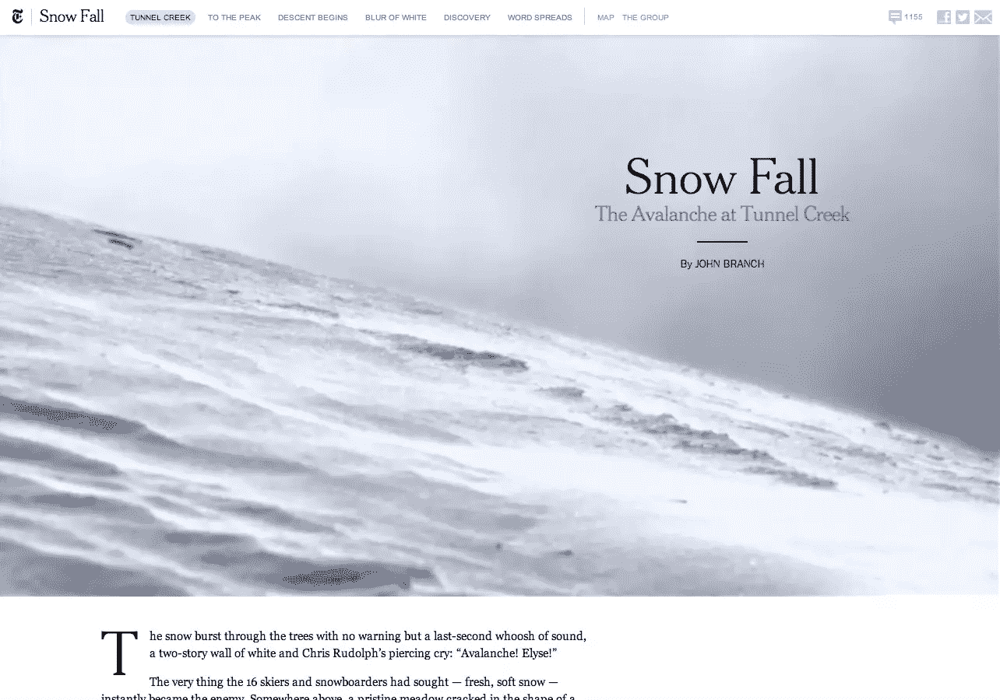
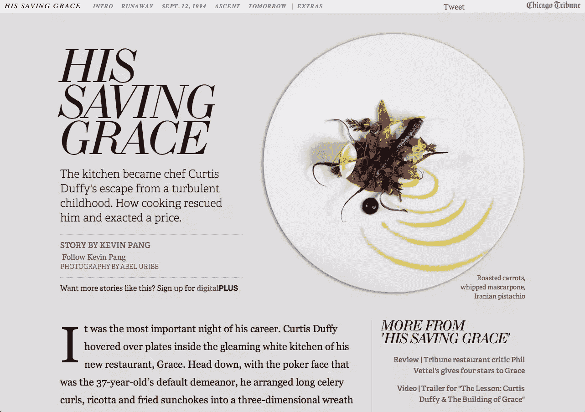
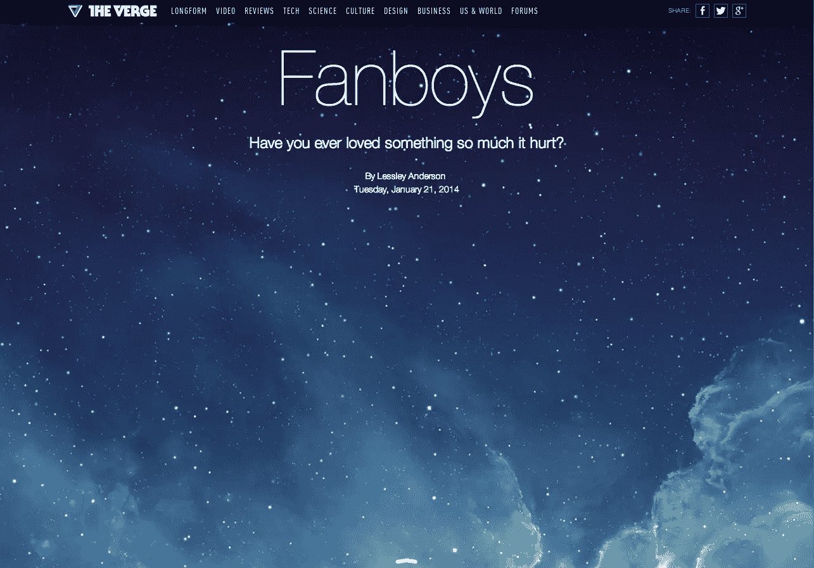
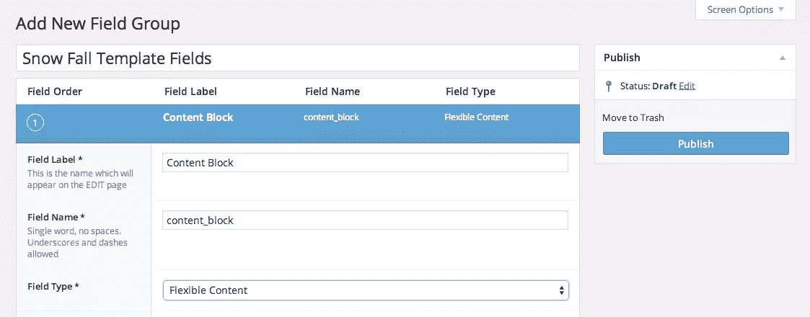
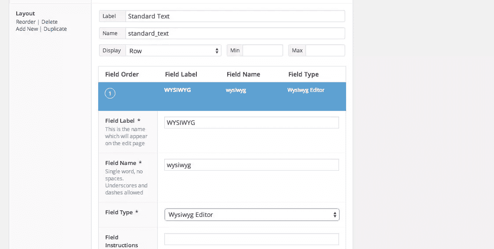
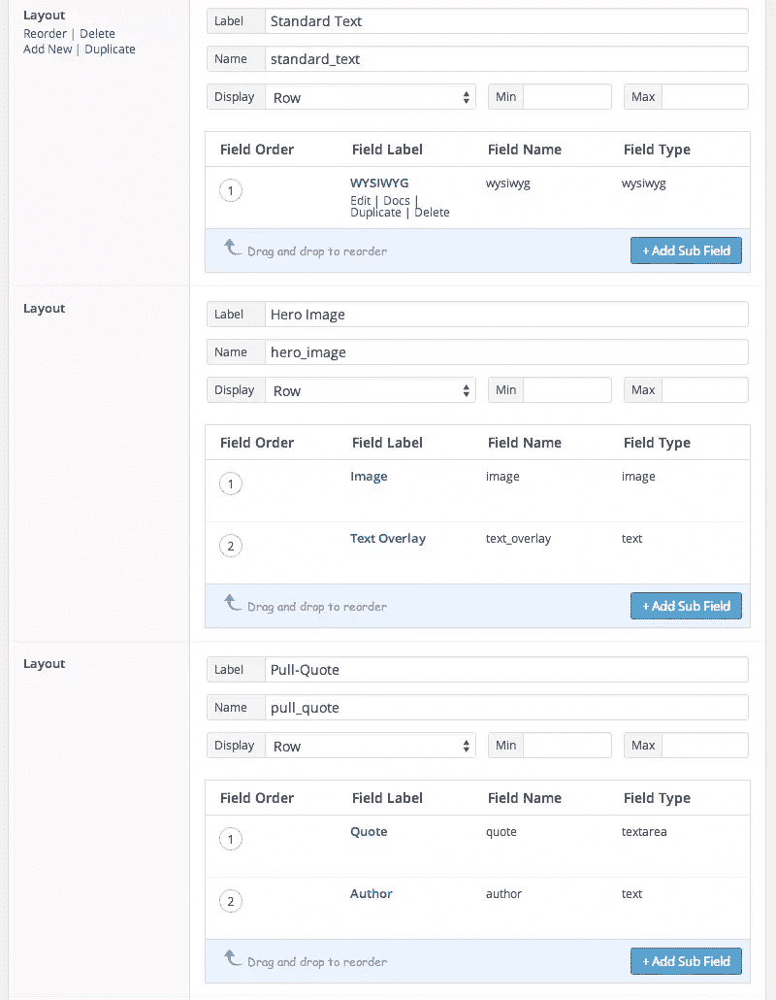

# 在 WordPress 中创建自定义的“降雪”设计

> 原文：<https://www.sitepoint.com/acf-flexible-content-fields/>

2012 年 12 月,《纽约时报》打破了标准的在线文章布局，用约翰·布兰奇美丽的“降雪”文章让我们惊叹不已。这篇文章没有简单地包含标题、文本和偶尔出现的内嵌照片，而是自由地使用了全屏图像、视频、自定义文本布局和动画，通过精心设计和讲述的故事来吸引读者。



没过多久，其他出版网站也纷纷效仿，开始偏离它们的“正常”设计，偶尔发表艺术导向的文章，比如芝加哥论坛报的“[他的救赎之恩](http://graphics.chicagotribune.com/grace/)”和 The Verge 的[“长篇”文章](http://www.theverge.com/longform)。



* * *



通常，新闻网站上的文章遵循一个非常标准的模式:特色图片、标题、内容(文本、标题和内嵌图片)，上面是菜单，旁边是侧边栏，下面是评论和页脚。大多数 WordPress 网站也遵循这种模式。但是在一些有用的插件和自定义模板页面的帮助下，你可以很容易地在 WordPress 中创建引人注目的艺术导向的文章。

为了本教程，让我们挑选几个独特的设计元素，我们想添加到我们的“雪落”布局。我们需要(1)正常的所见即所得编辑器区域，(2)可选文本覆盖的英雄图像，以及(3)引用。我们还想尽可能多地使用每种内容，按照我们想要的任何顺序。我们走吧！

## 高级自定义字段和灵活的内容字段

为了创建可定制的布局，我们将从[高级定制字段插件](http://www.advancedcustomfields.com/) ( [WP 插件 Repo](http://wordpress.org/extend/plugins/advanced-custom-fields/) )开始。ACF 是免费的，但我们还需要它的一个付费附加组件:[灵活的内容字段](http://www.advancedcustomfields.com/add-ons/flexible-content-field/)。这个附加组件不到 25 美元，非常值得！

安装完这些插件后，单击 Dashboard 中的自定义字段图标，然后单击“新建”创建一个新的字段组。让我们称之为“降雪模板字段”单击“添加字段”向该组添加新字段。将其命名为“内容块”，并将其字段类型设置为“灵活内容”



这将打开一个标记为“布局”的新行这里我们将添加我们的第一个内容块选项:一个所见即所得编辑器。对于其标签，使用“标准文本”，然后单击“+添加子字段”按钮。将新的子字段标记为“所见即所得”，并选择“所见即所得编辑器”作为其字段类型。



现在我们将添加我们需要的其他块。将鼠标悬停在布局标题单元格上(在我们刚刚添加的子字段的右侧)，然后单击“添加新项”将这一行命名为“英雄图像”,添加一个图像字段和一个文本字段。添加一个名为“Pull-Quote”的行，带有一个报价文本区域字段和一个作者文本字段。点击“发布”按钮。一旦我们建立了页面模板，我们将编辑更多的东西。



## 自定义模板页面

现在，我们需要在主题中为该内容定制一个模板页面。WordPress 页面模板的基础知识在 Codex 中。在你的主题中创建一个模板文件(例如 snowfall.php)。

```
<?php

/*
Template Name: Snow Fall Template
*/

get_header();
//template stuff
get_footer();

?>
```

该文件准备就绪后，请返回降雪模板字段页面。在“位置”框中，选择“页面模板”等于“雪落模板”在选项框中，隐藏所有不需要的部分(在本例中是编辑器)。单击“更新”保存您的更改。创建一个新的页面并选择 Snow Fall 模板:你会看到旧的编辑器被一个新的“添加内容块”框所取代，在这里你可以添加任意数量的内容块，顺序不限。

现在让 PHP 模板来构建我们的自定义页面。我们构建的字段可以通过一些自定义函数使用([这里是灵活内容字段的所有 ACF 文档](http://www.advancedcustomfields.com/resources/field-types/flexible-content/))。

我们可以使用与 WP Core 的 [`WP_Query()`](http://codex.wordpress.org/Class_Reference/WP_Query) 非常相似的语法遍历每个内容块:

```
if ( have_rows('content_block') ) {
  while ( have_rows('content_block') ) : the_row();
  // All your subfields code for this goes here.
}
```

一旦进入这个循环，就需要正确地获取每个块的数据。让我们使用一个`switch`来测试我们拥有哪种类型的内容块，然后只询问必要的字段。

```
switch (get_row_layout()) {
  case 'standard_text' :
    // get wysiwyg sub-field
    break;
  case 'hero_image' :
    // get hero image sub-field(s)
    break;
  case 'pull_quote' :
    // get pull quote sub-field(s)
    break;
}
```

以下代码将检查以确保存在 WYSIWYG 字段，然后将其内容打印到页面上。*注意:通常在 ACF 中，您会使用`get_field()`，但是因为它嵌套在一个灵活的内容字段中，所以使用`get_sub_field()`。*

```
if( get_sub_field('wysiwyg') ) {
  print get_sub_field('wysiwyg');
}
```

把所有这些放在一起，你得到这个:

```
<?php

/*
Template Name: Snow Fall Template
*/

get_header();
if ( have_rows('content_block') ) { //1
  while ( have_rows('content_block') ) : the_row();
    printf('<div class="%s">', get_row_layout());
      switch (get_row_layout()) {
        case 'standard_text' :
          if( get_sub_field('wysiwyg') ) {
            print get_sub_field('wysiwyg');
          }
          break;
        case 'hero_image' :
          if( get_sub_field('image') ) {
	$image_array = get_sub_field('image');
            printf('', $image_arrayhttps%3A%2F%2Feditor.sitepoint.com);

          }
          if( get_sub_field('text_overlay') ) {
            printf('<h3>%s</h3>', get_sub_field('text_overlay'));
          }
          break;
        case 'pull_quote' :
          if( get_sub_field('quote') ) {
            printf('<p>%s</p>', get_sub_field('quote'));
          }
          if( get_sub_field('author') ) {
            printf('<p>%s</p>', get_sub_field('author'));
          }
          break;
      print '</div>';
    }
	endwhile;
}
get_footer();

?>
```

当然，设计所有输出完全取决于您的想象！你可以用 ACF 灵活的内容域做很多事情，享受乐趣，并在评论中分享你用这种技术构建的令人惊叹的页面！

## 分享这篇文章