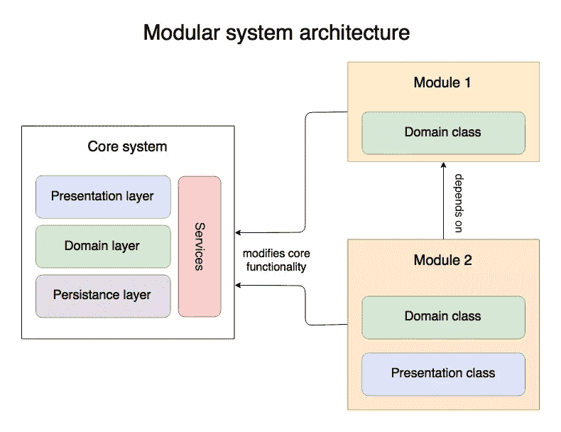
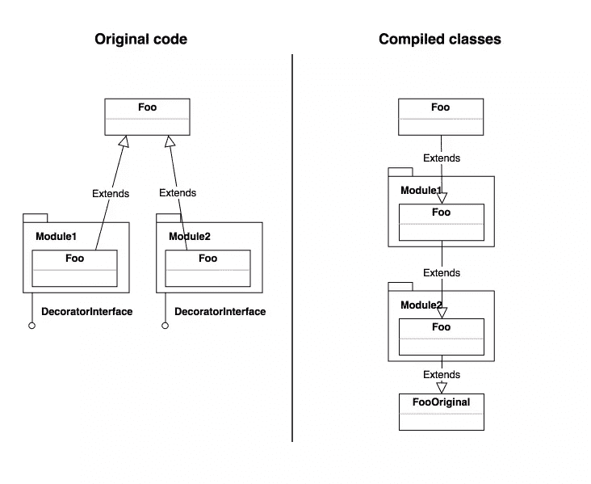
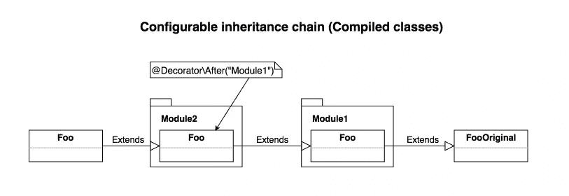

# 用转发装饰器实现模块化体系结构

> 原文：<https://www.sitepoint.com/achieving-modular-architecture-with-forwarding-decorators/>

*这篇文章由[尤尼斯·拉菲](https://www.sitepoint.com/author/yrafie)和[克里斯多佛·皮特](https://www.sitepoint.com/author/assertchris)进行了同行评议。感谢 SitePoint 的所有同行评审员使 SitePoint 的内容尽可能做到最好！*

* * *

随着您的 web 应用程序变得越来越大，您肯定开始更多地考虑设计一个灵活的、模块化的体系结构，这意味着允许高度的可扩展性。有很多方法可以实现这样的架构，所有的方法都围绕着基本原则:关注点的分离，自给自足，应用程序各部分的可组合性。

有一种方法在 PHP 软件中很少见，但可以有效地实现——它涉及使用本机继承来提供软件代码的可管理补丁；我们称之为转发装饰。



## 概念介绍

在本文中，我们将观察转发装饰器方法的实现及其优缺点。你可以在这个 GitHub 库中看到正在运行的演示应用[。此外，我们将把这种方法与其他众所周知的方法(如钩子和代码修补)进行比较。](https://github.com/sitepoint-editors/decorators-demo)

主要思想是将每个类视为一个服务，并通过代码编译扩展它和反转继承链来修改该服务。如果我们围绕这个想法构建系统，任何模块都将能够包含特殊的类(它们将被标记为以某种方式与通常的类分开)，这些类可以从任何其他类继承，并将在任何地方使用，而不是原始对象。



这就是为什么它被称为**转发**装饰器:它们包装原始实现，并将修改后的变体转发到最前面以供替代使用。

这种方法的优势是显而易见的:

*   模块几乎可以扩展系统的任何部分，任何类，任何方法；您不必提前计划扩展点。
*   多个模块可以同时修改一个子系统。
*   子系统是松散耦合的，可以单独升级。
*   扩展系统基于我们熟悉的继承方法。
*   您可以通过制作`private`方法和`final`类来控制可扩展性。

权力越大，责任越大，因此缺点是:

*   您将不得不实现某种编译系统(稍后将详细介绍)
*   模块开发者必须遵守子系统的公共接口，并且不违反[利斯科夫替代原则](https://en.wikipedia.org/wiki/Liskov_substitution_principle)；否则其他模块会破坏系统。
*   当修改子系统的公共接口时，你必须非常小心。现有的模块肯定会崩溃，必须适应变化。
*   额外的编译器使调试过程变得复杂:您不能再对原始代码运行 XDebug，任何代码更改都应该在运行编译器之后进行(尽管这可以减轻，甚至是 XDebug 问题)

## 这个系统怎么用？

这个例子应该是这样的:

```
class Foo {
    public function bar() {
        echo 'baz';
    }
} 
```

```
namespace Module1;

/**
 * This is the modifier class and it is marked by DecoratorInterface
 */
class ModifiedFoo extends \Foo implements \DecoratorInterface {
    public function bar() {
        parent::bar();        
        echo ' modified';
    }
} 
```

```
// ... somewhere in the app code

$object = new Foo();
$object->bar(); // will echo 'baz modified' 
```

这怎么可能呢？

实现这一点需要一些魔法。我们必须对这段代码进行预处理，并用反向继承图编译一些中间类，因此原始类将像这样扩展模块装饰器:

```
// empty copy of the original class, which will be used to instantiate new objects
class Foo extends \Module1\ModifiedFoo {
    // move the implementation from here to FooOriginal
} 
```

```
namespace Module1;

// Here we make a special class to extend the other class with the original code
abstract class ModifiedFoo extends \FooOriginal implements \DecoratorInterface {
    public function bar() {
        parent::bar();        
        echo ' modified';
    }
} 
```

```
// new parent class with the original code, every inheritance chain would start from such file
class FooOriginal {
    public function bar() {
        echo 'baz';
    }
} 
```

软件必须实现编译器来构建中间类和类自动加载器，自动加载器将加载它们而不是原始类。

本质上，编译器将获取系统所有类的列表，并为每个单独的非装饰类找到实现`DecoratorInterface`的所有子类。它将创建一个装饰图，确保它是非循环的，根据优先级算法对装饰符进行排序(稍后将详细介绍)，并构建中间类，其中继承链将被反转。源代码将被提取到新类中，这个新类现在是继承链的父类。

听起来很复杂，是吗？

不幸的是，这确实很复杂，但是这样一个系统允许你以一种灵活的方式组合这些模块，并且这些模块将能够修改系统的任何部分。

## 有多个模块修改单个类怎么办？

在多个装饰类应该有效的情况下，我们可以根据它们的优先级将它们放在结果继承链中。优先级可以通过注释来配置。我强烈推荐使用[教义注释](https://github.com/doctrine/annotations)或者一些配置文件。看一下这个例子:

```
class Foo {
    public function bar() {
        echo 'baz';
    }
} 
```

```
namespace Module1;

class Foo extends \Foo implements \DecoratorInterface {
    public function bar() {
        parent::bar();        
        echo ' modified';
    }
} 
```

```
namespace Module2;

/**
 * @Decorator\After("Module1")
 */
class Foo extends \Foo implements \DecoratorInterface {
    public function bar() {
        parent::bar();        
        echo ' twice';
    }
} 
```

```
// ... somewhere in the app code

$object = new Foo();
$object->bar(); // will echo 'baz modified twice' 
```

这里，`Decorator\After`注释可以用来将另一个模块装饰器放在继承链的更上面。编译器将解析这些文件，寻找注释，并构建中间类，使其具有以下继承链:



此外，您可以实现`Decorator\Before`(将 decorator 类放在更高的位置)、`Decorator\Depend`(仅当另一个模块存在或不存在时才启用 decorator 类)。这样一个注释子集将非常完整，可以进行任何所需的模块和类的组合。

## 但是钩子或者修补代码呢？这样更好吗？

就像**装饰者**一样，每种方法都有其优点和缺点。

例如，钩子(基于某种*观察者*模式)在 WordPress 和许多其他应用程序中被广泛使用。他们的好处是有一个明确定义的*扩展 API* 和一个透明的注册观察者的方式。同时，他们还有一个问题，即*限制了*扩展点数，而*执行*的时间不确定(很难依赖于其他钩子的结果)。

开始修补代码很容易，但通常被认为是非常危险的，因为这可能导致无法解析的代码，并且通常很难合并文件的几个补丁或撤消更改。修补系统可能需要它自己的 [DSL](https://en.wikipedia.org/wiki/Domain-specific_language) 来控制修改。复杂的修改需要对系统有深入的了解。

## 结论

Forwarding Decorators 模式至少是一种有趣的方法，可以用来解决实现 PHP 软件的模块化、可扩展架构的问题，同时使用熟悉的语言结构，如继承或执行范围来控制可扩展性。

一些应用程序已经结合了所描述的概念，特别是 OXID eShop 使用了非常相似的东西。阅读他们的开发文档很有趣，这些人真的很有幽默感！另一个平台，X-Cart 5eсommerce software，完全以上述形式使用了这个概念——它的代码被作为本文的基础。X-Cart 5 有一个第三方扩展市场，可以修改系统的行为，但不会破坏核心的可升级性。

这样的概念可能很难实现，应用程序的调试也存在一些问题，但如果您花一些时间对编译器进行微调，这些问题并非不可能克服。在下一篇文章中，我们将介绍如何构建一个最佳的编译器和自动加载器，并使用 **PHP 流过滤器**通过 **XDebug** 对原始代码进行逐步调试。敬请期待！

如果你有任何其他的技巧和诀窍想要分享，请在下面的评论区告诉我们。此外，欢迎任何问题。

## 分享这篇文章