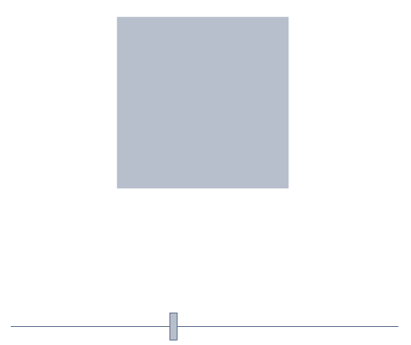
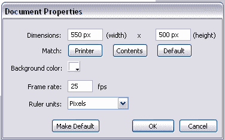
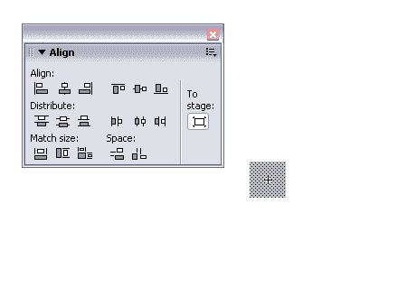
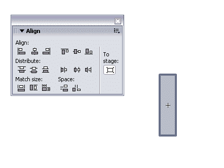
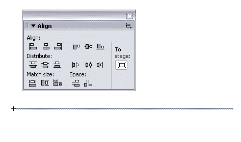
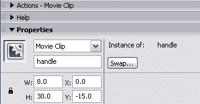
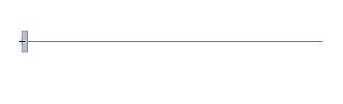
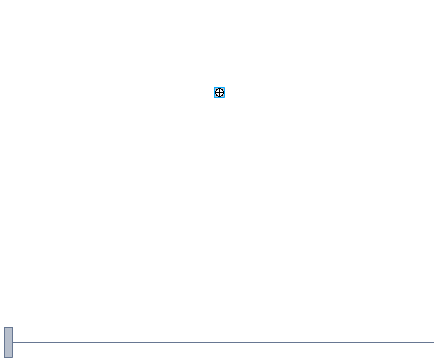

# Flash 中的 ActionScript 动画简介

> 原文：<https://www.sitepoint.com/actionscript-animation-flash/>

**所以你已经学习了 Flash 的基础知识，但你仍然不明白设计师是如何创建如此复杂的 Flash 网站和界面的。在本教程中，我将向您展示一种使用 ActionScript 创建交互式动画的简单方法。**

在这个例子中，ActionScript 将用于缩放一个基本的形状，但是这个相同的过程可以用于运动、透明度、颜色效果等等。我假设您对基本的 ActionScript 语法和基本的 Flash 界面/工具有所了解。如果你变得过于困惑，我建议你停下来阅读一些初学者 Flash 教程，如 SitePoint 的 [Flash 101 here](https://www.sitepoint.com/flash-101-1-hammer-chisel/) 。

我们的项目将由一个带手柄的滑动条组成，该手柄控制舞台上正方形的大小。当我们滑动手柄时，正方形会平滑地增大或缩小。



##### 入门指南

首先，我们需要搭建舞台，创造一些符号。打开一个新的 Flash 文档，设置为 550 像素宽，500 像素高。将帧速率设置为 25fps。



接下来，我们要创建 3 个简单的符号，都是电影剪辑。要制作每个元件，请选择“插入”>“新建元件”。我们希望这些符号存储在库中；稍后我们会把它们放在舞台上。

将第一个影片剪辑命名为“shape”，并在其中创建一个 10 x 10 像素的正方形，使用“对齐”面板将其垂直和水平居中。您现在应该有一个小正方形，剪辑的注册点位于其中心(请注意，在下图中，正方形以 400%的缩放比例显示)。



让我们回到主时间轴，为小部件创建符号，它将控制我们刚刚创建的正方形的大小。创建一个名为“handle”的新电影剪辑，并在其中创建一个 8 像素宽、30 像素高的小矩形。像正方形一样，水平和垂直居中这个矩形(同样，下图以 400%的缩放比例显示)。



回到主时间轴，创建最后一个符号。这将作为我们的手柄滑动的轨道。创建一个名为“slider”的电影剪辑。在此剪辑中，简单地放置一条 400 像素长的水平线，使用 1 像素的笔画。对齐直线，使左端点位于 x=0 y=0 处。这可以使用对齐或属性面板来完成。



我们已经做了三个我们需要的符号。现在，是时候将手柄和滑块结合起来，制作一个可以工作的控制条了。从库面板，点击回到我们刚刚创建的滑块符号。在包含您制作的线条的图层上方插入一个新图层。如下图所示，将“handle”的一个实例从库中拖到舞台上。使用属性面板将句柄的位置设置为 0，-15，并将实例命名为“handle”。现在，手柄应该位于直线的左端，并具有如下所示的属性。



你的滑块现在应该看起来如下图所示。



##### 把代码拿来！

是时候来点动作片了！创建第三层以上的两个现有的层在你的滑块符号，并命名为"行动"。选择动作层的第 1 帧，并打开“动作”( ActionSript)面板。将以下代码复制或重新键入到帧 1 的面板中。

```
handle.onPress = function(){ 

  this.startDrag(false,0,0,400,0); 

}; 

handle.onRelease = function(){ 

  this.stopDrag() 

}
```

这段代码包含两个动作处理程序。第一个`handle.onPress`函数定义了当光标悬停在我们的手柄上时按下鼠标按钮会发生什么。在这种情况下，我们想使用 Flash 函数`startDrag();`，这将允许我们左右拖动手柄。拖动动作的限制由我们传递给`startDrag()`函数的数字参数定义。这个函数的语法如下:`startDrag` ( `lock`、`left`、`top`、`right`、`bottom`)。

“lock”参数是`true`或`false`，它告诉 Flash 在拖动时是否应该将指针锁定在对象的中心。在这种情况下，我们给这个参数一个值`false`。我们更关心使用数值来限制滑块的运动。通过检查传递给拖动函数的值，您将看到我们将 top 和 bottom 都设置为 0，这防止了句柄垂直移动。我们将左设置为 0，右设置为 400，以允许手柄沿着我们预定义的轨迹滑动。第二个`handle.onRelease`功能说的是松开鼠标，手柄会停止拖动。

回到主时间轴，创建一个名为“控制”的层，在新层的舞台上放置一个 slider 实例，并将其放置在 75，450 处。如果您选择“控制”>“测试影片”,您应该有一个工作滑块。它还没有控制任何东西，但是它应该像预期的那样左右拖动。

接下来，在主时间轴上创建另一个层，称为“形状”。将形状元件的一个实例拖到舞台上，将其定位在 270，210，并在属性面板中将其命名为“shape”。



至于滑块剪辑，我们现在需要向主时间轴添加一些动作。在主时间轴的现有图层之上创建一个图层，命名为“动作”。单击该层的第 1 帧，打开动作面板。将以下代码放入第 1 帧。

```
shape.targetWidth = shape._width; 

shape.targetHeight = shape._height; 

shape.onEnterFrame = function() { 

    var speed = 5; 

    this._width += (this.targetWidth - this._width)/speed; 

    this._height += (this.targetHeight - this._height)/speed; 

};
```

前两行初始化了我们的两个变量。我们创建变量`targetWidth`和`targetHeight`，并将它们设置为形状符号的初始高度和宽度。请注意，这种初始化只发生一次，在我们的电影开始。

代码的第二部分为形状分配一个`onEnterFrame`处理程序。这对你来说可能是新的，但是你很快就会非常熟悉它！`onEnterFrame`定义了在每一帧中执行的动作。因此，如果帧速率是每秒 25 帧，那么`onEnterFrame`处理程序中的代码将每秒运行 25 次。基本上，这是一种实现实时交互的方式。

在函数中，我们使用一个数学公式来定义形状大小的变化。在本例中，宽度和高度的代码行都计算为相同的值，因为我们处理的是正方形和统一的缩放。当然，这可以被修改以处理各种更复杂的动作。因为这两行做的事情几乎相同，所以我将只研究其中一行代码。

```
this._height += (this.targetHeight - this._height)/speed;
```

```
this._height is the actual height property of the item; changes to this value will be visually reflected in the movie. 

```

```
this._targetHeight is a variable we use to keep track of what we want the height actually to be.

该代码将对象的实际高度增加实际高度和目标高度之间的差值的一部分。由于这一行在每一帧执行，实际高度将很快接近目标高度。它还将跟踪对变量`targetHeight`的值所做的任何更改，并相应地调整我们的形状。这是整个练习的关键。

如果你对这里使用的数学感到困惑，试着用纸和笔做出来。如果你从高度 10 开始写出来，目标高度 100，你会看到一次又一次执行代码会发生什么:高度的值会越来越接近目标高度。调整“速度”变量将决定实际高度达到目标高度的速度。

使其工作

我们快完成了！如果你愿意，你可以再测试一下这部电影。你会看到你的工作滑块在底部，一个小方块就在那里，一动不动。正方形为什么不动？因为我们还没有告诉滑块改变`targetHeight`和`targetWidth`的值。

双击滑块实例以再次编辑该符号，单击动作层的第 1 帧并重新打开动作面板。您现在应该看到控制滑块拖动动作的代码。我们想添加更多的代码，以完成我们的电影的功能。用现有代码替换下面的代码片段。

```

```
handle.onPress = function(){ 

  this.startDrag(false,0,0,430,0); 

}; 

handle.onRelease = function(){ 

  this.stopDrag() 

} 

handle.onEnterFrame = function(){ 

  _root.shape.targetWidth = this._x +10; 

  _root.shape.targetHeight = this._x +10; 

};
```

前两个功能保持不变，但第三个是新的。在本课的这一点上，这可能看起来很熟悉。我们使用一个`onEnterFrame`处理程序来建立句柄的位置与`targetWidth`和`targetHeight`变量的值之间的关系。我们将目标宽度和高度的值设置为手柄的 X 位置+ 10。

正如在我们的`starDrag()`函数中定义的，handle 的 X 值将在 0 到 400 之间，所以我们将能够在 10 像素和 410 像素之间缩放我们的形状。你可以去掉“+10 ”,但这样我们的形状可以缩小到 0，我不想让它消失。

##### 恭喜你！

回到主时间线，点击控制>测试电影…就这样！如果你正确地遵循了所有的步骤，你现在应该有一个工作的电影。希望你觉得这个教程对学习 Flash 有帮助。

点击下载完整源代码[。](https://www.sitepoint.com/examples/actionanim/source_file_mx.fla)

## 分享这篇文章