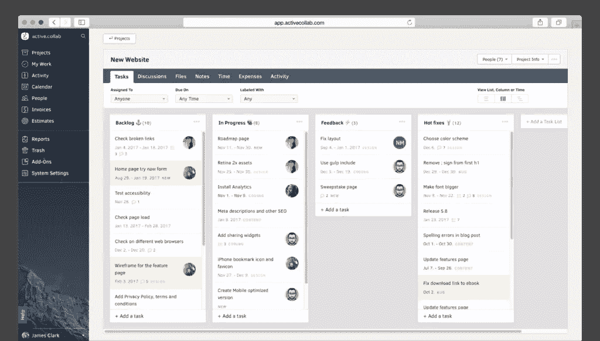
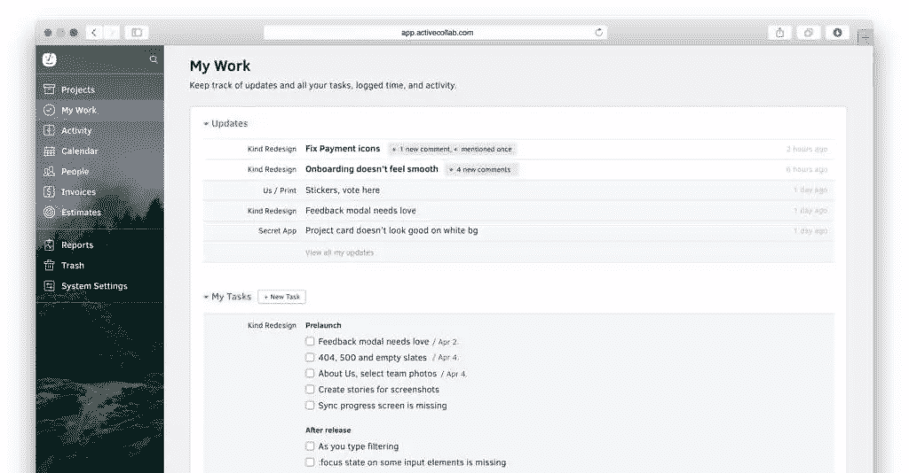
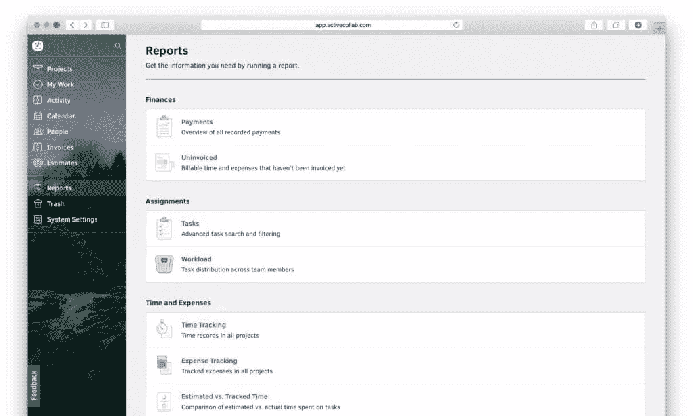
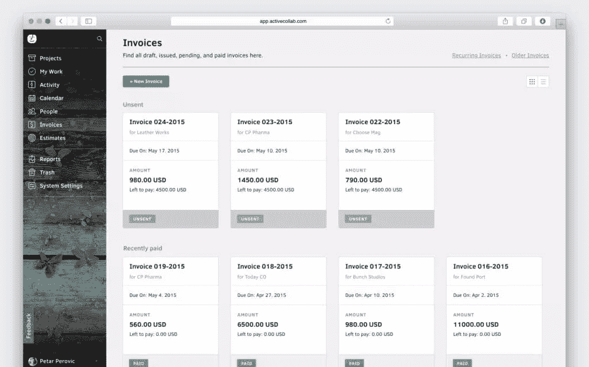
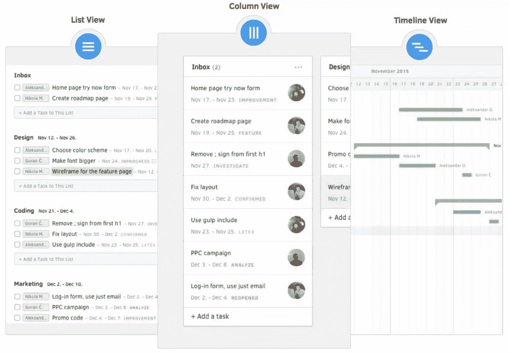

# 主动协作:协作应该是怎样的

> 原文：<https://www.sitepoint.com/active-collab-how-collaboration-should-have-been-all-along/>

*本文由[活动合作方](http://synd.co/2neTKnO)赞助。感谢您对使 SitePoint 成为可能的合作伙伴的支持。*

团队与团队之间的协作是不同的。所有团队最终都会发现他们自己独特的工作流程，尽管团队实现这些工作流程的方式基本上是相似的。我们以文件上传为例。设计师会上传他们的设计，作家会上传他们的作品。不管团队做什么，他们肯定会使用文件上传。

不管你是设计师、作家、营销人员还是其他什么人:最好的协作工具是那些掌握核心功能的工具——**任务管理→反馈→时间跟踪→开发票**。进入[活动协作](http://synd.co/2neTKnO)。

强大而简单的 Active Collab 可在您无法处理电子邮件时帮助您的团队保持有序，使您能够有效地管理任务，与客户合作，并在必要时进行委派——想想 Trello，但内置了日历、时间跟踪和发票功能。

## 所有功能都在一个地方

无论您的团队做什么，Active Collab 都会支持您，让您从构思到完成全程管理任务。在评估、时间跟踪和协作完成任务后，您可以在任务完成时向客户开具发票，所有这些都在一个应用程序中完成。当这些特性协同工作时，项目管理效果最好，减少(甚至完全消除)摩擦，这种摩擦通常发生在所需的功能广泛分布于各种应用程序时。借助 Active Collab，所有管理工具都统一在一个订阅下。

无缝体验是一种快乐(和富有成效)的体验！

## 任务管理

像一台润滑良好的机器一样运营您的业务。借助高级待办事项列表，保持井然有序，管理团队的每一步进展。虽然 Active Collab 拥有您需要的所有功能—时间和费用跟踪、文件上传、讨论等—但团队成员只能通过他们自己独特的仪表板看到他们需要看到的内容。

## 团队协作

没有沟通，协作根本就行不通。幸运的是，Active Collab 通过@ note 功能、协作写作工具和易于阅读的日历来帮助团队联系，确保您永远不会错过截止日期。

是时候抛弃电子邮件了。主动协作确保您的邮件被视为有截止日期的可操作任务，而不是下午三点左右变得沉重和丢失的收件箱项目。

## 时间跟踪

使用 Active Collab，您可以为您的团队所做的不同类型的工作设置小时费率，并让 Active Collab Timer 应用程序自动记录您的工作时间。当您专注于手头的任务时，Active Collab 会完成剩下的工作，让您高枕无忧，因为客户的账单是准确的，当然，也让您免去了手动跟踪时间的麻烦(讽刺的是，这可能非常耗时！)

只要你按下计时器上的停止按钮，Active Collab 就会计算所有的计费时间，向你显示你赚了多少钱，然后让你为你的工作开一张发票。

您可以立即生成关于您的时间、收入、支出和发票的即时、易于理解的报告。

## 开票

Active Collab 计算出您的计费时间后，您就可以轻松地向客户开具发票，并为他们设置支付选项(PayPal、信用卡等)。当付款过期时，Active Collab 会自动提醒他们，这样您就不必担心了。当涉及到任务提醒、时间跟踪和发票时，Active Collab 就像一个有用的助手，每天为您节省大量时间。

对于那些你还没有得到的客户，你可以创建方便的项目评估，如果你得到了那个客户，你可以在 Active Collab 中把这个评估转换成一个真实的项目，然后马上开始工作！这样方便吗？

## 灵活的任务视图

我们都以不同的方式组织自己。我们中的一些人不列清单简直无法生存(这肯定是我！)，而其他的则更适合基于列的看板卡，甚至类似甘特图的时间线。活动协作允许您选择对您最有意义的视图。

提示:团队成员可以使用 Unsplash 定制他们自己的活动 Collab 界面的外观！谁说协作和交流不能有趣？

## 自托管版本

像大多数现代应用程序一样，Active Collab 运行在云中，但如果安全性是您公司的一个关键问题(在 2017 年，我想象它会是！)，可以一次性付费安装在自己的服务器上。没有订阅，无限的用户和客户端，升级是永远免费的，安装也非常简单！

## 结论

Active Collab 肯定比 Basecamp、Asana 和 Trello 等公司更好，尤其是如果你热衷于使用一种工具来自动化某些活动，如跟踪计费时间和提醒客户发票。至少对我来说，我喜欢 Active Collab 将协作工作流程的每个步骤统一到一个应用程序中的方式。老实说，这才是合作应该有的方式！

Slack、苹果、Adobe、英特尔甚至 NASA 都在使用 Active Collab。我们有什么资格和 NASA 争论呢？

*此内容由[通过](http://synd.co/1EqdFWZ)[辛迪加广告](http://synd.co/)赞助。*

## 分享这篇文章