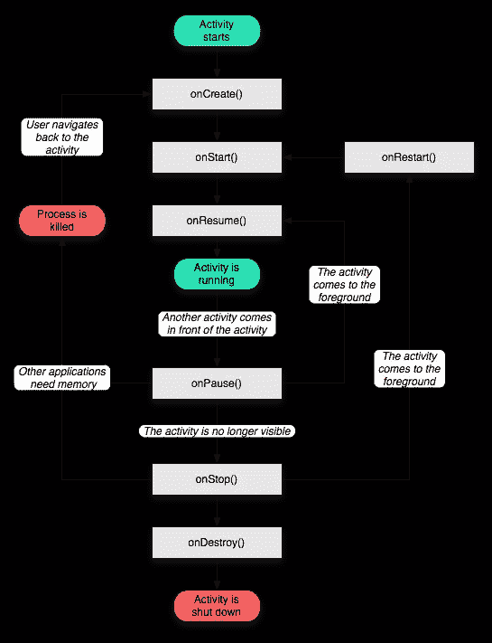
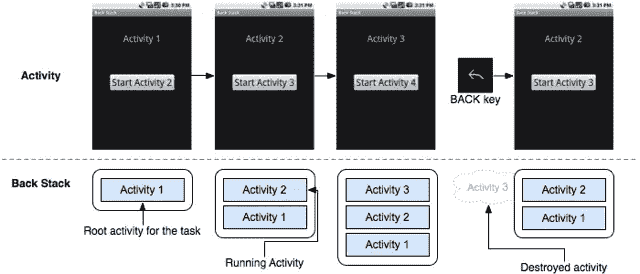
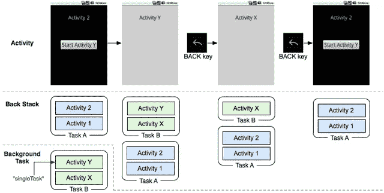

# 活动、任务和意图，天啊！

> 原文：<https://www.sitepoint.com/activities-tasks-and-intents-oh-my/>

每当你读到 Android 开发的时候，你都会看到 *Activity* 这个词一直在弹出。在本文中，我们将解释什么是活动，以及它们如何与手机上运行的任务、流程和后台堆栈相关联。

### 活动

活动是您在屏幕上看到的可视组件，带有一些相关的逻辑来管理生命周期和导航。一个应用程序通常由几个活动组成。当您从一个屏幕移动到另一个屏幕时，通常您会改变活动，用新的内容和控制器替换屏幕上的内容。

每个活动都被定义为`android.app.Activity`的一个子类，并且必须在您的清单文件中声明，同时声明如何启动活动。活动也有生命周期，响应以下状态机:

[](https://www.sitepoint.com/wp-content/uploads/2011/07/activity_lifecycle.png)

活动状态机

当活动出现在屏幕上时，它正在运行(图中为绿色)。安卓改活动的时候会暂停。当调用`onPause()`方法时，停止任何正在运行的 CPU 密集型任务(如动画、图形)是开发人员的责任。Android 也可能请求停止某个活动，因为它想要恢复内存。发生这种情况时，活动可能会停止。和以前一样，当被发送给`onStop()`方法时，开发人员有责任尽可能地释放内存。最后，当应用程序关闭时，调用`onDestroy()`方法。当活动逐渐进入运行状态时，也有相应的`onCreate()`、`onStart()`和`onResume()`方法。

活动可以随时开始或重新开始。开发人员在活动中放置正确的代码来保存任何状态信息是非常重要的。例如，默认情况下，Android 会在屏幕旋转时重新创建一个活动，以允许该活动使用不同的布局和组件。可以忽略这一点，但这只是一个示例。开发人员应该将代码放在`onStart()`和`onStop()`方法中，以保存任何需要的状态。

### 将活动与后台堆栈链接在一起

大多数应用程序将由不止一个屏幕组成，Android 通过使用专用的后退按钮拥有非常强大的后退机制。它使用后台堆栈来实现这一点。当你点击 home 应用程序中的一个应用程序时，Android 会启动一个 back stack，并推送 home 活动。如果应用程序随后导航到另一个活动，则调用适当的生命周期事件，然后将其推送到堆栈上，成为最顶层(活动的)活动。

[](https://www.sitepoint.com/wp-content/uploads/2011/07/diagram_backstack1.png)

Android 后台堆栈

到目前为止，这一切听起来非常直截了当，对不对？如今每个手机操作系统都是以这种方式工作的。Android 有一点不同的地方是，back stack 可以包含来自不同应用程序的活动，这些活动被分组到一个称为任务的东西中。

一个应用程序可以在另一个应用程序中启动一个活动，使用一种叫做意图的东西(我们将在后面讨论)。这允许不同的应用程序进行协作，但不必太了解彼此。例如，当用户点击“反馈”按钮时，您可能希望从您的应用程序发送一封电子邮件。当这种情况发生时，Android 将编写器活动从 Gmail 应用程序推到任务的后台堆栈上，用户输入他们的消息。当他们完成时(或按下 back), Android 会弹出 gmail 活动，并返回到下一个活动，这将是你的应用程序。这使得应用程序看起来像是作为一个连贯的任务一起工作，而实际上它们是完全独立的。

[](https://www.sitepoint.com/wp-content/uploads/2011/07/diagram_backstack_singletask_multiactivity1.png)

在任务中混合应用程序

也有可能一次有多个任务处于活动状态。比方说，你加载一个应用程序，向下钻取一些你想要的活动，然后按下 *Home* 按钮，启动另一个应用程序。Android 会记住你之前在任务中所处的状态。然后，它为您的新应用程序启动一个新任务，您可以进一步深入研究。现在，您可以自由地返回，在这两个任务之间切换，每次都返回到您之前所在的位置，这要归功于记住的任务及其后台堆栈。

默认情况下，如果你不返回任务，Android 会在一段时间后忘记任务。基本原理是，如果你一段时间没有使用一项任务，那么你就对它失去了兴趣，它可以被关闭。这解释了为什么如果你退出比如说你的网络浏览器，但很快又回到它，然后你会回到上一页，但如果你几天后再回来，它可能会带你回到你的主页。这些都是 Android 自动为你管理的。

### 意图:在活动之间导航(以及其他)。

我们前面提到过，活动之间的导航是由意图管理的。意图是一种消息，应用程序通过 Android 操作系统向电话中感兴趣的各方广播。然后，应用程序使用 Android 清单文件将自己注册为这些意图事件的监听器，并采取相应的行动。如果使用得当，它们会非常强大。

在应用程序内的活动之间导航的最简单的例子是使用显式意图。使用这种方法，开发人员可以指定他们希望启动的特定活动类(例如使用*活动*中的`startActivity()`方法)。这非常简单，并且在 Android 开发者文档中有很好的记录。让我们来看看如何使用意图发送电子邮件。下面是我的一个应用程序的一个片段，它让用户可以很容易地向我发送诊断日志:

```
Intent sendIntent = new Intent(Intent.ACTION_SEND);
// Add attributes to the intent
sendIntent.setFlags(Intent.FLAG_ACTIVITY_NEW_TASK);
sendIntent.putExtra(Intent.EXTRA_SUBJECT, "Log dump from NodeDroid");
sendIntent.putExtra(Intent.EXTRA_EMAIL, new String[] { "android-logs@8bitcloud.com" });
sendIntent.putExtra(Intent.EXTRA_TEXT, "");
sendIntent.setType("application/zip");
sendIntent.putExtra(Intent.EXTRA_STREAM, Uri.fromFile(dumpFile));

startActivity(Intent.createChooser(sendIntent, "Email:"));
```

在这个代码示例中，我创建了一个意图，并赋予它一个动作(`Intent.ACTION_SEND`)，还设置了一些额外的字段来指定电子邮件应该发送给谁、主题和文件附件。最后，我调用`startActivity()`来启动意图。当运行时，意图被广播到 Android 操作系统，Android 操作系统检查哪些应用程序可以响应它。如果不止一个应用程序可以响应(在这种情况下很常见)，操作系统会向用户提供一个应用程序选项来处理意图，并选择该应用程序作为以后使用的默认应用程序。做出选择后，活动开始，撰写屏幕将显示。

当编写应用程序时，开发人员应该选择如何构建他们的意图，以便其他应用程序可以使用它们。例如，您可能正在编写一个联系人列表应用程序。通过选择正确的动作名称并在意图中将联系人 ID 作为附加数据传递，您可以让其他应用程序加载用户的联系人信息，而不是让您的应用程序成为一个封闭的盒子，只有它自己可以访问。

### 总结

在本文中，我们解释了 Android 通过使用活动和任务来整合导航的方式。这一切都被 Android 强大的意图系统绑定在一起，使创建在手机上协作的应用程序成为可能，为用户提供了一致而直观的界面。在使用 Android 开发时，围绕任务和活动有许多概念需要学习，但是一旦你掌握了其中的诀窍，开发出与系统的其他部分良好协作的应用程序就变得非常容易了。就个人而言，我认为这是 Android 平台最引人注目的优势之一。

## 分享这篇文章