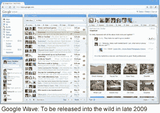

# 卡梅伦·亚当斯谈谷歌 Wave 的设计

> 原文：<https://www.sitepoint.com/adams-designing-google-wave/>

**如果你还不了解谷歌的下一件大事，[挥手](http://wave.google.com)，让我给你一个电梯推销:**

我们都知道 HTTP、电子邮件和即时消息等协议。谷歌现在已经开发了一种全新的协议，称为 Wave 以及支持它的应用程序-旨在将这些协议编织成一个新的、连贯的整体。

实际上，这可以将即时消息放入你的电子邮件中，将 Twitter 放入你的即时消息中，将地图放入你的 Twitter 中，等等。很难夸大这个项目的雄心和范围，但如果你想获得一个更清晰的画面，我建议听听 Lars 在五月下旬做的完整演示。

最近，我和卡梅伦聊了聊他作为“G 人”的生活，以及他将在 10 月份的 Web Directions South(T1)演讲中涉及的一些内容。

*参加 [Web Directions 小测验](https://www.sitepoint.com/quiz/webdirections/wds09)，你就有可能赢得一张门票，观看卡梅隆今年晚些时候在悉尼 [Web Directions South](http://south09.webdirections.org/) 的演讲。*

嘿，小卡，谢谢你给我们一点时间。Google Wave 当然引起了巨大的轰动(请原谅我的双关语——我肯定其他人也这么做过！)在五月份的谷歌输入输出大会上，网民们对重塑在线交流的前景非常兴奋。你如何着手为一种尚未存在的交流形式定义接口？

卡梅伦·亚当斯:当然，确切形式的 Wave 还不存在(在那个阶段)，但这并不意味着它没有受到现有技术的影响。有很多不同的沟通模式可以很好地映射到 Wave——论坛、维基、聊天、文档编辑、电子邮件——所以我们的出发点是查看所有这些模式，并找出哪些部分适合 Wave 的结构。

最困难的部分是调和似乎截然相反的分歧。

例如，聊天的即时性与文档编辑更冗长、更结构化的本质之间的对比——你如何在完成输入后提交内容？回车键？你可以在聊天中使用回车键，但是人们在文档中使用回车键来换行。

我们的解决方案是适当地使用 shift-enter 来提交，这工作得很好(当您开始在其他地方使用它时，您可以感觉到它确实如此),但是会产生可学性问题。

这是另一个主要挑战——知道什么时候坚持传统，知道什么时候推出独特的解决方案。有时候你做对了，有时候没有。这就是测试的目的！

是的，我想人们很容易忘记回车键在不同的应用程序中有多少不同的用途。

谷歌显然因其测试而闻名。Wave 的用户测试程序是如何工作的？新功能和特性在实现过程中是否经过用户测试？或者在每个开发阶段结束时对应用程序进行整体用户测试是否更有用？

我们仍处于测试阶段。离我们把这个东西拿到消费者手里还有一段时间，所以在这段时间里，我们会疯狂地进行微调。

我们对产品进行了两种类型的测试，它们处于非常不同的水平。

为了测试刚出炉的东西，我们基本上带着几个原型在办公室里走来走去，把人拖到地上，强迫他们使用这个应用程序。这可以是静态模型或草图的形式，再加上这样的问题:如果你点击它，你认为会发生什么？或者，我发现对于这样的应用程序来说，最有价值的过程是创建一个我们正在思考的行为的简化原型，并让人们去尝试它。

拥有一幅需要人们发挥想象力的图像，与向他们展示工程师们两个月后将建造的东西是完全不同的。所以，我有一堆不同的交互原型，每个都专注于一个领域——滚动、输入、插入、拖动等等。我们会调整这些，直到我们喜欢我们所拥有的，用户获得最佳体验。然后我们把它交给工程师来正确地建造。

我们执行的第二组测试更具纵向性——它在几周和几个月内跟踪人们对产品的使用。这使我们能够看到哪些概念最能传达给用户，人们是否在一段时间后习惯了应用程序的一些独特的交互，以及产品在日常生活中的一般用途。目前，这一切都是由内部参与者完成的，在谷歌这样大的地方，我们不缺乏主题。

Wave 是一个规模巨大的项目。我怀疑许多技术人员真的对此感到兴奋，但可能很难定义他们的经理和支票签署人的好处。

你是否试图为早期采用者设计简单易行的途径？或者你只是创造工具，让人们决定如何和在哪里使用它？

我们认为产品本身对早期用户来说很容易成功，所以无论你使用 Google Wave 的每个功能还是其中一个功能，你都可以从中受益。但从设计的角度来看，我们也试图在第一用户体验和创造一个功能更丰富的产品供人们探索之间小心翼翼地平衡……也许会时不时地朝着功能的方向摇摆。

让人们理解产品，并在第一次使用时就掌握它，这绝对是一个重要的优先事项，而且可能是我们还没有完全完成的事情。

我总是提倡简单胜于复杂(这在一个工程师的公司里很难做到！)，但我们也承认，对于初次用户来说，界面只是
拼图的一部分。

因此，我们还关注如何在人们首次登录时吸引他们，如何让他们在使用产品时保持积极性，以及如何在应用程序之外传递产品信息——创建营销材料，不仅让人们对 Google Wave 感兴趣，还告诉他们如何使用它。我认为 iPhone 在这方面做得很好。

很明显，谷歌拥有非常广泛的用户群。在为这样的用户群进行设计时，Wave 团队在你脑海中集体想到了谁？这只是最小公分母还是谷歌有一套他们使用的用户角色，或者你只是想让它为 Lars 和 Jens 的妈妈工作？

不仅是他们的妈妈，还有他们的大家庭。

就像谷歌的许多东西一样，Google Wave 主要是为了挠我们自己的痒而写的。我们是不是遗漏了什么我们需要的东西？我们在建造我们不需要的东西吗？从这个意义上说，我们的目标是达到相当不错的技术能力水平，因为他们是早期采用者。但是我们的目标是让界面的基础足够简单，让能力较弱的用户能够相当容易地掌握。

我知道 Google 的其他项目大量使用了人物角色来定义他们应用程序的目标。然而，由于各种原因，尽管我们的用户研究员 Aaron Cheang 进行了勇敢的尝试，我们的团队仍然没有采用它们。

然而，从广义上讲，我们为产品的更多面向消费者的用途而构建。由于传统系统的惯性，企业很难进入，所以这是我们喜欢在消费者采用产品并取得成功后解决的问题。

话虽如此，但企业部门对 Google Wave 有着惊人的兴趣，我们有一个强大的企业故事，因此这可能会影响我们的消费者发布后会发生什么。

目前，很多标准的交流方式——电子邮件、即时消息和推特——通常都可以被广泛使用。将它们集成到一个单一的非线性应用程序中是否会带来可访问性问题？

我不认为将不同形式的交流集成到一个产品中有任何固有的可访问性问题。让他们以跨格式的方式一起工作肯定会有挑战(你如何在实时聊天中处理电子邮件用户？)但这更多的是关于不同服务的协同工作，而不是可访问性。

我认为 Google Wave 的一个伟大之处在于，这个项目不仅仅是关于我们的客户——它也是关于 API 和协议本身。

我们肯定知道我们无法满足地球上每个用户的需求，所以就像 Twitter 一样，我可以想象一个世界，其中有几十个不同的 Wave 客户端来满足用户的特定需求——简单、复杂、实时、静态、聚合、移动、大型、小型、web、桌面。挑选你想要的，然后按照你的想法来建造它。

Wave 与 Twitter 整合得非常好，但把这些事件称为“Twaves”你反对采用这个术语吗？

如果我知道这件事，我会表明立场的！

事情的扩展/API 方面可能是 Wave 的蛮荒西部。开发人员离开去建造东西，当他们演示的时候我看到他们。因此，接口可能有点…不完善，因为是命名。

这样做有很大的优势——有一点编程知识的人可以很快建立一个想法，并看看它是否可行，而不必经历重重困难来完成一个接口。然后，如果它被证明是有用的，我们就可以开始提炼经验。

不利的一面是，如果你建造了它，你可以给它命名！

啊，在一篇接下来的天才文章中，我相信这是你在 WD09 演讲中将要谈论的话题？

没错。在 Web Directions 上，我将谈论创新:它如何在一个大公司内部工作，我们如何接近它，如何设计(在头脑中)，以及(更广泛地)为下一代 Web 应用程序设计。

好的，Cam，谢谢你花时间和我们在一起，我们期待着 10 月份在悉尼和你见面。

干杯亚历克斯。

***记得参加[网络指南小测验](https://www.sitepoint.com/quiz/webdirections/wds09)，有可能为自己赢得一张今年 10 月悉尼南方网络指南的门票。***

*图片来源:[网页说明](http://www.flickr.com/photos/webdirections/2902789021/)*

## 分享这篇文章