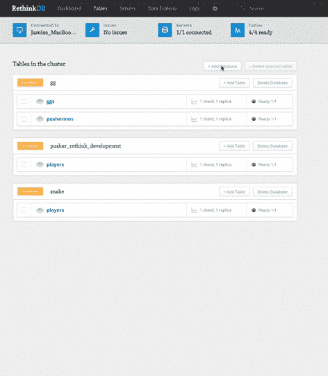

# 使用 Pusher 为事件 Web 调整 RethinkDB

> 原文：<https://www.sitepoint.com/adapting-rethinkdb-for-the-evented-web-with-pusher/>


RethinkDB 最近[发布了 2.0 版本](https://rethinkdb.com/blog/2.0-release/)，在 Pusher，我们都非常兴奋地看到创建实时应用现在变得更加容易。 [Changefeeds](https://rethinkdb.com/docs/changefeeds/ruby/) ，RethinkDB 几个版本之前引入的一个特性，允许您的系统监听数据库中的变化。这个新版本有了显著的改进，为实时应用开辟了有趣的可能性。

虽然 RethinkDB 涵盖了监听服务器上的事件，但是仍然存在将这些更改发布给客户机的问题，客户机可以构建从新闻提要到数据可视化的任何内容。

这就是托管消息代理如 [Pusher](https://pusher.com/) 发挥作用的地方。通过将 RethinkDB changefeed 更改公开为 Pusher 事件，您可以快速实现可伸缩的最后一英里交付，即时将数据库更新推送到客户端。不仅如此，Pusher 的事件发布-订阅方法符合实时应用程序的逻辑:

*   **通道**识别数据，无论是数据库中的表，还是 RethinkDB 中的 changefeed。
*   **事件**表示数据发生了什么:新数据可用、现有数据被更新或数据被删除。

作为一个额外的好处，实时功能可以快速投入生产，因为 Pusher 可以扩展到数百万个并发设备和连接，消除了管理自己的实时基础设施的痛苦。

为了向你展示如何做到这一点，这篇文章将指导你如何创建在 [RethinkDB 网站](https://rethinkdb.com)上找到的活动流类型。通过创建一个小的 Sinatra 应用程序，我们将快速构建 JSON feed 和高分列表，你可以在我们的演示中看到[。请注意，虽然我们使用的是 Ruby 和 Sinatra，但 RethinkDB 适配器的一个优点是它们在所有语言中非常相似。换句话说，我们在这里所做的可以很容易地应用到您选择的堆栈中。](https://pusher-rethinkdb.herokuapp.com)

这里可以玩试玩[。如果你在任何一点上卡住了，请随时](https://pusher-rethinkdb.herokuapp.com)[检查源代码](https://github.com/pusher/snake-rethinkdb/tree/322219a9593d871b1b863d45a2871d4686217074)。

## 步骤 1:设置

首先，如果你还没有帐户，[注册一个免费的 Pusher 帐户](https://pusher.com/signup)。请将您的应用程序凭据放在身边。

如果您没有安装 RethinkDB，您可以使用 [Homebrew](https://brew.sh/) 在 Mac 上安装它:

```
$ brew install rethinkdb 
```

其他操作系统的安装可以在文档中找到[。](https://rethinkdb.com/docs/install/)

要启动 RethinkDB 服务器，请在终端中键入:

```
$ rethinkdb 
```

现在浏览到[https://localhost:8080/# tables](https://localhost:8080/#tables)，这将导致一个 Web UI，您可以在其中创建您的数据库。创建一个名为`game`的数据库和一个名为`players`的表。



在您的项目目录中，将 Pusher 和 RethinkDB gems 添加到您的 gem 文件中，同时为我们的 web 应用程序添加 Sinatra:

```
gem 'pusher'
gem 'rethinkdb'
gem 'sinatra' 
```

捆绑安装你的 gems，为路由处理器创建 **app.rb** ，为数据库配置创建 **rethinkdb.rb** 。

在 **rethinkdb.rb** 中，我们来连接数据库。使用你的应用凭据设置我们稍后需要的 Pusher 实例。你可以在[你的仪表盘](https://app.pusher.com)上得到这些。

```
require 'rethinkdb'
include RethinkDB::Shortcuts

require 'pusher'

pusher = Pusher::Client.new({
  app_id: <your_app_id>,
  key: <your_app_key>secret: <your_app_secret>})

$conn = r.connect(
  host: "localhost",
  port: 28015, # the default RethinkDB port
  db: 'game',
)</your_app_secret></your_app_key></your_app_id> 
```

在 **app.rb** 中，设置一个 Sinatra 应用程序的基本框架:

```
require 'sinatra'
require './rethinkdb'

get '/' do
  erb :index
end 
```

## 步骤 2:创建玩家

正如你在[演示](https://pusher-rethinkdb.herokuapp.com/)中看到的，每当玩家输入他们的名字，一场贪吃蛇的游戏就开始了。同时，我们希望根据用户提供的名称创建一个播放器实例。

这个演示不会深入到应用程序背后的 HTML 和 jQuery。贪吃蛇游戏基于借用的代码(您可以在这里阅读),这将偏离本教程的目的:用几行代码实现最后一英里的交付。但是如果你想深入了解它，请随意查看源代码。

在创建用户的情况下，我们只是想发送一个 AJAX POST 到 Sinatra 服务器的`/players`和`{name: "the user's name"}`。在这个端点，应用程序运行一个简单的 [`insert`](https://rethinkdb.com/api/ruby/#insert) 查询到`players`表中:

```
post '/players' do
  name = params[:name]
  r.table("players").insert(name: name).run($conn) # pass in the connection to `run`
  "Player created!"
end 
```

就这么简单！如果你运行应用程序并浏览到[https://localhost:8080/# data explorer](https://localhost:8080/#dataexplorer)，运行`r.table("game").table("players")`，你应该会看到你全新的播放器文档。

虽然这成功地创建了一个新的玩家，但我们可能希望服务器记住它们以备后续请求，比如提交分数。我们可以修改这个端点，在一个会话中存储玩家的 ID。方便的是，RethinkDB 查询响应在一个`"generated_keys"`字段中返回实例的 ID。

```
post '/players' do
  name = params[:name]
  response = r.table("players").insert(name: name).run($conn)
  session[:id] = response["generated_keys"][0]
  "Player created!"
end 
```

## 第三步:提交玩家分数

为了使演示更加有趣和具有交互性，我在 snake 代码中添加了两个 jQuery 事件。一个用于[在玩家创建后触发游戏开始](https://github.com/pusher/the-snake/blob/ff400c9e59c114b654145c9b638cb63b5eb508b4/public/app.js#L39)，另一个用于[监听游戏结束并检索用户的分数](https://github.com/pusher/the-snake/blob/ff400c9e59c114b654145c9b638cb63b5eb508b4/public/app.js#L58-L60)。

当游戏结束时，分数被传递给 jQuery 事件监听器。使用这个分数，用参数`{score: score}`向`/players/score`发送一个简单的 POST。路由处理器通过玩家的会话 ID 获取玩家，并相应地更新他们的分数和高分:

```
post '/players/score' do
  id = session[:id]
  score = params[:score]

  player = r.table("players").get(id).run($conn) # get the player

  score_update = {score: score} # our update parameters

  if !player["score"] || score > player["high_score"]
    # if the player doesn't have a score yet
    # or if the score is higher than their highest score
    score_update[:high_score] = score
    # add the high-score to the query
  end

  r.table("player").get(id).update(score_update).run($conn) # e.g. .update(score: 94, high_score: 94)
  {success:200}.to_json
end 
```

现在我们的数据库中有了`players`的`high_score`键，我们可以开始渲染排行榜的静态视图，然后再进行实时渲染。在 **rethinkdb.rb** 中，让我们建立我们的排行榜查询:

```
LEADERBOARD = r.table("players").order_by({index: r.desc("high_score")}).limit(5) 
```

为了实现这一点，请确保您已经创建了一个名为`high_score`的索引，通过该索引可以对`players`进行排序。你可以通过运行`r.db("game").table("players").indexCreate("high_score")`在[你的 RethinkDB 数据浏览器](https://localhost:8080/#dataexplorer)中做到这一点。

该应用程序需要一个`/leaderboard`端点，以便向 DOM 呈现 leaders:

```
get '/leaderboard' do
  leaders = LEADERBOARD.run($conn)
  leaders.to_a.to_json
end 
```

使用 jQuery 或您喜欢的 Javascript 框架，显示最高分玩家的静态列表:

```
$.get('/leaderboard', function(leaders){
  showLeaderboard(leaders); // showLeaderboard can render leaders in the DOM.
}) 
```

## 步骤 4:使您的数据库实时化

正如你从[演示](https://pusher-rethinkdb.herokuapp.com/)中看到的，我们涉及到两个实时流:一个实时分数的原始 JSON feed，和一个实时排行榜。为了开始了解这些变化，我们将使用 RethinkDB gem 的 EventMachine 适配器。在 **rethinkdb.rb** 的顶部，加上`require 'eventmachine'`。Sinatra 将 EventMachine 列为依赖项，因此它应该已经在您的 bundle 的上下文中可用了。

鉴于我们已经构建了上面的`LEADERBOARD`查询，让我们深入了解如何监听关于该查询的变化。所有需要做的就是在查询中调用`changes`方法，而不是调用`run`，而是调用`em_run`。一旦我们有了更改，我们所需要的就是一行 Pusher 代码来触发客户端的事件。

```
EventMachine.next_tick do # usually `run` would be sufficient - `next_tick` is to avoid clashes with Sinatra's EM loop
  LEADERBOARD.changes.em_run($conn) do |err, change|
    updated_player = change["new_val"]
   pusher.trigger(“scores”, "new_high_score", update_player)
  end
end 
```

RethinkDB 的 changefeed 的一个惊人之处在于，每当查询发生变化时，它都会传递增量，因此您可以获得旧值和新值。此查询的一个示例显示了获得高分的玩家的先前和更新的实例，如下所示:

```
{
  "new_val": {
    "high_score": 6 ,
    "id":  "476e4332-68f1-4ae9-b71f-05071b9560a3" ,
    "name":  "thibaut courtois" ,
    "score": 6
  },
  "old_val": {
    "high_score": 2 ,
    "id":  "476e4332-68f1-4ae9-b71f-05071b9560a3" ,
    "name":  "thibaut courtois" ,
    "score": 1
  }
} 
```

在这种情况下，我们只需获取变更的`new_val`——即最近获得的高分——并通过该更新在名为`scores`的频道上触发名为`new_high_score`的推送事件。您可以通过在您的应用程序或 RethinkDB 数据浏览器中更改玩家的高分来测试它的工作情况，然后前往您在[https://app.pusher.com](https://app.pusher.com)上的调试控制台查看新创建的事件。

演示中显示的原始 JSON 分数提要也很容易实现。让我们构建查询并将其放在同一个 EventMachine 块中:

```
LIVE_SCORES = r.table("players").has_fields("score")
# all the players for whom `score` isn't `nil`

EventMachine.next_tick do

  ...

  LIVE_SCORES.changes.em_run($conn) do |err, change|
    updated_player = change["new_val"]
    pusher.trigger(“scores”, "new_score", updated_player)
  end
end 
```

现在，在浏览器调试控制台中，每当有人的分数发生变化时，您应该会看到这样的事件:

```
{
  "high_score": 1,
  "id": "97925e44-3e8f-49cd-a34c-90f023a3a8f7",
  "name": "nacer chadli",
  "score": 1
} 
```

## 步骤 5:从数据库到 DOM

既然每当查询值改变时都会触发 Pusher 事件，我们可以在客户机上绑定这些事件，并相应地改变 DOM 。我们只需用 app key 创建一个新的 Pusher 实例，订阅`scores`通道，并将回调绑定到该通道上的事件:

```
var pusher = new Pusher("YOUR_APP_KEY");

var channel = pusher.subscribe("scores");

channel.bind("new_score", function(player){
  // append `player` to the live JSON feed of scores
});

channel.bind("new_high_score", function(player){
  // append `player` to the leaderboard
}); 
```

现在，您有了它:一种简单而有效的方法，无论何时数据库发生变化，都可以实时更新客户机！

## 前进

希望我们已经让您深入了解了 RethinkDB 漂亮的查询语言和令人敬畏的实时功能。我们还展示了 Pusher 如何轻松地集成到从数据库到客户的“最后一英里交付”中。除了设置应用程序本身，启动和运行 changefeeds 并不需要太多代码。

我向您展示的演示是一个相当小而简单的。大型的生产应用程序很可能更能感受到 Pusher 与 RethinkDB 集成的好处。RethinkDB 允许您轻松地扩展数据库，Pusher 为您处理实时消息的可伸缩性。将这两者结合起来，开发人员可以构建强大可靠的可扩展应用程序。

## 分享这篇文章