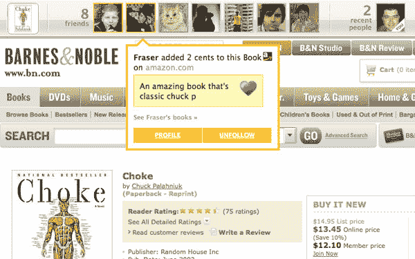

# AdaptiveBlue 宣布 Glue:终极垂直社交网络

> 原文：<https://www.sitepoint.com/adaptiveblue-announces-glue-the-ultimate-vertical-social-network/>

在大多数公司都在精简业务以降低烧钱率并尽可能利用现有现金的时候，总部位于新泽西的 AdaptiveBlue 今天很幸运地宣布了一轮大型 B 轮融资。由 RRE 风险投资公司牵头，并有第一轮牵头的联合广场风险投资公司参与，AdaptiveBlue 今天宣布，他们在第二轮融资中又筹集了 450 万美元，使他们的总融资额达到约 600 万美元。

## BlueOrganizer 变成胶水

然而，比资金宣布更令人兴奋的是，该公司还宣布了他们超受欢迎的 BlueOrganizer Firefox 扩展的第二代产品。新版本的语义插件将被称为 [Glue](http://getglue.com/) ，是对 BlueOrganizer 的彻底改造。事实上，尽管 Glue 包含了使 BlueOrganizer 如此受欢迎的相同类型的语义发现位，但它本质上是一种全新的产品，它在基于产品和媒体内容的 web 之上添加了一个分散的社交网络层。

这听起来很复杂，但实际上再简单不过了。Glue 基本上是一个终极的垂直社交网络，它将你与志同道合的用户联系起来，不管你使用什么样的网络。Glue 是关于拆除围墙花园，将用户从信息孤岛中解放出来。

## 胶水是如何工作的

它是这样工作的:用户安装免费的 Glue 扩展，然后像平常一样浏览网页。Glue 使用为 BlueOrganizer 开发的语义技术，该技术可以识别您正在查看的特定实体，可以跟踪您在网络上与各种垂直领域进行交互的内容，如书籍、音乐、电影、电视节目、葡萄酒、餐馆、小工具、股票和大量受支持网站的艺人。每当你访问 Glue 识别的实体时，它会在页面顶部添加一个栏。

该栏显示与该项目互动过的其他人(无论是书籍、电影还是其他内容)，以及您的哪些朋友与该项目互动过。但问题在于:其他人在哪里与某物互动并不重要。为了粘合，维基百科上的电影页面与亚马逊上的相同，与 IMDB 上的相同，等等。例如，如果我在 IMDB 上查看新的*印第安纳琼斯*电影的电影页面，Glue 会告诉我我的朋友是否在维基百科、Barnes and Noble、Fandango、亚马逊等网站上查看了印第安纳琼斯。

正如你在下面的截图中看到的，Glue 正在向在 Barnes and Noble 上浏览同一本书的用户提供关于在亚马逊上与一本书进行交互的用户的信息。

正如 AdaptiveBlue 创始人亚历克斯·伊斯科尔德告诉我的那样，这是多么强大的最终例子，这意味着百视达和网飞的用户现在可以互动，分享他们对电影的品味，而以前他们被锁在他们使用的任何网站上。胶水完全消除了服务周围的墙。

Glue 还引入了“喜欢”的概念——这样你就可以标记你最喜欢的内容——以及“2 美分”——与朋友分享的 140 个字符的简短评论。用户还可以删除他们与某个项目的互动，以避免脸书灯塔式的隐私失礼行为，即提前与收件人分享圣诞礼物，或者在允许其他人跟踪他们的浏览活动之前要求批准。

下面的视频是 AdaptiveBlue 向用户介绍 Glue 的截屏:

<object width="500" height="302"><param name="allowfullscreen" value="true"> <param name="allowscriptaccess" value="always"> <param name="movie" value="https://vimeo.com/moogaloop.swf?clip_id=1965471&amp;server=vimeo.com&amp;show_title=0&amp;show_byline=0&amp;show_portrait=0&amp;color=00ADEF&amp;fullscreen=1"> <embed src="https://vimeo.com/moogaloop.swf?clip_id=1965471&amp;server=vimeo.com&amp;show_title=0&amp;show_byline=0&amp;show_portrait=0&amp;color=00ADEF&amp;fullscreen=1" type="application/x-shockwave-flash" allowfullscreen="" allowscriptaccess="always" width="500" height="302"></object>

## 分享这篇文章