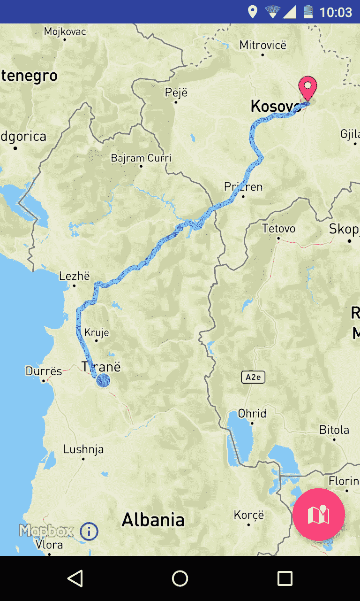
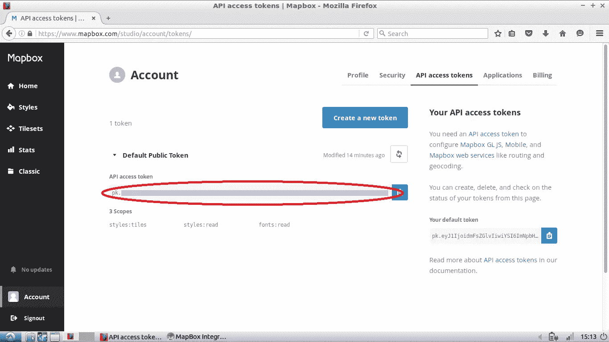
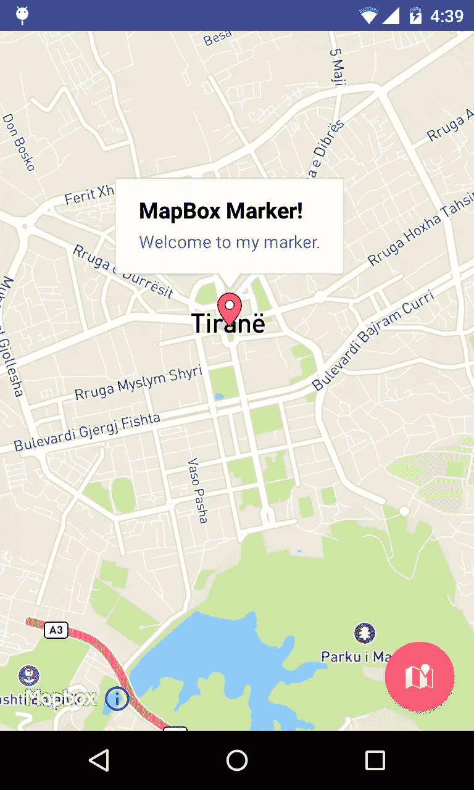
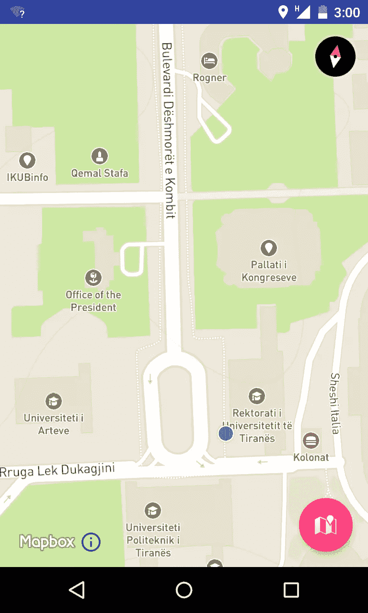
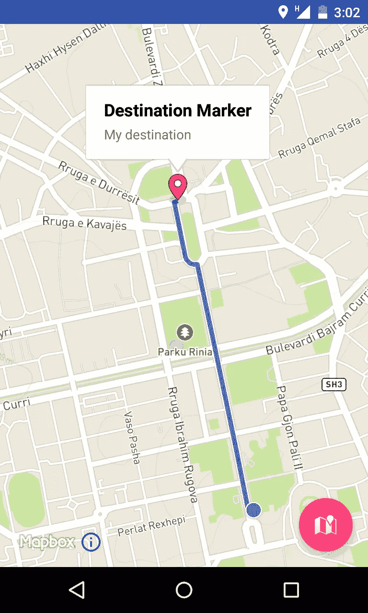

# 使用 MapBox 为您的 Android 应用程序添加精美的地图

> 原文：<https://www.sitepoint.com/add-elegant-maps-to-your-android-app-with-mapbox/>

Mapbox 是一个开源的 SDK，用于像素完美的矢量地图，保证视频游戏的渲染速度和流畅度。如果你有兴趣在你的应用程序中集成地图功能，那么 Mapbox 是一个值得考虑的选择。

Mapbox Android SDK [概述](https://www.mapbox.com/android-sdk/)和[示例](https://www.mapbox.com/android-sdk/examples/)是一个很好的起点。在本教程中，我将创建一些更复杂的东西，一个在地图上绘制从起点到终点的最佳路线的应用程序。



我们开始吧！

你可以在 [GitHub](https://github.com/sitepoint-editors/MapBox-App) 上找到最终项目的代码。

要在您的应用程序中使用 Mapbox，您需要一个 API 访问令牌。要得到一个，请[创建一个地图箱账户](https://www.mapbox.com/studio/signup/)，并在这里找到你的[。](https://www.mapbox.com/studio/account/tokens)



将令牌添加到 Android 项目中的 *strings.xml* :

```
<string name="accessToken">Your access token</string>
```

在 *AndroidManifest.xml* 中添加以下互联网和位置访问权限。

```
<uses-permission android:name="android.permission.ACCESS_NETWORK_STATE"/>
<uses-permission android:name="android.permission.INTERNET"/>

<uses-permission android:name="android.permission.ACCESS_COARSE_LOCATION"/>
<uses-permission android:name="android.permission.ACCESS_FINE_LOCATION"/>
<uses-permission android:name="android.permission.ACCESS_WIFI_STATE"/>
```

**注意**:在 Android Marshmallow (API 23)及以上版本中，需要[在运行时请求权限](https://developer.android.com/training/permissions/requesting.html)。

## 安装地图框

打开 *build.gradle(Module: app)* ，添加 MapBox 作为依赖项。

```
repositories {
    mavenCentral()
}

dependencies {
    . . .

    compile('com.mapbox.mapboxsdk:mapbox-android-sdk:3.2.0@aar') {
        transitive = true
    }
    compile ('com.mapbox.mapboxsdk:mapbox-android-directions:1.0.0@aar'){
        transitive=true
    }

}
```

第一个依赖项表示 Mapbox，第二个是方向库，用于将驾车、步行和骑行路线添加到应用程序中，并在地图上绘制它们。

## 地图布局

在 *content_main.xml* 布局文件中，用以下内容替换内容:

```
<?xml version="1.0" encoding="utf-8"?>
<RelativeLayout xmlns:android="http://schemas.android.com/apk/res/android"
    xmlns:mapbox="http://schemas.android.com/apk/res-auto"
    xmlns:tools="http://schemas.android.com/tools"
    android:layout_width="match_parent"
    android:layout_height="match_parent"
    tools:context="com.example.valdio.mapboxintegration.MainActivity"
    tools:showIn="@layout/activity_main">

    <com.mapbox.mapboxsdk.views.MapView
        android:id="@+id/mapview"
        android:layout_width="fill_parent"
        android:layout_height="fill_parent"
        mapbox:access_token="@string/accessToken" />

</RelativeLayout>
```

初始化`MainActivity`类中需要的变量:

```
public class MainActivity extends AppCompatActivity {

  private MapView mapView = null;
  private String MAPBOX_ACCESS_TOKEN = "";
  private DirectionsRoute currentRoute = null;

  ...
```

在*MainActivity.java*的`onCreate()`方法中，删除工具栏和浮动动作按钮代码，并通过添加以下内容初始化地图:

```
String MAPBOX_ACCESS_TOKEN = getResources().getString(R.string.accessToken);

// Set up a standard Mapbox map
MapView mapView = (MapView) findViewById(R.id.mapview);
mapView.setAccessToken(MAPBOX_ACCESS_TOKEN);
mapView.setStyleUrl(Style.MAPBOX_STREETS); // specify the map style
mapView.setZoom(14); // zoom level
mapView.onCreate(savedInstanceState);
```

Mapbox 地图需要实现`Activity`的生命周期方法以避免运行时错误，所以添加必要的覆盖函数。

```
@Override
protected void onStart() {
    super.onStart();
    mapView.onStart();
}

@Override
protected void onStop() {
    super.onStop();
    mapView.onStop();
}

@Override
protected void onDestroy() {
    super.onDestroy();
    mapView.onDestroy();
}

@Override
protected void onResume() {
    super.onResume();
    mapView.onResume();
}

@Override
protected void onPause() {
    super.onPause();
    mapView.onPause();
}

@Override
protected void onSaveInstanceState(Bundle outState) {
    super.onSaveInstanceState(outState);
    mapView.onSaveInstanceState(outState);
}
```

既然 Mapbox 已经配置好了，是时候开始构建应用程序了。

## 向地图添加标记

将以下内容添加到`MainActivity`中`onCreate`的底部:

```
CameraPosition cameraPosition = new CameraPosition.Builder()
        .target(new LatLng(41.327752, 19.818666)) // Sets the center of the map to the specified location
        .zoom(13)                            // Sets the zoom level
        .build();

//set the user's viewpoint as specified in the cameraPosition object
mapView.moveCamera(CameraUpdateFactory.newCameraPosition(cameraPosition));

//Add a marker to the map in the specified location
mapView.addMarker(new MarkerOptions()
        .position(new LatLng(41.327752, 19.818666))
        .title("MapBox Marker!")
        .snippet("Welcome to my marker."));
```

是一个有用的 Mapbox 类，用于设置用户视点的位置、角度、缩放和倾斜。

这是标记在地图上的外观:



## 获取设备位置。

要让 Mapbox 访问设备位置，必须启用定位服务，并且应用程序应该拥有使用这些服务的权限。如前所述，在 Android Marshmallow (API 23)和更高版本中，需要在运行时请求许可。

添加代码以获取新函数的当前位置:

```
 private void myLocation() {

        if (ActivityCompat.checkSelfPermission(this, Manifest.permission.ACCESS_FINE_LOCATION) != PackageManager.PERMISSION_GRANTED && ActivityCompat.checkSelfPermission(this, Manifest.permission.ACCESS_COARSE_LOCATION) != PackageManager.PERMISSION_GRANTED) {
            // TODO: Consider calling
            //    ActivityCompat#requestPermissions
            // here to request the missing permissions, and then overriding
            //   public void onRequestPermissionsResult(int requestCode, String[] permissions,
            //                                          int[] grantResults)
            // to handle the case where the user grants the permission. See the documentation
            // for ActivityCompat#requestPermissions for more details.
            return;
        }

        mapView.setMyLocationEnabled(true);
        mapView.setMyLocationTrackingMode(MyLocationTracking.TRACKING_FOLLOW);
        mapView.getMyLocation();
    }
```

并在地图初始化代码后调用此函数:

```
...
mapView.onCreate(savedInstanceState);

myLocation();
```

在这种情况下，跟踪被设置为`TRACKING_FOLLOW`，这意味着用户的位置将被持续监控，地图将随着变化而更新。



## 快到了！

你现在有了标记和位置，接下来就是在地图上绘制路线。

这使用了依赖项中导入的第二个库，即“方向库”，也是由 Mapbox 团队创建的。

它是这样工作的:

1.  创建两个`Waypoint`位置，起点和终点。
2.  创建一个`MapboxDirections`构建器对象，它是对 Mapbox API 的一个网络请求，包含起点和目的地`Waypoint`以及方向路线(驾车、步行或骑自行车)的配置文件。
3.  异步执行方向请求。`MapboxDirections`类有一个内置的异步请求，使用改进的 API，使用`enqueue()`来执行请求。
4.  `onResponse()`方法返回一个改进响应，这是一个标准的 JSON API 响应。
5.  响应正文包含位置坐标对，即将要绘制在地图上的坐标。
6.  使用地图框折线坐标绘制在地图上。折线是一种几何要素，具有绘制为直线的未闭合坐标列表。

要使用方向库，获取设备位置作为起点，并获取用户通过在地图上长按*指定的位置作为目的地。*

## 创建两个航路点位置，并在目的地上添加一个标记。

将以下内容添加到`onCreate`功能的底部:

```
mapView.setOnMapLongClickListener(new MapView.OnMapLongClickListener() {
    @Override
    public void onMapLongClick(LatLng point) {

        //Remove previously added markers
        //Marker is an annotation that shows an icon image at a geographical location
        //so all markers can be removed with the removeAllAnnotations() method.
        mapView.removeAllAnnotations();

        // Set the origin waypoint to the devices location
        Waypoint origin = new Waypoint(mapView.getMyLocation().getLongitude(), mapView.getMyLocation().getLatitude());

        // Set the destination waypoint to the location point long clicked by the user
        Waypoint destination = new Waypoint(point.getLongitude(), point.getLatitude());

        // Add marker to the destination waypoint
        mapView.addMarker(new MarkerOptions()
                .position(new LatLng(point))
                .title("Destination Marker")
                .snippet("My destination"));

        // Get route from API
        getRoute(origin, destination);

    }
});
```

### 创建 MapboxDirections 网络请求并异步运行它。

添加以下方法以获得最佳路径:

```
 private void getRoute(Waypoint origin, Waypoint destination) {
  MapboxDirections directions = new MapboxDirections.Builder()
          .setAccessToken(MAPBOX_ACCESS_TOKEN)
          .setOrigin(origin)
          .setDestination(destination)
          .setProfile(DirectionsCriteria.PROFILE_WALKING)
          .build();

  directions.enqueue(new Callback<DirectionsResponse>() {
      @Override
      public void onResponse(Response<DirectionsResponse> response, Retrofit retrofit) {

          // Display some info about the route
          currentRoute = response.body().getRoutes().get(0);
          showToastMessage(String.format("You are %d meters \nfrom your destination", currentRoute.getDistance()));

          // Draw the route on the map
          drawRoute(currentRoute);
      }

      @Override
      public void onFailure(Throwable t) {
          showToastMessage("Error: " + t.getMessage());
      }
  });
}
```

### 根据地图上的坐标绘制折线。

添加此方法来绘制路线:

```
 private void drawRoute(DirectionsRoute route) {
  // Convert List<Waypoint> into LatLng[]
  List<Waypoint> waypoints = route.getGeometry().getWaypoints();
  LatLng[] point = new LatLng[waypoints.size()];
  for (int i = 0; i < waypoints.size(); i++) {
      point[i] = new LatLng(
              waypoints.get(i).getLatitude(),
              waypoints.get(i).getLongitude());
  }

  // Draw Points on MapView
  mapView.addPolyline(new PolylineOptions()
          .add(point)
          .color(Color.parseColor("#38afea"))
          .width(5));
}

private void showToastMessage(String message) {
  Toast.makeText(this, message, Toast.LENGTH_SHORT).show();
}
```

运行项目，选择两个点，您应该会看到类似下面的内容。



## 多走一步

在本教程中，我介绍了 MapBox SDK 和方向库的基础知识。MapBox 有更多很酷的功能可以在你的应用中使用，比如不同的地图样式，或者不同的自定义矢量地图。

我推荐的另一个库是地理编码库，它可以将坐标转换成地址，反之亦然。要了解更多关于 MapBox 的信息，请查看它的[移动地图](https://www.mapbox.com/mobile/)，在那里你可以找到关于本教程中提到的[图书馆](https://www.mapbox.com/mobile/#directions-geocoding)的信息。

## 分享这篇文章