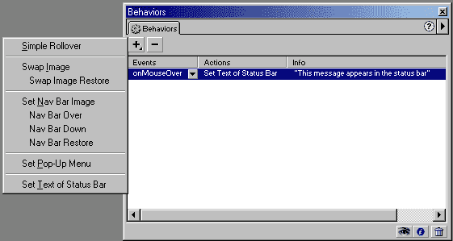
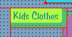
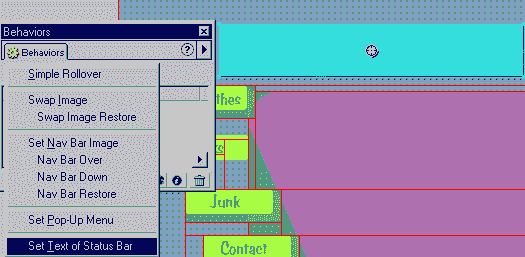
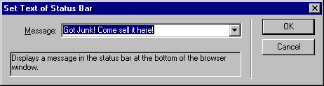
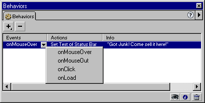
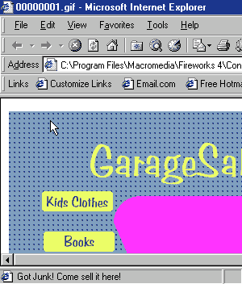
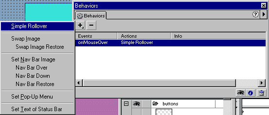
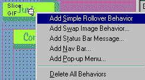
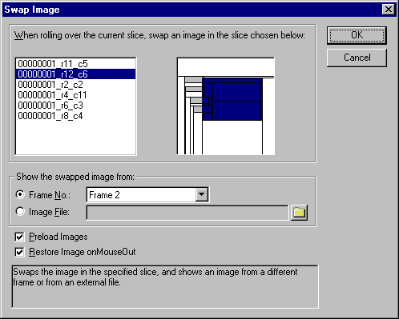
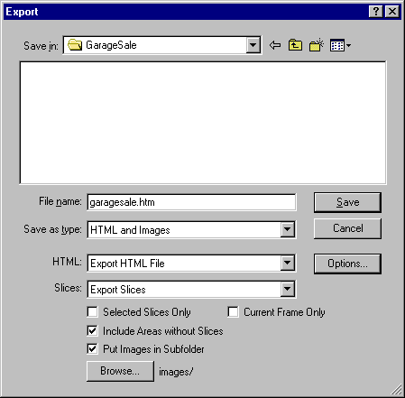

# 向 Fireworks 添加 JavaScript

> 原文：<https://www.sitepoint.com/add-javascript-fireworks/>

“你能不能再给它一点…我不知道… pizazz？”以前听过吗？有多少次客户走进来，看到一个网站的组成，虽然他们喜欢他们所看到的，但他们觉得它需要更多一点？你多久听到一次“你能让它互动吗？”

当然，从本质上来说，网站是互动的。但客户寻找的金块是表明他们的网站——因此也是他们的公司——利用了最新技术的东西。诀窍是为你的客户提供一点活力，并保证无论使用什么样的浏览器，你的技巧都会奏效。

Macromedia Fireworks 配备了完整的工具库，允许丰富的交互，并让您带客户超越设计。首先，你只需要学习一些参与规则，然后就可以开始与一个杀手级的设计和完全交互式的网站战斗了。

##### 交战规则

为网站增加交互性最常用的方法是使用 JavaScript。JavaScript 是一种受主流 Web 浏览器支持的编程语言，它允许事件(如图像交换、状态栏消息或弹出菜单)发生。而 Fireworks 让你不用学习 Javascript。Fireworks 在行为检查器中包含一组有用的 JavaScript 命令，如图 1 所示。行为是预编程的 JavaScript 代码，可以很容易地修改。如果您使用过 Dreamweaver，您会认识到“行为检查器”,它在两个程序中的工作和行为方式是相同的。事实上，Fireworks 中添加的任何行为都可以在 Dreamweaver 中修改，但弹出菜单行为除外。

*图一。行为检查员*

行为检查器会快速将正确的 JavaScript 添加到图像中。并且只有一个规则适用:一个行为只能被添加到一个图像上的热点或切片。可以使用热点工具或切片工具创建热点或切片，如图 2 所示。选择工具并在您在 Fireworks 中创建的图像上绘图。图 2 中的文本是用热点工具描绘的。

*图二。热点工具*

热点工具用于在图形周围绘制一个区域，以便将行为应用到这个新区域。

切片工具允许您剪切图形的一部分。当您导出图形时，它将被导出为包含图像集合的网页。如果您选择网页并在网页浏览器中打开它，它将显示为一幅完整的图像。实际上，这个页面是一个 HTML 表格，里面有几个排列在一起的图片。切片工具可以在图 3 中看到。

*图三。切片工具*

切片工具提供了更丰富的 JavaScript 交互选择，并且比热点工具更有优势，因为它允许交换图像。稍后将详细介绍这一技巧。

##### 第一个行为

第一个行为是一个简单的状态栏消息。在活动模式下，当用户将光标移动到图形的某个部分时，状态栏行为会在 Web 浏览器的状态栏中显示一条消息。

以假设的 GarageSale.com 网站为例。该网站的标题是 GarageSale.com，我们将把状态栏行为附加到网站的徽标上。如果我们右击 Garagesale.com 标志，我们会看到一组快捷的菜单选项。点击“插入热点”。标题周围会出现一个蓝色轮廓，表示热点已经与图形相关联。接下来，打开行为检查器，如图 4 所示。

*图 4。行为检查器*

“行为”检查器有五种主要行为。这里“设置状态栏文本”被选中。

从“行为”检查器中，选择“+”符号，然后选取“设定状态栏文本”。一个弹出窗口将要求您添加一行短语-让我们输入“有垃圾？来这里卖！”，如图 5 所示。

*图五。状态栏行为的设置文本是一个常用的 JavaScript。*

选择“确定”关闭窗口。行为检查器现在列出了“设置状态栏文本”。只有在选择了围绕标题的热点时，该操作才会显示在“行为”检查器上。这允许您将行为分组在一起。行为检查器分为两个部分，事件和动作，如图 6 所示。

*图六。事件和动作允许您自定义超出“固定”脚本的效果。*

动作定义了将要发生的事情。在这种情况下，操作是“设置状态栏文本”。事件是导致动作发生的原因。大多数行为的默认值是“onMouseOver”，也就是说，当光标移动到图形的适当部分时，该动作将被激活。其他事件包括:

*   onMouseOut
*   onClick
*   装载

当光标离开图像时，事件“onMouseOut”将导致动作发生。例如，当鼠标移入和移出按钮图形的空间时，翻转按钮的外观会发生变化。“onClick”只会在用户点击图形时触发动作。最后，“onLoad”事件在用户浏览器加载网页时执行。

所有这些动作都使用 JavaScript 在网页中产生效果。您可以放心，这些脚本将在 Netscape 的 Navigator 3 和 Microsoft 的 Internet Explorer 3 及更高版本中工作(状态栏行为的设置文本将在 Netscape 2.02+中工作)。

下一步是在网络浏览器中预览你的作品——打开你的浏览器并加载页面。图 7 显示了当您将光标移动到页面标题上时，浏览器的状态栏会如何变化。

*图 7。网络浏览器的状态栏现在显示“收到垃圾邮件？来这里卖！”*

##### 图像交换

第二个最常用的行为是“图像交换”——数以百万计的网站都有按钮，当光标移动到按钮上时，按钮的外观会发生变化。

产生这种效果的行为称为“简单翻转”。要使此行为生效，简单鼠标经过所附加的图像必须是“切片图像”，并且图形必须至少有两帧长。

GarageSale.com 网站使用按钮进行导航。当用户在导航条上移动时，每个按钮都会被阴影修改。要创建这种效果，您需要两个帧，因此在帧检查器中添加第二个帧。选择第二帧，你的画布将变成空白。要保持整个影片的背景颜色一致，请将背景对象放在它们自己的层中。将新图层重命名为“背景”，并选择“跨框架共享”选项。这一点特别重要，因为 GarageSale.com 站点的按钮有透明的背景。如果背景在所有帧中不一致，则翻转图像将具有白色背景，这将消除翻转效果的错觉。

现在所有站点的背景都是一致的，选择包含按钮的图层——这也将选择每个按钮的文本。选择编辑，然后选择复制，将图像保存到内存中。接下来，选择第 2 帧。单击“编辑”,然后单击“粘贴”,将带有文本的按钮插入到与第一帧中的对象完全相同的位置。但是现在这些是不同的物体。选择第一个按钮并为其添加投影实时效果，然后对其余按钮重复该过程。

图形更改已经完成。现在必须添加效果。要创建“简单翻转”效果，必须向每个按钮添加一个切片。选择第 2 帧中的按钮，用右键菜单选项“插入切片”插入一个切片。然后，选择第一个按钮，在行为检查器打开的情况下，插入一个“简单翻转”，如图 8 所示。请注意，如果您在第 1 帧上创建切片，它们将不会大到足以覆盖投影。您应该选择第 2 帧上的按钮，然后选择“插入切片”。

*图 8。插入简单变换图像时,“行为”检查器会用第 2 帧图像替换第 1 帧图像。*

按 F12 在 Web 浏览器中预览文件。该效果通过用第 2 帧中的相应图像替换第 1 帧中的图像来实现。第二个行为是在 MouseOut 上替换原始图像。

##### Fireworks 4 的新功能

Fireworks 4 用户会发现，将行为插入切片或热点的一种简单方法是选择图形中心的目标。图 9 展示了提供对行为的直接访问的目标。

*图九。Fireworks 4 使得在不打开行为检查器的情况下访问行为变得非常容易。*

##### 高级图像交换

简单翻转行为的高级版本是“交换图像行为”。本质上，“交换图像”行为实现了与简单翻转相同的最终结果，即当光标选择一个图像时，它会被另一个图像替换。交换图像的优势在于它允许你一次交换多个图像。例如，用于 GrarageSale.com 导航的按钮应用了一个简单的鼠标经过。此外，当光标在每个按钮上滚动时，站点中心的文本会发生变化。交换图像行为使这变得不可能。

选择一个按钮并应用交换图像行为。如图 10 所示，交换图像行为有许多增强的特性。

*图十。交换图像为设计者提供了对改变哪些图像的很大控制。*

“交换图像”窗口出现在窗口的上半部分，显示图像在画布上的名称和位置。左侧栏中的名称可以在对象检查器中更改。或者，您可以从画布的右侧视图中选择要更改的图像。

图形的所有切片区域都出现在右侧框架中。选择画布中央的文本。现在我们必须用另一个图像替换这个切片中的图像。为此，只需选择一个帧号。其效果与简单的翻转效果相同，只是您可以选择任何帧来替换当前帧。例如，每个按钮可以有相同的关联行为，画布中央的文本可以用不同的文本更改为不同的帧号。

##### 为 Web 导出

为了让所有这些工作正常进行，您需要将文件导出为 Web 格式。选择“文件”、“导出”时，Fireworks 会将文件格式调整为 HTML。图 11 展示了这是如何工作的。

*图 11。保存类型是 HTML 和图像。*

文件类型必须选择为 HTML 和切片设置为“导出切片”的图像。导出的文件将包括一些图形文件和一个网页，现在可以发送到您的网站。您在 Fireworks 中添加的行为可以在 Dreamweaver 中修改。

有了 Fireworks，您现在可以交付让客户说“哇！那是 *PIZAZZ* ！”

## 分享这篇文章