# 在 WordPress 中添加丰富的片段支持，主导你的个人品牌

> 原文：<https://www.sitepoint.com/add-rich-snippet-support-in-wordpress-and-dominate-your-personal-brand/>

谷歌正在提供一系列(相对)新功能，允许你在网页内容中添加“丰富片段”元数据。对于那些设计、编写和管理 WordPress 博客的人来说，这是一个强大的工具，可以帮助你更有效地建立你的个人品牌——因为如果你已经通过 rich snippets 标记正确地标记了你的元数据，Google 将在搜索结果中显示你的作者信息！

添加丰富的元数据片段的回报是，随着越来越多的博客以你的名字发布，你的脸或标志会不断出现在搜索结果中。这只是让你的个人品牌展现在人们面前的一个更重要的方法，在 WordPress 中很容易实现。

### 什么是丰富的片段？

通常，HTML 标记用于在 web 浏览器中显示内容。“Rich snippets”是一种 HTML 格式，允许您仔细定义网页中的信息片段，以便搜索引擎和其他程序知道这些数据到底有什么用。

这里有一个你通常如何介绍自己的例子:

`
Hi there! My name is Tara Hornor! Nice to meet you.
`

使用丰富的代码片段，我们可以告诉搜索引擎我在使用这样的代码:

`
Hi there! My name is Tara Hornor! Nice to meet you.
`

您可以定义许多项目，如徽标、生日、产品 id 等等。但是，今天我真的只对我自己感兴趣…或者至少我作为一个作者的地位感兴趣，所以我的照片会在谷歌搜索结果中突出显示。

关于 rich snippets 的更多信息，这里有你想知道的一切:

*   [W3.org 官方对微数据(丰富片段)的定义](http://dev.w3.org/html5/md/ "Working Draft for Microdata Definitions")
*   [Schema.org 微数据简介](http://schema.org/docs/gs.html "Schema.org intro to Microdata")

### 入门指南

对于非 web 开发人员来说，不要担心会弄脏自己的手。我会一步一步教你。

*注意:你需要访问 WordPress 的“外观”——>“编辑器”区域，这意味着你需要成为该网站的管理员。如果您不是管理员，您仍然可以自己完成步骤 1-3，并让您的管理员参考步骤 4-5。*

### 第一步:你的 Google+页面

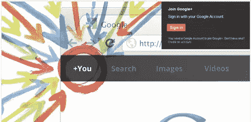

你需要一个 Google+页面来实现这个功能。如果您还没有一个页面，请快速设置一个页面(只需几分钟)，然后回到本演练。

[转到 G+](https://plus.google.com) 的注册页面

### 第二步:贡献者…

要告诉谷歌你是一个网站的正式贡献者(作者)，你必须更新你的“关于”页面上的“贡献者”字段。登录您的 G+页面，点击“关于”选项卡:

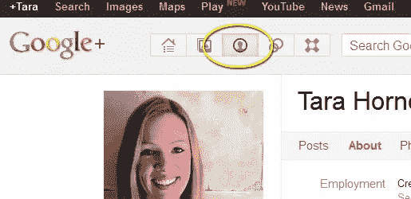

现在点击屏幕右上方的“编辑个人资料”按钮:

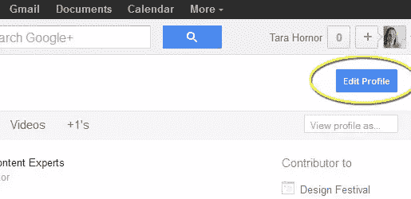

点击“贡献者”部分。当您将鼠标悬停在该字段上时，它会高亮显示整个部分:

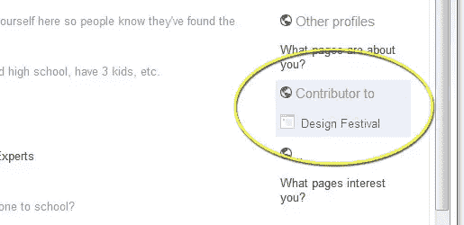

非常重要的是**不要**在 URL 中包含“www ”,因为这会中断连接，谷歌会给你一个错误。

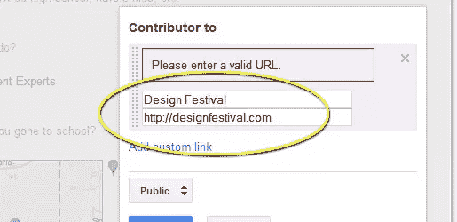

确保链接设置为“公共”，然后点击“保存”完成。你还需要点击右上角的“完成编辑”按钮。

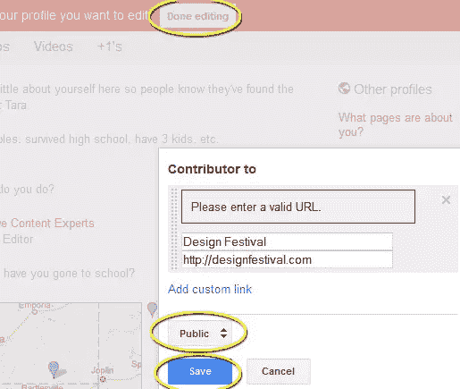

### 步骤 3: WordPress 个人资料

登录你的 WordPress 网站，进入“用户”->“个人资料”部分，将你的 G+ URL 粘贴到“网站”栏:

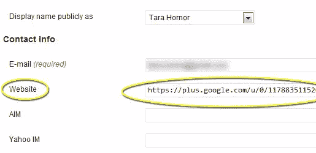

注意:确保您添加“？rel=author”添加到 G+ URL 的末尾。这是非常重要的。现在，我的网址是这样的:

https://plus.google.com/u/0/117883511520701899763?rel=author

### 步骤 4: WordPress 编辑器

接下来，我们需要更新你的 WordPress 博客，以便它自动将你的 G+个人资料连接到你的博客。如果你对你的博客没有管理员权限，那你就只能到此为止了。你需要能够访问 WordPress 中的“外观”->“编辑器”选项来完成这个功能。

以管理员身份登录你的 WordPress 博客，进入“外观”->“编辑器”选项(我在本教程中使用的是 WordPress 3.3.1):

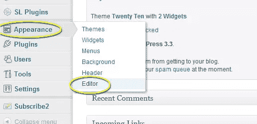

99%的情况下，您需要编辑“single.php”文件，但是您的主题可能在“content.php”、“loop.php”、“functions.php”或其他文件中有您需要的信息。在我们的例子中，我们要去“functions.php”。

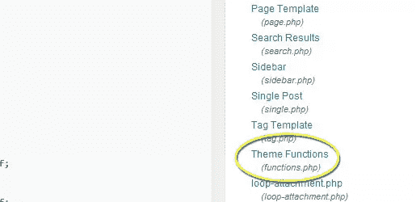

当你浏览你的 PHP 文件时，你正在寻找的是 WordPress 主题发布作者内容和日期的地方。这通常与文章的标题在同一个区域。在某些主题中，您可以简单地粘贴以下代码，并将其称为好代码:

`<a href="<?php the_author_url(); ?>" rel="author"><?php the_author('display_name'); ?></a>`

这将调用您的作者网站(在步骤 3 中更新)，并使您的名字链接到您的个人资料页面。最重要的是，href 有 rel="author "代码，它告诉 Google 你是这个页面的作者。

对于我们其余的人，使用 WordPress 中默认的 Twenty Ten 主题，这里是我想要编辑的内容显示的地方:

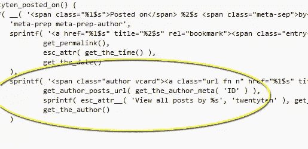

在这个例子中，我们只需要做一个小小的改变。在调用作者 URL 的 href 的函数部分，添加 rel="author "代码:

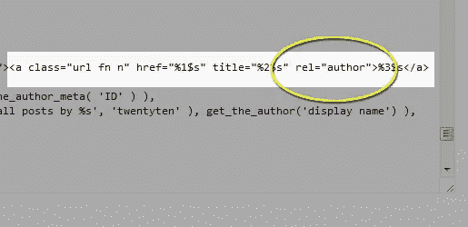

您可以通过在 rel="author "中添加“me”来覆盖所有的基础，这样 Google 就可以将其他信息(如作者的姓名)与个人资料联系起来:

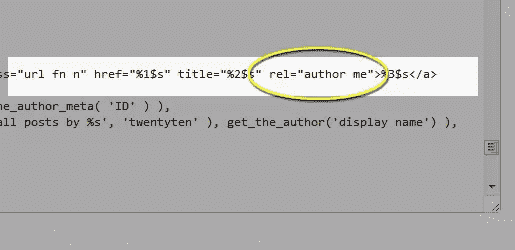

现在，我们需要告诉 WordPress 获取哪个 URL。默认情况下，WordPress 会将读者链接到你的文章档案，这已经不是我们想要的了。我们希望 WordPress 从作者简介页面链接到“网站”字段。为此，我们需要更改这行代码:

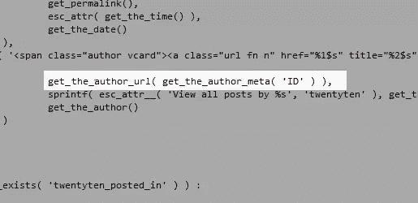

您正在将该行从:

`get_author_post_url( get_the_author_meta( 'ID' ) ),`

到抓取作者网站的代码:

`get_the_author_url( get_the_author_meta( 'ID' ) ),`

一旦这些更新完成，保存文件，你就大功告成了！

### 第五步:测试结果

为了测试结果，你可以去谷歌的 Rich Snippet 测试页面:[http://www.google.com/webmasters/tools/richsnippets](http://www.google.com/webmasters/tools/richsnippets)

粘贴一篇文章的网址，上面有作者的名字，点击“预览”按钮:

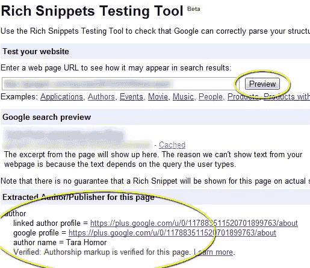

你会在测试的底部看到绿色的确认，表明作者已经被验证。

恭喜你。你现在是该博客的官方认证作者，你的头像、徽标和其他元数据将开始显示在搜索结果中。你正在走向个人品牌统治！

你是否利用丰富的片段发展了你的个人或公司品牌？你会分享任何谷歌搜索查询来炫耀你的结果吗？

## 分享这篇文章