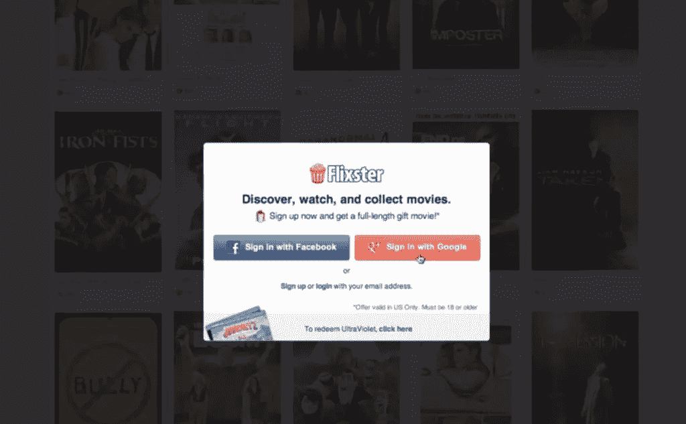

# 向 WordPress 添加 Google+登录

> 原文：<https://www.sitepoint.com/adding-a-google-sign-in-to-wordpress/>

本教程是针对那些想在 WordPress 主题中添加 Google+登录的开发者的。对于为电子商务、论坛和其他需要用户登录的网站构建的主题，提供 Google+登录按钮选项使用户的注册和登录过程更快、更容易，因为他们不必填写表格。



Flixster 上的 Google+登录示例

### Google+ OAuth WordPress 库

我为 WordPress 创建了一个 [Google+ OAuth 库，处理 Google+ OAuth 登录的所有棘手任务。](https://github.com/qnimate/Google-Plus-OAuth-WordPress)

这个库还创建了 Google+登录所需的 REST API URLs 官方文档称之为 **Google+登录**)。

一旦你下载了上面的 zip 文件，将内容解压到你的主题文件夹中。现在你的主题文件夹中会有一个`/inc`目录，里面有 Google+登录所需的所有文件。

### 加载 Google+ OAuth WordPress 库

现在你需要将这个库加载到 WordPress 中。在你的主题的 functions.php 文件中，只需要包括以下内容:

```
require_once("inc/googleplusoauth.php");
```

### 重定向用户

接下来，当用户点击“使用 Google+登录”按钮时，您需要重定向用户:

```
site_url() . "/wp-admin/admin-ajax.php?action=googleplus_oauth_redirect"
```

这个 URL 将处理“使用 Google+登录”的所有核心功能。一旦用户登录，用户将被重定向到网站的主页。

### 创建和安装 Google+应用程序

安装你的主题的用户需要创建一个 [Google 开发者项目](https://console.developers.google.com)并启用 Google+ API。

当启用 Google+ API 时，它会要求回调 URL。用户必须使用以下内容作为回拨 URL:

```
get_site_url() . "/wp-admin/admin-ajax.php?action=googleplus_oauth_callback"
```

一旦他们启用了 Google+ API，他们需要从项目仪表板中复制项目名称、API 密钥和秘密密钥，并将它们存储为 WordPress 选项。

您可以使用以下选项名称来存储选项值:

```
update_option("googleplus_client_id", $client_id_variable);
update_option("googleplus_client_secret", $client_secret_variable);
update_option("googleplus_app_name", $app_name_variable);
```

这就是你所需要做的，让 Google+登录按钮与你的主题相结合。

现在让我们创建一个显示 Google+登录按钮的 Google+登录小部件。

### 创建 Google+登录小部件

在这一节中，我将列出创建 Google+登录小部件的代码。如果你愿意，你也可以将这些代码放入插件中。你只需要确保你的插件包含了 Google+ OAuth WordPress 库。

```
<?php

require_once("inc/googleplusoauth.php");

class Google_Plus_Login_Widget extends WP_Widget 
{
    public function __construct() 
    {
        parent::__construct("Google_Plus_login_widget", "Google Plus Login", array("description" => __("Display a Google+ Login Button")));
    }

    public function form( $instance ) 
    {
        // Check values
        if($instance) 
        {
            $title = esc_attr($instance['title']);
            $api_key = $instance['api_key'];
            $secret_key = $instance['secret_key'];
            $googleplus_app_name = $instance['googleplus_app_name'];
        } 
        else 
        {
            $title = '';
            $api_key = '';
            $secret_key = '';
            $googleplus_app_name = '';
        }
        ?>

        <p>
            <label for="<?php echo $this->get_field_id('title'); ?>"><?php echo "Title"; ?></label>  
            <input class="widefat" id="<?php echo $this->get_field_id('title'); ?>" name="<?php echo $this->get_field_name('title'); ?>" type="text" value="<?php echo $title; ?>" />
        </p>

        <p>
            <label for="<?php echo $this->get_field_id('api_key'); ?>"><?php echo "Client Id"; ?></label>
            <input type="text" class="widefat" id="<?php echo $this->get_field_id('api_key'); ?>" name="<?php echo $this->get_field_name('api_key'); ?>" value="<?php echo $api_key; ?>" />
        </p>

        <p>
            <label for="<?php echo $this->get_field_id('secret_key'); ?>"><?php echo "Client Secret"; ?></label>
            <input type="text" class="widefat" id="<?php echo $this->get_field_id('secret_key'); ?>" name="<?php echo $this->get_field_name('secret_key'); ?>" value="<?php echo $secret_key; ?>" />
        </p>

        <p>
            <label for="<?php echo $this->get_field_id('googleplus_app_name'); ?>"><?php echo "App Name"; ?></label>
            <input type="text" class="widefat" id="<?php echo $this->get_field_id('googleplus_app_name'); ?>" name="<?php echo $this->get_field_name('googleplus_app_name'); ?>" value="<?php echo $googleplus_app_name; ?>" />
        </p>

        <p>
            While creating a Twitter app use "<?php echo get_site_url() . '/wp-admin/admin-ajax.php?action=googleplus_oauth_callback'  ?>" as callback URL.
        </p>

        <?php
    }

    public function update( $new_instance, $old_instance ) 
    {
        $instance = $old_instance;
        $instance['title'] = strip_tags($new_instance['title']);
        $instance['api_key'] = strip_tags($new_instance['api_key']);
        $instance['secret_key'] = strip_tags($new_instance['secret_key']);
        $instance['googleplus_app_name'] = strip_tags($new_instance['googleplus_app_name']);
        update_option("googleplus_client_id", $new_instance['api_key']);
        update_option("googleplus_client_secret", $new_instance['secret_key']);
        update_option("googleplus_app_name", $new_instance['googleplus_app_name']);
        return $instance;
    }

    public function widget( $args, $instance ) 
    {
        extract($args);

        $title = apply_filters('widget_title', $instance['title']);
        echo $before_widget;

        if($title) 
        {
            echo $before_title . $title . $after_title ;
        }

        if(is_user_logged_in()) 
        {
            ?>
                <a href="<?php echo wp_logout_url( get_permalink() ); ?>" title="Logout"><input type="button" value="Logout" /></a>
            <?php
        }
        else
        {
            ?>
                <a href="<?php echo site_url() . '/wp-admin/admin-ajax.php?action=googleplus_oauth_redirect'; ?>"><input type="button" value="Login Using Google+" /></a>
            <?php
        }
        echo $after_widget;
    }
}
register_widget("Google_Plus_Login_Widget");
```

让我们看看上面的代码是如何工作的:

*   我们首先包括了 Google+ OAuth 库
*   然后我们创建了一个小部件，在前端显示一个登录按钮，在后端显示密钥输入框
*   当用户在后端提交小部件表单时，这些值被保存为 WordPress 选项
*   当有人点击小工具前端的 Google+登录按钮时，用户会被重定向到上面提到的“重定向 URL”
*   重定向的 URL 处理所有登录任务

### 进行 Google+ REST API 调用

用户登录后，您将获得一个访问令牌，作为在 Google+中发布和检索用户数据的权限。

每个用户的访问令牌都是唯一的，因此这个库将其存储为用户元数据。您可以使用以下方法检索它:

```
get_user_meta(get_current_user_id(), "googleplus_access_token", true)
```

现在您可以通过在 [HTTP 授权请求头](https://developers.google.com/accounts/docs/OAuth2#basicsteps)中传递这个令牌来进行 [Google+ REST API](https://developers.google.com/+/api/) 调用。

### 令牌过期

访问令牌具有有限的生命周期，并且可能由于多种原因而变得无效。如果您在进行 REST API 调用时收到无效访问令牌错误，那么您需要通过让用户再次登录来获得新的访问令牌。

### 结论

我们已经学习了如何创建一个 Google+登录按钮。如果你把它集成到你的主题中，那么你可以把这个按钮放在任何地方，但是如果它在一个插件中，那么你需要放入一个小部件。

如果您对该主题的更多信息感兴趣，这里有一些其他有用的资源:

*   [Google+平台开发者文档](https://developers.google.com/+/)
*   [Google+登录开发者文档](https://developers.google.com/+/web/signin/)
*   [在 WordPress 中集成 Ajax](http://qnimate.com/integrating-ajax-in-wordpress/)

如果你有任何反馈，或者你自己在一个项目中使用上述方法或类似的东西，请在下面评论让我知道。

## 分享这篇文章