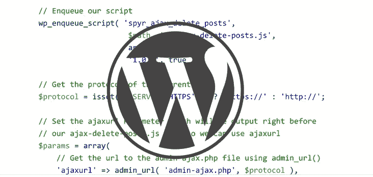

# 给你的 WordPress 插件添加 Ajax

> 原文：<https://www.sitepoint.com/adding-ajax-to-your-wordpress-plugin/>

在你的 WordPress 网站中使用 Ajax 比你想象的要简单。有了 jQuery，您可以提交数据，也可以接收数据。与 WordPress 的通信是通过一个特殊的 Ajax 专用 WordPress 动作来执行的，这个动作能够处理服务器端的信息。



Ajax 通常发生在表单提交之后，或者通过按一个按钮，使您能够向服务器发送一些数据以便进行处理。例如，请考虑以下代码片段:

```
var data {
	action: 'spyr_plugin_do_ajax_request',
	var1: 'value 1',
	var2: 'value 2'
}
```

使用我们的朋友 jQuery，我们将把它发布到服务器并得到服务器响应。在 WordPress 中，所有 Ajax 请求都被发送到`admin-ajax.php`进行处理。这个文件位于你的 WordPress 站点的`/wp-admin`目录中。尽管该文件位于站点的管理区域，但是您可以使用它来处理前端和后端的交互。

### 动作参数

在我们之前的例子中，动作参数`spyr_plugin_do_ajax_request`负责在 JavaScript 文件和 PHP 代码之间建立连接。建议给所有动作加上前缀，包括这个动作；以便它是唯一的和可识别的。让它看起来像是属于你的 WordPress 插件。

### WordPress 的专用 Ajax 动作

我们可以使用两个 WordPress 专用的 Ajax 动作。

第一个是`wp_ajax_$action`，它在用户登录时处理 Ajax 请求。

第二个是`wp_ajax_nopriv_$action`，如果用户没有登录并且没有任何特权，它将处理 Ajax 请求。

按照我们之前的例子，我们将把这些动作挂钩添加到我们的插件中，如下所示:

```
add_action( 'wp_ajax_spyr_plugin_do_ajax_request', 'spyr_plugin_do_ajax_request' );
add_action( 'wp_ajax_nopriv_spyr_plugin_do_ajax_request', 'spyr_plugin_do_ajax_request' );
```

现在我们知道了 Ajax 事件如何与 WordPress 交互的基本知识，让我们看一个真实的例子。让我们建立一个简单的插件，允许管理员从前端删除某个帖子。

## Ajax 发布删除插件

我们现在可以开始构建一个示例插件，它将通过 Ajax 删除帖子。由于本文旨在向您介绍处理 Ajax 请求的内部工作原理，我觉得这个插件将允许您在不增加任何混乱的情况下进行尝试。我们的插件将包括:

*   用 Ajax 脚本添加 JavaScript 文件
*   向每个帖子添加一个链接，单击该链接将删除帖子
*   用 PHP 处理 Ajax 请求
*   用 jQuery 处理按钮点击
*   将我们的脚本排队

```
// Add script on single post only, if user has Admin rights
add_action( 'template_redirect', 'spyr_add_js_single_posts' );
function spyr_add_js_single_posts() {
	// We only want to add the script if is_single()
	// and can manage options (Admins)
	if( is_single() && current_user_can( 'manage_options' ) ) {

		// Get the Path to this plugin's folder
		$path = plugin_dir_url( __FILE__ );

		// Enqueue our script
		wp_enqueue_script( 'spyr_ajax_delete_posts', 
							$path. 'js/ajax-delete-posts.js',
							array( 'jquery' ),
							'1.0.0', true );

		// Get the protocol of the current page
		$protocol = isset( $_SERVER['HTTPS'] ) ? 'https://' : 'http://';

		// Set the ajaxurl Parameter which will be output right before
		// our ajax-delete-posts.js file so we can use ajaxurl
		$params = array(
			// Get the url to the admin-ajax.php file using admin_url()
			'ajaxurl' => admin_url( 'admin-ajax.php', $protocol ),
		);
		// Print the script to our page
		wp_localize_script( 'spyr_ajax_delete_posts', 'spyr_params', $params );
	}
}
```

安全永远是重要的。因此，我们需要检查当前用户是否有足够的权限查看“删除”链接。我们还需要确保我们正在查看一个帖子，否则添加“删除”链接是没有意义的。

如果两个条件都为真，继续将包含 JavaScript 代码的脚本入队，以处理单击链接时发生的情况。密切关注该协议在网站前端的使用情况。我们必须这样做，因为 Ajax 请求和响应遵循相同的起源策略。所有 Ajax 请求和响应都必须在同一个域中处理；协议也必须匹配。

在 WordPress 中，通过在你的 WordPress 配置文件中设置“FORCESSLADMIN”为“true ”,可以在你的站点的管理部分强制使用 https 协议。从`http://example.com/sample-post/`向`https://example.com/wp-admin/admin-ajax.php`发送请求不起作用。即使我们在后端强迫`https://`，我们也可以在没有`https://`的情况下调用`admin-ajax.php`。

最后，代码中最后有意义的一行输出我们的动态变量，供我们在`ajax-delete-posts.js`中使用。

```
<script type='text/javascript'>
/* <![CDATA[ */
var spyr_params = {"ajaxurl":"http:\/\/example.com\/wp-admin\/admin-ajax.php"};
/* ]]> */
</script>
```

### 向内容添加删除链接

```
// Add an admin link to each post
add_filter( 'the_content', 'spyr_add_content_delete_link' );
function spyr_add_content_delete_link( $content ) {
	if( is_single() && current_user_can( 'manage_options' ) ) {
		// Get current post
		global $post;

		// Create a nonce for this action
		$nonce = wp_create_nonce( 'spyr_adp-delete-' . $post->ID );
		// Get link to adminn page to trash the post and add nonces to it
		$link = '<a href="'. admin_url( 'post.php?post='. $post->ID .'&action=trash&nonce=' .$nonce ) .'" 
				class="spyr_adp_link" data-nonce="'. $nonce .'" data-id="'. $post->ID .'">Delete Post</a>';

		// Append link to content
		return $content . '<p>'. $link .'</p>';
	}
}
```

简短明了。再次检查权限，并确保您查看的是单个帖子。这些安全措施是必要的，这是你必须习惯的。接下来，创建您的 nonce，并将其绑定到一个操作；请注意特殊格式。它使用下面的结构，`prefix_plugin-action-identifier`，其中`spyr`是前缀，adp = Ajax Delete Post，Delete 是我们的动作，post ID 是标识符。这不是必须的，但是在编写插件时推荐这样做。注意，我们还使用 HTML5 数据属性将帖子的 ID 和 nonce 值添加到链接中。最后一步是将格式化的链接附加到内容上。

### 用 PHP 和 WordPress 处理 Ajax 请求

这篇文章我们已经看了一半了。接下来是实际处理 Ajax 请求提交的代码。请密切注意，因为它依赖于如何命名 jQuery 请求提交的数据来获得 post ID (pid)和 nonce 值。

```
// Ajax Handler
add_action( 'wp_ajax_spyr_adp_ajax_delete_post', 'spyr_adp_ajax_delete_post' );
function spyr_adp_ajax_delete_post() {
	// Get the Post ID from the URL
	$pid = $_REQUEST['pid'];

	// Instantiate WP_Ajax_Response
	$response = new WP_Ajax_Response;

	// Proceed, again we are checking for permissions
	if( current_user_can( 'manage_options' ) && 
		// Verify Nonces
		wp_verify_nonce( $_REQUEST['nonce'], 'spyr_adp-delete-' . $pid ) &&
		// Delete the post
		wp_delete_post( $pid ) ) {
		// Build the response if successful
		$response->add( array(
			'data'	=> 'success',
			'supplemental' => array(
				'pid' => $pid,
				'message' => 'This post has been deleted',
			),
		) );
	} else {
		// Build the response if an error occurred
		$response->add( array(
			'data'	=> 'error',
			'supplemental' => array(
				'pid' => $pid,
				'message' => 'Error deleting this post ('. $pid .')',
			),
		) );
	}
	// Whatever the outcome, send the Response back
	$response->send();

	// Always exit when doing Ajax
	exit();
}
```

`spyr_adp_ajax_delete_post`是 JavaScript 文件的请求所传递的动作的名称。记住这一点，您的动作的全名应该是`wp_ajax_spyr_adp_ajax_delete_post`。文章 ID 和 nonce 值也通过 JavaScript 文件传递，我们可以从`$_REQUEST`获得它们。

我们将实例化`WP_Ajax_Response`,这将允许我们返回一个漂亮的 XML 响应。然后，您可以读取并处理通过 jQuery 返回的内容。同样，您需要验证用户是管理员，并在删除帖子之前尝试匹配 nonce 值。您需要为每个场景建立不同的响应，这样您就可以确定帖子是否被删除。然后，您可以附上描述结果的简短消息，以便向用户提供额外的反馈。最后，将响应发送回浏览器并退出。在处理 Ajax 请求的时候，一定要记得退出。

该请求将被发送到服务器进行处理，就像下面这样简单:

`action=spyr_adp_ajax_delete_post&pid=403&nonce=878727e18a`

下面是响应中返回的格式化 XML 文件的一个示例:

```
<wp_ajax>
	<response action="spyr_adp_ajax_delete_post_0">
		<object id="0" position="1">
			<response_data>success</response_data>
			<supplemental>
				<pid>403</pid>
				<message>This post has been deleted</message>
			</supplemental>
		</object>
	</response>
</wp_ajax>
```

### 用 jQuery 处理按钮点击

现在唯一要做的就是编写 JavaScript 代码，它将发送请求并解析响应。代码本身很容易理解，但是我已经添加了行内注释，使它更容易理解。

```
jQuery( document ).ready( function() {
	jQuery( '.spyr_adp_link' ).click( function( e ) {
		var link = this;
		var id   = jQuery( link ).attr( 'data-id' );
		var nonce = jQuery( link ).attr( 'data-nonce' );

		// This is what we are sending the server
		var data = {
			action: 'spyr_adp_ajax_delete_post',
			pid: id,
			nonce: nonce
		}
		// Change the anchor text of the link
		// To provide the user some immediate feedback
		jQuery( link ).text( 'Trying to delete post' );

		// Post to the server
		jQuery.post( spyr_params.ajaxurl, data, function( data ) {
			// Parse the XML response with jQuery
			// Get the Status
			var status = jQuery( data ).find( 'response_data' ).text();
			// Get the Message
			var message = jQuery( data ).find( 'supplemental message' ).text();
			// If we are successful, add the success message and remove the link
			if( status == 'success' ) {
				jQuery( link ).parent().after( '<p><strong>' + message + '</strong></p>').remove();
			} else {
				// An error occurred, alert an error message
				alert( message );
			}
		});
		// Prevent the default behavior for the link
		e.preventDefault();
	});
});
```

用 jQuery 解析 XML 很简单，使用`jQuery.find();`在 XML 中查找元素，就像试图在 HTML 文档中查找元素一样。

## 结论

正如你所看到的，在你的插件和主题中执行 Ajax 请求在 WordPress 中是一个非常简单的过程。由于有两个专用的动作:`wp_ajax_$action`和`wp_ajax_nopriv_$action`，这显然更容易实现。这仅仅是一条令人敬畏的代码编写之路的开始，它将节省页面重新加载并为你的 WordPress 主题或插件增加交互性。接下来你会做什么？

如果你正在寻找关于这个主题的更多信息，请确保查看 Ajax 上的 WordPress Codex 页面和插件中的 Ajax。

## 分享这篇文章