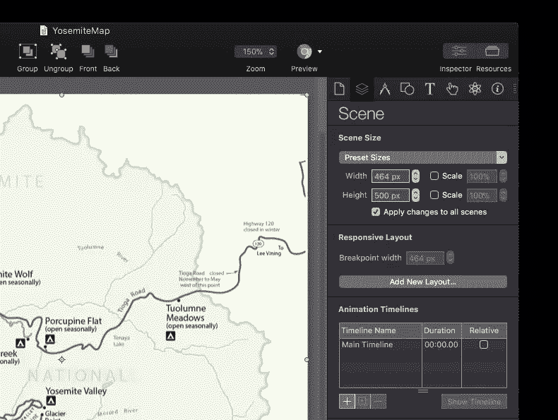
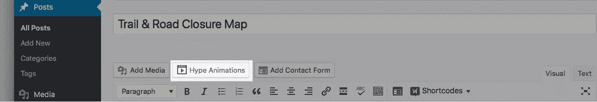
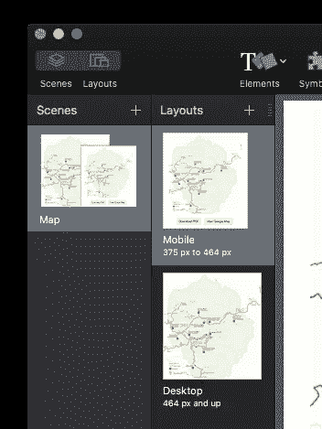
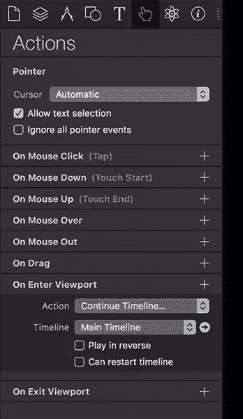

# 使用 WordPress 和 Tumult Hype 为有效的博客文章添加动画

> 原文：<https://www.sitepoint.com/adding-animations-effective-blog-posts-wordpress-tumult-hype/>

*本文由[骚动](https://tumult.com/)赞助。感谢您对使 SitePoint 成为可能的合作伙伴的支持。*

在这篇文章中，我想介绍一个新的 WordPress 插件，用于在 WordPress 中嵌入互动和动画内容:[为 WordPress 宣传动画](https://wordpress.org/plugins/tumult-hype-animations/)。

[Tumult Hype](http://tumult.com/hype/) 是一款强大的工具，用于构建可在任何设备上运行的高级互动和动画内容。当你第一次打开 Tumult Hype 时，迎接你的是一张空白的画布，下面有一条时间线。使用“录制”按钮并操纵时间轴，可以轻松地将添加到场景中的内容制作成动画。当您探索该程序时，您会发现一系列交互式制作的强大功能:运动曲线、自定义缓和过渡、触摸手势、web 字体支持、音频动作、强大的物理引擎和响应性布局功能。

WordPress 的 Hype Animations 插件使得将你的 HTML5 动画集成到你的博客中成为一个无痛的拖放过程。通过搜索“[骚动宣传动画](https://wordpress.org/plugins/tumult-hype-animations/)”，插件可以在一分钟内从 WordPress 插件库中安装并激活安装该插件允许你使用简单的文本短代码将导出的喧闹炒作动画添加到帖子和页面中。你可以从插件的管理页面更新之前上传的动画，并复制完整的嵌入代码，将你的动画放到其他地方(甚至是 WordPress 之外)。这允许你有选择地利用你的 WordPress 站点作为你炒作动画的一个简单的托管平台。

假设你正在构建一个交互式地图，你想在一个常规的 WordPress 页面上保持更新。除了重新上传一个静态的 PDF 文件，你还可以在混乱的宣传中快速创建一个交互式地图。首先，创建一个 Tumult Hype 文档，其宽度为博客宽度的最大值。如果你有一个响应式的主题，你甚至可以让你的动画扩展并与你的主题相联系。如果你想测试这个过程，下载一个无限制的( [14 天试用在这里](http://tumult.com/hype/pro))。在下面的例子中，我们的博客文章最大宽度是 463 像素，所以我们的场景大小被设置为这个数字:

接下来，您可以在文档中构建交互式功能:设置文档以响应鼠标悬停，更新任何道路封闭，并创建任何类型的交互性以使地图更加有趣和有用。一旦你对你的文档感到满意，并且已经使用内置的浏览器预览和免费的移动预览应用程序 [Hype Reflect](http://tumult.com/hype/reflect/) 进行了预览，下一步就是为 WordPress 插件做准备。

为插件包装一个夸张的动画很简单。该插件要求动画首先以 OAM 格式导出，这将创建一个包含显示动画所需的所有 JavaScript、媒体和代码的压缩包。这与嵌入 Adobe Muse 等应用程序的格式相同。要以此格式导出，请选择文件>导出为 HTML5 >导出为 OAM 文件。切换到你的 WordPress 站点，开始一个新的页面或文章。安装插件后，点击“添加媒体”按钮右侧的“宣传动画”按钮:

将 OAM 文件拖放到生成的覆盖图中，你的动画就会上传，插件会生成一个短代码，并自动将其添加到你的帖子或页面中:

## 利用 CSS 样式和响应性布局

嵌入动画时，插件上传 Hype JavaScript 运行时、资源和动画数据，并在页面上用 JavaScript 创建一个对它的引用作为标准 DIV 元素。由于嵌入和你的 WordPress 主题在同一个页面上，你可以访问你当前在 WordPress 主题中使用的任何 CSS 样式或字体，无缝地将设计元素合并到你的动画中。这允许你利用你已经在你的站点中设置的任何网络字体或者 CSS 组件。您可能需要在文档检查器中取消选中**防止外部样式**，以利用外部 CSS 样式。

对于你的响应式 WordPress 主题，你也可以在混乱宣传中镜像你的主题的断点，这样你的动画就可以适应你想要支持的所有设备大小:

在“场景检查器”中，您可以轻松地为各个布局设定所需的断点。关于在 Hype 中设置响应式布局的更多信息，请访问文档。

## 附加交互和导出功能

您可以通过使用进入视口动作选择仅在可见时启动动画。设置这一点就像在操作检查器中选择下拉菜单一样简单:

不要把自己局限于项目的 HTML5 导出。对于社交媒体共享，您可以轻松导出单独的帧、动画 gif，甚至直接从 Tumult Hype 导出视频。这些导出格式可以用于分配给你的 WordPress 帖子的特色图片，作为 Twitter &脸书上的社交分享卡，甚至作为视频预告。

**技术说明:**

下面是一些关于 WordPress 插件如何工作的技术说明。有关炒作的更多一般信息，请访问[炒作常见问题页面](http://tumult.com/hype/faq/)。

*   所有的上传都保存在 WordPress 上的`wp-content`文件夹中，不需要任何额外的服务器基础设施。
*   嵌入代码是非呈现阻塞 JavaScript 嵌入代码。您可以选择将宣传动画嵌入为一个`<iframe>`而不是一个 DIV。如果您需要访问添加到 Tumult Hype 文档的 HTML 文件的`<head>`中的代码，这可能更好。
*   使用最少的代码轻松跟踪 Google Analytics 上的事件或交互。[在此了解更多信息](https://forums.tumult.com/t/tracking-visits-events-and-actions-with-google-analytics/1506)。
*   从你的 WordPress 文章中读取变量并使用它们来控制你的动画:例如:`TolumneMeadowsRoad = closed;` [在这里了解更多](https://blog.tumult.com/2017/06/02/visualizing-live-data-in-tumult-hype/)。

如果你想尝试炒作，现在作为 SitePoint 用户，你可以以 24.99 美元的价格获得 50%的[炒作标准](https://sites.fastspring.com/tumultco/instant/hype3?coupon=SITEPOINTDEAL)。

或者，如果你追求的是有各种花哨功能的版本，我们还为专业宣传人员提供 25%的折扣，价格为 74.99 美元。

## 分享这篇文章