# 向 Windows Phone 应用添加地理位置和地图

> 原文：<https://www.sitepoint.com/adding-geolocation-and-maps-to-windows-phone-apps/>

从旅游指南到商业指南和社交推荐，地图已经成为应用用例的重要组成部分。不出所料，Windows Phone 平台默认支持 Bing 地图，并且很容易实现。

本教程的最终项目在 [GitHub](https://github.com/sitepoint-editors/AppWithMap) 上。

## 添加地图

首先，我们需要创建一个应用程序来保存我们的地图，通过使用 *Ctrl+Shift+N* 键盘快捷键或者通过选择*文件- >新建- >项目…* 菜单项，这两种方式都会将你带到下面的窗口。在左边确保你选择了 *Windows Phone* ，然后选择*空白应用(Windows Phone)* 。给你的应用命名，点击*确定*。


打开 *MainPage.xaml* 你会注意到一个黑色的空白`MainPage`。如果您想添加新的默认页面标题和应用程序名称，请将其删除，然后*右键单击项目上的*，选择*添加- >新项目……*_

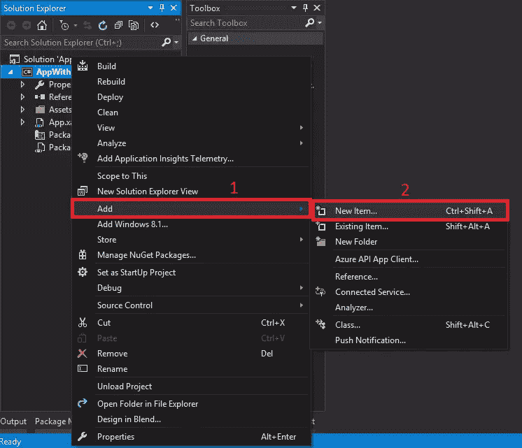

选择*基础页面*，命名为*主页面*。

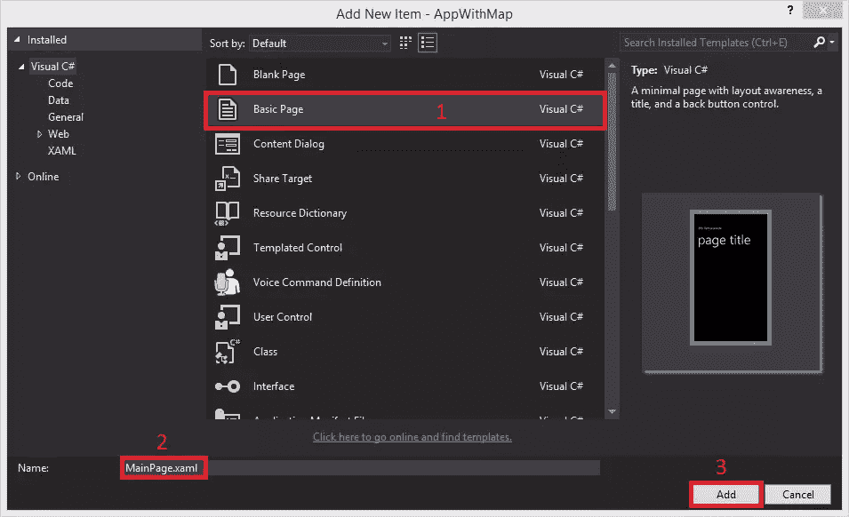

在下一个提示时，点击*是*。它会自动添加管理页面导航所需的文件。这些类最终保存在一个名为 *Common* 的文件夹中。

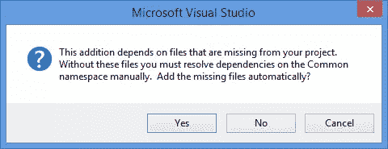

现在要添加地图，只需从*工具箱*中拖拽一个 *MapControl* 并将其放到*文档轮廓*中的 *LayoutRoot* 网格中。您也可以将它放入设计器中。xaml 代码将自动生成，如下所示。

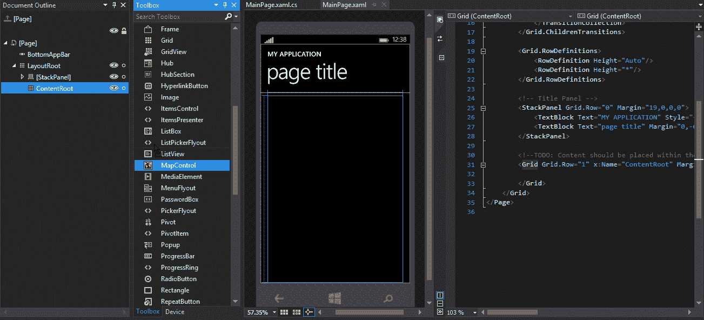

如果您希望自己添加控件，请将这一行代码添加到`ControlRoot`网格的标签中。

```
<maps:MapControl />
```

它需要在开始的`Page`标签中有一个引用，否则会导致错误。

```
xmlns:maps="using:Windows.UI.Xaml.Controls.Maps"
```

这足以创建控件，但我们将添加更多的属性。

此时，您可以运行您的应用程序，它将编译没有错误，但当它启动时，您将看到一条消息，而不是一个地图声明<q>警告:MapServiceToken 未指定。</q>我们将在下一步解决这个问题。

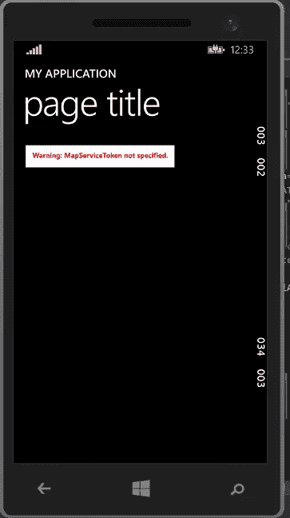

## 添加 MapServiceToken

要在您的应用中使用`MapControl`，您必须是注册的 Windows 开发人员，并为您的应用保留一个名称，以生成令牌来使用该服务。

完成此操作后，请转到您的开发者仪表盘，选择您的应用。在左侧，点击*服务*，然后*地图*。点击出现在右边的按钮*获得令牌*。

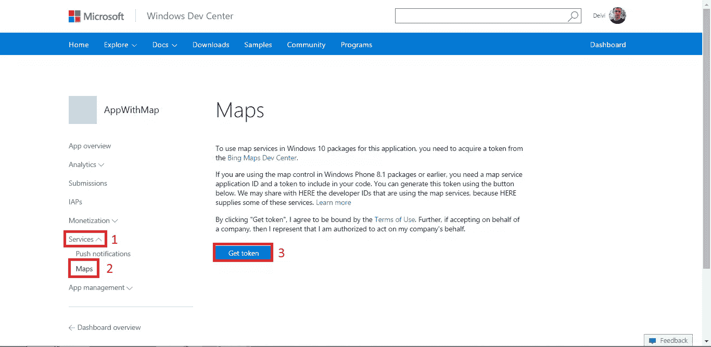

您将看到两个字符串:*应用程序 ID* 和*认证令牌*。第二个是我们需要的。

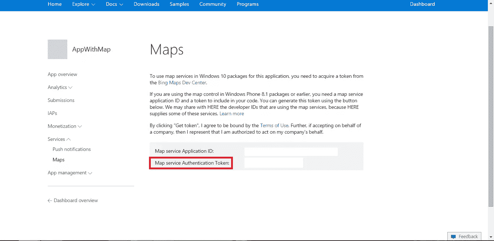

回到我们的项目，在 *MainPage.xaml* 的代码视图中，更新下面几行:

```
<Grid Grid.Row="1" x:Name="ContentRoot" Margin="0">
    <maps:MapControl x:Name="MyMap" MapServiceToken="<your authentication token>" VerticalAlignment="Stretch" HorizontalAlignment="Stretch" Margin="10"/>
</Grid>
```

在这里，我添加了`MapServiceToken`，一个控件名和几个属性，使地图几乎充满了屏幕。记得用你的令牌替换`<your authentication token>`。`MapControl`在设计视图中不显示实际的地图，它显示适合地图的窗口，所以你不能马上看到正在发生的事情。运行应用程序查看结果。

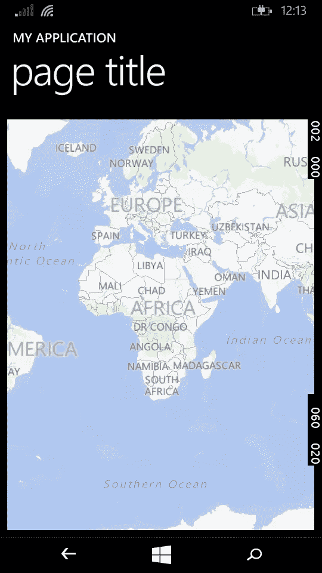

## 获取当前位置

最常见的应用程序需求之一是获取用户的位置，以了解世界上的位置并收集位置数据。

为此，打开 *MainPage.xaml.cs* 并添加以下名称空间。

```
using System;
using Windows.Devices.Geolocation;
using Windows.UI.Popups;
```

在`MainPage`类中添加两个方法。

```
private async void getLocation()
{
    Geolocator gl = new Geolocator
    {
        DesiredAccuracy = PositionAccuracy.High
    };

    try
    {
        Geoposition gp = await gl.GetGeopositionAsync(
            maximumAge:TimeSpan.FromMinutes(1),
            timeout:TimeSpan.FromSeconds(20));
        message("Lat: " + gp.Coordinate.Point.Position.Latitude + "\n Lon: " + gp.Coordinate.Point.Position.Longitude, "Coordinates");
    }
    catch (Exception e)
    {
        message(e.Message, "ERROR!");
    }
}

private async void message(string body, string title)
{
    var dlg = new MessageDialog(
            string.Format(body), title);

    try
    {
        await dlg.ShowAsync();
    }
    catch (Exception) { }
}
```

第二种方法将坐标显示为消息对话框。一旦你得到这些坐标，你可以选择做不同的事情。你可以将它们存储在数据库中，进行一些距离计算等等。

这里真正的工作发生在`getLocation()`方法中。首先，我们声明一个位置精度设置为高的地理定位器。我们甚至可以用米来设置精度

```
gl.DesiredAccuracyInMeters = 100;
```

在这两种情况下，精确度取决于我们想要用我们接收的位置数据做什么。

我们也可以设置`MovementThreshold`和`ReportInterval`。`MovementThreshold`是必须移动的距离，实际上被称为移动并引发`PositionChanged`事件。`ReportInterval`给位置提供者刷新的时间(毫秒)。如果你有一个按钮，让用户得到他们的位置，用户决定按下它 100 次，通话不会在同一时间间隔内发生两次。

返回到`getLocation()`方法。我们有一个`try-catch`块，它包含使用前面提到的地理定位器获取`GeoPosition`的异步调用，并设置两个参数。

`maximumAge`指定我们希望位置数据多长时间。这意味着，如果我们在 2 分钟后收到一个位置的数据，根据情况，数据可能会误导人，所以我们不想使用它。

是我们愿意等待回应的时间，这样，如果我们根据收到的数据进行计算，他们就不会延迟这个过程。

最后调用`getLocation()`。我添加了一个带有点击事件的`AppBarButton`。将下面的代码添加到 *MainPage.xaml* ，在`Grid`标签之前。

```
<Page.BottomAppBar>
  <CommandBar>
    <AppBarButton Icon="Target" Label="Get Location" Click="AppBarButton_Click"/>
  </CommandBar>
</Page.BottomAppBar>
```

使用该方法作为 *MainPage.xaml.cs* 中的事件处理程序。

```
private void AppBarButton_Click(object sender, Windows.UI.Xaml.RoutedEventArgs e)
{
    getLocation();
}
```

如果你现在运行应用程序，你会得到以下异常。

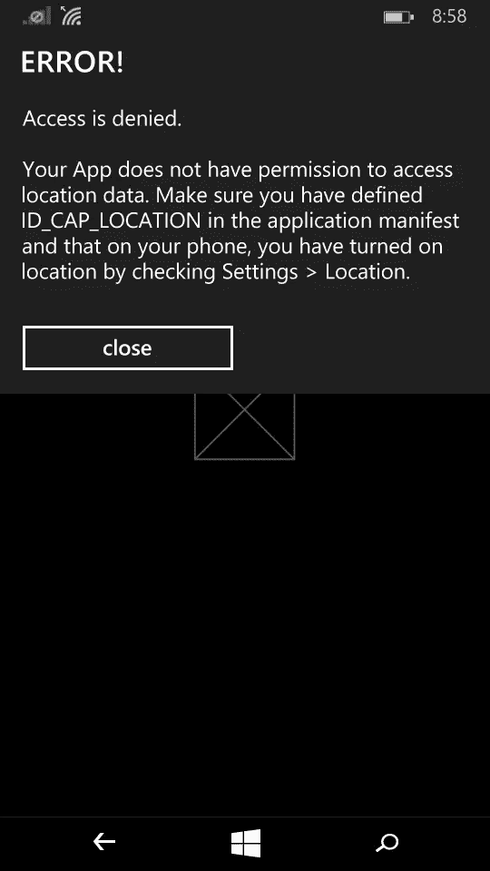

发生这种情况是因为我们需要声明何时需要获取用户的位置，这样就不会在没有用户许可的情况下完成。从*解决方案浏览器*中打开 *Package.appxmanifest* 。在*功能*、*标签页中+点击列表中的*位置。

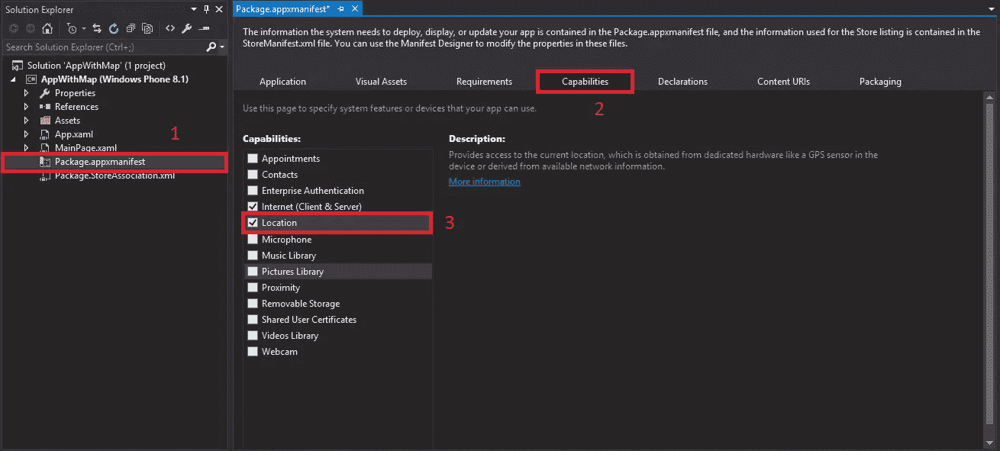

运行应用程序并按下命令栏中的*获取位置*按钮。几秒钟后，根据您的网络，将显示一条消息，显示您的位置。

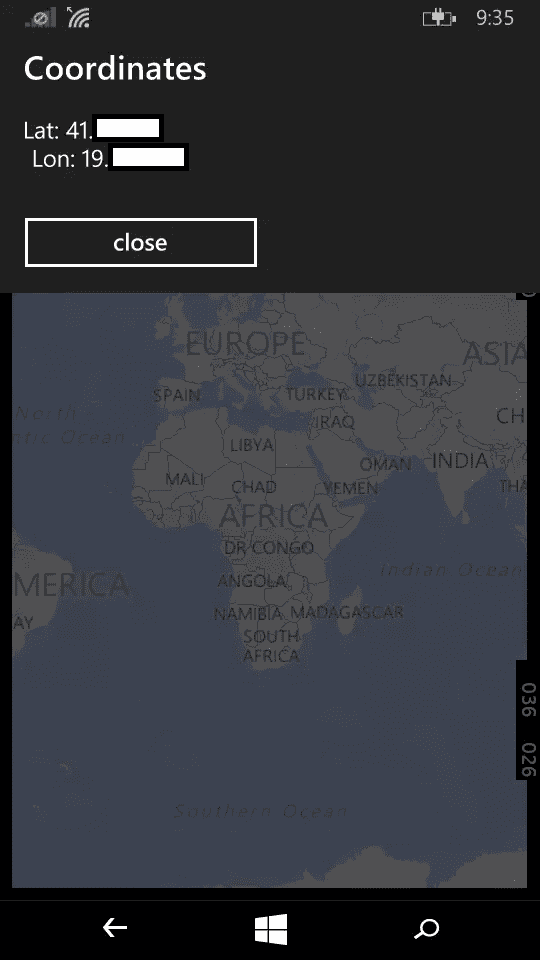

## 更改地图中心和缩放级别

为了服务于我们的用例，地图必须显示一个特定的位置，或者至少关注一个特定的区域。让我们使用在上一步中获得的用户位置作为地图的中心。为此，我在`MainPage`类中添加了下面的方法。

```
private void CenterMap(double lat, double lon)
{
   MyMap.Center = new Geopoint(new BasicGeoposition()
   {
      Latitude = lat,
      Longitude = lon
   });
}
```

你可能已经注意到地图显示了迄今为止的大陆。如果您想放大到特定的国家或城市，只需一行代码即可完成。但是不同的设备有不同的屏幕尺寸，缩放可能不是正确的水平，或者如果用户想要缩小怎么办？一个好的方法是添加一个滑块，这样用户可以控制缩放级别。首先，我们在地图标签下的 *MainPage.xaml* 中添加控件。

```
<Slider x:Name="slider" VerticalAlignment="Bottom" Margin="15,0" LargeChange="1" Maximum="20" Minimum="1" SmallChange="1" ValueChanged="slider_ValueChanged"/>
```

滑块可以有从 1 到 20 的整数值。为了捕捉 *ValueChanged* 事件，我们使用下面的方法，添加到 *MainPage.cs* 。

```
private void slider_ValueChanged(object sender, Windows.UI.Xaml.Controls.Primitives.RangeBaseValueChangedEventArgs e)
{
    if (slider != null)
        MyMap.ZoomLevel = (int)slider.Value;
}
```

剩下的就是更新我们已经有的`GetLocation()`方法。更改是在 try 块中进行的。

```
try
{
    Geoposition gp = await gl.GetGeopositionAsync(
        maximumAge:TimeSpan.FromMinutes(1),
        timeout:TimeSpan.FromSeconds(20));
    //message("Lat: " + gp.Coordinate.Latitude +
    //"\n Lon: " + gp.Coordinate.Longitude, "Coordinates");
    CenterMap(gp.Coordinate.Point.Position.Latitude, gp.Coordinate.Point.Position.Longitude);
    MyMap.ZoomLevel = (int)slider.Value;
}
```

结果在下面的截图里。用户可以询问他们的位置，并放大和缩小。


## 添加图钉

我要讲的最后一件事是图钉。它们是让地图上的点变得明显的好方法。

我添加了一个`AppBarToggleButton`来显示地图上代表用户位置的图钉。现在命令栏看起来像这样:

```
<Page.BottomAppBar>
    <CommandBar>
        <AppBarButton Icon="Target" Label="Get Location" Click="AppBarButton_Click"/>
        <AppBarToggleButton x:Name="PushPinToggle" Icon="MapPin" Label="Toggle Pushpin" Checked="AppBarToggleButton_Checked" IsChecked="False" Unchecked="AppBarToggleButton_Unchecked"/>
    </CommandBar>
</Page.BottomAppBar>
```

check/uncheck 事件由两种方法处理，这两种方法可以在子地图中添加或移除图钉。

```
private void AppBarToggleButton_Checked(object sender, Windows.UI.Xaml.RoutedEventArgs e)
{
    AddPushpin(MyMap.Center.Position.Latitude,
    MyMap.Center.Position.Longitude, Colors.Blue);
}

private void AppBarToggleButton_Unchecked(object sender, Windows.UI.Xaml.RoutedEventArgs e)
{
    MyMap.Children.Clear();
}
```

这里的工作发生在`AddPushpin`方法中，该方法有三个参数:位置的纬度和经度，以及图钉的颜色，这是可选的。

```
public void AddPushpin(double lat, double lon, Color c)
{
    BasicGeoposition location = new BasicGeoposition();
    location.Latitude = lat;
    location.Longitude = lon;

    var pin = new Ellipse()
    {
        Fill = new SolidColorBrush(c),
        Stroke = new SolidColorBrush(Colors.White),
        StrokeThickness = 1,
        Width = 40,
        Height = 40,
    };

    pin.Tapped += pin_Tapped;

    Windows.UI.Xaml.Controls.Maps.MapControl.SetLocation(pin, new Geopoint(location));
    MyMap.Children.Add(pin);
}

void pin_Tapped(object sender, Windows.UI.Xaml.Input.TappedRoutedEventArgs e)
{
    message("This is your location.", "");
}
```

在我的例子中，图钉是一个椭圆。您可以设置不同的属性，如大小、颜色、边框等。我还添加了一个`EventHandler`用于用户按下 pin 时。您可以像我们之前做的那样，用一个`DialogMessage`来显示该位置的更多信息。

剩下的就是给这个大头针一个地理位置，否则它将是一个画在`MapControl`上的椭圆。放大、缩小或移动不会改变大头针的位置。

现在一切就绪，将您的图钉添加到`MapControl`孩子，最后一次运行应用程序。

## 结论

在本教程中，我们创建了一个包含地图的应用程序，可用于多种用途。我们学习了如何添加这个地图和它的工作要求。我们收到了设备位置，并根据结果更改了地图中心。我们学会了在特定的位置添加图钉，并在按下时给出额外的信息。

当然，地图还有其他应用，我希望这是一个奠定基础的好例子。

感谢您抽出时间。愿代码与你同在！

## 分享这篇文章