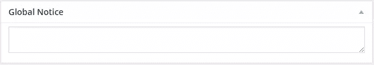
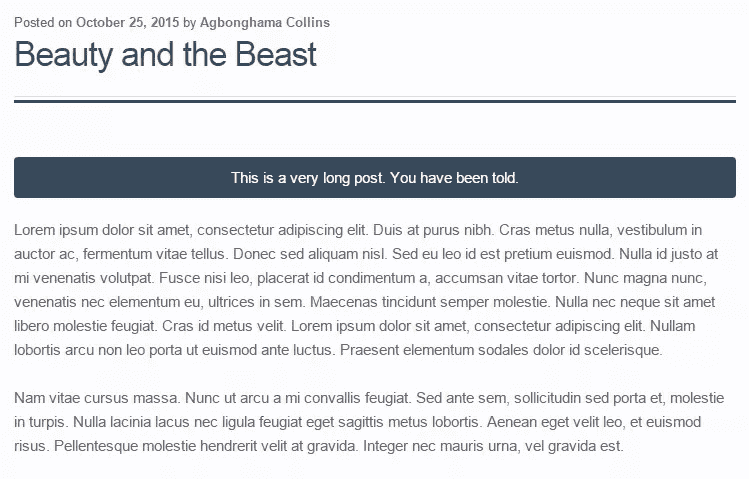

# 在 WordPress 的文章类型中添加元框

> 原文：<https://www.sitepoint.com/adding-meta-boxes-post-types-wordpress/>

如果你曾经使用 WordPress 为自己或客户建立过一个网站，或者你为一家网站由 WordPress 支持的公司工作，你应该见过并使用过 meta boxes。

过去，我们已经介绍过[向 WordPress](https://www.sitepoint.com/adding-custom-meta-boxes-to-wordpress/) 添加自定义元框。在本文中，我们将进一步解释它们与文章类型的关系和集成，包括如何使用保存在 WordPress 前端元框中的数据。

## 向文章类型屏幕添加元框

Narayan Prusty 已经介绍了大多数(如果不是全部的话)PHP 函数、它们的参数和`Action`钩子，它们在[创建元盒时非常方便。](https://www.sitepoint.com/adding-custom-meta-boxes-to-wordpress/)

要将元框添加到 any post 类型编辑屏幕，使用`add_meta_box()`并随后挂钩到`add_meta_boxes`动作。

以下代码向`post`编辑屏幕添加了一个元框。注意`global_notice_meta_box_callback`，这个函数被调用来显示元框中的表单字段。我们稍后会谈到这一点。

```
function global_notice_meta_box() {

    add_meta_box(
        'global-notice',
        __( 'Global Notice', 'sitepoint' ),
        'global_notice_meta_box_callback',
        'post'
    );
}

add_action( 'add_meta_boxes', 'global_notice_meta_box' ); 
```

添加一个元框到多个帖子类型屏幕-`post`、`page`和一个`book`自定义帖子类型；创建一个帖子类型的数组，遍历数组并使用`add_meta_box()`将元框添加到其中。

```
function global_notice_meta_box() {

    $screens = array( 'post', 'page', 'book' );

    foreach ( $screens as $screen ) {
        add_meta_box(
            'global-notice',
            __( 'Global Notice', 'sitepoint' ),
            'global_notice_meta_box_callback',
            $screen
        );
    }
}

add_action( 'add_meta_boxes', 'global_notice_meta_box' ); 
```

要将元框添加到所有现有的帖子类型和将来要创建的帖子类型中，使用`get_post_types()`获得一个帖子类型的数组，然后用它替换上面的`$screen`的值。

```
function global_notice_meta_box() {

    $screens = get_post_types();

    foreach ( $screens as $screen ) {
        add_meta_box(
            'global-notice',
            __( 'Global Notice', 'sitepoint' ),
            'global_notice_meta_box_callback',
            $screen
        );
    }
}

add_action( 'add_meta_boxes', 'global_notice_meta_box' ); 
```

为所有现有的和新的文章类型添加一个元框也可以通过省略第三个(`$screen`)参数来完成，如下所示:

```
function global_notice_meta_box() {

    add_meta_box(
        'global-notice',
        __( 'Global Notice', 'sitepoint' ),
        'global_notice_meta_box_callback'
    );

}

add_action( 'add_meta_boxes', 'global_notice_meta_box' ); 
```

通过将文章类型名称附加到`add_meta_boxes`动作挂钩，元框也可以被限制为文章类型(在本例中为`book`),如下所示:

```
function global_notice_meta_box() {

    add_meta_box(
        'global-notice',
        __( 'Global Notice', 'sitepoint' ),
        'global_notice_meta_box_callback'
    );

}

add_action( 'add_meta_boxes_book', 'global_notice_meta_box' ); 
```

在由`register_post_type()`用于定制自定义 post 类型的数组参数中，有一个是`register_meta_box_cb`，它的值是一个回调函数，在设置元框时被调用。

假设我们用以下代码创建了一个`book`自定义帖子类型:

```
function book_cpt() {

    $args = array(
        'label'                => 'Books',
        'public'               => true,
        'register_meta_box_cb' => 'global_notice_meta_box'
    );

    register_post_type( 'book', $args );
}

add_action( 'init', 'book_cpt' ); 
```

添加用于在`global_notice_meta_box` PHP 函数中创建元框的`add_meta_box()`函数定义(上面`register_meta_box_cb`的值)会将元框添加到`book`自定义文章类型编辑屏幕。

这是我们的示例`global_notice_meta_box`函数。

```
function global_notice_meta_box() {

    add_meta_box(
        'global-notice',
        __( 'Global Notice', 'sitepoint' ),
        'global_notice_meta_box_callback'
    );

} 
```

到目前为止，我们已经学习了在 WordPress 中注册或添加元框的各种方法。我们还没有创建包含元框表单字段的`global_notice_meta_box_callback`函数。

下面是`global_notice_meta_box_callback`函数的代码，它将在元框中包含一个文本区域字段。

```
function global_notice_meta_box_callback( $post ) {

    // Add a nonce field so we can check for it later.
    wp_nonce_field( 'global_notice_nonce', 'global_notice_nonce' );

    $value = get_post_meta( $post->ID, '_global_notice', true );

    echo '<textarea style="width:100%" id="global_notice" name="global_notice">' . esc_attr( $value ) . '</textarea>';
} 
```



当文章被保存为草稿或发布时，`save_post`动作钩子处理保存输入到文本区域的数据。

```
/**
 * When the post is saved, saves our custom data.
 *
 * @param int $post_id
 */
function save_global_notice_meta_box_data( $post_id ) {

    // Check if our nonce is set.
    if ( ! isset( $_POST['global_notice_nonce'] ) ) {
        return;
    }

    // Verify that the nonce is valid.
    if ( ! wp_verify_nonce( $_POST['global_notice_nonce'], 'global_notice_nonce' ) ) {
        return;
    }

    // If this is an autosave, our form has not been submitted, so we don't want to do anything.
    if ( defined( 'DOING_AUTOSAVE' ) && DOING_AUTOSAVE ) {
        return;
    }

    // Check the user's permissions.
    if ( isset( $_POST['post_type'] ) && 'page' == $_POST['post_type'] ) {

        if ( ! current_user_can( 'edit_page', $post_id ) ) {
            return;
        }

    }
    else {

        if ( ! current_user_can( 'edit_post', $post_id ) ) {
            return;
        }
    }

    /* OK, it's safe for us to save the data now. */

    // Make sure that it is set.
    if ( ! isset( $_POST['global_notice'] ) ) {
        return;
    }

    // Sanitize user input.
    $my_data = sanitize_text_field( $_POST['global_notice'] );

    // Update the meta field in the database.
    update_post_meta( $post_id, '_global_notice', $my_data );
}

add_action( 'save_post', 'save_global_notice_meta_box_data' ); 
```

为了将输入到元框文本区域的数据放入使用，我们将在显示保存的文章内容之前显示数据。

```
function global_notice_before_post( $content ) {

    global $post;

    // retrieve the global notice for the current post
    $global_notice = esc_attr( get_post_meta( $post->ID, '_global_notice', true ) );

    $notice = "<div class='sp_global_notice'>$global_notice</div>";

    return $notice . $content;

}

add_filter( 'the_content', 'global_notice_before_post' ); 
```

### 代码解释

首先，我们创建了一个`global_notice_before_post`函数，它与带有包含文章内容的`$content`参数的`the_content`过滤器挂钩。

在该函数中，我们包含了全局的`$post`变量，该变量包含了当前正在查看的文章的`WP_Post`对象。

针对给定帖子保存的全局通知由`get_post_meta`检索，并保存到`$global_notice`变量。

然后通知被包装在一个`div`中，并保存到`$notice`变量中。

最后，保存全局通知的`$notice`被连接到实际帖子内容的`$content`。

下面是一个帖子的截图，帖子内容前有全局通知。



## 摘要

在本教程中，我们学习了多种在 WordPress 管理界面注册元框的方法，以及如何将它们限制为文章类型。

我们还讨论了如何将表单域添加到元框中，以及在保存或发布帖子时如何保存输入其中的数据。

最后，我们讨论了如何将输入到元框中的数据付诸实践。

在以后的文章中，我们将介绍如何向文章类型管理屏幕添加上下文帮助选项卡。

如果你有任何问题或贡献，我们希望在评论中听到它们。

## 分享这篇文章