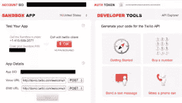
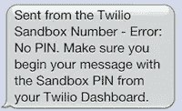
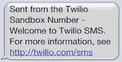
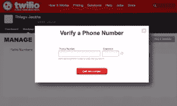

# 给你的 Rails 应用添加短信功能

> 原文：<https://www.sitepoint.com/adding-sms-capabilities-to-your-rails-app/>

在最近的一个项目中，技术需求之一是将 SMS 服务集成到 Rails 应用程序中，以便用户可以使用他们的移动设备验证他们的帐户，并且允许应用程序向这些用户发送 SMS 消息。

事实证明，添加这样的功能非常容易，特别是在使用像 [Twilio](http://www.twilio.com) 这样的服务时。在我看来，这是当今市场上最好的服务之一，其简单性是无与伦比的。

本文将指导您通过 Rails 应用程序发送和接收文本消息的必要步骤。更具体地说，它将包括:

*   报名参加 Twilio
    *   使用 Twilio 的沙盒
    *   使用 Twilio 验证电话号码
*   通过 Rails 应用程序发送和接收 SMS 消息
    *   创建基本应用程序
    *   将基本部件连接在一起
    *   将应用程序与 Twilio 集成
    *   向互联网公开您的本地主机
*   编写单元测试和模拟外部调用

最后，我们应该有一个能够发送和接收文本消息的功能应用程序。尽情享受吧！

## 报名参加 Twilio

注册 Twilio 的过程非常简单:你只需要提供你的名字、邮箱和密码。完成后，您将被重定向到他们的控制面板。

### 使用 Twilio 的沙盒

现在我们已经注册了，让我们看看当我们向 Twilio 的电话号码发送一条简单的*‘hello’*短信时会发生什么。我们得到以下错误消息:

好了，我们需要包括来自仪表板的 PIN，让我们继续这样做。以格式*PIN‘hello’*成功发送消息后，我们会收到以下自动回复:

太好了！我们已经成功地与 Twilio 沙盒互动。

### 使用 Twilio 验证电话号码

在沙盒模式下，您需要添加并验证您想要启用的电话号码，以便通过编程接收短信。 ***这是一个强制步骤*** ，除非您完成这个过程，否则您不会收到来自 Rails 应用程序的任何消息。

添加电话号码并点击“拨打此号码”按钮后，系统将自动拨打给定号码。您需要接听电话并输入屏幕上显示的代码。之后你就可以走了。

## 通过 Rails 应用程序发送和接收 SMS 消息

### 施基肥

在这一节中，我将从一个新的 Rails 应用程序开始，它基于 Mac OSX 环境中的 Ruby 1.9.3 和 Rails 3.2.5。如果您已经有一个应用程序，您可以自由使用它。

首先，让我们创建一个新的 rails 应用程序。为了简单起见，我跳过了链轮齿和 javascript(因为我们不需要我们的示例应用程序):