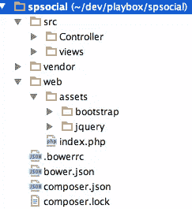
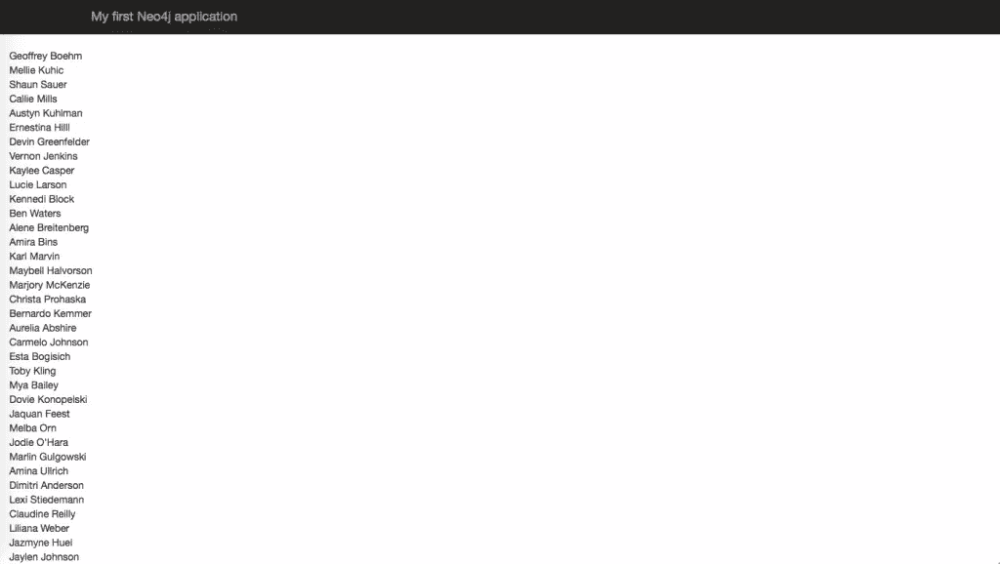
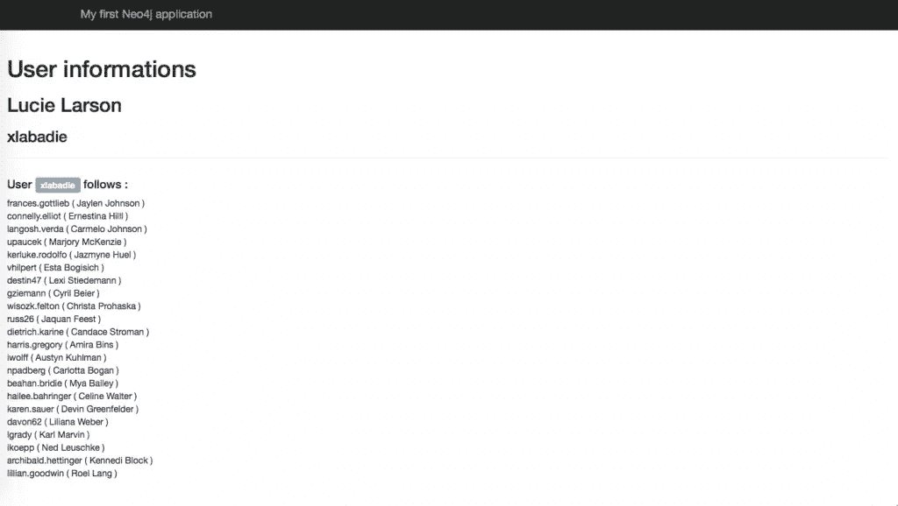
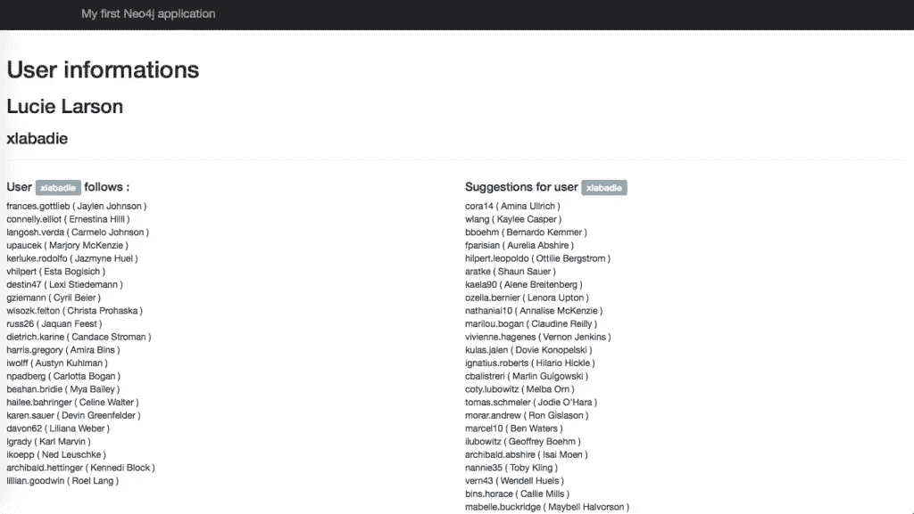
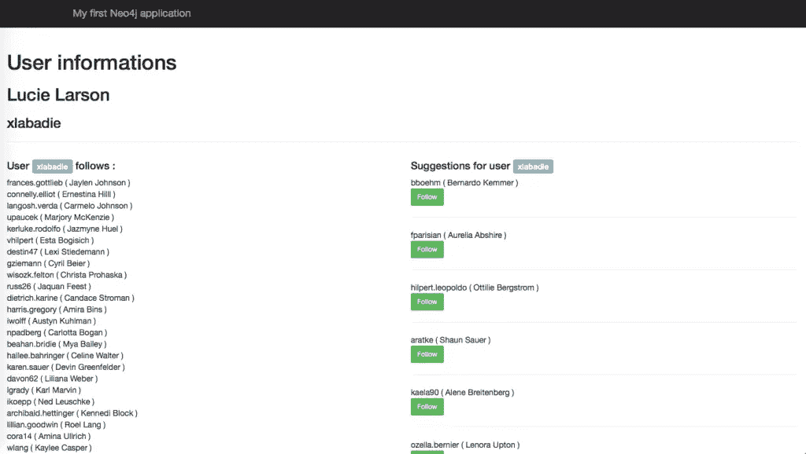
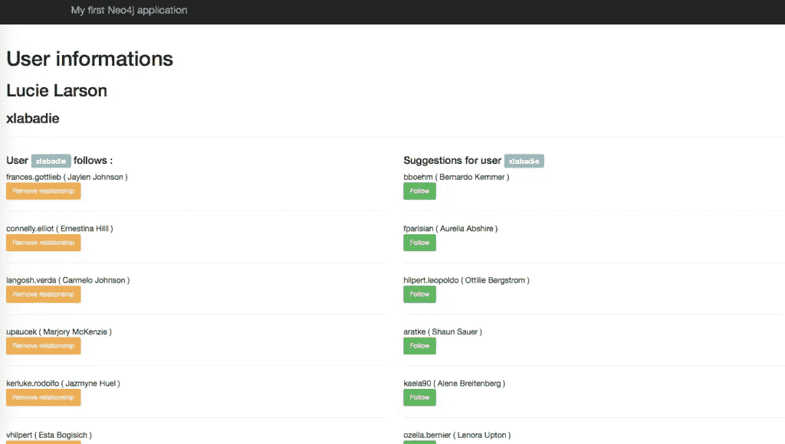

# 使用 Neo4j 向 PHP 应用程序添加社交网络功能

> 原文：<https://www.sitepoint.com/adding-social-network-features-php-app-neo4j/>

在上一部分中，我们学习了 Neo4j 以及如何在 PHP 中使用它。在这篇文章中，我们将使用这些知识来构建一个真正的 Silex 驱动的社交网络应用程序，它带有一个图形数据库。

## 引导应用程序

我将使用 [Silex](http://silex.sensiolabs.org/) 、 [Twig](http://twig.sensiolabs.org) 、 [Bootstrap](http://getbootstrap.com) 和 [NeoClient](https://github.com/neoxygen/neo4j-neoclient) 来构建应用程序。

为应用程序创建一个目录。我给我的取名`spsocial`。

将这些行添加到您的`composer.json`中，并运行`composer install`来安装依赖项:

```
{
  "require": {
    "silex/silex": "~1.1",
    "twig/twig": ">=1.8,<2.0-dev",
    "symfony/twig-bridge": "~2.3",
    "neoxygen/neoclient": "~2.1"

  },
  "autoload": {
    "psr-4": {
      "Ikwattro\\SocialNetwork\\": "src"
    }
  }
}
```

您可以下载 Bootstrap 并将其安装到项目的`web/assets`文件夹中。

你也可以在这里找到 bootstrap 演示应用:[https://github.com/sitepoint-editors/social-network](https://github.com/sitepoint-editors/social-network)

## 设置 Silex 应用程序

我们需要配置 Silex 并声明 Neo4jClient，以便它在 Silex 应用程序中可用。在项目的`web/`文件夹中创建一个`index.php`文件:

```
<?php

require_once __DIR__.'/../vendor/autoload.php';

use Neoxygen\NeoClient\ClientBuilder;

$app = new Silex\Application();

$app['neo'] = $app->share(function(){
    $client = ClientBuilder::create()
        ->addDefaultLocalConnection()
        ->setAutoFormatResponse(true)
        ->build();

    return $client;
});

$app->register(new Silex\Provider\TwigServiceProvider(), array(
    'twig.path' => __DIR__.'/../src/views',
));
$app->register(new Silex\Provider\MonologServiceProvider(), array(
    'monolog.logfile' => __DIR__.'/../logs/social.log'
));
$app->register(new Silex\Provider\UrlGeneratorServiceProvider());

$app->get('/', 'Ikwattro\\SocialNetwork\\Controller\\WebController::home')
    ->bind('home');

$app->run();
```

Twig 被配置为将其模板文件放在`src/views`文件夹中。
指向`/`的归属路由被注册并配置为使用我们稍后将创建的`WebController`。
应用程序的结构应该是这样的:



注意，这里我使用了 bower 来安装 bootstrap，但是使用什么取决于你自己。

下一步是用一个内容块创建我们的基本布局，我们的子树枝模板将用它们自己的内容覆盖它。我将采用顶部带有导航条的默认引导主题:

```
<!DOCTYPE html>
<html lang="en">
<head>
    <meta charset="utf-8">
    <meta http-equiv="X-UA-Compatible" content="IE=edge">
    <meta name="viewport" content="width=device-width, initial-scale=1">
    <meta name="description" content="">
    <meta name="author" content="">

    <title>My first Neo4j application</title>

    <!-- Bootstrap core CSS -->
    <link href="{{ app.request.basepath }}/assets/bootstrap/dist/css/bootstrap.min.css" rel="stylesheet">
    <!-- HTML5 shim and Respond.js IE8 support of HTML5 elements and media queries -->
    <!--[if lt IE 9]>
    <script src="https://oss.maxcdn.com/html5shiv/3.7.2/html5shiv.min.js"></script>
    <script src="https://oss.maxcdn.com/respond/1.4.2/respond.min.js"></script>
    <![endif]-->

    <style>
        body { padding-top: 70px; }
    </style>
</head>
<body>

<div class="navbar navbar-inverse navbar-fixed-top" role="navigation">
    <div class="container">
        <div class="navbar-header">
            <button type="button" id="collbut" class="navbar-toggle collapsed" data-toggle="collapse" data-target=".navbar-collapse">
                <span class="sr-only">Toggle navigation</span>
                <span class="icon-bar"></span>
                <span class="icon-bar"></span>
                <span class="icon-bar"></span>
            </button>
            <a class="navbar-brand" href="#">My first Neo4j application</a>
        </div>
    </div>
</div>

<div class="container-fluid">

    

    

</div>
</body>
</html>
```

### 主页(检索所有用户)

到目前为止，我们在应用程序中提供了 Neo4j，我们的基本模板已创建，我们希望在主页上列出所有用户。

我们可以分两步实现这一目标:

*   创建我们的`home`控制器动作并从 Neo4j 中检索用户
*   将用户列表传递给模板并列出他们

#### 控制器动作

```
<?php

namespace Ikwattro\SocialNetwork\Controller;

use Silex\Application;
use Symfony\Component\HttpFoundation\Request;

class WebController
{

    public function home(Application $application, Request $request)
    {
        $neo = $application['neo'];
        $q = 'MATCH (user:User) RETURN user';
        $result = $neo->sendCypherQuery($q)->getResult();

        $users = $result->get('user');

        return $application['twig']->render('index.html.twig', array(
            'users' => $users
        ));
    }
}
```

控制器显示了流程，我们检索`neo`服务并发出一个密码查询来检索所有用户。
用户集合然后被传递给`index.html.twig`模板。

#### 索引模板

```



    <ul class="list-unstyled">
        
            <li>{{ user.property('firstname') }} {{ user.property('lastname') }}</li>
        
    </ul>

```

该模板非常简单，它扩展了我们的基本布局，并添加了一个未排序的列表，在`content`继承块中包含用户的名字和姓氏。

启动内置的 php 服务器，欣赏您的作品:

```
cd spsocial/web
php -S localhost:8000
open localhost:8000
```



#### 社交网络功能:显示用户关注谁

假设我们想要点击一个用户，并显示他的详细信息和他关注的用户。

第一步:在`index.php`中创建一条路线

```
$app->get('/user/{login}', 'Ikwattro\\SocialNetwork\\Controller\\WebController::showUser')
    ->bind('show_user');
```

步骤 2:创建`showUser`控制器动作

```
public function showUser(Application $application, Request $request, $login)
    {
        $neo = $application['neo'];
        $q = 'MATCH (user:User) WHERE user.login = {login}
         OPTIONAL MATCH (user)-[:FOLLOWS]->(f)
         RETURN user, collect(f) as followed';
        $p = ['login' => $login];
        $result = $neo->sendCypherQuery($q, $p)->getResult();

        $user = $result->get('user');
        $followed = $result->get('followed');

        if (null === $user) {
            $application->abort(404, 'The user $login was not found');
        }

        return $application['twig']->render('show_user.html.twig', array(
            'user' => $user,
            'followed' => $followed
        ));
    }
```

该工作流类似于任何其他应用程序，您尝试根据登录找到用户。如果不存在，则显示 404 错误页面，否则将用户数据传递给模板。

步骤 3:创建`show_user`模板文件

```



    <h1>User informations</h1>

    <h2>{{ user.property('firstname') }} {{ user.property('lastname') }}</h2>
    <h3>{{ user.property('login') }}</h3>
    <hr/>

    <div class="row">
        <div class="col-sm-6">
            <h4>User <span class="label label-info">{{ user.property('login') }}</span> follows :</h4>
            <ul class="list-unstyled">
                
                    <li>{{ follow.property('login') }} ( {{ follow.property('firstname') }} {{ follow.property('lastname') }} )</li>
                
            </ul>
        </div>
    </div>


```

第 4 步:重构主页中的用户列表，以显示到他们个人资料的链接

```

    <li>
        <a href="{{ path('show_user', { login: user.property('login') }) }}">
           {{ user.property('firstname') }} {{ user.property('lastname') }}
        </a>
    </li>

```

刷新主页，点击任何用户，显示其个人资料和关注用户列表



### 添加建议

下一步是向概要文件提供建议。我们需要在控制器中稍微扩展一下我们的 cypher 查询，添加一个`OPTIONAL MATCH`来查找基于二级网络的建议。

可选前缀使`MATCH`返回一行，即使没有匹配，但是未解析部分被设置为`null`(非常像外部连接)。由于我们可能会为每个朋友的朋友(fof)获得多条路径，因此我们需要区分结果以避免列表中出现重复(collect 是将值收集到数组中的聚合操作):

更新的控制器:

```
public function showUser(Application $application, Request $request, $login)
    {
        $neo = $application['neo'];
        $q = 'MATCH (user:User) WHERE user.login = {login}
         OPTIONAL MATCH (user)-[:FOLLOWS]->(f)
         OPTIONAL MATCH (f)-[:FOLLOWS]->(fof)
         WHERE user <> fof
           AND NOT (user)-[:FOLLOWS]->(fof)
         RETURN user, collect(f) as followed, collect(distinct fof) as suggestions';
        $p = ['login' => $login];
        $result = $neo->sendCypherQuery($q, $p)->getResult();

        $user = $result->get('user');
        $followed = $result->get('followed');
        $suggestions = $result->get('suggestions');

        if (null === $user) {
            $application->abort(404, 'The user $login was not found');
        }

        return $application['twig']->render('show_user.html.twig', array(
            'user' => $user,
            'followed' => $followed,
            'suggestions' => $suggestions
        ));
    }
```

更新的模板:

```



    <h1>User informations</h1>

    <h2>{{ user.property('firstname') }} {{ user.property('lastname') }}</h2>
    <h3>{{ user.property('login') }}</h3>
    <hr/>

    <div class="row">
        <div class="col-sm-6">
            <h4>User <span class="label label-info">{{ user.property('login') }}</span> follows :</h4>
            <ul class="list-unstyled">
                
                    <li>{{ follow.property('login') }} ( {{ follow.property('firstname') }} {{ follow.property('lastname') }} )</li>
                
            </ul>
        </div>

        <div class="col-sm-6">
            <h4>Suggestions for user <span class="label label-info">{{ user.property('login') }}</span> </h4>
            <ul class="list-unstyled">
                
                    <li>{{ suggested.property('login') }} ( {{ suggested.property('firstname') }} {{ suggested.property('lastname') }} )</li>
                
            </ul>
        </div>

    </div>


```

您可以立即探索应用程序中的建议:



### 连接到用户(添加关系)

为了连接到建议的用户，我们将为每个建议的用户添加一个 post 表单链接，其中包含两个用户作为隐藏字段。我们还将创建相应的路线和控制器动作。

创建路线:

```
#web/index.php

$app->post('/relationship/create', 'Ikwattro\\SocialNetwork\\Controller\\WebController::createRelationship')
    ->bind('relationship_create');
```

控制器动作:

```
public function createRelationship(Application $application, Request $request)
    {
        $neo = $application['neo'];
        $user = $request->get('user');
        $toFollow = $request->get('to_follow');

        $q = 'MATCH (user:User {login: {login}}), (target:User {login:{target}})
        MERGE (user)-[:FOLLOWS]->(target)';
        $p = ['login' => $user, 'target' => $toFollow];
        $neo->sendCypherQuery($q, $p);

        $redirectRoute = $application['url_generator']->generate('show_user', array('login' => $user));

        return $application->redirect($redirectRoute);
    }
```

这里没什么稀奇的，我们`MATCH`为起始用户节点和目标用户节点，然后我们`MERGE`为对应的`FOLLOWS`关系。我们在关系上使用 MERGE 来避免重复条目。

模板:

```
<div class="col-sm-6">
            <h4>Suggestions for user <span class="label label-info">{{ user.property('login') }}</span> </h4>
            <ul class="list-unstyled">
                
                    <li>
                        {{ suggested.property('login') }} ( {{ suggested.property('firstname') }} {{ suggested.property('lastname') }} )
                        <form method="POST" action="{{ path('relationship_create') }}">
                            <input type="hidden" name="user" value="{{ user.property('login') }}"/>
                            <input type="hidden" name="to_follow" value="{{ suggested.property('login') }}"/>
                            <button type="submit" class="btn btn-success btn-sm">Follow</button>
                        </form>
                        <hr/>
                    </li>
                
            </ul>
        </div>
```

现在，您可以点击您想要关注的建议用户的`FOLLOW`按钮:



删除关系:

删除关系的工作流程与添加新关系、创建路线、控制器操作和调整布局的工作流程非常相似:

路线:

```
#web/index.php
$app->post('/relationship/remove', 'Ikwattro\\SocialNetwork\\Controller\\WebController::removeRelationship')
    ->bind('relationship_remove');
```

控制器动作:

```
public function removeRelationship(Application $application, Request $request)
    {
        $neo = $application['neo'];
        $user = $request->get('login');
        $toRemove = $request->get('to_remove');

        $q = 'MATCH (user:User {login: {login}} ), (badfriend:User {login: {target}} )
        MATCH (user)-[follows:FOLLOWS]->(badfriend)
        DELETE follows';
        $p = ['login' => $user, 'target' => $toRemove];
        $neo->sendCypherQuery($q, $p);

        $redirectRoute = $application['url_generator']->generate('show_user', array('login' => $user));

        return $application->redirect($redirectRoute);
    }
```

你可以在这里看到，我使用`MATCH`来寻找两个用户之间的关系，
和我添加了一个标识符`follows`到关系中，以便能够`DELETE`它。

模板:

```
<h4>User <span class="label label-info">{{ user.property('login') }}</span> follows :</h4>
            <ul class="list-unstyled">
                
                    <li>
                        {{ follow.property('login') }} ( {{ follow.property('firstname') }} {{ follow.property('lastname') }} )
                        <form method="POST" action="{{ path('relationship_remove') }}">
                            <input type="hidden" name="login" value="{{ user.property('login') }}"/>
                            <input type="hidden" name="to_remove" value="{{ follow.property('login') }}"/>
                            <button type="submit" class="btn btn-sm btn-warning">Remove relationship</button>
                        </form>
                        <hr/>
                    </li>
                
            </ul>
```

您现在可以点击每个被关注用户下的**删除关系**按钮:



## 结论

图形数据库非常适合关系数据，在 PHP 和 NeoClient 中使用它很容易。Cypher 是一种方便的查询语言，你会很快爱上它，因为它可以用自然的方式查询你的图表。

使用[图形数据库](http://graphdatabases.com)获取真实世界的数据有如此多的好处，
我邀请你通过阅读手册[http://neo4j.com/docs/stable/](http://neo4j.com/docs/stable/)，
看看 Neo4j 用户提供的[用例](http://neo4j.com/use-cases)和[示例](http://gist.neo4j.org/)并在 Twitter 上关注[@ Neo4j](https://twitter.com/neo4j)来发现更多。

## 分享这篇文章