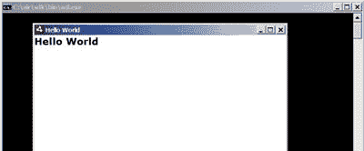
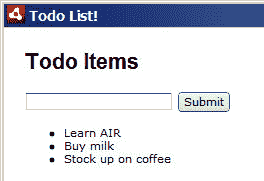
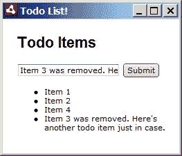

# 漫步云端:在五分钟内创建一个待办事项清单

> 原文：<https://www.sitepoint.com/adobe-air-todo-list-5-minutes/>

*****这是最近比赛的获奖文章我们跑去 sitepoint.com 推广 Adobe AIR 的文章。*** 
Adobe Integrated Runtime(AIR)是 web 开发人员的热门话题。很有可能！借助 Adobe 新推出的基于桌面的 web 应用系统 AIR，桌面应用程序现在可以使用 web 开发人员多年来一直使用的技术来构建——普通的旧式 HTML、CSS 和 JavaScript。**

 **在本教程中，我将向您展示如何做到这一点:使用 Adobe AIR 为桌面构建一个简单的基于 web 的应用程序。

##### 航空 101

那么，这个土坯 AIR 是什么？最基本的，AIR 是一个在 web 技术和桌面 API 之间提供桥梁的平台。web 开发人员曾经需要使用变通方法并与服务器交互来构建以客户端为中心的应用程序，而 AIR 提供了一种构建从桌面运行的 web 应用程序的方法。AIR 应用程序为用户提供了两个世界的精华——桌面应用程序的丰富界面和本地资源，以及 Web 的网络优势。它还提供对客户机系统的访问，这是富互联网应用程序中非常缺乏的功能。

借助 AIR，web 应用程序现在可以:

*   使用本地文件系统
*   与窗口管理器集成(例如，允许修改 OS X dock 图标和 Windows 系统托盘图标)
*   提供本地菜单
*   将数据安全地存储在本地机器上

然而，最好的部分是:JavaScript 代码提供了所有的功能。任何具备一定 JavaScript 技能的 web 开发人员都可以立即上手。如果你会说 JavaScript，你可以只用你现有的技能在几分钟内构建强大的桌面应用程序。

不过关于*为什么*已经说得够多了——现在让我们来考察一下*什么*，然后跳到*如何*。

***内部空气***

AIR 的核心是高度面向 web 的。AIR 包括一个基于 WebKit 的网络浏览器，与苹果 Safari 浏览器的渲染引擎相同。WebKit 和任何现代网络浏览器一样符合标准，所以它对 CSS 和 JavaScript 有极好的支持。

然后，web 浏览器链接到特定于操作系统的 API。当你的应用程序在 OS X 上运行时，你可能想在应用程序菜单栏上添加 dock 图标或菜单——这就是这些 API 的用途。同样，在 Windows 中，您可以创建系统托盘图标和窗口菜单。

最后，AIR 通过桌面 API 提供对更通用的操作系统功能的访问，这些功能类似于您可能在桌面应用程序框架中看到的功能。基本的东西都准备好了:使用文件系统、拖放、剪贴板、网络。然而，AIR 更进了一步——由于该平台是为富 web 应用程序设计的，它提供了开箱即用的本地 SQLite 支持的数据库*。*

任何以前做过面向对象的 JavaScript 编程的人都会立即意识到，有了 AIR 应用程序提供的所有这些功能，JavaScript 开发人员利用这种巨大的能力应该没有任何困难。

***入门***

作为一名开发人员，您需要了解两个部分:

*   [运行时](http://get.adobe.com/air/)，它允许您(和您的用户)运行 AIR 应用程序
*   [软件开发工具包(SDK)](http://www.adobe.com/products/air/tools/sdk/) ，它允许您测试和打包 AIR 应用程序

在你进一步阅读之前，我建议你下载这两个软件，这样你就可以在家里一起玩了。为了构建本教程中的示例应用程序，我使用了运行时的 1.0.1 版本(撰写本文时可用的最新版本)，但是它们应该可以在任何 1.x 运行时上工作。

安装运行时后，将 SDK 解压缩到本地文件系统上的一个文件夹中。因为我在 Windows 机器上，所以我使用了路径`C:airsdk`，但是如果你愿意，你可以把它放在另一个文件夹中。

从现在开始，如果您已经拥有了构建 web 应用程序的工具，那么您就拥有了所需的一切。我用的是 Windows，除了文本编辑器什么都没有( [Notepad2](http://flos-freeware.ch/notepad2.html) 完成这项工作)，但如果你在任何平台上使用 [Aptana](http://www.aptana.com/) 或 [Dreamweaver CS3](http://labs.adobe.com/wiki/index.php/AIR:Dreamweaver_CS3_Extension) ，有一些适合你的 IDE 的插件，你可能会喜欢尝试。

在这个阶段，你需要使用 Windows 或者 Mac。AIR for Linux 处于 alpha 版本，但[可用](http://labs.adobe.com/downloads/air_linux.html)。尽管试一试，但是因为它是 alpha 软件，我不能保证它能运行这些样本。

##### 您的第一个 AIR 应用程序

让我们切入正题，构建我们的第一个 AIR 应用程序！我们将从组装一个简单的“Hello World”来演示基础知识开始，然后转到一个简单的待办事项列表应用程序。虽然[不是第一次在 AIR 中创建这样的应用程序，但对于初级项目来说，这是完美的。](http://24ways.org/2007/christmas-is-in-the-air )

首先，为项目创建一个新文件夹，以帮助组织构成 AIR 应用程序的所有零碎内容——我已经使用了`C:airprojectshello_world`。

***应用描述符文件***

AIR 应用程序最简单的形式就是 HTML 文件的集合。XML 配置文件通知运行时应用程序入口点，通常是 HTML 文件或 Flash/Flex 文件。这个配置文件称为应用程序描述符文件，包括一些基本的元数据，如应用程序的名称、惟一的 ID 和应用程序的当前版本。

我们现在就做一个吧。在文本文件中键入以下内容:

```
<?xml version="1.0" encoding="UTF-8"?> <application >    <id>examples.sp.helloworld</id>    <filename>HelloWorld</filename>    <initialWindow>        <content>index.html</content>        <visible>true</visible>    </initialWindow> </application>
```

在我们之前创建的项目文件夹中，用名称`application.xml`保存这个文件。目前，这个应用程序描述符文件非常小；我们的最终应用程序将指定更多的参数。现在，我们已经有了一个应用程序 ID、一个包文件名和一些关于初始窗口的细节。

应用程序 ID 只是标识我们的应用程序的唯一字符串；建议使用反向域点语法来指定。例如，如果我正在构建 sitepoint.com 的测试应用程序，我会指定一个 ID`com.sitepoint.Test`。在这里，我们使用了`examples.sp.helloworld`，它应该可以避免与您可能尝试的任何其他空气样本发生冲突。这指的是最终的应用程序可执行文件的文件名，以及安装目录的名称和一些对应用程序的引用。最后，`initialWindow`部分定义了我们的应用程序将如何启动——在本例中，`index.html`页面可见。

***应用前端***

接下来，我们必须将作为前端的 HTML 文件放在一起。我们将从 HTML 中的一个基本“Hello world”开始:
 `<html>
<head>
<title>Hello World</title>
</head>
<body>
<h1>Hello World</h1>
</body>
</html>`

将上述标记复制到您的文本编辑器中，并将其保存为`index.html`，与`application.xml`放在同一个文件夹中。

一旦我们准备好了应用程序描述符文件和初始 HTML 页面，我们就万事俱备了。通过在命令行键入以下命令来运行您的第一个 AIR 应用程序:
 `/path/to/adl /path/to/application.xml` 
因为我使用的是 Windows，所以我会键入以下命令:

```
C:airsdkbinadl C:airprojectshello_worldapplication.xml
```

当然，您应该将适当的路径替换为二进制文件`adl`和文件`application.xml`。如果你使用的是 Windows，你甚至可以把你的`application.xml`文件拖到`adl`可执行文件上来实现同样的事情。

这导致控制台窗口打开，我们的“Hello World”web 应用程序显示在一个基本窗口中，如下所示。



祝贺您-您的第一个 AIR 应用程序已完成！

这个神秘的`adl`可执行文件就是 AIR Debug Launcher (ADL)。随之打开的黑色控制台窗口允许 ADL 为您提供调试信息，例如，大多数 JavaScript 错误都会产生一两条 ADL 控制台消息。您还可以为 ADL 生成自己的调试消息。

##### 使用空气

正如我们刚刚看到的，开始使用 AIR 很容易。然而，一旦你找到了运行时的方法，乐趣才真正开始。让我们使用 HTML、CSS 和 JavaScript 样本构建一个简单的待办事项列表应用程序。

***界面细节***

我们需要我们的应用程序看起来比我们的“Hello World”页面更迷人一些。在本教程中，我不会太担心 CSS 样式，因为这是您以后可以轻松添加到应用程序中的东西。我们将构建一个基本的界面来演示基础知识。

如果您要将网页改装到 AIR 应用程序中，那么您现有的网页样式可能会表现得很好。但是，要小心不要完全照搬你的网站设计——桌面应用程序有不同的用户界面需求。请记住，桌面应用程序可能会在一个窗口中运行，而 web 浏览器窗口通常会被最大化以填满整个屏幕。另一个不同点是，在桌面上，用户滚动较小的元素和输入字段，而在 Web 上，用户(通常)滚动整个页面。

打开之前的 index.html 文件，用我们新的待办事项列表布局代码更新它，如下所示:

```
<html>   <head>      <title>Todo List!</title>      <style type="text/css">      body {          margin: 20px;      }      h1 {          font-family: sans-serif;      }      </style>   </head>   <body>      <h1>Todo Items</h1>      <p><input type="text" id="new_text" />         <input type="submit" id="add_item" /></p>      <ul id="todo_items">          <li>Learn AIR</li>          <li>Buy milk</li>          <li>Stock up on coffee</li>      </ul>   </body>   </html>
```

再次运行您的应用程序(从命令行或者通过将您的`application.xml`拖到`adl.exe`上),您的应用程序应该如下图所示。



现在将鼠标悬停在输入框和提交按钮上，您会注意到 AIR 运行时对这两个按钮都应用了一些样式，包括一个漂亮的悬停效果。如果你愿意，你可以覆盖这些样式，就像你覆盖任何网络浏览器的默认样式一样，但是我们将坚持这种效果。

***JavaScript:AIR goed Wild！***

接下来，我们需要添加实际的列表管理功能。通过允许我们用 JavaScript 编码，AIR 为我们提供了巨大的能力；看看 AIR 的 JavaScript 语言参考的大小就知道了。从使用文件系统到检查剪贴板的内容，甚至是连接相机和麦克风，一切都在那里。你能得到的太多了，感谢空气！

现在，我们将执行一些基本的接口绑定来创建我们的待办事项功能。我们将创建一个简单的项目列表，并允许用户通过单击从列表中删除每个项目。JavaScript 相当简单；下面是接口代码:

```
function remove_todo(element) {      element.parentNode.removeChild(element);   }     window.onload = function() {      document.getElementById('add_item').onmousedown = function() {          item_text = document.getElementById('new_text').value;          new_item = document.createElement('li');          new_a = document.createElement('a');          new_a.onmousedown = function() {              remove_todo(this.parentNode);          }          new_a.innerHTML = item_text;          new_item.appendChild(new_a);          document.getElementById('todo_items').appendChild(new_item);      }   }
```

这些都是非常标准的 DOM 内容，也可以是为 web 应用程序编写的。事实上，我用 Firebug 和 Firefox 在这个页面上做了一些快速检查，同时把它放在一起。代码并不漂亮，可能也没有它应有的速度快，但目前来说还可以。将此粘贴到您的`index.html`头部的`<script>`标签中。

 *下面是我们最终的 UI 代码:

```
<html>   <head>      <title>Todo List!</title>      <style type="text/css">      body {          margin: 20px;      }      h1 {          font-family: sans-serif;      }      </style>      <script type="text/javascript">      function remove_todo(element) {          element.parentNode.removeChild(element);      }            window.onload = function() {          document.getElementById('add_item').onmousedown = function() {              item_text = document.getElementById('new_text').value;              new_item = document.createElement('li');              new_a = document.createElement('a');              new_a.onmousedown = function() {                  remove_todo(this.parentNode);              }              new_a.innerHTML = item_text;              new_item.appendChild(new_a);              document.getElementById('todo_items').appendChild(new_item);          }      }      </script>   </head>   <body>      <h1>Todo Items</h1>      <p><input type="text" id="new_text" /><input type="submit" id="add_item" /></p>      <ul id="todo_items">      </ul>   </body>   </html>
```

用这段代码更新您的`index.html`文件，通过 ADL 运行它——瞧！我们的应用程序功能齐全！它应该看起来像这样。



如果用户插入项目，它们会被添加到列表中，单击它们会导致它们从列表中消失，这是意料之中的。我们的界面当然可以做一些改进，但总的来说，该应用程序构建起来既快速又简单，我们已经准备好了一个合理的 Adobe AIR 应用程序。

但是等等——我们现在该怎么办？

##### 收尾

随着我们的待办事项应用程序几乎准备就绪，我们现在可以添加最后的润色，并将其打包成一个`.air`文件进行分发。

***调整我们的应用描述符文件***

下面是我们当前的`application.xml`:

```
<?xml version="1.0" encoding="UTF-8"?>   <application >      <id>examples.sp.helloworld</id>      <filename>hello_World</filename>      <initialWindow>          <content>index.html</content>          <visible>true</visible>      </initialWindow>   </application>
```

我们可以从更新 Hello World 数据开始！接下来，在我们投入生产之前，我们应该明确地添加一个版本号，以便最终用户机器上的运行时能够识别更新。我们还可以添加带有一些有用信息的`<name>`和`<description>`标签。

此外，我们的待办事项窗口被设计得非常窄。我们可以通过`<initialWindow>`中的`<width>`属性节点将宽度限制为 200 像素。`<height>`同样适用于限制窗口高度；这两个标签都是可选的。

手册页包含所有可用选项的完整文档。这是我们更新后的配置文件:

```
<?xml version="1.0" encoding="UTF-8"?>   <application >      <id>examples.sp.todo</id>      <filename>TodoList</filename>      <version>1</version>      <name>SitePoint.com AIR Example: Todo List</name>      <description>This application helps you manage your pending tasks.</description>      <initialWindow>          <content>index.html</content>          <visible>true</visible>          <width>200</width>      </initialWindow>   </application>
```

***打包我们的应用程序以进行分发*** 
除了 ADL，Adobe AIR SDK 还包括用于打包 AIR 应用程序和生成证书的 AIR 开发工具(ADT)实用程序。AIR 应用程序应进行数字签名——当安装未正确签名或根本未签名的应用程序时，用户将收到警告。

我们需要跳转到命令行来生成证书，因此在 AIR 应用程序所在的文件夹中弹出一个控制台窗口，并键入以下内容:

```
adt -certificate -cn SelfSigned 1024-RSA testCert.pfx some_password 
```

用您选择的密码替换“`some_password`”。几秒钟后，ADT 应该完成它的证书生成过程，您应该在应用程序目录中有一个新的`testCert.pfx`文件。

接下来，使用 ADT 将应用程序打包成一个`.air`文件:

```
adt -package -storetype pkcs12 -keystore testCert.pfx TodoList.air application.xml index.html
```

这告诉 ADT 使用`testCert.pfx`中的密钥文件打包您的应用程序。在上面一行中，我们指示 ADT 将我们的整个应用程序打包到一个名为`TodoList.air`的文件中，并包含文件`application.xml`和`index.html`。您可能需要在应用程序中包含的任何其他文件(如 JavaScript、CSS 等)都可以添加到该命令的末尾。

在此过程中，系统会提示您输入我们为您的新证书文件设置的密码。输入它，稍等片刻，一个`TodoList.air`文件应该出现在与您的项目文件相同的目录中。

剩下的唯一任务是测试您的新 AIR 应用程序！双击`TodoList.air`文件启动 AIR 安装程序。应用程序需要一些时间来安装，并在安装过程中显示我们的应用程序的名称(如`application.xml`中所定义)。最后，一旦安装完成，应用程序将启动。Ta *da* ！您的第一个真正的 AIR 应用程序已经完成！

##### 进一步阅读

Adobe 准备了一些关于 AIR 入门的宝贵资源。如果您有兴趣进一步探索该领域，请前往他们的开发人员中心，那里有 [AIR HTML 教程](http://www.adobe.com/devnet/air/ajax/quickstart/)，AIR APIs 的 JavaScript 语言参考，以及关于使用 HTML 和 AJAX 构建 AIR 应用程序的完整手册。

您还应该使用 IDE 进行设置；Aptana 提供了强大的空中支持，甚至有一个关于使用 Aptana 和 AIR 构建应用的[截屏](http://www.adobe.com/devnet/air/ajax/articles/building_on_air_in_aptana.html)。

虽然这是一个非常简单的应用程序，但我希望您能看到 Adobe AIR 带来的潜力。网络应用和桌面应用之间的灰色地带变得更加灰暗；我期待着看到你可以用什么惊人的创作来填充它！*** 

## ***分享这篇文章***