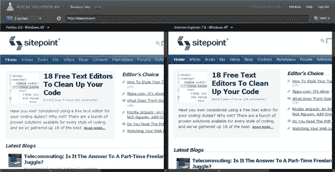
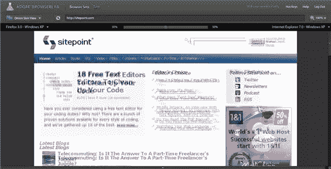

# Adobe BrowserLab:跨浏览器测试仍在起步阶段…

> 原文：<https://www.sitepoint.com/adobe-browserlab-cross-browser-testing-still-teething/>

作为网页设计师，我们需要做的最费力的工作之一可能就是进行跨浏览器测试。查看你的网站在许多不同的浏览器中的外观需要很多时间。Adobe 最近宣布，他们将向用户开放新在线应用程序 [BrowserLab](https://browserlab.adobe.com/) 的有限免费试用，这是一款供设计师和开发人员进行跨浏览器测试的工具。

实际浏览器渲染的屏幕截图是实时生成的，具有多个查看选项，有助于查明各种问题。这些选项包括:

1.  一次检查一个站点在一个浏览器中的外观。
2.  在不同的浏览器中并排比较同一个站点。

4.  使用“洋葱皮”模式，在多个浏览器中显示一个站点，一个在另一个之上

目前它仍然是一个框架结构，可能会在正式发布前充实。例如，没有 Chrome 浏览器选项，也没有显示移动浏览器，我认为这在这些日子里是必不可少的。试用的浏览器仅限于 Windows XP 和 OS X 的 Firefox 3.0，Win XP 的 Safari 3.0 和 Internet Explorer 7。话虽如此，有什么是易于使用，让您快速测试。我认为这项服务有潜力真正帮助设计师。

开发人员可能特别感兴趣的另一个功能是 Dreamweaver CS4 与 BrowserLab 的集成，它允许您通过“冻结”特定页面状态并将其直接发送到 BrowserLab 来预览本地交互式页面/应用程序内容(ajax/db 驱动的数据、小部件和 JS 驱动的 UI 元素等)。

Adobe 表示，他们最终会将这项服务作为付费订阅服务进行收费。注意:在发表这篇文章时，Adobe 已经停止接受用户的有限试用，但计划很快接受另一波用户。查看[更新，了解他们何时接受更多用户](http://labs.adobe.com/wiki/index.php/BrowserLab#Adobe_BrowserLab_-_Current_Status)。

与此同时，你可以看看其他一些提供类似跨浏览器测试功能的网站。

1.  [浏览器主机](http://browsershots.org/)
2.  [石蕊](http://litmusapp.com/)
3.  [戈麦斯](http://www.gomez.com/products/cross-browser-compatibility-testing.php)
4.  [XBDiff(也在公测中)](http://www.xbdiff.com/)

您使用过哪些其他网站或应用程序来提供这项服务？你愿意为跨浏览器的测试应用付费吗？

## 分享这篇文章