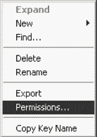
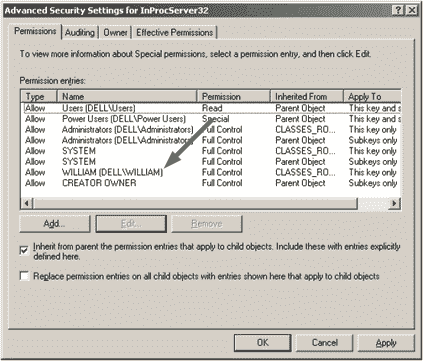
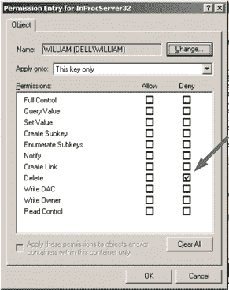

# Adobe CS3 和消失的缩略图案例——续集

> 原文：<https://www.sitepoint.com/adobe-cs3-and-the-case-of-the-disappearing-thumbnails-the-sequel/>

所以，自从我们第一次发表一篇关于让你的缩略图在 Adobe Creative Suite 2 中再次工作的小文章以来，已经过去了将近两年。执行摘要:Adobe 禁用了许多曾经在 Explorer 中显示的缩略图，大概是为了“*激励*CS3 用户使用 Bridge。在咬紧牙关做了一些研究后，我们想出了一个变通办法，并在那里发布了它。

两年后，它成为了我们最受欢迎的帖子之一——我上次查看的时候有近 140 条评论，一般来说，最多一两周就会收到另一条评论。

然而，Adobe ***仍然*** 喜欢 Bridge，而 ***仍然*** 喜欢你使用 Bridge，所以在 CS3 中做出了稍微困难一点的回应。如果允许，Illustrator CS3 会在每次启动时检查缩略图是否被禁用，如果发现缩略图未被禁用，它会进行更改以确保缩略图被禁用。

如果你让它是..

谢天谢地，这个问题已经解决了，我很想把解决方案和功劳传给大家。

威廉·M·帕克是一位天才画家、Photoshop 超级用户和注册表调整者。

除了原始解决方案中提到的 dll 和 REG 文件，William 还整理了一份详细的 PDF，解释了 CS3 用户需要进行的注册表更改，以恢复他们的 AI 和 PSD 缩略图。

你可以从这里下载 PDF、DLL 和 REG 文件。

干得好，威廉。

征得 William 的同意，我在这里重新发布了他的 PDF 格式的说明，让你不必下载就能了解其中的内容。

**在 Windows 资源管理器中启用 AI 和 PSD 缩略图**

Adobe CS、CS2 和 CS3 禁用 Windows 资源管理器中的缩略图预览。要纠正这一点:

1).转到“开始/所有程序/附件/系统工具/系统还原”，按照说明创建系统还原点。万一出了问题，请回到这个菜单来撤销您所做的任何更改。

2).将以下文件放入`C:Program FilesCommon FilesAdobeShell`

*   psicon.dll
*   aiicon.dll

3).运行两个注册表文件。

如果你运行的是 CS 或者 CS2，那就可以了。对于 CS3，您必须在注册表中编辑一个键，以防止 Illustrator 每次启动时删除该键。

4).单击“开始/运行”,键入“regedit ”,然后找到并右键单击以下项:

```
 HKEY_CLASSES_ROOTCLSID{0C5B0CED-206B-4c39-B615-0EB23C824612}InProcServer32

```


5)。点击**权限**。

6).点击**高级**按钮。

7).找到**你的** 用户名(即不是`WILLIAM(DELLWILLIAM)`)，高亮显示，然后点击“**编辑… 【T4”按钮。**



8).在“拒绝”栏的“删除”框中打勾，然后单击“确定”。忽略任何安全警告，只需单击确定。



9).这将防止 Illustrator 在启动时删除密钥。

*就这样。如果一切都按计划进行，你现在应该有缩略图了。*

> > jgaris 在下面的评论中指出，Windows Vista 在 Illustrator reg 文件中使用的一些大写目录名存在问题。解决方法很简单。

要纠正这一点，请遵循以下步骤。在双击文件 aiicon.dll.reg 之前，在文本编辑器
2 中打开它。第 6 行是去 aiicon.dll 的路，但是是大写的。将其全部改为小写(就像实际的文件名–aiicon . dll)。
3。保存并关闭该文件，然后双击该文件以应用注册表更改。

psicon.dll.reg 已经是正确的，不需要编辑。然后重启你的电脑，一切都会好的。

## 分享这篇文章