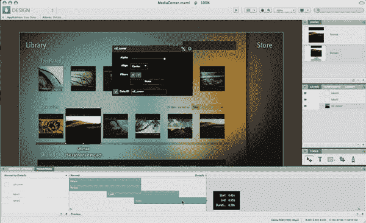
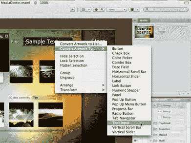

# Adobe 在 MAX 大会上首次推出 Flash Catalyst

> 原文：<https://www.sitepoint.com/adobe-debuts-flash-catalyst-at-max-conference/>

一年多前，在去年芝加哥举行的年度 MAX 活动上，Adobe 展示了他们正在生产的代号为“Thermo”的应用程序，这立即成为会议的话题——这是有充分理由的。Thermo 是一款令人瞠目结舌且可能改变游戏规则的应用程序，它允许非编码人员创建丰富的互联网应用程序用户界面，从而极大地简化了基于 Flex 的应用程序的设计人员到开发人员的工作流程。

今天，在今年旧金山举行的 2008 年 MAX 大会上，Thermo 以其官方名称 Adobe Flash Catalyst 面向公众展示。今天 MAX 与会者可以获得预览版本，明年年初将在 Adobe 的实验室网站上发布公共测试版。

Flash Catalyst 是一个非常令人印象深刻的应用程序，它允许设计师导入在另一个 Adobe CS 工具(如 Photoshop 或 Illustrator)中创建的 UI，然后自动编写 MXML 代码以使界面工作。

例如，该应用程序可以从 Photoshop 中获取分层图形，设计师可以使用 Flash Catalyst 的“将插图转换为”功能将按钮、滚动条和文本输入的模型转换为实际的功能性 UI 元素，底层代码已经准备就绪。从那里，开发人员可以将 UI 与应用程序的业务逻辑和后端代码挂钩。Adobe 表示，目标是简化设计人员和开发人员之间的工作流程。

您可以将 Flash Catalyst 视为更智能的 Visual Basic，允许创建前端代码，而无需实际编写任何代码(尽管可以跳转到代码视图来手动编辑位)。由于 Flash Catalyst 与 Adobe CS 系列设计工具和 Flex Builder 无缝集成，它将允许设计人员和开发人员以前所未有的方式共同开发基于 Flash 的富互联网应用程序。设计师不再需要有一些编码知识来连接前端，相反，开发人员不再需要有设计经验来使 UI 功能与它的外观相匹配。

相反，设计师可以处理用户界面元素，而开发人员专注于业务逻辑，两者之间的资产转换或多或少是无缝的。Flash Catalyst 消除了设计人员和开发人员之间的许多摩擦。

去年在 MAX 展会上，Thermo 无疑是 Adobe 展示的最热门的产品。很高兴看到事情回到原点，Adobe 离 Flash Catalyst 的公开发布如此之近。Adobe 在 Labs 上有一个[预览视频，本文中的截图(如上)是该应用程序的预发布版本。](http://labs.adobe.com/technologies/flashcatalyst/)

## 分享这篇文章