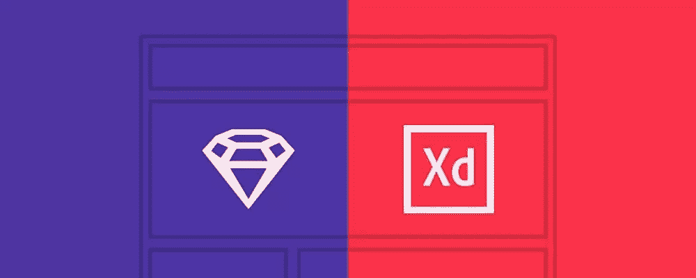
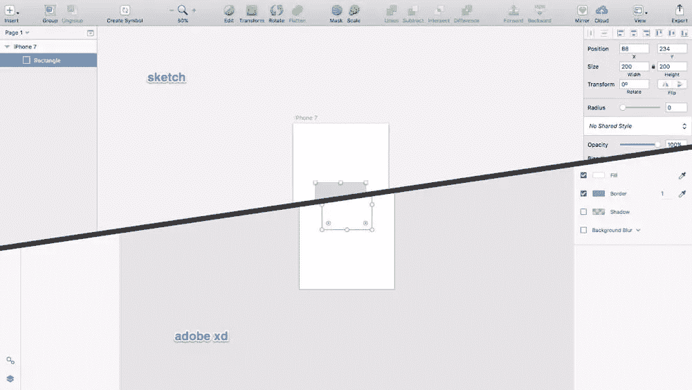
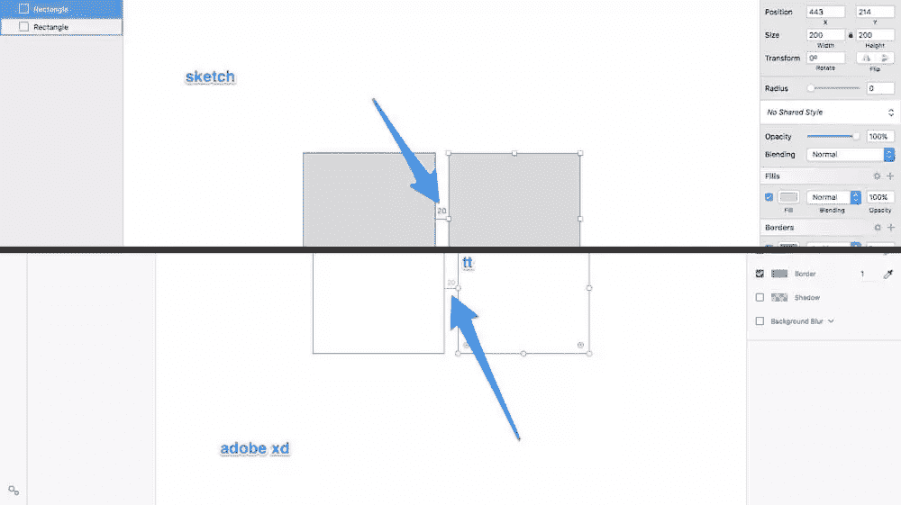
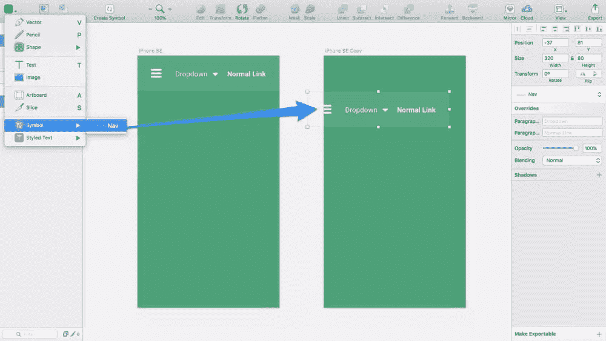
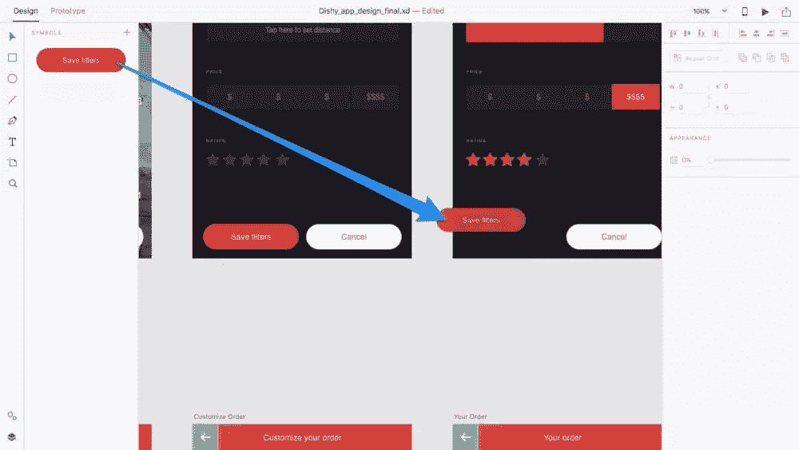
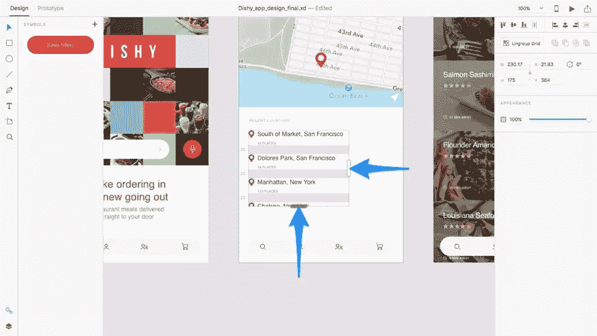
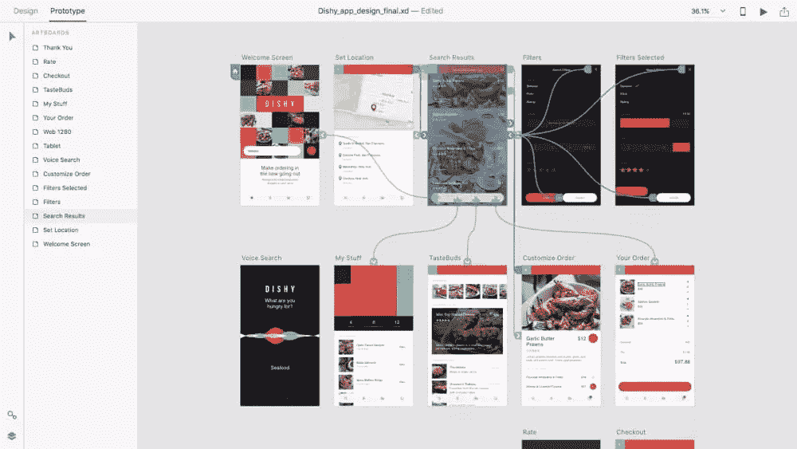

# Adobe XD 和 Sketch:哪个会产生最好的 UX？

> 原文：<https://www.sitepoint.com/adobe-xd-sketch-will-result-best-ux/>

我们将 [Sketch](https://sketchapp.com/) 与 [Photoshop](http://www.adobe.com/Photoshop) (有时还有 Illustrator)进行比较已经有一段时间了，但现在这个问题引发了争论: **Adobe XD 还是 Sketch？**说到 UI 设计，Photoshop 正在半途而废。

为什么？因为，在很长一段时间里，Photoshop 是 Sketch 唯一的直接竞争对手，尽管 Photoshop 主要用于编辑*照片*。Adobe 随后试图为用户界面设计师⏤改进 Photoshop，他们添加了画板、更好的导出工作流程、智能指南等等。然而，这些新功能的主要问题是它们让 Photoshop 变得更加臃肿。这就像在远洋客轮上加了一个溜冰场。

随着 Sketch 的不断发展，以及更多新的设计应用程序开始出现(Affinity Designer、Figma 等)，Adobe 需要构建一个快速、超干净的应用程序，专门用于用户界面设计师。Photoshop 还需要再次显示大约*张照片*。

进入 **Adobe Experience Design CC** ，也被称为**Adobe XD**——他们对纯 UI 设计工具的新尝试。

那么，Adobe XD 和 Sketch 哪个 app 更适合你呢？

## 平台战争

**Sketch 仅适用于 macOS 用户**–我们现在就来确定一下。设计师们仔细审查了这个决定，但事实就是如此。Adobe XD 可用于 Windows 和 macOS。

## Adobe 的激烈界面改革

毫无疑问，你会注意到的关于 Adobe XD 的第一件事是漂亮的最小化界面(与 Photoshop 相比)。由于 Adobe XD 专注于用户界面设计，你会发现图像编辑工具几乎不存在，所以与其他 Adobe 应用程序相比，该应用程序的界面没有那么令人印象深刻。这不是修饰照片或移除背景的应用程序。

对于那些不想转向 Sketch(或者因为他们使用 Windows 而不能)的 Adobe 粉丝来说，但在其他方面承认 Photoshop 不是 UI 设计的正确工具，那么我向你保证，这是你一直在等待的工具。

但是，如果你是 macOS 用户，两个工具都可以选择，那该怎么办呢？好吧，在这方面，你会发现 Sketch 和 XD 非常不相上下——它们的 UI 布局几乎相同。

## 不可见的用户界面—智能指南和键盘快捷键

我最喜欢的 Sketch 也存在于 Adobe XD — *隐形界面*。所谓不可见，我的意思是有一些方法可以在不与界面交互(例如点击)的情况下完成某些任务，要么是因为动作是自动的，要么是因为有一个超小型的键盘快捷键。

需要 50%的不透明度吗？只要在键盘上按“5”就行了。需要以 20px 的边距对齐图层？别担心，自动出现的智能向导会让你知道你有多近。智能指南也可以用 option 键(⌥)激活！

## 可重复使用的组件(符号)

到目前为止，这两个应用程序听起来都同样令人印象深刻，但是真正的战斗开始于更大的功能。

我们先来看看符号。

符号是可重复使用的设计元素/组件。本质上，您维护一个“主”符号，并且主文档(在您的设计中)中该符号的所有实例都是主符号的镜像。

插入符号非常非常容易！

草图中的符号

但是，当您需要组件的一个实例看起来不同于另一个实例时，会发生什么呢？如果一个导航实例需要在其中一个屏幕上显示悬停状态，该怎么办？

不用担心，Sketch 允许你将*符号嵌套在其他符号中。你基本上可以为你的图标设计不同的状态作为一个单独的符号，并选择在更大的符号中使用哪个状态(在这个例子中，是菜单导航)。*

Adobe 还没有在 XD 中实现嵌套符号(在撰写本文时)，但将来很可能会实现。在这方面，Sketch 正在赢得比赛，因为他们已经存在了更长时间，然而，XD 正在快速前进。

顺便说一下，这些截图中使用的令人惊叹的 UI 套件名为 Dishy(由 Serge Vasil 创建)，你可以在这里找到它。

## 可重复组件(重复网格)

重复网格是 Adobe XD ⏤的一个标志性功能，目前没有其他 UI 设计应用程序提供。它允许您水平和垂直重复组件，同时在每个图块中插入独特的内容。您甚至可以从桌面多次拖动资源(图像和文本文件),以便自动插入和分发内容。

重复网格

到目前为止，Sketch 还没有实现这样的功能，尽管因为 Sketch 允许开发者社区构建扩展，你可以安装 [Craft 插件](https://www.invisionapp.com/craft)来完成同样的事情。

就我个人而言，我喜欢 Adobe XD 自带的这个特性！

## 原型用户流(仅在 Adobe XD 中)

在 Sketch 中无法构建用户流的原型，因此“Sketchers”不得不依靠与另一种服务集成，如 InVision App、漫威 App 或 Atomic App(没关系，它们都是很棒的应用！).Adobe XD 提供了内置的设计和原型制作工具，因此如果您喜欢将工作流程包含在一个应用程序中，那么 Adobe XD 可能适合您。

原型用户流

## 导出图像资产

两个应用程序中的图像资产导出非常相似，尽管我有时需要导出 *JPG* 文件，只有 Sketch 支持，所以这真的取决于你的个人需求。

这两款应用都支持 PDF、PNG 和 SVG。

## 结论

如果你认为 Photoshop 和 Sketch 之间的竞争非常激烈，那么 Adobe XD 会让你大吃一惊——Adobe XD 和 Sketch 之间的竞争正在推动他们不断完善自己，这对我们这些希望设计得更好更快的设计师来说是一个好消息。

但是你最终应该选择哪一个呢？Adobe XD 还是 Sketch？对于 Windows 用户来说，Adobe XD 是明确的选择。但对于 macOS 用户来说，这可能取决于你的个人需求。

*   你需要原型工具吗？(Adobe XD 原生提供此功能)
*   符号更灵活？(此处素描略好)
*   你会爱上重复网格吗？(Adobe XD 独家！)

*有兴趣了解与 Adobe XD 合作的设计、原型制作**和**的更多细节吗？SitePoint Premium 会员可以下载我们的新书， [Jump Start Adobe XD](https://www.sitepoint.com/premium/books/jump-start-adobe-xd) ！*

## 分享这篇文章