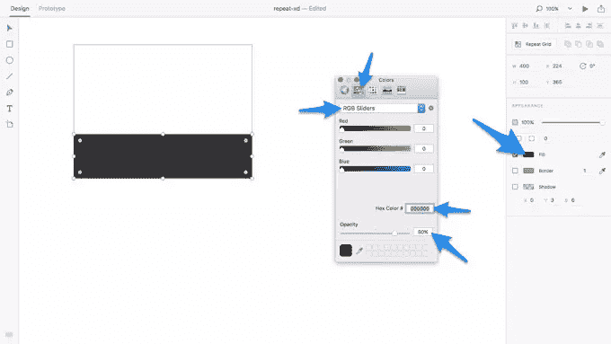
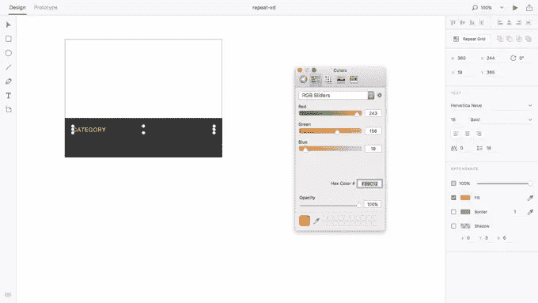
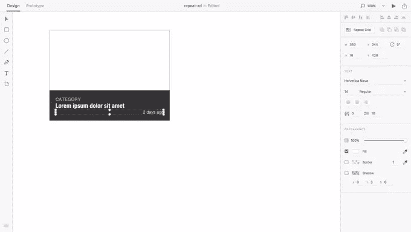
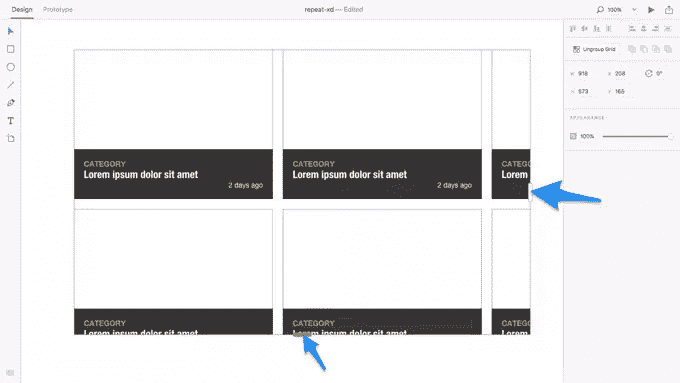
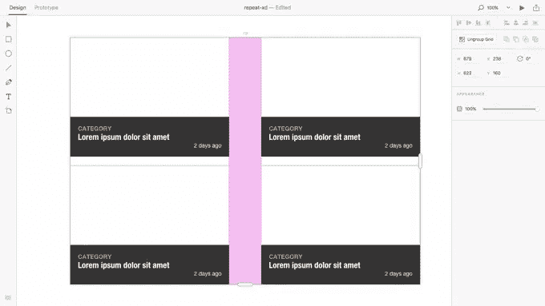
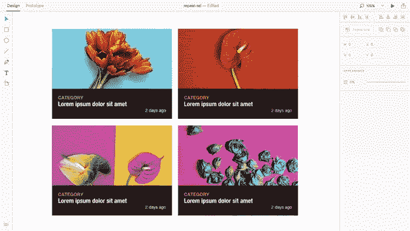
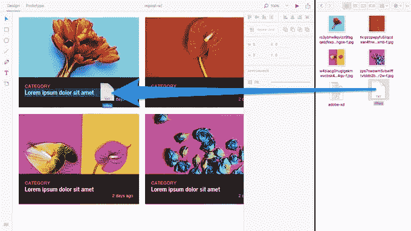

# Adobe XD 重复网格教程:轻松导入资产

> 原文：<https://www.sitepoint.com/adobe-xd-tutorial-a-pain-free-way-to-import-assets/>

自从 Adobe 决定通过最终建立一个专用的用户界面设计工具来挑战 Sketch 以来，许多人都想知道这两个应用程序还需要多长时间才能在同一重量级上战斗。但如果你问我，Adobe XD 的重复网格功能表明我们已经在那里。

我们先来看看 [Adobe XD](http://www.adobe.com/products/experience-design.html) 新增的拖拽资产导入功能，然后你可以自己决定。以下是我们目前通常导入资产的方式:

*   `Save As` → `File` → `Import`或者
*   `Ctrl/Command+C` → `Ctrl/Command+V`

在我的记忆中，“拖放”也是大多数设计应用程序的一个功能，但是没有办法一次对各种可重用的组件自动执行这一操作，本质上是为一组在视觉上完全相同的组件提供独特的内容——直到现在。

## 第一步:设计物品卡片网格

从闪屏打开一个新的“Web”文档开始——只要有一块可爱的白色画布，你选择哪个尺寸都没关系。按 **R** 创建并绘制一个矩形，确保尺寸为 400x300px。

现在创建另一个矩形(400x100px)，删除其边框，然后使用 80%不透明度的黑色(#000000)作为“填充”颜色——确保首先选择 *`Color Sliders` → `RGB Sliders`* 。

让我们创建一系列的文字层来覆盖这个矩形；很快就可以清楚地看到，我们正在设计由文章的类别、标题和日期组成的文章卡片。按下 **T** 选择“文本”工具，并使用以下可选样式:

*   **填充:** #F39C12
*   **文字:** Helvetica 新，15，Bold
*   **高度:** 18(与*行距*相同)

再说一遍:

*   Helvetica·纽伊，21 岁，简洁大胆
*   **Fill:** #FFFFFF
*   身高: 26

最终时间:

*   Helvetica·纽，14 岁，普通学生
*   **Fill:** #FFFFFF
*   **身高:** 16
*   **右对齐:**

## 用 Adobe XD 的重复网格复制组件

拖动鼠标光标一次选择所有的层，然后从边栏中选择“重复网格”工具。你会注意到组件现在有了可拖动的侧边手柄——你可以根据需要拖动这些手柄多次平铺组件。一个磁贴发生的事情会发生在所有磁贴上(就造型而言，但不一定在内容上，这非常方便)。

*提示:你可以通过拖动网格中每行或每列之间的空间来轻松调整装订线的宽度。*

## 轻松批量导入图像资产

这就是奇迹发生的地方。在我们开始之前，这里是我在截图中使用的四幅由美妙的叶夫根尼娅·波列琴斯卡娅创作的图像:[红色马蹄莲极简主义](https://creativemarket.com/Porechenskaya/648015-Red-Calla-Minimalism)、[马蹄莲时尚极简主义](https://creativemarket.com/Porechenskaya/648013-Calla-Fashion-Minimal)、[深红色背景上的蓝色玫瑰](https://creativemarket.com/Porechenskaya/663785-Blue-Roses-on-a-crimson-background)和[红色郁金香花束](https://creativemarket.com/Porechenskaya/663782-Red-Tulip-Bouquet)。

将这些图像保存到您的计算机上(样本就可以了)。如果你拖动*一个*的图像到*一个*的矩形中，图像将被自动裁剪(当然也适用于每个区块)。然而，如果您选择所有四个图像，*一个*图像将被应用到*每个*图块；这是我们将图像资产导入 Adobe XD 时节省大量时间的方法。到目前为止，与素描或 Photoshop 相比，这是最快的方法。

为什么？

1.  无需遮蔽、裁剪或调整图像大小
2.  没有必要一遍又一遍地重复这些步骤
3.  不需要使用*覆盖*(在草图中)

## 将文本文件导入重复网格

我们可以对文本做同样的事情。假设我们想用一个唯一的标题替换 lorem ipsum title 的每个实例，我们可以打开文本编辑(或者任何你用来创建简单的 T2 的应用程序)。txt files)，将每个标题写在新的一行上，然后将文件拖到图层中，就像我们对图像所做的那样。

Adobe XD 将自动提取每一个新行，并将它们分发到该重复层的每个实例。

*警告:“文本编辑”默认使用富文本格式，但您可以在`File` → `Preferences`(选择“纯文本”)*下更改此格式。

## 结论

并不总是由设计师来选择图像或决定文本，但由于 Adobe XD 的更新，无论谁负责都可以创建图像和文本文件的资产文件夹，设计师可以直接将它们拖到设计文件中，并按原样使用它们。这种高能量的工作流程要容易得多，可以节省你大量的时间。

你怎么想呢?Adobe XD 会成为对抗 Sketch 的真正竞争者吗？你认为 Adobe XD 缺少哪些重要功能？

*更新:it **难道**真的成了 Sketch 的有力竞争者了！有兴趣了解更多关于设计、原型制作**和**与 Adobe XD 合作的细节吗？SitePoint Premium 会员可以下载我们的全新书籍 [Jump Start Adobe XD](https://www.sitepoint.com/premium/books/jump-start-adobe-xd) ！*

## 分享这篇文章