# Photoshop 中的高级图像锐化

> 原文：<https://www.sitepoint.com/advanced-image-sharpening-in-photoshop/>

对于任何想要清晰、干净的设计图像的设计师来说，锐化图像是一项重要的技能。你可能会有一张看起来有点平淡无奇或缺乏所需细节的图片。锐化可以通过增强细节来增加深度，使图像更清晰、更锐利、更精致。

传统的锐化技术会产生不同的结果。诸如模糊蒙版和智能锐化之类的滤镜会影响所有像素，这意味着当您锐化图像时，某些颜色会发生变化。由于颜色限制、RGB 模式下锐化产生的光晕以及无法针对图像的精确部分进行锐化的事实，某些锐化看起来过于尖锐，有时您根本无法获得良好的效果。

将您的图像转换为 LAB 模式是避免这些问题的一个很好的方法，可以通过清晰的颜色和精确的目标来锐化您的图像。LAB 颜色模式产生如此差异的原因是由于 LAB 由亮度组成，并且“A”和“B”通道包含颜色信息。亮度和颜色信息的这种分离有助于出色的锐化；您可以在亮度通道中锐化您的图像，专注于您的细节并排除图像的颜色信息，这些信息会导致失真和晕圈。

下面的图片是一个非常漂亮的山和树的展示。看起来不错，但是缺少细节。树木看起来模糊不清；他们肯定会从被磨尖中受益。整个图像似乎缺乏对比度和深度。远处的山和树都是朦胧的，你根本看不到任何细节。

[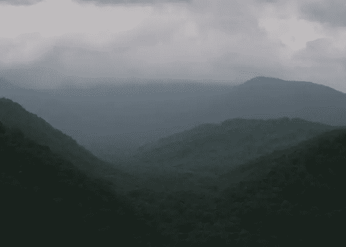](https://www.sitepoint.com/wp-content/uploads/2012/07/Screen-shot-2012-07-26-at-11.29.03-PM.png)

首先，我们需要将颜色模式从 RGB 改为 LAB。为此，请转到“图像”>“模式”>“实验室”正是在这里，我建议复制你的图像，这样，如果你犯了一个错误，你总是有原始图像工作。更好的是，智能过滤器也可以在实验室模式下工作。右键单击你的图像层，从弹出菜单中选择“转换为智能对象”。这是这项技术正常工作的非常重要的一步。选择你的智能对象层，进入通道面板，只选择亮度通道。

[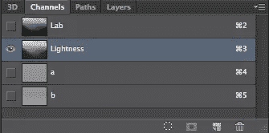](https://www.sitepoint.com/wp-content/uploads/2012/07/Screen-shot-2012-07-27-at-12.49.36-AM.png)

[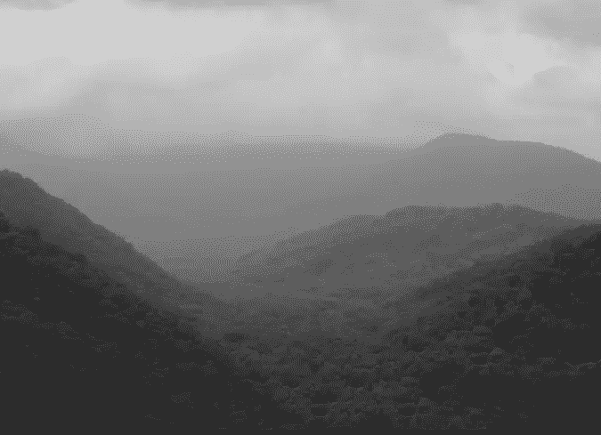](https://www.sitepoint.com/wp-content/uploads/2012/07/Screen-shot-2012-07-27-at-12.49.47-AM.png)

Photoshop 倾向于关闭其他图层，因此如果发生这种情况，请返回并通过单击眼睛图标重新激活它们的可见性。

[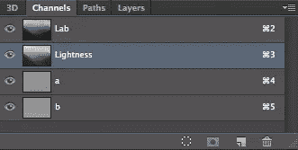](https://www.sitepoint.com/wp-content/uploads/2012/07/Screen-shot-2012-07-27-at-12.50.03-AM.png)

[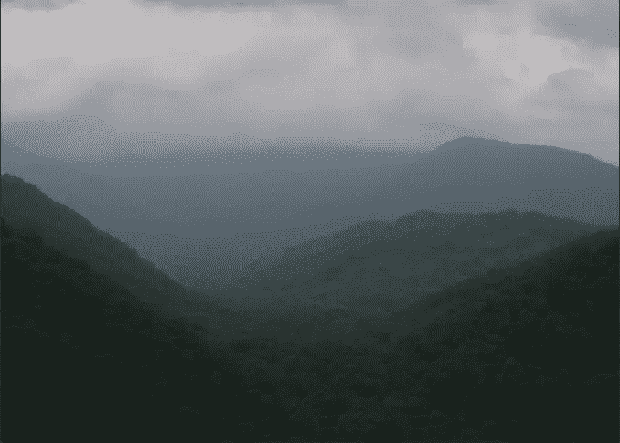](https://www.sitepoint.com/wp-content/uploads/2012/07/Screen-shot-2012-07-27-at-12.50.20-AM.png)

接下来，进入“滤镜”>“锐化”>“模糊蒙版”由于图层是一个智能对象，任何应用到它的滤镜都将是一个智能滤镜，使效果可以无限调整。我们将希望大幅增加数量和半径值。增加这些值会锐化图像。实际上，当您增加阈值的值时，阈值会降低锐度，因此出于我们的目的，将阈值设置为较低的值是一个好主意。

立刻，你会注意到一个不同，细节似乎活了过来。前景中有更多的细节，地平线上和远处的细节层次是巨大的。没有光晕，雾和朦胧感减少到你可以非常详细地看到几乎每棵树的程度。

智能滤镜最好的一点是，尤其是在这种情况下，你可以屏蔽掉不想锐化的区域。默认情况下，智能滤镜附带图层蒙版。只需选择一个软边笔刷，点击蒙版图标，然后涂上黑色来隐藏图像部分的锐化。你也可以在相反的地方涂上白色来锐化不同的区域。这给了你最终的控制权，什么是尖锐的，什么是留下来的。在下面的例子中，我想在左上角的山谷中添加一些模糊的东西。一个好的建议是将你的笔刷不透明度降低到 30-50%，这样你就可以慢慢地建立蒙版，而不会在你的图像中产生剧烈的变化。

[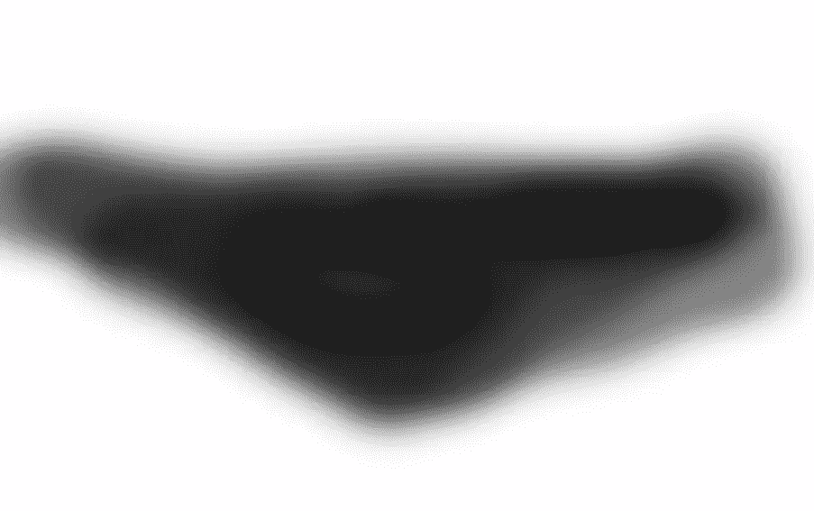](https://www.sitepoint.com/wp-content/uploads/2012/07/Picture-5.png)

[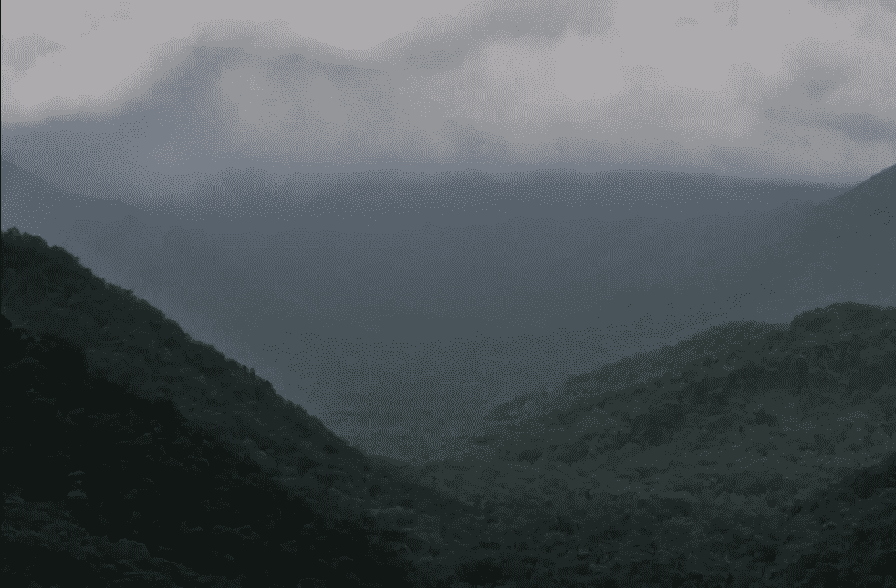](https://www.sitepoint.com/wp-content/uploads/2012/07/Picture-6.png)

### 替代技术:高通锐化方法

高通滤波锐化方法是使用实验室模式锐化的一种不错的替代方法。您可以在 RGB 模式下执行高通方法。要使用此方法，请按 Command/Ctrl + "J "来复制层。在复制的图层上，将混合模式更改为“叠加”您可以将复制的图层转换为智能对象。

接下来，进入“过滤器”>“其他”>“高通”设置半径，使您的图像锐化，变得更加明确，而不会过度锐化。对于我们的示例图像，200 产生了最好的结果，但这严格取决于图像本身及其分辨率。你可以从下面的图像中看到，结果是好的，但实验室锐化给出了更自然的结果，并暴露了更多的细节。

[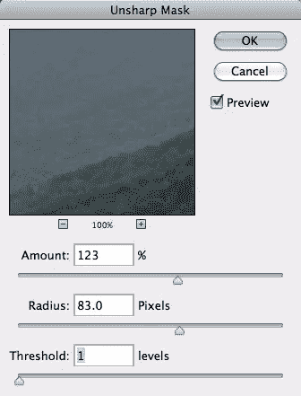](https://www.sitepoint.com/wp-content/uploads/2012/07/Screen-shot-2012-07-27-at-12.51.50-AM1.png)

[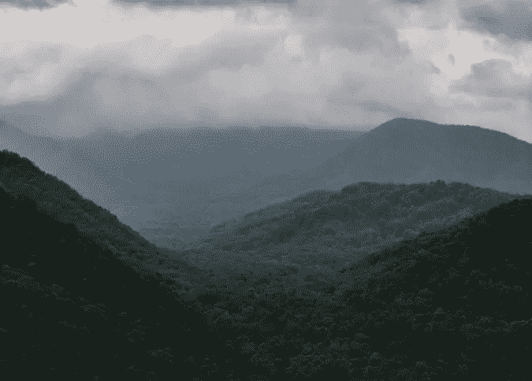](https://www.sitepoint.com/wp-content/uploads/2012/07/Screen-shot-2012-07-27-at-12.53.35-AM1.png)

## 方法 3:智能锐化

智能锐化是处理特定问题的好方法。“智能锐化”将锐化过程细分为一个点，您可以精确定位要锐化的内容、要校正的内容以及是锐化图像的高光还是阴影。首先，您必须将您的图像转换为智能对象。这样，您可以无限期地返回并编辑您的锐化滤镜。你总是有机会回去调整你的形象，而不是从头再来。

一旦你把你的图像转换成一个智能对象，只需进入“滤镜”>“锐化”>“智能锐化”一个对话框会出现几个选项，这是你可以针对和纠正具体问题的地方。为了获得最佳效果，请选择“高级”按钮来解锁该菜单提供的额外选项。

[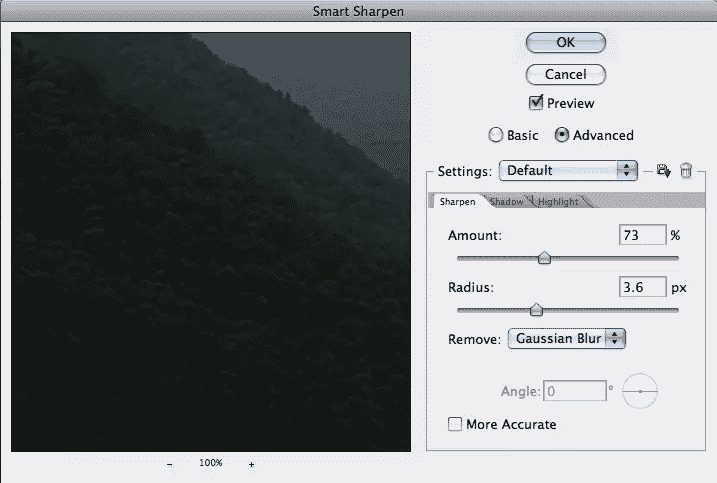](https://www.sitepoint.com/wp-content/uploads/2012/07/Picture-1.png)

智能锐化的设置与您通常使用的锐化非常相似，但也有一些细微的区别。第一个也是最有用的区别是消除由特定问题引起的模糊的能力。请注意上面的例子，它说“删除”您可以选择移除高斯模糊、镜头模糊或运动模糊。对于运动模糊，可以选择要校正的模糊角度。

在“阴影”和“高光”选项卡下，您可以通过增加淡入度来降低这些图像部分的锐化程度。使用这种方法，您可以只锐化图像的高光，而保持阴影完整。您也可以只锐化图像的阴影区域，而保持高光完整。这允许您只锐化您需要的区域。

[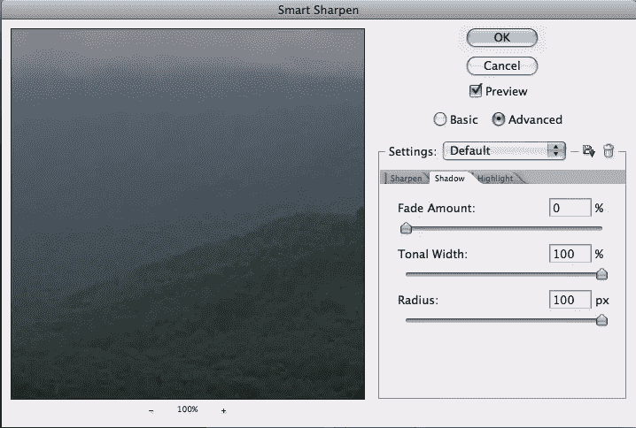](https://www.sitepoint.com/wp-content/uploads/2012/07/Picture-2.png)

[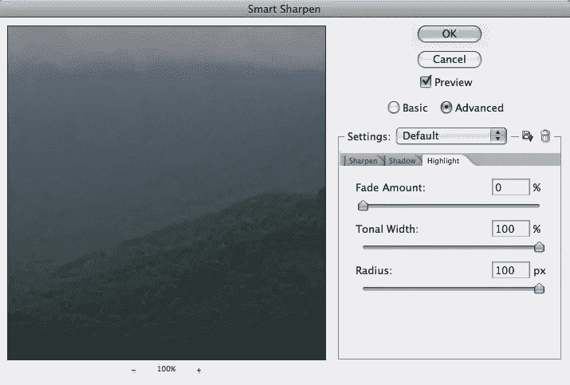](https://www.sitepoint.com/wp-content/uploads/2012/07/Picture-3.png)

最后两种图像锐化方法的唯一问题是，当您在锐化过程中包含颜色信息时，结果往往是粒状的。使用 LAB 方法时不会发生这种情况，因为您只是调整图像的亮度，而不会影响颜色信息。你也倾向于得到更清晰的图像，看起来不像是假的或被强行锐化的。另一方面，您可以使用智能锐化来消除运动模糊和镜头模糊，这有时会产生比实验室模式更好的结果。

### 结论

如果方法正确，锐化可以极大地增强图像，使其看起来更加细致。有些方法会在图像中产生不想要的噪点，所以最好少用，但有些方法会在没有任何副作用的情况下锐化图像，在不影响质量的情况下使图像更加清晰。将图像转换为智能对象可让您使用智能滤镜，使您的调整可无限编辑，并节省您的时间和精力。您可以根据需要锐化图像，如果您需要调整，可以使用智能滤镜来实现。

*有什么扎实的磨刀技术吗？以上哪种方法是你最喜欢的？*

## 分享这篇文章