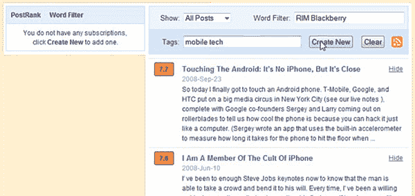

# AideRSS 以 PostRank 品牌重新推出

> 原文：<https://www.sitepoint.com/aiderss-relaunches-under-postrank-brand/>

7 月，我称加拿大初创公司 AideRSS 为“我在过去一年中遇到的最有用的工具之一”这并不夸张。feed filtering web 应用程序使用公开可用的社交数据将有用的帖子从 RSS feeds 中分离出来，对于每天与信息过载作斗争的人来说非常有用。今天，该公司宣布了该产品的第二个版本，它变得更好了。

他们也将援助者重新命名为后等级。PostRank 是为 AideRSS 提供支持的底层算法的名称，并于 7 月作为开发者网站在[发布，详细介绍了该公司的 feed 过滤 API。AideRSS 的创始人伊利亚·格里戈利克告诉我，为了更好地瞄准他们的用户群，他们正在以 PostRank 的名字重新命名。](https://www.sitepoint.com/rss-filtering-now-an-api-with-postrank/)

## 怎么样

新的 PostRank 服务带来了一系列新功能，其中最重要的是增加了**关键词过滤**和**频道**。这是许多用户已经在使用 AideRSS 完成的两件事，但为了做到这一点，他们需要第三方服务的帮助，如 FeedRinse 和 Dapper。

现在，除了使用 PostRank 技术过滤之外，新服务的用户还可以添加关键字过滤器。关键词过滤器相当简单——目前他们只能允许带有特定关键词的帖子，而不能阻止帖子，他们不能进行更复杂的过滤，如对帖子的特定部分应用规则，如作者字段、标题字段、标签或只是正文。帖子也可以通过标签分组到频道中。因此，它们还没有完全取代市场领导者 FeedRinse，但它们仍然是有帮助的。

频道的概念尤其令人兴奋，因为这意味着 AideRSS 可以用于从多个来源创建单个过滤的 megafeeds，这些 feed 可以作为 RSS 输出并在您的 feed 阅读器中订阅。例如，一家初创公司的所有者可以创建一个 feed，专门关注 VentureBeat、TechCrunch、Mashable、ReadWriteWeb、CenterNetworks，当然还有 SitePoint 上提到竞争对手的帖子。这些提要可以被添加到一个频道，然后作为一个 RSS 提要导出。也可以应用传统的助手过滤，所以我可以指定我只想被符合我的过滤的最受欢迎的故事所困扰。

在过去，做这样的事情需要使用至少两个额外的辅助服务。

该公司还宣布了改进的 feed 管理工具，包括批量管理 feed 的能力，以及一个新的 Firefox 3 扩展，允许用户在网络上的任何地方管理 feed 订阅，并立即获得他们当前正在查看的博客帖子的 PostRank 分数。

整个 PostRank 服务通过一个 API 对开发者开放(Firefox 插件就是基于这个 API 构建的)。这意味着第三方 RSS 阅读器可以使用 PostRank API 添加提要过滤和频道分组——希望他们中的许多人都这样做！

## 分享这篇文章