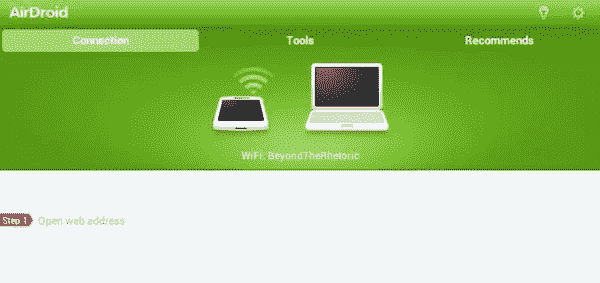
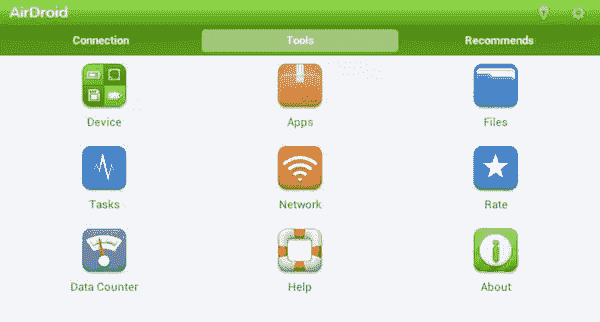
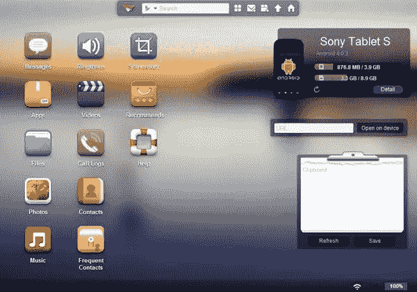
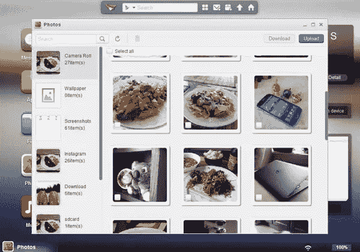

# AirDroid 可以让你在电脑上管理你的 Android

> 原文：<https://www.sitepoint.com/airdroid-lets-you-manage-your-android-on-your-pc/>

不要误解我。我爱我的安卓智能手机和平板电脑。它们非常适合在旅途中完成工作，比如查看我的电子邮件、浏览网页或更新我的脸书帐户。即便如此，在配有真正键盘和鼠标的普通旧电脑上完成这些任务通常会更快、更舒适。无论我如何努力，我就是不能在小触摸屏键盘上快速打字。使用传统的拖放界面管理文件也更加容易。

那么，当你想在你的 Android 设备上实现这些便利时，你能做些什么呢？有一个应用程序可以提供这种功能。它被称为 [AirDroid](http://airdroid.com/) ，它允许你“从你最喜欢的浏览器无线管理你的 Android。”你甚至不需要在电脑上安装任何软件，因为这一切都是通过一个基于网络的界面完成的。

### 与 Android 应用程序连接

这里的核心思想实际上非常强大。虽然你不能完全控制你的 Android 设备，也不能在你的电脑屏幕上玩你的 Android 游戏，但你可以用 AirDroid 做很多你通常会做的事情…笨拙地…直接在你的 Android 设备上。

主要的缺点是，如果你可以这么说的话，你的电脑和你的 Android 设备都必须连接到同一个 Wi-Fi 网络，这个应用程序才能工作。鉴于此，你所要做的就是从 [Google Play](https://play.google.com/store/apps/details?id=com.sand.airdroid&hl=en) 商店下载、安装并打开 AirDroid 应用。然后你会看到上面的屏幕。

在你的电脑上，你进入与[相关的网站](http://web.airdroid.com/)，它会要求你输入密码。这在 Android 应用程序的主页面上显示为七个字符的代码。或者，您可以使用 Android 手机或平板电脑上的摄像头扫描网站上显示的二维码。我发现输入密码更快，但这取决于你。

在你的 Android 设备上，你会发现另一个名为“工具”的标签，列出了应用程序中可用的一系列工具。这些包括检查您的网络、管理您的文件和监控您的数据使用情况。你可能不会经常用到这些，但无论如何它们都不是 AirDroid 的主要部分。主要部分发生在你的电脑上。

### 基于网络的界面

当你把你的 Android 设备和你的 PC 上的网络浏览器连接起来后，你会看到一个非常吸引人的网络界面。

它在许多方面看起来几乎像一个 Android 主屏幕。左侧是一系列应用程序，你可以通过它们与你的安卓设备进行无线互动。顶部是一个搜索栏和一些快捷图标，右侧是一些类似小工具的界面，用于查看您使用了多少存储容量，您运行的 Android 版本，等等。如果你愿意，还可以用剪贴板做笔记。

这一切都很干净，很容易遵循，很容易在眼睛上。如果你知道如何浏览手机或平板电脑上的应用，你就会明白如何使用这个网络用户界面。如前所述，左边的每个图标实际上都是一个可以在你的移动设备上运行的网络应用，但其中一些仅限于根设备。例如，除非是根用户，否则不能对 Android 手机或平板电脑(使用 AirDroid web UI)进行截图。

### 一整套功能

在很大程度上，这真的就像在你的电脑上完全控制你的 Android 智能手机或平板电脑。例如，顶部有一个发送信息的图标，包括阅读过去对话的功能。我不知道你是怎么想的，但是在真正的键盘上输入信息比在触摸屏上输入要快得多。你也可以仔细检查你的通话记录和联系人列表，包括经常联系的人的列表。最棒的是，你的朋友和同事甚至不会知道你在用电脑给他们发短信，因为这只会以普通的旧短信的形式出现在他们的面前。

此外，AirDroid 中的许多“应用程序”几乎与成熟的桌面应用程序一样强大。上面显示的照片应用程序就是一个简单的例子。我可以看到我通常在平板电脑上的“Gallery”应用程序下看到的每个不同的文件夹组，但我也可以同时以一系列缩略图的形式看到该文件夹的内容。我也可以多选下载或上传内容。

当我在 AirDroid 中打开“音乐”应用程序时，我以为会有一个类似文件管理器的配置，但不止如此。实际上，你可以通过这个基于网络的界面直接从你的 Android 设备上播放你的音乐。它不是世界上最强大的媒体播放器，但它是无缝的，而且很有效。视频内容也是如此。

### 完成工作的简便方法

我已经将我的安卓手机和安卓平板电脑设置为自动将我所有的相机照片上传到我的 Dropbox，但是我想要来回移动的所有其他文件怎么办？AirDroid 提供了一个简单而强大的无线文件传输协议。桌面短信管理非常棒，提供了一个类似即时消息的界面，以及一个可搜索的联系人列表。我甚至可以通过网络界面组织和播放我不同的媒体文件，这当然比通过最好的 Android 文件管理器应用程序更容易在电脑上完成。

考虑到 AirDroid 是从谷歌 Play 商店免费下载的，你没有理由不买这个应用。当你在旅途中时，它不会那么有用，但当你在家里或办公室呆一会儿时，AirDroid 让你更容易完全控制、管理和操纵你的 Android 设备，只需一台完整的计算机和网络浏览器。

## 分享这篇文章