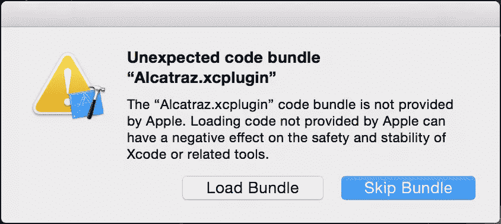
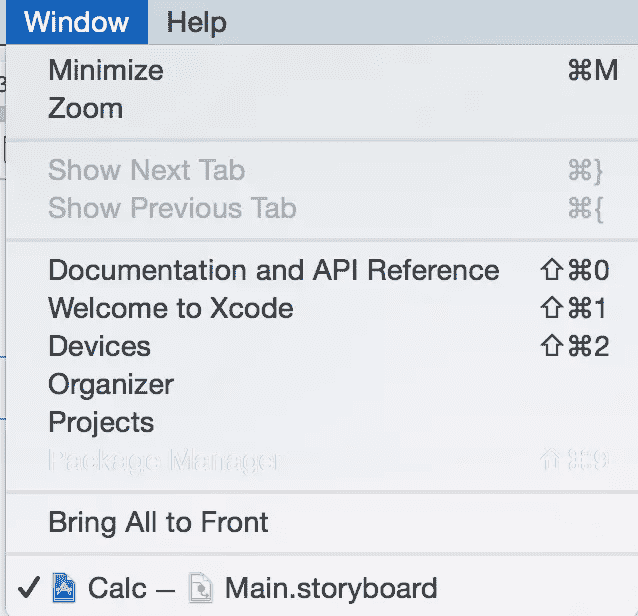
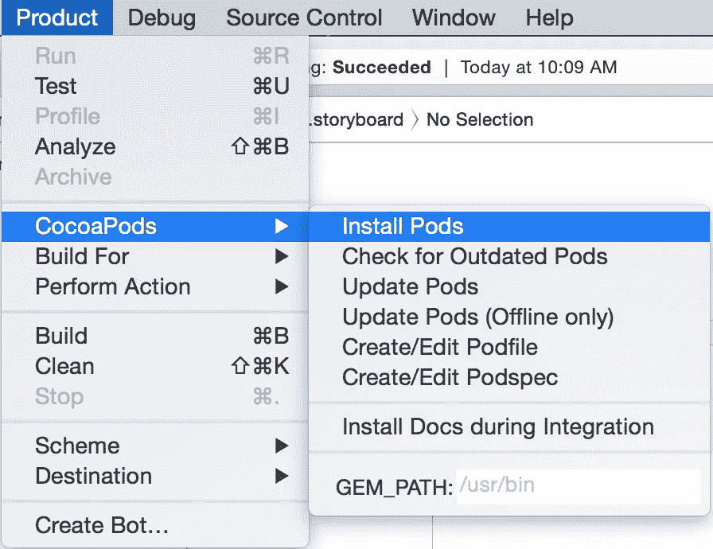
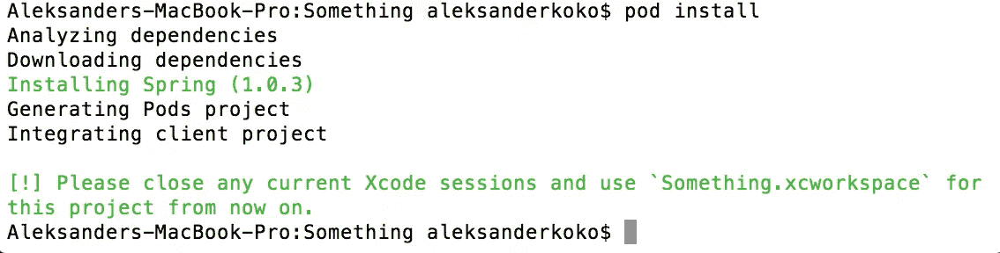

# 阿卡特兹，Xcode 的包管理器

> 原文：<https://www.sitepoint.com/alcatraz-the-package-manager-for-xcode/>

没有人能否认包管理者的力量。我们在 [Ruby](https://rubygems.org/) 、 [Node](https://www.npmjs.com/) 、 [PHP](https://www.google.com/webhp?sourceid=chrome-instant&ion=1&espv=2&ie=UTF-8#newwindow=1&q=php%20package%20manager) 等语言上看到它们。我们在 Linux 发行版和文本编辑器中看到它们，如 [Sublime](http://www.sublimetext.com/) 或 [TextMate](https://macromates.com/) 。

阿卡特兹是 Xcode 缺失的包管理器。多亏了阿卡特兹，Xcode 现在可以支持改变编辑器行为的插件，比如颜色主题和启动模板。

## 装置

安装阿卡特兹很容易。要安装，请执行:

```
curl -fsSL https://raw.githubusercontent.com/supermarin/Alcatraz/master/Scripts/install.sh | sh
```

这可能需要`sudo`凭证。要卸载 alcatraz，请执行:

```
rm -rf ~/Library/Application\ Support/Developer/Shared/Xcode/Plug-ins/Alcatraz.xcplugin
rm -rf ~/Library/Application\ Support/Alcatraz
```



不要忘记加载包以在 Xcode 中使用阿卡特兹。

如果您不小心按下了*跳过捆绑*，请阅读[这篇关于如何恢复该操作的](http://pablin.org/2015/05/27/re-enable-alcatraz-on-xcode-6-dot-3-2-or-newer/)文章。这发生在我身上，很难逆转。

安装或卸载阿卡特兹时，您需要重启 Xcode。

## 使用

在*窗口- >包管理器*菜单项下找到阿卡特兹。



阿卡特兹由三个主要部分组成。*插件*、*颜色主题*和*模板*。我在任何 IDE 上做的第一件事就是激活 Dracula 颜色主题。打开*包管理器*，搜索*德古拉颜色主题*。安装完成后，重启 Xcode，打开*偏好设置*，在*字体和颜色*下，选择新主题。

要删除一个阿卡特兹插件，打开包管理器，选择*已安装*并导航到三个部分之一(*插件*、*颜色主题*和*模板*)。

接下来我要添加[椰子](http://CocoaPods.org)。我已经安装了 CocoaPods】)作为 CLI 工具，但我还希望它能作为 Xcode 中的 GUI 工具。打开软件包管理器，在*插件*中搜索 *CocoaPods* 并安装。您可以在*产品- >椰子*菜单项中找到该工具。



CocoaPods 是 Xcode 项目的包管理器，为 Objective-C 和 Swift 提供包。Swift 仍然是新的，所以每天都有包裹到达和更新。

点击*创建- >编辑 Podfile* 。我的 Podfile 如下所示:

```
use_frameworks!
pod 'Spring', '~> 1.0.3'
```

Spring 是一个帮助制作动画的包。点击*安装吊舱*，您就可以开始了。

您还可以在命令行上使用 CocoaPods 工具安装 Pods。



如果您在使用 GUI 工具时遇到问题，请将*产品- >椰子- >宝石*路径 _ 更改为`/usr/local/bin`。如果 pod 安装目录不同，尝试执行`which pod`以找出位置。

## 有用的插件

CocoaPods 是一个必不可少的插件，但也有其他有用的插件来弥补 Xcode 的缺失。

### 模板

在模板部分，你会发现一些插件来帮助你开始使用样板代码，例如 Swift 模板插件。

### VVDocumenter

每个人都应该记录他们的代码，一个使记录更容易的插件是 [VVDocumenter](https://github.com/onevcat/VVDocumenter-Xcode) 。您只需在类或方法声明前键入`///`就可以自动生成 javadoc 风格的文档。


不要忘记重启 Xcode 并加载软件包。

还有其他文档插件可以产生不同的文档样式。

### AdjustFontSize

我不知道为什么 Xcode 默认不支持改变字体大小，这个[插件](https://github.com/zats/AdjustFontSize-Xcode-Plugin)可以在你需要快速改变字体大小时提供帮助。

### 特雷罗

如果你是 Trello 与他人合作项目的忠实粉丝，那么这个插件适合你，允许直接从 Xcode 创建卡片。关于设置，请阅读此处的文档[。](https://github.com/lechium/XTrello)

## 结论

在本文中，我们看到了如何使用阿卡特兹为 Xcode 安装插件，包括使用带有 GUI 的 CocoaPods。

你去过阿卡特兹吗？你怎么想呢?你还在使用或者希望看到其他 Xcode 插件吗？

## 分享这篇文章