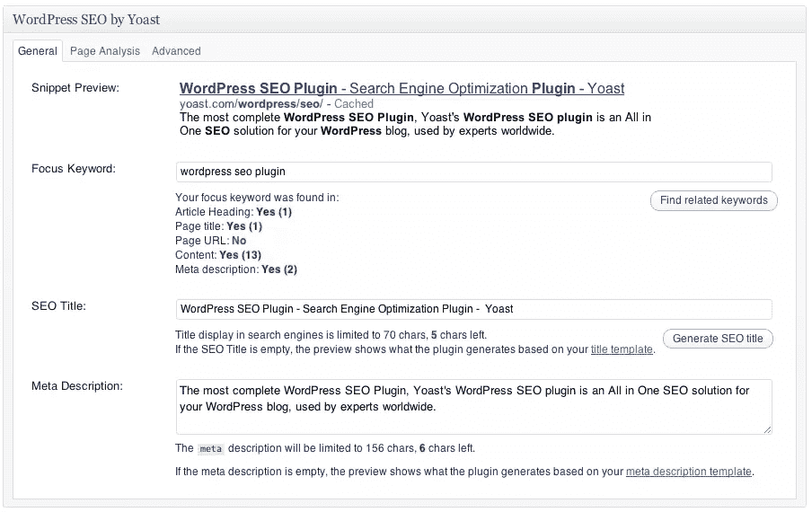
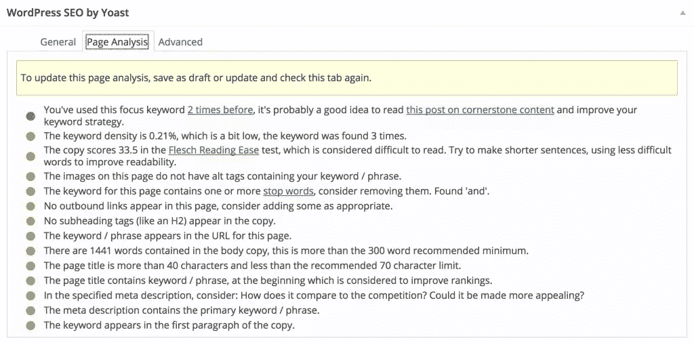
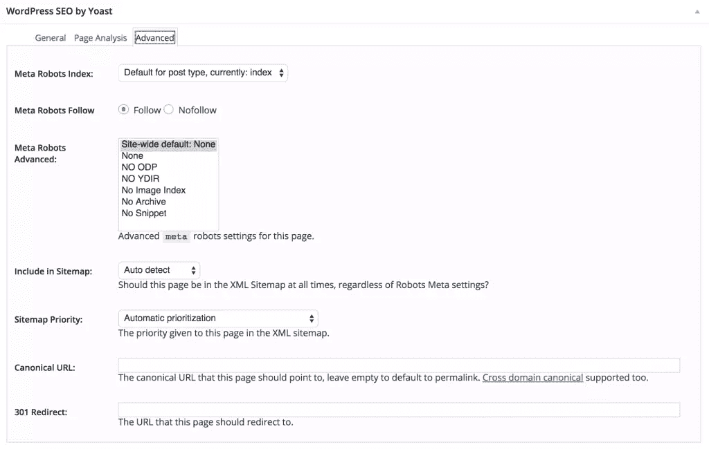

# 从 All in One SEO 转移到 Yoast 的 WordPress SEO

> 原文：<https://www.sitepoint.com/all-in-one-seo-to-yoast/>

当我十多年前开始玩博客软件时，MoveableType 是可用选项中的“最佳选择”。AltaVista 是首选的搜索引擎，我们大多数人从未听说过 SEO(搜索引擎优化)这个术语。

今天，WordPress 是一个 CMS(内容管理系统),用于运行世界上很大一部分网站。谷歌是占主导地位的搜索引擎，有数以亿计的网站，所以诀窍是很容易找到。很少有人敢越过谷歌搜索结果的第一页，所以如果你想被找到，你或多或少需要在那里。

早期，引起注意的所有必要条件是将一些关键字放入网页代码的`<head></head>`中的 meta 标签中。Alta-Vistas“蜘蛛”会出现并“爬行”你的网站，这或多或少是你必须做的所有事情。

从那以后，事情变得更加困难，虽然像 Google 这样的主要搜索引擎仍然会抓取你的站点，但是它们会查看你的代码中许多不同的特征和标签，比如`<h1> </h1>`和`<h2> </h2>`。

让事情变得更复杂的是，搜索引擎不断调整它们的算法。正在进行的向 HTML5 和 CSS3 的迁移增加了新标签的复杂性，如`<article> </article>`。

那么，你如何跟上所有的变化，让你的网站在谷歌和必应的第一页呢？幸运的是，您可以使用许多工具来几乎自动化这个过程，或者至少保持它相对简单。特别是，WordPress 有几个插件专注于提高你的 SEO。在过去的几年里，我一直在使用“多合一搜索引擎优化包”插件。这是一个很好的工具，我没有遇到任何问题。然而，在参加了一些墨尔本 SEO 会议后，我被 Yoast 说服转到了 [WordPress SEO。](https://yoast.com/wordpress/plugins/seo/)

Yoast 的 WordPress SEO 承诺控制更大范围的参数，并提供比我在一个 SEO 包中所拥有的更多的功能。所以我决定在我的一个流量较少且更具实验性的网站上更换我的 SEO 插件。我分两个阶段解决了转换问题:

*   阶段 1–设置过程，包括备份和安装。
*   第二阶段——交换，包括由 Yoast 配置 WordPress SEO，更新额外的字段和其他次要任务。

现在我将带你经历我从 All in One SEO Pack 切换到 Yoast 的 WordPress SEO 的过程。

## 第一阶段:安装

### 第一步–备份

备份整个网站，包括主要的数据库文件。虽然我有一个定期备份制度，有很多参数和数据是与搜索引擎优化。你不能太小心，所以要确保备份不在你的实际服务器上。

### 第二步–停用

停用你以前的 SEO 插件，但不要删除它。

### 第三步–安装

安装并激活 WordPress SEO by Yoast 插件(也可以选择单独的 Google Analytics 插件，也很方便)。

### 第四步-导入

在 WordPress 仪表盘上，你应该会看到一个新的菜单项“SEO”。展开菜单并选择导入和导出。选中“从 All-in-One SEO 导入”框。

在我转换的第一个网站上，我没有选中“导入后删除旧数据”选项。在随后的网站上，我这样做了，看起来很安全。但是，我再次建议您备份您的站点，以防万一出现问题。

根据网站的大小和服务器的速度，导入需要几秒钟的时间。这就是设置过程的全部内容！

## 第二阶段:互换

### 步骤 1–连接 Google Analytics(可选)

首先要检查的是你已经连接到你的谷歌分析帐户。在更新之前，Yoast 会提醒您这样做。你可以在找到关于[如何做到这一点的说明。虽然非常简单，但我发现“用你的谷歌账户验证”按钮显示为灰色有点令人困惑。一旦我意识到按钮实际上是活动的，这个过程不到 30 秒。如果认证失败，您也可以手动输入您的 UA 代码。](http://kb.yoast.com/article/118-installation-guide-for-google-analytics-for-wordpress)

### 步骤 2–检查永久链接结构

你也应该检查你的网页结构和文章设置。如果你刚开始或者只有几个页面和帖子，那么考虑将你的永久链接结构设置为`/%postname%/`或`/%category%/%postname%/`。然而，我推荐[阅读 Yoast 在永久链接上的这篇文章，并记下评论](https://yoast.com/wordpress-seo-url-permalink/)。如果出错，你可能会丢失数据，不得不重新链接所有的页面和文章。由于我的 WordPress 网站是很多年前建立的，永久链接是以“日”和“名”的格式构建的，我对此很满意。

注意:如果你确实需要改变你的网址结构，确保你使用 301 重定向来重定向你的旧网址。为此，您可以使用插件，如[重定向](https://wordpress.org/plugins/redirection/)或[简单 301 重定向](https://wordpress.org/plugins/simple-301-redirects/)，或者手动将条目添加到您的。htaccess 文件。

### 步骤 3-更新页面和帖子中的额外字段

与 One SEO 相比，Yoast 的 WordPress SEO 插件有一些额外的字段。这意味着如果你想让你现有的页面和帖子充分利用插件的优势，你将不得不全部返回并做一些更新。

你需要浏览每个现有的网页，张贴和添加相关数据。虽然这有点乏味，尤其是当你有数百个页面和帖子时，它确实给了你审查和优化内容的机会。

随着我的一个主要网站，我借此机会巩固了许多网页，删除了一些过时和不相关的职位。您需要添加的关键字段是“焦点关键字”。

对于博客文章，你通常会瞄准一个长尾关键词(一个包含多个关键词的短语)。当你开始输入短语时，你会看到一个提供建议的下拉菜单。这些建议是基于谷歌的建议。这与你在谷歌搜索框中输入搜索词时得到的建议完全一样。

你的目标应该是有一个简单的人们会自然输入的关键词/短语。想想如果您自己搜索该主题，您可能会键入的单词。当创建一个短语时，WordPress SEO 会警告你使用“停止”词。这些只是搜索引擎忽略的词，如“a”、“and”、“the”等。

一旦您添加了关键字/短语，并更新了页面/帖子，您将能够看到页面分析。“页面分析”标签给出了很多建议，如果你想深入你的内容，它也有助于解释为什么你的内容可能没有被优化。随着你越来越擅长搜索引擎优化，对于某些帖子，你可能会忽略一些指标。在这个例子中，它是一个关于事件的更新，所以 98 个单词就足够了。同样，关于链接到具有相似关键字的页面的警告也被忽略，因为事件拼写是唯一的。

如果你不想浏览每一页并手动发布，有一个“批量编辑器”。这允许您批量更新标题或描述。

## 结论

即使你不是搜索引擎优化专家，WordPress SEO by Yoast 插件也能让你轻松控制你的 WordPress 站点的关键 SEO 方面。这个插件非常适合编写元描述和其他 SEO 任务。

您还可以控制更多高级元素，如 robots.txt 文件，用于允许或禁止搜索引擎搜索您站点的某些区域，并且您可以生成 XML 站点地图以提交给搜索引擎。我建议你在创建和提交你的站点地图之前，使用一个程序，比如[尖叫的青蛙](http://www.screamingfrog.co.uk)来检查断开的链接和其他错误。

也许我最喜欢 Yoast 的 SEO 插件的一点是它分析你的页面并根据你写的内容提出建议的方式。Yoast 的插件还会给你一个总分——好、可以、一般——外加一个相应的交通灯，这取决于你正确瞄准了多少分。交通灯系统是一个很好的快速参考，让你知道你是否忘记了一些重要的事情，比如没有在标题中使用你的关键词。这对于非技术用户来说也很容易使用，不需要太多的培训，如果你的网站有多个作者，这一点很重要。

从 All in One SEO Pack 到 Yoast 的 WordPress SEO 的变化非常简单，但是请记住，这个插件比更简单的 All in One SEO 选项需要更多的用户。然而，作为回报，通过一些实践和关键字研究，你的网站应该会看到更好的搜索引擎排名。

## 分享这篇文章