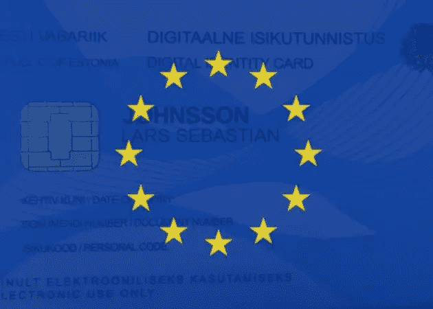
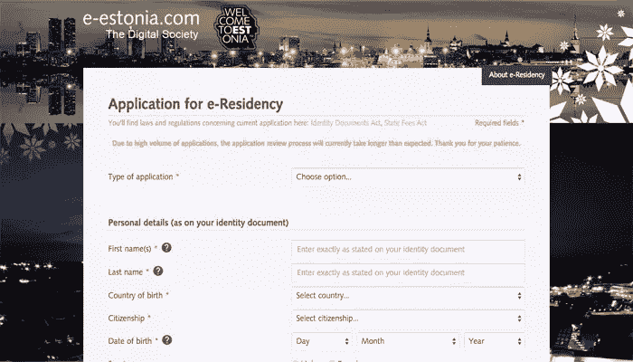
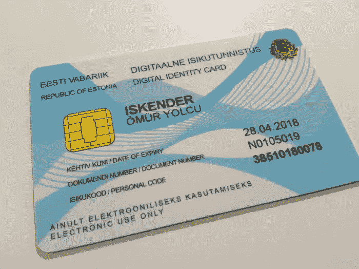

# 所有你需要知道的关于爱沙尼亚的电子居留计划

> 原文：<https://www.sitepoint.com/all-you-need-to-know-about-estonias-e-residency-program/>

爱沙尼亚成为世界上第一个提供跨国数字身份的国家。它吸引了全球企业家和数字游民的关注，但对于电子居留计划的好处以及电子居留的实际意义，仍存在大量困惑。让我们来看看。

## 什么是电子派驻服务？

这是一种无需实际访问爱沙尼亚就能获得爱沙尼亚政府服务的方式。

您可以开一家公司，享受欧盟法律框架的所有好处，还可以远程访问低维护管理工具，如纳税申报和公司组建。2009 年，爱沙尼亚打破了“注册新法律实体最快时间”的世界纪录——18 分钟。

简而言之，这个美丽的波罗的海国家正在提供远程接入服务，通常只有爱沙尼亚的实际居民才能获得这些服务。对于没有固定位置的数字游牧企业家来说，这是一笔巨大的交易，是朝着完全位置独立迈出的一大步，最重要的是，它带来了最少的官僚主义和清晰、理想的税收框架。

## 什么不是 E-Residency？

E-Residency 并不意味着实际居住。它不是签证、居留权、身份证或公民身份，也不具备爱沙尼亚当地人所拥有的任何社会权利。

更重要的是，这不是以任何方式*避税的方式，尽管我稍后会详细说明税收优惠。*

## 成为爱沙尼亚电子居民有什么好处？

以下是更清晰、更简明的优势列表:

*   **非常**行政负担低
*   0%的公司税(但 20%的所得税)
*   欧洲货币或多种货币的银行账户
*   因在欧盟国家注册而获得更多信任
*   使用更多在线服务，如 PayPal
*   可以远程管理的现代银行业务
*   你特别想在爱沙尼亚做生意
*   使用政府软件节省时间和金钱

但这里有一个大问题，你需要成为爱沙尼亚电子居民才能拥有这一切吗？答案是否定的。你可以*设立一个更具成本效益的[国际银行账户](https://medium.com/nomad-gate/the-world-s-best-bank-accounts-for-international-travelers-and-nomads-3257e6839cff)以避免货币兑换费用，你还可以在一个会计要求最低或免税的国家创办公司。*

然而，根据你居住的地点**和你开店的地点**，这可能会很困难；通常情况下，如果你不移民或者至少在这个国家呆上一段时间，同时建立一个银行账户和签署文件，这是不可能的。

一句话:成为另一个国家的居民或在那里开公司通常感觉有点像是在做手脚。这是可能的，但是很少有国家真正努力让这种折磨变得方便。E-residency 是数字时代的解决方案。

## 如何成为电子居民

克里斯·沃德向我们深入讲述了他是如何在爱沙尼亚申请电子居留的，但我会快速总结一下步骤，然后我会继续讨论一些技术细节。

### 第一步:填写申请表

在[表格](https://apply.e-estonia.com/)上，你会被问及你目前的国籍、申请的理由，当然你也可以指定你想从哪个国家领取身份证。

### 第二步:付款和送货

许多成功的申请人说，无论你在表格上选择哪个国家，卡都需要大约一个月才能到达大使馆。它值 50 欧元。

### 步骤 3:设备

除了 e-residency 卡，您还可以在初学者工具包中找到一个 USB 读卡器，它与[读卡器软件](https://e-estonia.com/e-residents/welcome/)结合使用，将授权您访问爱沙尼亚服务并对文档进行数字签名。

## 在爱沙尼亚创办公司

就像当你在任何其他国家成立一个商业实体时，你需要一个在那个国家的地址——但是在你说“啊，这就是问题所在”之前，地址可以是虚拟的地址。由于 e-residency 仍处于起步阶段，我们可以预计随着时间的推移，这样的事情会变得更加容易。

你可以在[公司注册门户](http://www.rik.ee/en/company-registration-portal)在线注册公司，用不了多久，用你的爱沙尼亚电子卡。

## 在爱沙尼亚开立银行账户

爱沙尼亚网上银行一般来说相当安全和方便用户。最棒的是，你可以直接从你的银行账户报税，节省你的时间、金钱，当然还有理智。

### 寻找虚拟地址

好的，所以这个*是*一个“gotcha”。你**必须**去三家支持电子居民开设银行账户的银行(LHV、瑞典银行或 SEB)中的一家，但是你的电子居民卡可以用来对最后一步进行数字授权。电子爱沙尼亚正在努力使这成为一种不遵守行为；到 2016 年秋季，电子居民将不再需要与银行官员面对面会面，取而代之的是，我们将能够使用安全的虚拟视频聊天。

## 纳税(每个人都会感到困惑)

爱沙尼亚有一个非常独特和可取的税收制度。首先，公司税为零，这意味着只有员工才需要缴纳他们应缴纳的所得税。

至于公司股东，他们只对*分配利润*纳税。基本上，当他们发放红利时。如果你没有收到股息，你就不用缴税，你可以将这些资金再投资于公司增长。

### 谁支付股息税？

你的公司在分配股息时支付了税款，尽管每个股东仍然有责任在他们自己居住的国家缴纳所得税。请记住，电子居留并不意味着你是爱沙尼亚居民，尽管如果你选择无限期地呆在爱沙尼亚，你仍然可以[成为爱沙尼亚的税务居民](http://www.emta.ee/index.php?id=36465)。

### 你在哪里缴纳所得税？

不过，这并不意味着你会被重复征税。大多数国家都有双重征税法，你需要查阅你的居住国和爱沙尼亚之间的相关税收协定。

有时你会被征收外国收入税，有时不会；不同国家的规则是不同的，这取决于你与本国的交往水平。在任何地方成为“税收居民”都是完全可行的，尽管许多数字游民错误地认为这适用于他们。

总是，总是，总是咨询法律意见。

## 结论

在前 7 个月，超过 4，000 名企业家和数字游民申请了电子居留，只需 50 欧元，你也可以这样做。如果你有任何进一步的问题，Kaspar Korjus(爱沙尼亚电子居留项目主任)最近做了一个关于游牧民族的 AMA 论坛，他澄清了爱沙尼亚电子居留的一些更令人困惑的方面。

我想对塞巴斯蒂安·约翰逊让我使用他的照片表示深深的感谢。Sebastian 的目标是在爱沙尼亚远程开设一个银行账户，但不想在那里开公司，因为那里的税率不像马耳他(他目前居住的地方)那样诱人。爱沙尼亚的电子居留对个人和公司都有好处。

*我也要感谢 Yulcu Iskender，他想把他的生意[转移到欧洲](http://servermonitoring.io/)，以便从欧盟提供的一切中受益，还有 [Skyler Shaw](http://skylershaw.com) ，他发现税收优惠非常有利。*

## 分享这篇文章