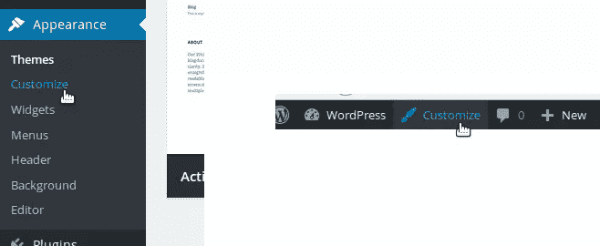
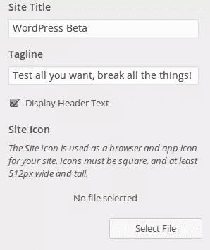
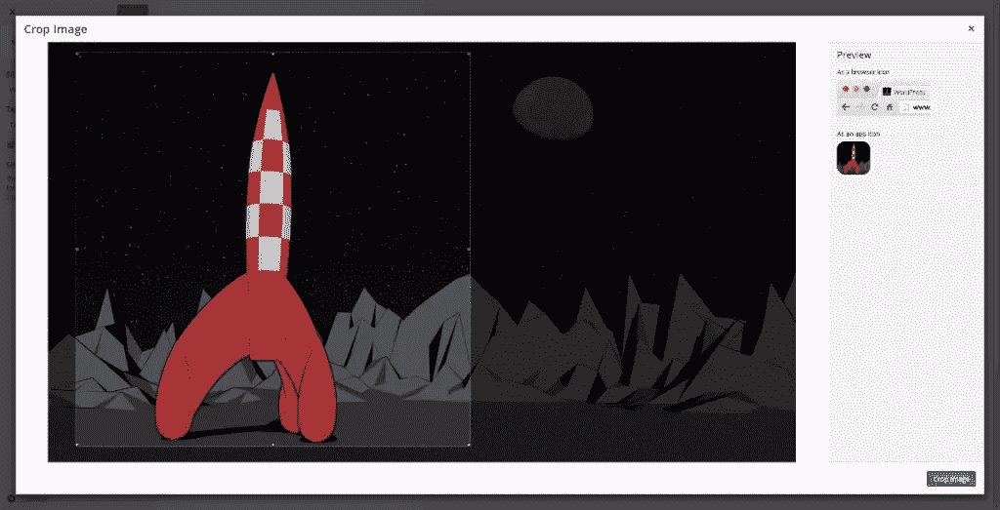

# 关于新的 WordPress 站点图标 API 你所需要知道的

> 原文：<https://www.sitepoint.com/all-you-need-to-know-about-the-new-wordpress-site-icon-api/>

随着 4.3 版本的发布，WordPress 引入了站点图标，允许用户定义一个代表他们网站的图标。正如经常发生的那样，这个新概念有一个相关的 API。

这篇文章将深入研究站点图标，从定义它们是什么开始。然后，我们将使用这个全新的 API，它本质上由四个函数和两个过滤器组成。这听起来不多，但是你会看到这绝对够用！

## 什么是站点图标？

好消息:如果你已经在网络上工作了一段时间，那么你可能已经知道什么是网站图标。事实上，这只是 WordPress 给一个我们都很熟悉的图标起的名字:favicon。

当您的网站打开时，网站图标是显示在浏览器标签上的图像。此外，当您在智能手机的主屏幕上保存网页的快捷方式时，您的移动操作系统会使用您的收藏夹图标，这样就不会为每个网站显示相同的通用图标。

一旦设置完成，站点图标也会显示在你的管理面板上，而管理面板直到现在都没有图标。

通过定义一个网站图标，你就定义了你网站的 favicon。好消息是，作为用户或主题开发者，你不需要做任何事情来激活这个特性。事实上，在 WordPress 4.3 中，站点图标的显示是默认激活的:当`wp_head`动作发生时，调用正确的函数，每个主题都必须调用这个动作。

这意味着一件事:如果你想尝试我们在这篇文章中所做的，你可以不改变你当前的主题。在遵循本教程之前，你必须做的唯一一件事就是将你的 WordPress 安装更新到 4.3 版本(如果你还没有更新你的 WordPress 安装的话，请看我们关于[更新你的 WordPress 安装](https://www.sitepoint.com/a-guide-to-updating-wordpress/ "A Guide to Updating WordPress, Plugins and Themes")的文章)。

## 如何定义站点图标

使用主题定制器可以定义一个新的站点图标。您有两种方法可以访问此定制器:

*   通过使用管理菜单，定制器位于“外观”菜单中，第二个条目名为“定制”
*   点击管理栏中的“自定义”按钮，这个按钮会在你登录后出现在你网站的每一页的顶部(这个按钮是 WordPress 4.3 的新功能)



主题定制器包括你的网站的预览，在左边有一个侧边栏，允许你定制一些细节。出于本教程的目的，我们对“站点标识”菜单选项感兴趣。

如果你已经使用了主题定制器，你可能会注意到一个变化:“网站标题和标语”菜单选项已经被“网站身份”所取代。这个新名字反映了对这个菜单选项的修改:你现在不仅可以设置你的站点的标题和标语，还可以设置它的站点图标。

如果这是你第一次玩网站图标，WordPress 会显示文本“没有选择文件”,你可以点击下面的“选择文件”按钮选择一张图片作为你的网站图标。



然后将会打开一个媒体窗口。你已经知道这个窗口，因为它和你在任何地方看到的可以选择媒体文件的窗口是一样的。您可以选择已经上传的图像，也可以上传新的图像。为了确保你在任何情况下都有好的图片质量，你应该上传一张图片，根据 WordPress 的说法，“至少 512 像素宽和高”。

一旦你选择了你的图片，你可以选择裁剪它，只选择正方形作为你网站的图标。请注意，裁剪此图像不会改变原始文件，因此如果您选择了现有的图像文件，您可以裁剪它，而不必担心原始文件的显示。



接下来，一旦你选择了你想要使用的方块，点击窗口右下角的“裁剪图像”按钮，等待奇迹发生！

WordPress 会自动将你的图片调整到需要的尺寸(例如，WordPress 会创建一个 512 像素宽的正方形，即使你的图片小于 512 像素)。

要保存您刚才所做的更改，请点击主题定制器顶部的“保存并发布”按钮。现在你应该可以在你网站的每一页上看到你的新图标了。

通过使用主题定制器，您可以在任何阶段删除和更改站点图标。


## 正在检索当前站点图标

检索您当前的网站图标都是自动的。作为一个主题或插件开发者，你不必担心网站图标的基本用法:一旦图片被选中，WordPress 会自动将其显示为 favicon。

然而，如果你需要在你的主题或者插件中获取当前站点的图标，这是可能的。例如，如果您正在开发一个主题，如果用户没有定义站点图标，您可以在管理面板中显示您自己的 favicon 管理器(您也可以将他们重定向到主题定制器)。

## WordPress 站点图标功能 API

目前，WordPress 在站点图标公共 API 中提供了四个功能。我们将逐一回顾。

### 了解站点图标是否已设置

我们将看到的第一个函数是`has_site_icon()`。顾名思义，这个函数允许你查看一个站点图标是否被设置。这样你就可以指示你的用户设置一个站点图标。

如果设置了站点图标，该函数返回一个布尔值:`true`，否则返回`false`。

```
if (has_site_icon()) {
    // User set a Site Icon, do something awesome!
}
else {
    // User didn't set a Site Icon, do something else. But still awesome.
} 
```

### 正在检索站点图标 URL

WordPress 提供了两个功能，使我们能够检索当前站点图标 URL:`get_site_icon_url()`和`site_icon_url()`。正如我们上面所说的，WordPress 为一个站点图标生成几个不同大小的文件。这就是为什么这一部分的标题没有错误:有几个 URL 我们可以检索。

我们将从`get_site_icon_url()`开始。它可以在没有参数的情况下使用:它将返回当前站点图标，大小为 512 像素。

```
if (has_site_icon())
    echo ''; 
```

但是，我们也可以给这个函数传递三个参数。所有这些都是可选的。

第一个参数是您希望站点图标位于其上的博客的 ID；这在启用多站点时很有用。默认情况下，该参数设置为`null`，并检索当前位置。在大多数情况下，这就是我们想要的行为，所以您可以继续将`null`作为第一个参数传递。

第二个参数更有趣，因为它定义了站点图标的大小。你可以指定任何你想要的尺寸，但是记住 WordPress 不会为你生成一个新的图片:它会返回一个更小的尺寸，如果你指定一个小于 512 的值，这个尺寸会大于你指定的值。如果您指定的值大于或等于 512，它将始终返回 512 像素版本的图像。

例如，下面的代码不会显示 200 像素宽的图像，而是显示 270 像素宽的版本(使用默认生成的大小)。

```
if (has_site_icon())
echo ''; 
```

最后，第三个参数是如果没有找到站点图标，您想要查看的图像的 URL。这是一个定义后备 URL 的好方法，不用自己测试返回的 URL 是否为空。

当我们谈论检索站点图标时，我们可以引用的第二个函数是`site_icon_url()`。它回显当前站点图标的 URL，用`get_site_icon_url()`检索。也可以用同样的方法。

### 回显元标签

我们要看的最后一个函数是 WordPress 在`wp_head`动作中使用的函数:它直接回显所有的`meta`标签，这些标签需要向浏览器(或者智能手机上的操作系统)指示 favicon 的可用大小。这个函数是`wp_site_icon()`，它不接受任何参数。

```
// We should be in the head tag
wp_site_icon(); 
```

## 定义您自己的站点图标大小

默认情况下，当你裁剪你的站点图标时，WordPress 会生成几种尺寸。它使用四种不同的尺寸来生成`meta`标签:

*   经典网站图标的 32 像素宽图像(在浏览器中)
*   180 像素宽的图像，用作 iOS 中的应用程序图标
*   192 像素宽的图像，用作 Android 或 Chrome 应用程序图标
*   一个 270 像素宽的图像，在 Windows 中用作磁贴。

四个对应的`meta`标签都是在`wp_site_icon()`函数中生成的，但是如果要添加自己的尺寸呢？

多亏了两个新的过滤器，你可以添加自己的尺寸，这两个过滤器在 WordPress 4.3 中可用，并且专用于站点图标 API。

第一个过滤器名为`site_icon_image_sizes`，可以用来指示你的主题或插件中站点图标的大小。回调函数必须除了一个参数:一个包含当前大小的数组，它将被生成。它必须返回一个包含要生成的大小的数组(您可以覆盖现有的数组，但您应该只添加自己的数组)。

```
function add_my_site_icon_sizes($sizes) {
    $sizes[] = 64;

    return $sizes;
}
add_filter('site_icon_image_sizes', 'add_my_site_icon_sizes'); 
```

如果不使用它们，添加新的尺寸是没有用的。这就是为什么我们找到第二个过滤器:`site_icon_meta_tags`，当 WordPress 生成与网站图标(在`wp_site_icon()`中)相对应的`meta`标签时调用。

对于这个过滤器，您的回调函数必须排除一个包含所有当前`meta`标签的数组，并且必须返回要显示的新标签。还是那句话，如果可以覆盖现有的数组，就不应该这么做(除非你真的觉得默认生成的标签没用)。

```
function add_my_site_icon_meta_tags($tags) {
    $tags[] = sprintf('<link rel="icon" href="%s" sizes="64x64" />', esc_url(get_site_icon_url(null, 64)));

    return $tags;
}
add_filter('site_icon_meta_tags', 'add_my_site_icon_meta_tags'); 
```

## 最后

有了四个功能和两个过滤器，WordPress 站点图标 API 不像其他 API 那样广泛，但是你可以看到它覆盖了一系列选项，从生成你自己的图标尺寸，到显示它们。

也就是说，你不应该使用这个 API 来显示除了 favicon 之外的任何图像；这不是构建它的目的，而且由于默认情况下调用`wp_site_icon()`，可能会观察到一些副作用。

你可以在这里的一个小插件中找到这篇文章中使用的过滤器。注意，这个例子是从 WordPress 团队提供的一个例子中得到灵感的，这个例子是为了[向我们](https://make.wordpress.org/core/2015/07/27/site-icon/)介绍这个新的 API。

## 分享这篇文章