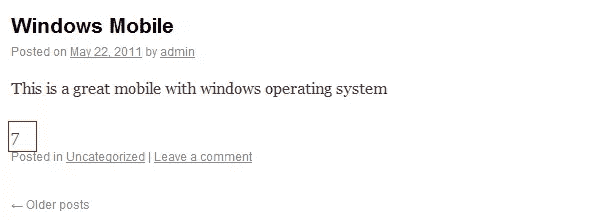
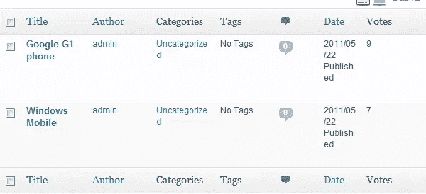
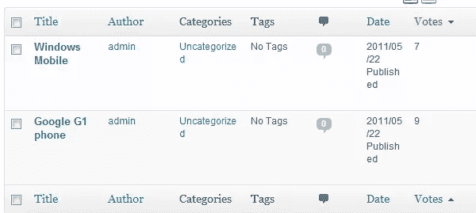
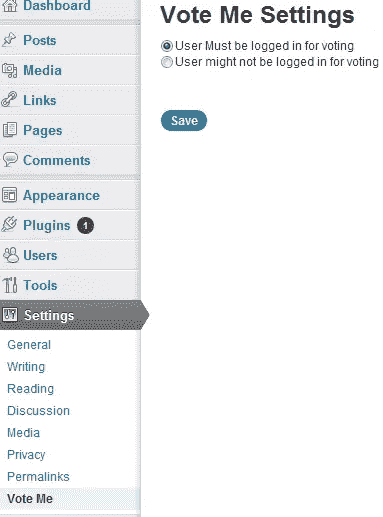
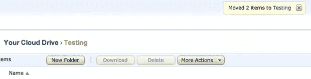

# 亚马逊云驱动

> 原文：<https://www.sitepoint.com/amazon-cloud-drive/>

有很多云存储选项可用，现在许多都提供 5 Gb 的免费空间。谷歌刚刚加入了 Drive 的竞争，当然我们都知道 DropBox。

你可能听说过亚马逊 S3 和 EC2，但亚马逊还提供了另一个云存储解决方案，名为[亚马逊云驱动](https://www.amazon.com/clouddrive/learnmore)。这是一个更加用户友好的存储云，你可以获得 5 Gb 的免费存储空间，你从亚马逊 MP3 下载网站购买的任何音乐也可以存储在那里，而不会影响你的 5Gb 免费空间。

亚马逊现在已经发布了一款适用于 Windows 和 Mac 的桌面应用。它试图提供一些与操作系统的集成，以便很容易将东西上传到你的亚马逊云驱动器。

但是云驱很有用吗？它的功能和 DropBox 相比如何？让我们来看看。

## 这个概念

云驱动背后的理念和 DropBox 不太一样。DropBox 的理念是:“一个无处不在的文件夹”来存储你的东西，而 Cloud Drive 的理念是你访问云来获取你的东西，没有本地存储的文件夹。

您可以使用桌面应用程序下载文件(我们将在本文后面看到)，或者您可以直接从 web 界面下载。

## 入门指南

如果你已经有一个亚马逊账户(谁没有？)开始很容易。你需要做的就是进入[云驱动信息页面](https://www.amazon.com/clouddrive/learnmore)，点击开始按钮，然后用你的亚马逊凭证登录。您的云驱动器将立即可用。

主界面提供了您可能会想到的常用文件夹:

您可以看到您可能期望的所有常见选项都可用。您可以:上传文件、创建文件夹和删除文件。要上传新文件，请单击大上传文件按钮:

我创建了一个名为“Testing”的文件夹，通过点击这个文件夹，我可以确定我的东西会被上传到那里。你可以选择多个文件(但不是文件夹，有另一种方法可以做到这一点)，云驱动器将依次上传每个文件。完成后，您将看到您的文件和一条确认消息:

### 默认上传到哪里？

任何上传的内容都将保存到你的云硬盘的上传文件夹中。然后，您可以将它们移动到另一个文件夹中，我们将在本文的后面部分介绍这个文件夹。

### 平板电脑/移动设备使用

你可以从 iPad 上访问 Cloud Drive，还可以查看文件夹的内容。但是不能上传或下载文件，因为需要 Flash。此外，没有移动应用程序可以与您的云驱动器连接。

## 桌面应用程序

亚马逊最近发布了桌面应用程序，以提供与云驱动器的一些集成。这些应用适用于 Mac 和 Windows，可以从[这里](http://www.amazon.com/gp/feature.html?ie=UTF8&docId=1000796781)下载。

亚马逊已经选择在这个时候忽略 Linux，尽管你仍然可以使用网络界面。

一旦你安装了桌面应用程序，你将有一个托盘图标(Windows)或菜单栏图标(Mac)与云驱动器接口。我已经说过了，Cloud Drive 不在本地存储东西，只在云上。所以不会有像你可能已经有的 DropBox 那样的云驱动文件夹。

### Windows 操作系统

你可以右击一个文件或文件夹，选择“发送到…”弹出的子菜单会显示“亚马逊云驱动器”作为选项。

点击该按钮，您的文件/文件夹将被上传。当上传成功完成时，您还会收到系统托盘通知。当您从 web 界面下载文件时，它将存储在您的下载文件夹中，除非您在选项菜单中指定了不同的文件夹。

### 苹果个人计算机

上传文件有 2 个选项:你可以把文件/文件夹拖到你菜单栏上的云硬盘图标上，也可以右键点击“服务”，然后选择“上传到云硬盘”。根据文件类型，您可能会在第一次右键单击时使用上传选项。

如果您安装了 Growl，您将在上传完成时收到通知:

## 移动云驱动器中的文件

现在你已经上传了一些文件和/或文件夹，接下来我们需要看的是移动东西。这必须通过网络应用程序来完成。

登录后，单击上传文件夹，然后使用勾选框选择要移动的文件。单击“更多操作”按钮将为您提供移动所选文件的选项:

单击“移动”选项将出现一个窗口，您可以在其中选择要将文件移动到的文件夹:

单击“移动项目”按钮将执行文件移动，完成后关闭窗口。主窗口中将显示一条消息，确认您已经移动了文件:

## 结论

亚马逊云驱动远比 DropBox 基础。与许多其他云存储服务相比，它也缺乏功能。然而，在某些方面，这是它最可取的特点之一——简单。尽管网络界面需要支持平板电脑，但它能以最少的麻烦完成你需要的一切。

5Gb 的空间比 DropBox 免费提供的空间更大，而且额外空间的成本非常有竞争力。亚马逊对 20Gb 的空间每年收费 20 美元，而 DropBox 对 50Gb 的空间每年收费 99 美元。作为额外的奖励，亚马逊将免费存储你从他们那里购买的所有 MP3。

现在亚马逊已经提供了桌面集成软件，它确实使云驱动器更可用，所以如果你正在寻找一个廉价的云存储解决方案，请尝试云驱动器。

## 分享这篇文章