# Amazon DynamoDB:用负载平衡器存储 PHP 会话

> 原文：<https://www.sitepoint.com/amazon-dynamodb-store-php-sessions-with-load-balancer/>

这篇文章分享自我们的姐妹网站之一， [CloudSpring](https://www.sitepoint.com/ "CloudSpring - Learn how to manage your website in the Cloud") 。如果你觉得有帮助，一定要给他们一个访问！

本教程将向您展示如何使用 Amazon DynamoDB 作为 PHP 会话的存储工具。当您的应用程序利用弹性负载平衡和自动伸缩服务时，这种方法变得非常有用。你将需要亚马逊 AWS 帐户启用使用 EC2，弹性负载平衡器和 DynamoDB 作为一个先决条件来玩教程。

## 什么是弹性负载平衡器

弹性负载平衡器充当一个或多个虚拟服务器的前端。它接受请求并在虚拟服务器之间分发它们。虚拟服务器可以通过克隆机器模板(AMI)来创建，也可以在需要时销毁。如果您的应用程序可以通过动态添加或减少虚拟服务器来改变，则处理能力。

## 和自动缩放？

当自动缩放加入游戏时，系统还可以:

*   当流量较高时，启动更多的 web 服务器克隆
*   当流量低于预定义的阈值时，关闭其中的一些
*   如果需要，终止不健康的实例并替换它们

## 我该怎么做？

您的应用程序能在这种环境下工作吗？是，如果它满足两个关键要求:

*   因为虚拟服务器是动态创建的，所以服务器应该只包含应用程序代码，而不包含任何数据。使用数据库服务很容易做到这一点。
*   任何用户会话状态都应该在虚拟服务器之外保持。这有点复杂，因为默认情况下，PHP 模块将这些数据存储在 web 服务器的文件系统中。

这就是我们将在本次会议中试图解决的问题。

## 不要做什么:粘性会话

粘性会话是弹性负载平衡器服务的一个特性，它将用户的会话绑定到一个特定的应用程序实例，因此会话期间来自用户的所有请求都将被发送到同一个虚拟服务器。会话 cookie 可以由负载平衡器或应用程序生成，但是:这被认为是一种不好的做法。理想的情况是将应用程序设计成无状态的，但这并不总是可能的。

## 将您的会话存储在数据库中

另一个选择是:将我们的会话存储在数据库中。它可以是应用程序使用的同一个外部 SQL 数据库，也可以是 Memcache 实例或另一个 NoSQL 数据库。在这种情况下，DynamoDB 似乎非常有趣，因为它是一个强大而快速的 NoSQL 数据库，它由亚马逊自己管理，也很容易从我们的虚拟服务器访问。另外，官方 PHP SDK 的 AmazonDynamoDB 类已经准备好将自己注册为会话管理器。如果你从未听说过 DynamoDB，我推荐你观看这个介绍视频。

## 演示应用程序

我已经编写了一个简单的应用程序来测试整个机制，您可以从我们的 Github 资源库下载源代码。我们将使用一个弹性负载平衡器和至少两个实例来运行这个应用程序。我们现在不使用自动缩放。

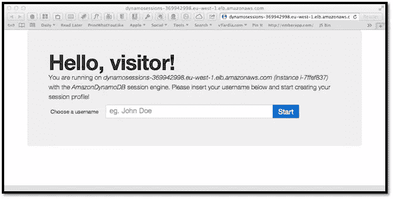

应用程序要求用户选择一个保存在当前会话中的用户名，并作为“登录”。如果会话中存在用户名，应用程序允许用户插入一种“配置文件”，本质上是一系列键/值信息，如姓名、姓氏、电子邮件等(键和值都是字符串)。所有这些逻辑都包含在`index.php`文件中。

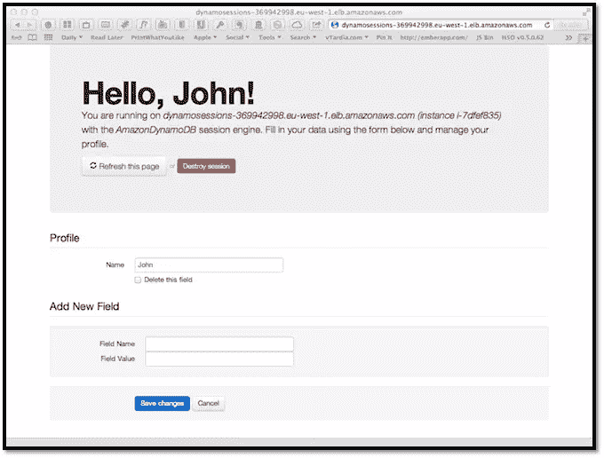

`session.php`文件包含一个简单的会话库。这个库允许我们用友好的方法管理会话数据，比如`$session->read('some_var') and $session->write('some_key', 'some_value')`。这个会话对象可以被配置成使用默认的 PHP 会话机制(如果我们是一个本地测试服务器)或者一个定制类。我们的应用程序文件的第一步是会话启动:

```
require_once 'lib/session.php';
try {
 // Engine can be PHP or AmazonDynamoDB
 $session = new Session($config['session']['engine'], $config['session']['params']);
} catch (Exception $e) {
 exit($e->getMessage());
} // end try
```

默认的引擎值是 PHP，它不需要参数。如果我们选择“AmazonDynamoDB”引擎，会话构造函数将执行一些额外的代码:

```
switch ($engine) {
case 'AmazonDynamoDB':
// Load AWS SDK
require_once 'AWSSDKforPHP/sdk.class.php';
// Create a list of credential sets that can be used with the SDK.
CFCredentials::set($params['credentials']);
// Instantiate a DynamoDB client
$dynamodb = new AmazonDynamoDB();
$dynamodb->set_region($params['region']);
// Instantiate, configure, and register the session handler
$this->handler = $dynamodb->register_session_handler(array(
'table_name'       => $params['table_name'],
'lifetime'         => $params['lifetime'],
));
break;
```

首先，我们加载必须已经安装并可访问的 AWS SDK，然后我们的凭证被加载到 AWS 环境中。从这一点开始，我们可以使用 AWS 类，这样就创建了 AmazonDynamoDB 的一个新实例，并用表所在的正确区域进行了设置。最后，我们告诉 DynamoDB 对象将自己注册为会话管理器，并传递要使用的表的名称，这就是我们真正需要的。

`config.php`文件是我们告诉应用程序我们想要使用哪个引擎的地方，我们的 AWS 凭证和 DynamoDB 设置也保存在这里。在`index.php`中，我还包含了一个小的实用函数，如果我们不在本地服务器中，它会获取当前正在运行的实例的名称。这有助于检查会话是否在我们的服务器上保持一致。

```
function getServerName() {
 $host = $_SERVER['SERVER_NAME'];
 if ('localhost' != $host) {
 // Maybe we are on EC2, trying to catch the current instance ID
 $ch = curl_init('http://169.254.169.254/latest/meta-data/instance-id');
 curl_setopt($ch, CURLOPT_FAILONERROR, true);
 curl_setopt($ch, CURLOPT_RETURNTRANSFER, true);
 curl_setopt($ch, CURLOPT_CONNECTTIMEOUT, 2);
 if ($ret = curl_exec($ch)) {
 $host .= ' (instance ' . $ret . ')';
 } // end if
 curl_close($ch);
 } // end if
 return $host;
} // end function
```

函数`getServerName()`使用 [EC2 元数据 API](http://aws.amazon.com/code/1825?_encoding=UTF8&jiveRedirect=1) 来查找实例的名称。

在您的车队上运行应用程序

为了测试这个应用程序，我们需要一个负载均衡器后面的至少两个 web 服务器。我使用的服务器是一个 Ubuntu GNU/Linux 实例，配备了:

*   Apache web 服务器，
*   PHP 5.3(命令行和 apache 模块都有)，
*   cURL 程序和 PHP 扩展，
*   Pear 包管理器(需要容易地安装 SDK)，
*   PHP 的[AWS SDK](http://aws.amazon.com/sdkforphp/)(我建议由 Pear 安装)。

如果您知道如何构建 AMI，那么您可以从头开始构建自己的 AMI。不过你也可以用我准备并公开的那个:ami-4b42443f。这台机器已经包含了应用程序的 PHP 源代码和所有其他依赖项。一旦你准备好你的 AMI 我们走吧！

### 初始化会话存储

进入你的 AWS 控制台，选择 DynamoDB 服务和你最喜欢的地区(我的是欧盟西部-爱尔兰)。点击“创建表格”按钮。

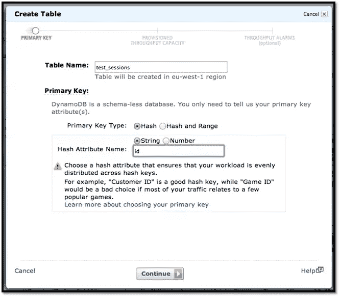

输入“test_sessions”作为表名，并选择了一个名为“id”的字符串主键，键类型必须是“hash”。如果您选择另一个名称，稍后必须将其复制到`config.php`文件中。在读取和写入容量单位字段中输入“10”(例如，您的表有多快)，这足以进行测试。

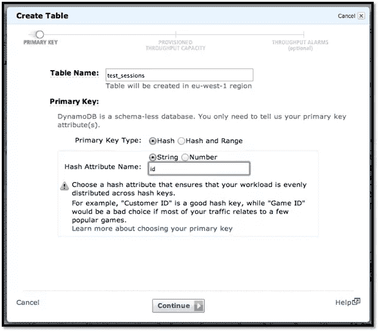

现在您有了一个 NoSQL 表，其中每一行都有一个强制 id 字段，但可以有可变数量的其他不同类型的字段，如字符串、数字、字符串集或数字集。会话管理器对象将使用一个名为“data”的字符串字段来存储会话的变量，并使用一个名为“expires”的数字字段作为会话的到期时间戳。

### 启动并配置服务器

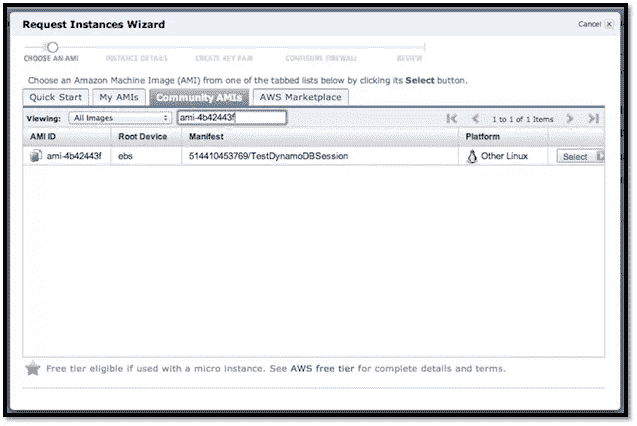

现在选择 EC2 服务和您为 DynamoDB 表选择的相同区域。从控制面板或“实例”部分单击“启动实例”按钮。选择您的自定义 ami，或者使用经典向导，转到“社区 AMI”选项卡并输入“AMI–4b 42443 f”。

在下一个屏幕中，至少输入“2”作为实例数，并选择您的实例类型，我选择了 Micro (t1.micro)。您可以在 availability zone 下拉列表中保留“no preference ”,但是在生产环境中，最好将各种实例分布在同一区域内的两个或更多区域之间。接受“实例详细信息”和“存储设备”配置面板的默认设置，然后继续。如果需要，输入一个或多个可选标签。选择一个[密钥对或创建一个新的密钥对](http://docs.amazonwebservices.com/AWSEC2/latest/UserGuide/generating-a-keypair.html)并选择一个[安全组](http://docs.amazonwebservices.com/gettingstarted/latest/wah/getting-started-security-group.html)，它至少允许端口 80 上的 HTTP 和端口 22 上的 SSH。

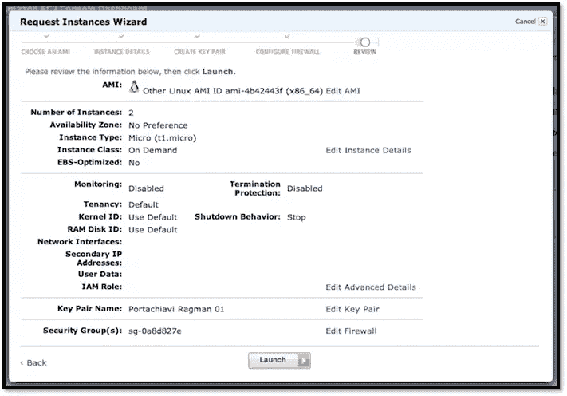

检查您的设置，然后启动实例。当实例状态为“正在运行”时，可以通过 SSH 进行配置。每个实例都有一个类似 ec2-xxx-xxx-xx-xx.region.compute.amazonaws.com 的公共 DNS 名称。您需要编辑您创建的每个实例上的 config.php 文件。使用您的公钥和用户名“ubuntu”(如果您使用我的公共 AMI)，通过 SSH 或 SFTP 客户端连接到实例:

`$ ssh -i /path/to/key.pem ubuntu@ec2-X-X-X-X.region.compute.amazonaws.com`

将当前目录更改为测试应用程序所在的/var/www。编辑 config.php 文件插入你的 AWS 密钥和秘密。然后检查你的 DynamoDB 表设置是否匹配，你必须用适当的值编辑这个区域，这个值可以在这个引用中找到[。](http://docs.amazonwebservices.com/AWSSDKforPHP/latest/index.html)

然后创建一个名为 ping.html inside/var/www 的空文件:负载平衡器将使用该文件来测试每个实例的可达性。

### 设置负载平衡器

数据库和所有实例就绪后，我们现在可以设置前端负载平衡器了。在 EC2 导航菜单中，在“网络和安全”下选择“负载平衡器”并点击“创建负载平衡器”按钮。

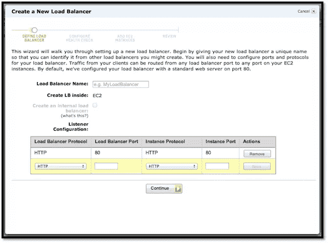

为负载平衡器选择一个名称，并验证监听器配置是否与屏幕截图的配置相匹配，即:将负载平衡器端口 80 上的所有 HTTP 流量转发到实例端口 80 上的 HTTP。

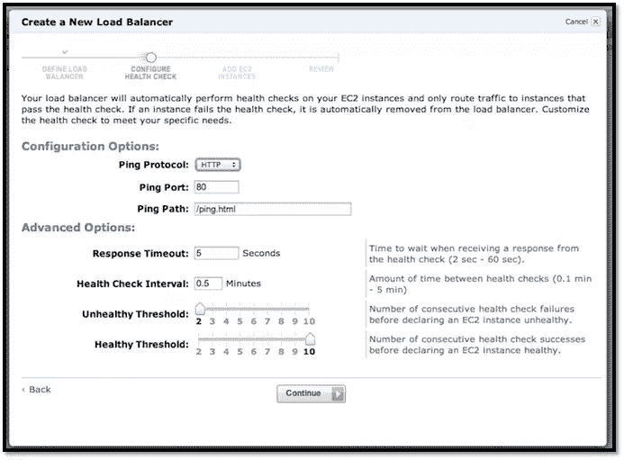

在运行状况检查面板的 ping 路径字段中输入/ping.html，并将其他设置保留为默认设置。这意味着:每 30 秒调用一次每个实例的/ping.html 资源，如果响应时间超过 5 秒，则检查失败，如果实例连续两次运行状况检查失败，则它是不健康的，如果它连续 10 次通过检查，则实例是健康的。负载平衡器不会将流量转发到不正常的实例，如果自动扩展到位，则不正常的实例可以被终止，并由新的实例替换。

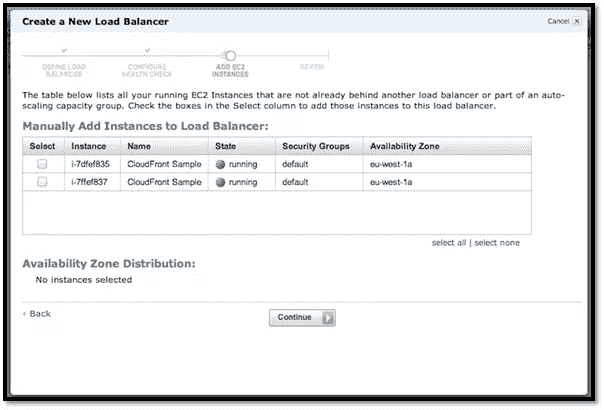

下一个屏幕让您选择哪些当前运行的实例可以添加到负载平衡器。选择之前创建的两个实例并继续。查看最终配置并确认它是否适合您。现在，您应该能够看到负载平衡器的详细信息以及所有已连接实例的状态。

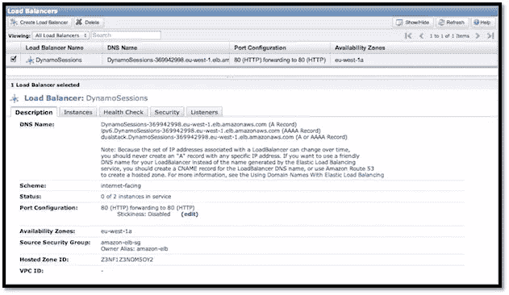

您可以通过将负载平衡器的 DNS 名称(类似于 yourname-12345678.region.elb.amazonaws.com)放入浏览器来测试应用程序。您也可以通过在 DNS 面板中添加指向负载平衡器 URL 的 CNAME 来配置域或子域(如 dynamo.yourdomain.com)。不建议使用带有 A 记录的 IP，因为 IP 会随着时间的推移而改变。

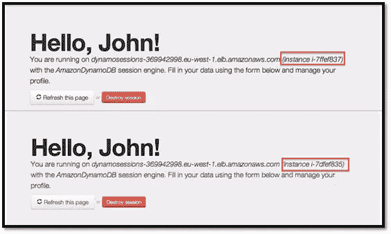

每次提交表单或刷新页面时，您的请求都会由不同的实例处理。您可以通过 getServerName()实用程序显示的名称来检查哪个实例在为您服务。

## 摘要

目前就这些了。我们已经讨论了 AWS 生态系统中的一个重要主题，但这仅仅是开始。例如，所有这些东西都是完全可编程的:你可以添加自动缩放，将你的实例设计成可自我配置的，并从可信的地方下载 AWS 凭证和其他数据。或者您可以使用云形成为整个基础架构创建一个可重用的模板。

检查的起点是 [AWS 主页](http://aws.amazon.com)。现在，如果你已经完成了测试，不要忘记终止你所有的东西，如果不是快乐的编码！

图片 via[Fotolia](http://us.fotolia.com/?utm_source=sitepoint&utm_medium=website_link&utm=campaign=sitepoint "Royalty Free Stock Photos at Fotolia.com")

## 分享这篇文章